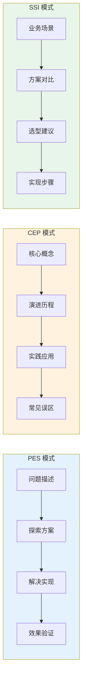
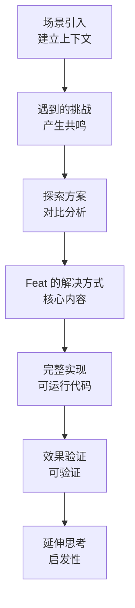
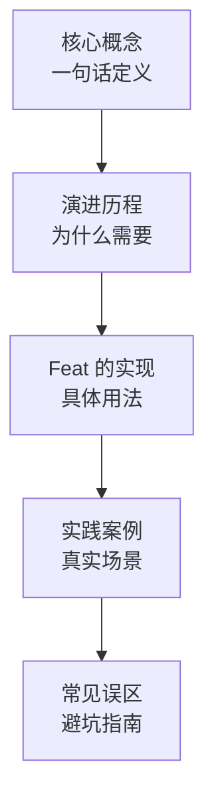
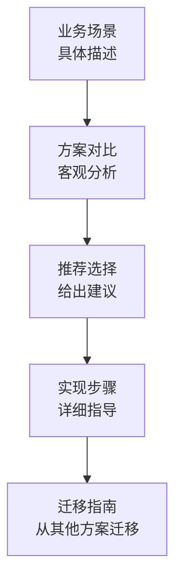

# 内容架构模式

> **重要**：本文档提供结构模板，但请避免机械套用。
> 写作前请先阅读 [00-writing-philosophy.md](00-writing-philosophy.md) 理解叙事驱动理念。

## 叙事结构模板（推荐）

### 模板1：问题-探索-解决（PES）

适用于：解决具体技术问题的教程

```
1. 场景引入（故事化）
   "假设你正在开发一个电商系统，需要处理用户下单..."

2. 遇到的挑战（产生共鸣）
   "传统的做法会遇到以下问题..."

3. 探索方案（对比分析）
   "我们尝试过 A、B、C 三种方案..."

4. Feat 的解决方式（核心内容）
   "Feat 通过 xxx 特性优雅地解决了这个问题..."

5. 完整实现（可运行代码）
   "下面是完整的实现代码..."

6. 效果验证（可验证）
   "运行后，你可以看到..."

7. 延伸思考（启发性）
   "这个方案还可以扩展到..."
```

### 模板2：概念-演进-实践（CEP）

适用于：需要理解设计思想的教程

```
1. 核心概念（一句话定义）
   "依赖注入的本质是..."

2. 演进历程（为什么需要）
   "在没有 DI 之前，我们是这样做的..."
   "这种方式的问题在于..."
   "于是产生了 DI 模式..."

3. Feat 的实现（具体用法）
   "Feat 的 DI 设计遵循以下原则..."

4. 实践案例（真实场景）
   "来看一个用户服务的实际案例..."

5. 常见误区（避坑指南）
   "初学者容易犯这些错误..."
```

### 模板3：场景-选型-实现（SSI）

适用于：多种方案对比的教程

```
1. 业务场景（具体描述）
   "你需要为一个高并发系统选择缓存方案..."

2. 方案对比（客观分析）
   | 方案 | 适用场景 | 优缺点 |

3. Feat 支持（能力展示）
   "Feat 支持以上所有方案，使用方式分别是..."

4. 推荐选择（给出建议）
   "对于你的场景，我建议..."

5. 实现步骤（详细指导）
   "下面是具体的配置步骤..."
```

## 连贯性设计

### 前置依赖声明

每篇文档开头必须明确：

```mdx
---
title: 路由配置详解
description: 学习 Feat 的路由配置，包括路径匹配、参数提取和中间件
prerequisites:
  - 已完成 [快速入门](/feat/getstart/)
  - 了解 HTTP 基本概念
related:
  next: [拦截器使用](/feat/interceptor/)
  prev: [快速入门](/feat/getstart/)
---

# 路由配置详解

> **学习路径位置**：第 2 篇，共 8 篇
>
> 上一篇：[快速入门](/feat/getstart/) | 下一篇：[拦截器使用](/feat/interceptor/)
```

### 跨文档引用规范

```mdx
<!-- 引用之前学过的内容 -->
> 📚 **回顾**：在[快速入门](/feat/getstart/)中，我们创建了一个基础服务。
> 现在我们将为其添加路由功能。

<!-- 预告后续内容 -->
> 🔜 **预告**：本节只介绍基础路由配置。
> 关于路由分组和中间件，将在[下一篇](/feat/router-advanced/)详细讲解。

<!-- 关联其他模块 -->
> 🔗 **关联**：路由配置完成后，你可能需要学习
> [拦截器](/feat/interceptor/)来实现权限控制。
```

## 传统教程类型与结构（参考）

以下提供传统结构模板，但建议优先使用上方的叙事模板。

### 1. 快速入门教程

**目标读者：** 初次接触 Feat 的开发者
**认知目标：** 应用（30 分钟内跑通第一个 Demo）
**字数控制：** 800-1500 字

**结构模板：**

```mdx
---
title: 快速入门
description: 5分钟快速上手 Feat
---

# 快速入门

## 环境准备

### 必需环境
- JDK 8 或更高版本
- Maven 3.6+ 或 Gradle 6.0+

### 可选工具
- IntelliJ IDEA（推荐）
- Eclipse

## 创建第一个项目

### 1. 添加依赖

<Steps>
  <Step>
    **Maven 方式**

    在 `pom.xml` 中添加：
  </Step>
</Steps>

\```xml
<dependency>
    <groupId>tech.smartboot.feat</groupId>
    <artifactId>feat-core</artifactId>
    <version>{最新版本}</version>
</dependency>
\```

### 2. 编写代码

\```java
public class HelloWorld {
    public static void main(String[] args) {
        FeatCloud.cloudServer()
                .get("/", ctx -> ctx.write("Hello Feat!"))
                .listen();
    }
}
\```

### 3. 运行项目

\```bash
mvn compile exec:java -Dexec.mainClass="HelloWorld"
\```

## 验证结果

打开浏览器访问 `http://localhost:8080`，看到 "Hello Feat!" 即表示成功。

## 下一步

- 了解更多 [路由配置](/feat/server/router/)
- 学习 [依赖注入](/feat/cloud/controller/)
```

**关键约束：**
- 前 200 字必须让读者看到可运行的代码
- 每个步骤不超过 3 个操作
- 必须包含"验证结果"章节

### 2. 功能教程

**目标读者：** 需要学习特定功能的开发者
**认知目标：** 应用 → 分析（会用 + 懂边界情况）
**字数控制：** 1500-3000 字

**结构模板：**

```mdx
---
title: 功能名称
description: 功能简介
---

# 功能名称

## 功能概述

简要说明功能的作用、价值和应用场景。

## 基础用法

### 最简示例

\```java
// 最简单的使用方式
\```

### 参数说明

| 参数 | 类型 | 必填 | 说明 |
|------|------|------|------|
| param1 | String | 是 | 参数说明 |
| param2 | int | 否 | 参数说明 |

## 进阶用法

### 场景1：XXX

\```java
// 场景1的代码示例
\```

**适用场景：** 说明何时使用这种方式

### 场景2：XXX

\```java
// 场景2的代码示例
\```

**适用场景：** 说明何时使用这种方式

## 最佳实践

<Aside type="tip">
最佳实践提示
</Aside>

## 常见问题

### Q1：问题描述？

**A：** 解决方案说明

## 相关链接

- [相关功能1](/feat/xxx/)
- [相关功能2](/feat/xxx/)
```

**关键约束：**
- "基础用法"必须在首屏（无需滚动即可看到代码）
- "进阶用法"按使用频率排序，高频在前
- 必须包含"常见错误"反模式示例

### 3. 集成教程

**目标读者：** 需要集成第三方组件的开发者
**认知目标：** 应用（跑通集成）→ 评估（选型依据）
**字数控制：** 2000-4000 字

**结构模板：**

```mdx
---
title: 集成 XXX
description: 如何在 Feat 中集成 XXX
---

# 集成 XXX

## 前置条件

- 已安装 XXX
- 版本要求：XXX

## 集成步骤

### 1. 添加依赖

\```xml
<dependency>
    <groupId>xxx</groupId>
    <artifactId>xxx</artifactId>
    <version>xxx</version>
</dependency>
\```

### 2. 配置

\```yaml
# application.yml
xxx:
  enabled: true
  option: value
\```

### 3. 使用

\```java
// 使用示例
\```

## 验证集成

如何验证集成是否成功。

## 故障排查

### 常见错误1

**错误信息：** XXX

**解决方案：** XXX

## 参考资料

- [XXX 官方文档](https://xxx)
```

**关键约束：**
- 必须列出所有版本兼容性矩阵
- "故障排查"必须基于真实 issue
- 提供回退方案（集成失败时的降级策略）

## 内容架构模式

### 模式对比



### 模式1：问题-探索-解决（PES）

适用于：解决特定技术问题的教程



### 模式2：概念-演进-实践（CEP）

适用于：需要理解设计思想的教程



### 模式3：场景-选型-实现（SSI）

适用于：多种方案对比的教程



## 内容组织原则

**去重原则：**

每个知识点只在一处详细讲解，其他地方简要提及 + 链接引用：

```mdx
<!-- 详细讲解处 -->
## Router 路由组件
Router 负责将 HTTP 请求分发到对应的处理器...
（完整讲解）

<!-- 其他文档引用时 -->
使用 Router 处理路由，详见 [Router 路由组件](/feat/server/router/)。
```

**渐进式展开：**

- 先讲最简单的用法
- 再讲常用场景
- 最后讲高级用法

**结构灵活性：**

- 简单的内容，一篇文档足够
- 复杂的内容，拆分成系列文档
- 根据内容特点调整结构
