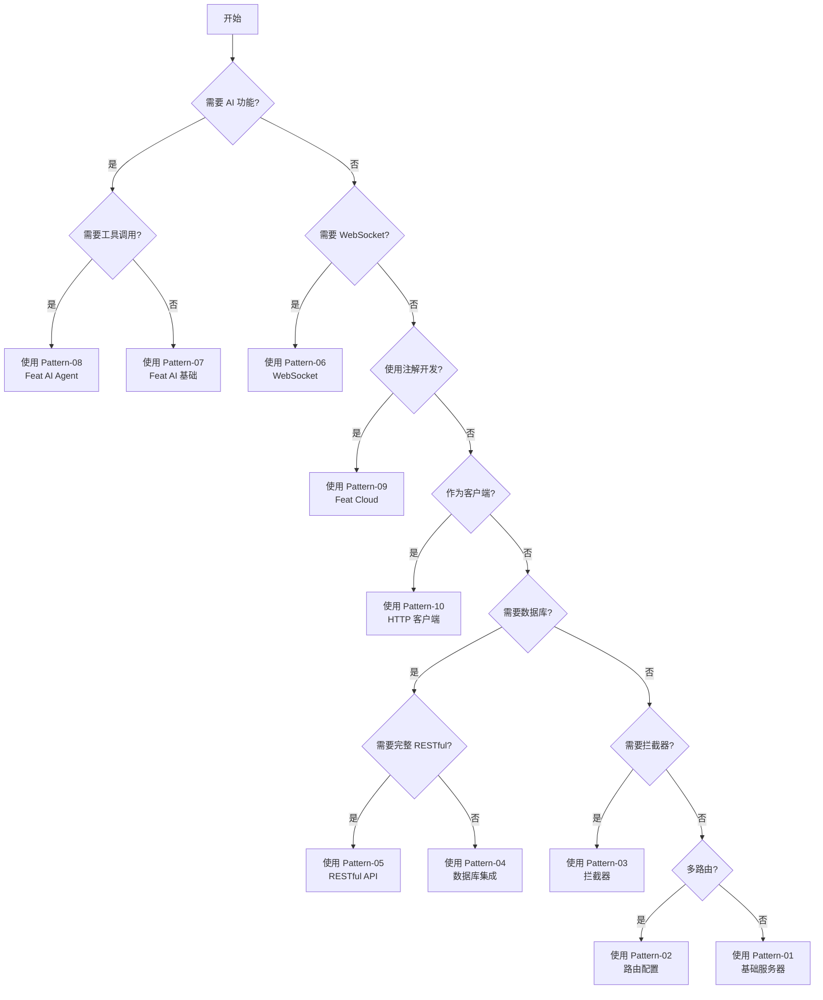

---

## 扩展模式

### Pattern-06: WebSocket 服务器

**适用场景**：实现 WebSocket 实时通信服务

**代码模板**：

```java
package com.example;

import tech.smartboot.feat.Feat;
import tech.smartboot.feat.router.Router;
import tech.smartboot.feat.router.WebSocketResponse;

import java.io.IOException;
import java.util.concurrent.ConcurrentHashMap;

/**
 * WebSocket 服务器示例
 * 
 * 功能：实现简单的 WebSocket 聊天服务器
 * 适用版本：Feat ≥ 3.2.0
 */
public class WebSocketServer {
    // 存储所有连接的客户端
    private static ConcurrentHashMap<String, WebSocketResponse> clients = new ConcurrentHashMap<>();
    
    public static void main(String[] args) {
        Router router = new Router();
        
        // WebSocket 端点
        router.ws("/chat", (ctx, ws) -> {
            String clientId = ctx.getRequest().getParameter("id");
            
            // 连接建立
            ws.onConnect(() -> {
                clients.put(clientId, ws);
                System.out.println("客户端连接: " + clientId);
                broadcast("系统", clientId + " 加入聊天室");
            });
            
            // 接收消息
            ws.onTextMessage(message -> {
                System.out.println("收到消息: " + message);
                broadcast(clientId, message);
            });
            
            // 连接关闭
            ws.onClose(() -> {
                clients.remove(clientId);
                System.out.println("客户端断开: " + clientId);
                broadcast("系统", clientId + " 离开聊天室");
            });
            
            // 错误处理
            ws.onError(e -> {
                System.err.println("WebSocket 错误: " + e.getMessage());
            });
        });
        
        Feat.createServer(router).listen(8080);
        System.out.println("WebSocket 服务器启动，访问 ws://localhost:8080/chat?id=user1");
    }
    
    // 广播消息给所有客户端
    private static void broadcast(String sender, String message) {
        String json = String.format("{\"sender\":\"%s\",\"message\":\"%s\",\"time\":%d}", 
            sender, message, System.currentTimeMillis());
        
        clients.forEach((id, ws) -> {
            try {
                ws.sendTextMessage(json);
            } catch (IOException e) {
                System.err.println("发送消息失败: " + e.getMessage());
            }
        });
    }
}
```

**关键要素**：
- WebSocket 端点注册（`router.ws()`）
- 连接生命周期回调（onConnect/onClose）
- 消息处理（onTextMessage/onBinaryMessage）
- 错误处理（onError）
- 客户端管理（存储/广播）
- 线程安全（ConcurrentHashMap）

**验证步骤**：
1. 启动服务器
2. 使用浏览器访问：`http://localhost:8080/`
3. 或使用 WebSocket 客户端测试：
   ```javascript
   const ws = new WebSocket('ws://localhost:8080/chat?id=user1');
   ws.onopen = () => console.log('连接成功');
   ws.onmessage = (e) => console.log('收到:', e.data);
   ws.send('Hello');
   ```

**常见错误**：

#### 错误 1：未处理并发
```java
// ❌ 错误：使用非线程安全的 HashMap
private static HashMap<String, WebSocketResponse> clients = new HashMap<>();

// ✅ 正确：使用 ConcurrentHashMap
private static ConcurrentHashMap<String, WebSocketResponse> clients = new ConcurrentHashMap<>();
```

#### 错误 2：未处理异常
```java
// ❌ 错误：发送消息不处理异常
ws.sendTextMessage(json);

// ✅ 正确：处理 IOException
try {
    ws.sendTextMessage(json);
} catch (IOException e) {
    System.err.println("发送失败: " + e.getMessage());
}
```

---

### Pattern-07: Feat AI 基础调用

**适用场景**：使用 Feat AI 模块进行 AI 模型调用

**代码模板**：

**pom.xml 依赖**：

```xml
<dependency>
    <groupId>tech.smartboot.feat</groupId>
    <artifactId>feat-ai</artifactId>
    <version>3.2.0</version>
</dependency>
```

**AiChatExample.java**：

```java
package com.example;

import tech.smartboot.feat.ai.FeatAI;
import tech.smartboot.feat.ai.Options;
import tech.smartboot.feat.ai.chat.ChatModel;
import tech.smartboot.feat.ai.chat.message.ChatMessage;
import tech.smartboot.feat.ai.chat.message.ChatResponse;

/**
 * Feat AI 基础调用示例
 * 
 * 功能：使用 Feat AI 进行简单的对话
 * 适用版本：Feat ≥ 3.2.0
 */
public class AiChatExample {
    public static void main(String[] args) {
        // 创建 AI 客户端
        ChatModel chatModel = FeatAI.chat(Options.newOptions()
            .apiKey("your-api-key")  // 替换为你的 API Key
            .baseUrl("https://api.openai.com/v1")  // 或你的自定义端点
            .model("gpt-3.5-turbo")  // 模型名称
        );
        
        // 发送消息并获取响应
        ChatResponse response = chatModel.chat(ChatMessage.user("你好，请介绍一下 Feat 框架"));
        
        // 输出响应
        System.out.println("AI 回复: " + response.getContent());
        
        // 流式输出
        chatModel.chatStream(
            ChatMessage.user("请写一首关于 Java 的诗"),
            chunk -> System.out.print(chunk.getContent())
        );
    }
}
```

**关键要素**：
- FeatAI 客户端创建
- API Key 配置
- 模型参数设置（baseUrl、model）
- 同步调用（`chat()`）
- 流式调用（`chatStream()`）
- 消息构建（`ChatMessage.user()`）

**验证步骤**：
1. 配置 API Key
2. 运行程序
3. 预期输出：AI 的回复内容

**常见错误**：

#### 错误 1：API Key 未配置
```java
// ❌ 错误：未设置 API Key
Options.newOptions().baseUrl("...").model("...")

// ✅ 正确：必须设置 API Key
Options.newOptions().apiKey("your-api-key").baseUrl("...").model("...")
```

#### 错误 2：未处理异常
```java
// ❌ 错误：未处理网络异常
ChatResponse response = chatModel.chat(message);

// ✅ 正确：添加异常处理
try {
    ChatResponse response = chatModel.chat(message);
    System.out.println(response.getContent());
} catch (Exception e) {
    System.err.println("调用失败: " + e.getMessage());
}
```

---

### Pattern-08: Feat AI Agent

**适用场景**：使用 Feat AI Agent 实现智能代理

**代码模板**：

```java
package com.example;

import tech.smartboot.feat.ai.FeatAI;
import tech.smartboot.feat.ai.Options;
import tech.smartboot.feat.ai.agent.AgentOptions;
import tech.smartboot.feat.ai.agent.FeatAgent;
import tech.smartboot.feat.ai.agent.memory.InMemoryMemory;
import tech.smartboot.feat.ai.agent.tool.Tool;

import java.util.function.Function;

/**
 * Feat AI Agent 示例
 * 
 * 功能：创建一个简单的计算器 Agent
 * 适用版本：Feat ≥ 3.2.0
 */
public class AiAgentExample {
    
    // 定义工具：加法
    public static class AddTool implements Tool {
        @Override
        public String name() {
            return "add";
        }
        
        @Override
        public String description() {
            return "计算两个数的和，参数：a, b";
        }
        
        @Override
        public Function<String, String> execute() {
            return params -> {
                // 解析参数并计算
                String[] parts = params.replace("{", "").replace("}", "").split(",");
                int a = Integer.parseInt(parts[0].split(":")[1].trim());
                int b = Integer.parseInt(parts[1].split(":")[1].trim());
                return String.valueOf(a + b);
            };
        }
    }
    
    public static void main(String[] args) {
        // 创建 Agent
        FeatAgent agent = FeatAI.agent(AgentOptions.newOptions()
            .apiKey("your-api-key")
            .model("gpt-3.5-turbo")
            .systemPrompt("你是一个计算器助手，可以使用工具进行数学计算。")
            .memory(new InMemoryMemory())  // 使用内存存储对话历史
            .tools(new AddTool())  // 注册工具
        );
        
        // 运行 Agent
        String response = agent.run("请计算 123 + 456 等于多少");
        System.out.println("Agent 回复: " + response);
        
        // 继续对话（保持上下文）
        String response2 = agent.run("再加 100 呢");
        System.out.println("Agent 回复: " + response2);
    }
}
```

**关键要素**：
- Agent 创建（`FeatAI.agent()`）
- 系统提示词设置（`systemPrompt()`）
- 内存管理（`InMemoryMemory`）
- 工具定义（`Tool` 接口）
- 工具注册（`tools()`）
- 对话上下文保持

**验证步骤**：
1. 配置 API Key
2. 运行程序
3. 预期输出：Agent 使用工具计算并返回结果

---

### Pattern-09: Feat Cloud Controller

**适用场景**：使用 Feat Cloud 模块开发 RESTful API

**代码模板**：

**pom.xml 依赖**：

```xml
<dependency>
    <groupId>tech.smartboot.feat</groupId>
    <artifactId>feat-cloud-starter</artifactId>
    <version>3.2.0</version>
</dependency>
```

**UserController.java**：

```java
package com.example.controller;

import tech.smartboot.feat.cloud.annotation.Controller;
import tech.smartboot.feat.cloud.annotation.RequestMapping;
import tech.smartboot.feat.cloud.annotation.RequestParam;
import tech.smartboot.feat.cloud.annotation.ResponseBody;

import java.util.ArrayList;
import java.util.List;
import java.util.concurrent.ConcurrentHashMap;
import java.util.concurrent.atomic.AtomicLong;

/**
 * 用户管理 Controller
 * 
 * 功能：使用 Feat Cloud 实现 RESTful API
 * 适用版本：Feat ≥ 3.2.0
 */
@Controller
@RequestMapping("/users")
public class UserController {
    
    // 内存存储（生产环境应使用数据库）
    private static ConcurrentHashMap<Long, User> users = new ConcurrentHashMap<>();
    private static AtomicLong idGenerator = new AtomicLong(1);
    
    /**
     * 获取所有用户
     */
    @RequestMapping(method = RequestMapping.GET)
    @ResponseBody
    public List<User> getAllUsers() {
        return new ArrayList<>(users.values());
    }
    
    /**
     * 根据 ID 获取用户
     */
    @RequestMapping(value = "/{id}", method = RequestMapping.GET)
    @ResponseBody
    public User getUserById(@RequestParam("id") Long id) {
        return users.get(id);
    }
    
    /**
     * 创建用户
     */
    @RequestMapping(method = RequestMapping.POST)
    @ResponseBody
    public User createUser(@RequestBody User user) {
        user.setId(idGenerator.getAndIncrement());
        users.put(user.getId(), user);
        return user;
    }
    
    /**
     * 更新用户
     */
    @RequestMapping(value = "/{id}", method = RequestMapping.PUT)
    @ResponseBody
    public User updateUser(@RequestParam("id") Long id, @RequestBody User user) {
        user.setId(id);
        users.put(id, user);
        return user;
    }
    
    /**
     * 删除用户
     */
    @RequestMapping(value = "/{id}", method = RequestMapping.DELETE)
    @ResponseBody
    public void deleteUser(@RequestParam("id") Long id) {
        users.remove(id);
    }
    
    // 用户实体类
    public static class User {
        private Long id;
        private String name;
        private String email;
        
        // Getters and Setters
        public Long getId() { return id; }
        public void setId(Long id) { this.id = id; }
        public String getName() { return name; }
        public void setName(String name) { this.name = name; }
        public String getEmail() { return email; }
        public void setEmail(String email) { this.email = email; }
    }
}
```

**Application.java**：

```java
package com.example;

import tech.smartboot.feat.cloud.FeatCloud;

/**
 * Feat Cloud 应用入口
 */
public class Application {
    public static void main(String[] args) {
        FeatCloud.cloudServer()
            .scan("com.example.controller")  // 扫描 Controller
            .listen(8080);
        System.out.println("Feat Cloud 服务器启动成功");
    }
}
```

**关键要素**：
- `@Controller` 注解
- `@RequestMapping` 路由映射
- `@RequestParam` 参数绑定
- `@ResponseBody` 响应序列化
- Controller 扫描配置
- 注解驱动的 RESTful API

**验证步骤**：
1. 启动服务器
2. 测试 API：
   ```bash
   # 创建用户
   curl -X POST -H "Content-Type: application/json" \
        -d '{"name":"张三","email":"zhangsan@example.com"}' \
        http://localhost:8080/users
   
   # 查询用户
   curl http://localhost:8080/users/1
   ```

---

### Pattern-10: HTTP 客户端调用

**适用场景**：使用 Feat HTTP Client 进行 HTTP 请求

**代码模板**：

```java
package com.example;

import tech.smartboot.feat.core.client.HttpClient;
import tech.smartboot.feat.core.client.HttpOptions;
import tech.smartboot.feat.core.client.HttpResponse;

import java.io.IOException;

/**
 * HTTP 客户端示例
 * 
 * 功能：使用 Feat HTTP Client 发送 HTTP 请求
 * 适用版本：Feat ≥ 3.2.0
 */
public class HttpClientExample {
    public static void main(String[] args) throws IOException {
        // 创建 HTTP 客户端
        HttpClient client = new HttpClient(HttpOptions.newOptions()
            .baseUrl("https://api.example.com")
            .timeout(30000)  // 30秒超时
        );
        
        // GET 请求
        HttpResponse response = client.get("/users")
            .header("Authorization", "Bearer token123")
            .execute();
        
        System.out.println("状态码: " + response.getStatusCode());
        System.out.println("响应体: " + response.getBody());
        
        // POST 请求
        HttpResponse postResponse = client.post("/users")
            .header("Content-Type", "application/json")
            .body("{\"name\":\"张三\",\"email\":\"zhangsan@example.com\"}")
            .execute();
        
        System.out.println("创建结果: " + postResponse.getBody());
        
        // 异步请求
        client.get("/users").executeAsync(resp -> {
            System.out.println("异步响应: " + resp.getBody());
        });
    }
}
```

**关键要素**：
- HttpClient 创建
- 基础 URL 配置
- 请求头设置
- GET/POST 请求
- 同步/异步调用
- 响应处理

**验证步骤**：
1. 运行程序
2. 检查 HTTP 请求是否成功
3. 验证响应内容

---

## 模式速查表

| 模式 | 适用场景 | 关键类 | 复杂度 |
|------|---------|--------|--------|
| Pattern-01 | 基础 HTTP 服务器 | Feat | ⭐ |
| Pattern-02 | 路由配置 | Router | ⭐⭐ |
| Pattern-03 | 拦截器 | Interceptor | ⭐⭐ |
| Pattern-04 | 数据库集成 | MyBatis | ⭐⭐⭐ |
| Pattern-05 | RESTful API | Router + Jackson | ⭐⭐⭐ |
| Pattern-06 | WebSocket | WebSocketResponse | ⭐⭐⭐ |
| Pattern-07 | Feat AI 基础 | FeatAI, ChatModel | ⭐⭐ |
| Pattern-08 | Feat AI Agent | FeatAgent, Tool | ⭐⭐⭐ |
| Pattern-09 | Feat Cloud | @Controller | ⭐⭐ |
| Pattern-10 | HTTP 客户端 | HttpClient | ⭐⭐ |

---

## 模式选择决策树



---

## AI 代码生成提示词（扩展）

### 生成 WebSocket 服务器

```
请使用 Pattern-06 生成 WebSocket 服务器：

要求：
- 实现 /chat 端点
- 支持连接、消息、关闭回调
- 实现消息广播功能
- 包含异常处理
- 提供验证步骤
```

### 生成 Feat AI 调用

```
请使用 Pattern-07 生成 Feat AI 调用代码：

要求：
- 配置 API Key 和模型
- 实现同步对话
- 实现流式输出
- 包含异常处理
- 提供验证步骤
```

### 生成 Feat AI Agent

```
请使用 Pattern-08 生成 Feat AI Agent：

要求：
- 定义自定义工具
- 配置系统提示词
- 使用内存保持上下文
- 实现工具调用
- 提供验证步骤
```

### 生成 Feat Cloud Controller

```
请使用 Pattern-09 生成 Feat Cloud Controller：

要求：
- 使用 @Controller 和 @RequestMapping
- 实现 CRUD 操作
- 使用注解驱动
- 包含 Controller 扫描配置
- 提供验证步骤
```

### 生成 HTTP 客户端

```
请使用 Pattern-10 生成 HTTP 客户端代码：

要求：
- 配置基础 URL 和超时
- 实现 GET 和 POST 请求
- 支持同步和异步调用
- 包含请求头和响应处理
- 提供验证步骤
```
