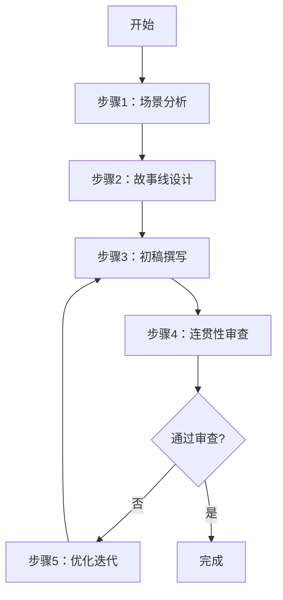
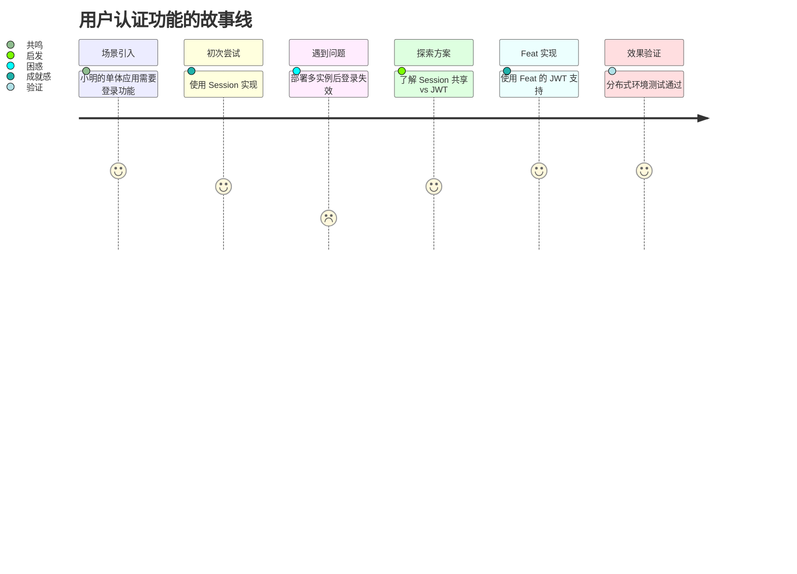
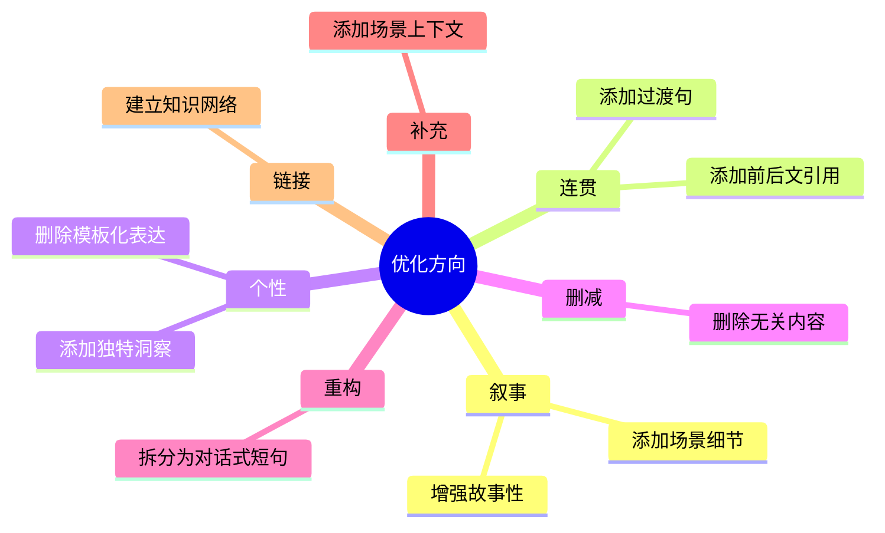

# 质量检查清单

## 叙事与连贯性检查（新增）

### 叙事质量

- [ ] 开头是否建立了场景/问题？（避免直接进入功能说明）
- [ ] 内容是否围绕核心问题展开？（避免偏离主题）
- [ ] 是否有明确的"为什么"解释？（避免只说"怎么做"）
- [ ] 是否使用了对话式语气？（避免机械说明）
- [ ] 是否展示了思考过程？（避免直接给答案）

### 连贯性检查

- [ ] 是否声明了前置知识？
- [ ] 是否说明了学习路径位置？
- [ ] 是否引用了相关文档？
- [ ] 是否给出了下一步指引？
- [ ] 与系列其他文档是否风格一致？

### 避免模板化

- [ ] 章节标题是否具体而非通用？（避免"功能概述"、"基础用法"）
- [ ] 内容是否服务于场景而非填满结构？
- [ ] 是否有独特的洞察或经验分享？
- [ ] 读者是否能感受到"这是一个真实开发者的经验"？

## 内容检查

- [ ] 代码来自真实项目，可运行
- [ ] 代码 JDK 8 兼容
- [ ] 步骤清晰，可操作
- [ ] 无重复内容（已搜索现有文档）
- [ ] 链接全部有效
- [ ] 每个代码块后有验证步骤
- [ ] 版本信息准确
- [ ] 包含常见错误及解决方案

## 格式检查

- [ ] 使用正确的组件（Steps、Aside 等）
- [ ] 代码块指定语言
- [ ] 表格格式正确
- [ ] 标题层级合理（H1→H2→H3）
- [ ] 代码块有标题和路径标注
- [ ] 内部链接文本描述性

## SEO 检查

- [ ] 标题包含核心关键词（≤30字）
- [ ] 描述包含动作词（≤150字）
- [ ] 正文关键词密度合理
- [ ] 每个文档 ≥2 个内部链接
- [ ] URL 符合规范

## 可读性检查

- [ ] 语言自然流畅
- [ ] 结构适合内容特点
- [ ] 关键步骤有注释
- [ ] 有适当的示例和说明
- [ ] 信息密度适中（无大段文字）
- [ ] 视觉层次清晰

## 可访问性检查

- [ ] 图片有 alt 文本
- [ ] 表格有表头
- [ ] 代码对比使用 ✅/❌ 标识
- [ ] 色盲友好（不依赖颜色传递信息）

## 图表检查

- [ ] 图表类型选择恰当（查阅 08-diagram-standards.md）
- [ ] Mermaid 语法正确，可渲染
- [ ] 图表有标题说明
- [ ] 图表大小适中（节点数/层级合理）
- [ ] 复杂图表考虑使用 feat-illustrator

## AI 辅助写作工作流（叙事驱动版）



### 步骤1：场景分析（关键转变）

**输入：** 用户提供的功能描述或代码
**输出：** 明确以下内容：
- **核心场景**：这个功能解决什么真实问题？
- **目标读者**：谁在什么情况下需要这个功能？
- **叙事类型**：PES（问题-探索-解决）/ CEP（概念-演进-实践）/ SSI（场景-选型-实现）
- **认知目标**：读者学完后能做什么？
- **前置知识**：读者需要预先了解什么？
- **后续内容**：学完后应该学什么？

### 步骤2：故事线设计

**输出要求：**
- 用一句话概括本文档要讲述的"故事"
- 列出 3-5 个关键情节点（对应章节）
- 标注每个情节点的情感目标（产生共鸣/启发思考/获得成就感）
- 标注需要代码示例的位置（代码是故事的"证据"）

**示例：**


### 步骤3：初稿撰写

**写作顺序（调整）：**


**叙事约束：**
- 开头 100 字必须建立场景或问题
- 每个段落不超过 150 字
- 每两个代码块之间最多 2 段文字
- 使用主动语态和对话语气
- 每个章节回答一个具体问题

### 步骤4：连贯性审查

**新增检查项：**
- [ ] 场景引入是否让读者产生共鸣？
- [ ] 章节之间是否有逻辑衔接？
- [ ] 是否引用了前置知识？
- [ ] 是否给出了后续学习指引？
- [ ] 是否避免了"功能概述"式的机械章节？
- [ ] 是否展示了思考过程而非直接给答案？

### 步骤5：优化迭代

**优化方向（新增）：**



### AI 写作提示词模板

**场景分析提示词：**
```
请分析以下功能，帮我确定最佳叙事结构：

功能描述：{功能描述}

请回答：
1. 这个功能解决什么真实场景的问题？
2. 目标读者是谁？他们当前处于什么状态？
3. 推荐哪种叙事结构（PES/CEP/SSI）？为什么？
4. 前置知识是什么？
5. 学完后读者应该学什么？
```

**故事线设计提示词：**
```
请为以下教程设计故事线：

功能：{功能名称}
叙事结构：{PES/CEP/SSI}
目标读者：{读者描述}

请输出：
1. 一句话故事概括
2. 5-7 个情节点，每个包含：
   - 情节描述
   - 情感目标（共鸣/困惑/启发/成就感）
   - 是否需要代码示例
```

**连贯性检查提示词：**
```
请检查以下文档的连贯性：

{文档内容}

请检查：
1. 开头是否建立了场景？
2. 章节之间是否有逻辑衔接？
3. 是否有过渡句连接不同部分？
4. 结尾是否给出了下一步指引？
5. 是否有模板化的章节标题？
6. 建议如何改进？
```
