# "In Action" 写作风格指南

## 经典技术书籍分析

### 《Spring in Action》风格特点

```
1. 渐进式项目构建
   - 不是孤立示例，而是贯穿全书的项目
   - 每章在上一章基础上添加新功能
   - 读者有"建造"的成就感

2. 对话式教学
   - "你可能想知道..."
   - "让我们看看会发生什么..."
   - "这看起来不错，但..."

3. 先跑起来，再解释
   - 先给可运行的代码
   - 然后"让我们看看刚才做了什么"
   - 最后深入原理

4. 真实场景
   - 不是"假设有一个用户系统"
   - 而是"Taco Cloud 应用需要订单功能"
   - 有具体的业务上下文

5. 错误驱动学习
   - 故意展示常见错误
   - "如果你忘了加这个注解，会看到..."
   - 从错误中学习
```

### 《Docker in Action》风格特点

```
1. 命令行即故事
   - 每个命令都有上下文
   - "首先，让我们看看当前有什么镜像..."
   - 展示输出，解释含义

2. 实验式学习
   - "试试这个命令..."
   - "观察输出，你会发现..."
   - 鼓励读者动手

3. 问题-解决节奏
   - "现在有个问题：容器重启后数据丢失了"
   - "解决方案是使用数据卷..."
   - 问题驱动，而非功能罗列

4. 对比教学
   - "传统部署 vs Docker 部署"
   - "虚拟机 vs 容器"
   - 通过对比加深理解
```

### 《Kubernetes in Action》风格特点

```
1. 从零开始构建
   - 先手动部署 Pod
   - 发现管理困难
   - 引入 Deployment
   - 理解抽象的价值

2. 可视化思维
   - 大量架构图
   - "如图所示..."
   - 图文结合

3. 生产级考量
   - 不只是"能跑"
   - "在生产环境中，你还需要考虑..."
   - 真实世界的复杂性
```

---

## "In Action" 风格核心原则

### 1. 项目驱动（Project-Driven）

**不是**：孤立的功能示例
**而是**：贯穿始终的实战项目

```mdx
# ❌ 传统方式
## 路由配置
本文介绍 Feat 的路由配置功能...

## 基础用法
```java
router.get("/", ctx -> ctx.write("Hello"));
```

# ✅ In Action 方式
## Taco Cloud：第一个端点

我们正在构建一个玉米卷订购系统（Taco Cloud）。
首先，让我们创建一个首页...

```java
// TacoCloudApplication.java
server.get("/", ctx -> {
    ctx.write("欢迎来到 Taco Cloud！");
});
```

运行应用，访问 http://localhost:8080，你应该看到欢迎信息。

## 添加菜单 API

现在，让我们添加一个 API 来获取玉米卷菜单...
```

### 2. 对话式引导（Conversational Guidance）

**常用句式**：

```mdx
> 💭 **你可能想知道**：为什么用 `:` 而不是 `{}`？
> 
> 这是 Feat 的路径参数语法，灵感来自 Express.js...

> 🔍 **让我们看看**：如果访问不存在的路由会发生什么？
> 
> 你会看到 404 页面...

> ⚠️ **注意**：这里有个常见的陷阱...

> 🎯 **现在**：我们已经有了基础路由。
> 但在实际应用中，我们需要处理更复杂的情况...
```

### 3. 实验式学习（Learning by Doing）

```mdx
## 动手实验：探索路由匹配

**步骤 1**：创建以下路由

```java
server.get("/users", ctx -> ctx.write("用户列表"));
server.get("/users/:id", ctx -> ctx.write("用户详情"));
```

**步骤 2**：测试以下 URL，观察结果

| URL | 结果 | 说明 |
|-----|------|------|
| `/users` | 用户列表 | 精确匹配 |
| `/users/123` | 用户详情 | 参数匹配 |
| `/users/` | ??? | 试试看 |

**步骤 3**：思考

为什么 `/users/` 不会匹配 `/users/:id`？
```

### 4. 错误驱动（Error-Driven）

```mdx
## 常见错误：忘记设置响应

**试试这段代码**：

```java
server.get("/test", ctx -> {
    // 忘记调用 ctx.write()
});
```

**你会看到**：请求挂起，直到超时。

**为什么**：Feat 等待你写入响应...

**正确做法**：

```java
server.get("/test", ctx -> {
    ctx.write("Hello");  // 必须写入响应
});
```
```

### 5. 渐进式复杂度（Progressive Complexity）

```mdx
## 第 1 章：静态路由
- 基础路由配置
- 简单响应

## 第 2 章：动态路由
- 路径参数
- 在上一章的 Taco Cloud 中添加动态菜单

## 第 3 章：路由分组
- 组织复杂路由
- 重构 Taco Cloud 的 API 结构

## 第 4 章：中间件
- 在路由前添加处理逻辑
- 为 Taco Cloud 添加日志和认证
```

---

## "In Action" 风格写作模板

### 模板：章节结构

```mdx
---
title: 第 X 章：章节标题
description: 在 Taco Cloud 项目中实现 xxx 功能
---

# 第 X 章：章节标题

## 本章目标

完成本章后，你将能够：
- ✅ 目标 1
- ✅ 目标 2
- ✅ 目标 3

## 场景回顾

> 📖 **回顾**：在上一章中，我们实现了...
> 
> 现在，我们的 Taco Cloud 应用已经有了基础功能。
> 但当我们尝试 xxx 时，遇到了一个问题...

## 问题：xxx

**当前状况**：描述当前代码和遇到的问题

**期望结果**：描述我们想要达到的效果

**遇到的困难**：具体的问题描述

## 解决方案：xxx

### 核心概念（一句话）

"xxx 是一种...的技术"

### 在 Taco Cloud 中实现

**步骤 1**：xxx

```java
// 代码示例
```

**验证**：运行后，你应该看到...

**步骤 2**：xxx

```java
// 代码示例
```

**验证**：现在，尝试...，你会发现...

## 深入理解

### 工作原理

"当你调用 xxx 时，Feat 内部..."

### 常见陷阱

> ⚠️ **注意**：...

### 最佳实践

> 💡 **建议**：...

## 本章总结

**我们完成了**：
- ✅ 要点 1
- ✅ 要点 2

**Taco Cloud 现在可以**：描述当前功能

**下一章**：我们将解决...问题
```

---

## 融入现有写作标准

### 与叙事驱动结构的结合

| In Action 元素 | 对应叙事结构 |
|----------------|-------------|
| 项目驱动 | PES 的场景引入 |
| 对话式引导 | 对话式写作语气 |
| 实验式学习 | PES 的效果验证 |
| 错误驱动 | CEP 的常见误区 |
| 渐进式复杂度 | 学习路径设计 |

### 更新后的写作流程

```
1. 确定实战项目
   - 选择一个贯穿始终的项目（如 Taco Cloud）
   - 项目要有业务逻辑，不能太简单

2. 设计学习路径
   - 每章在项目中添加一个功能
   - 功能之间有依赖关系

3. 选择叙事结构
   - 问题-探索-解决（PES）：新功能引入
   - 概念-演进-实践（CEP）：原理讲解
   - 场景-选型-实现（SSI）：技术选型

4. 应用 In Action 风格
   - 对话式引导
   - 实验式学习
   - 错误驱动

5. 建立连贯性
   - 回顾上一章
   - 预告下一章
   - 标注学习路径位置
```

---

## 示例：Taco Cloud 项目规划

### 项目概述

**Taco Cloud**：一个在线玉米卷订购系统

**核心功能**：
- 浏览玉米卷菜单
- 自定义玉米卷配料
- 下单购买
- 订单管理

### 章节规划

```mermaid
flowchart TD
    subgraph Ch1["第 1 章：项目启动"]
        C1A[创建 Feat 项目]
        C1B[第一个端点]
        C1C[项目结构组织]
    end
    
    subgraph Ch2["第 2 章：设计玉米卷模型"]
        C2A[领域模型设计]
        C2B[依赖注入基础]
        C2C[服务层实现]
    end
    
    subgraph Ch3["第 3 章：菜单 API"]
        C3A[RESTful API 设计]
        C3B[路由配置]
        C3C[JSON 响应]
    end
    
    subgraph Ch4["第 4 章：自定义玉米卷"]
        C4A[复杂表单处理]
        C4B[数据验证]
        C4C[错误处理]
    end
    
    subgraph Ch5["第 5 章：订单处理"]
        C5A[数据库集成]
        C5B[事务管理]
        C5C[订单状态机]
    end
    
    subgraph Ch6["第 6 章：安全认证"]
        C6A[用户认证]
        C6B[拦截器实现]
        C6C[权限控制]
    end
    
    subgraph Ch7["第 7 章：生产部署"]
        C7A[配置管理]
        C7B[日志记录]
        C7C[Docker 部署]
    end
    
    Ch1 --> Ch2
    Ch2 --> Ch3
    Ch3 --> Ch4
    Ch4 --> Ch5
    Ch5 --> Ch6
    Ch6 --> Ch7
    
    style Ch1 fill:#e3f2fd
    style Ch2 fill:#e8f5e9
    style Ch3 fill:#fff3e0
    style Ch4 fill:#fce4ec
    style Ch5 fill:#e3f2fd
    style Ch6 fill:#e8f5e9
    style Ch7 fill:#fff3e0
```



### 连贯性设计

```mdx
<!-- 第 3 章开头 -->
## 场景回顾

> 📖 **回顾**：在上一章中，我们设计了玉米卷的领域模型，
> 并实现了 IngredientService 来获取配料信息。
> 
> 现在，我们需要将这些数据通过 API 暴露给前端...

<!-- 第 3 章结尾 -->
## 本章总结

**Taco Cloud 现在可以**：
- ✅ 通过 `/api/tacos` 获取菜单
- ✅ 通过 `/api/tacos/{id}` 获取单个玉米卷详情
- ✅ 返回标准的 JSON 格式数据

**下一章**：我们将实现自定义玉米卷功能，
让用户可以选择配料并创建自己的玉米卷。
```

---

## 快速检查清单

### In Action 风格检查

- [ ] 是否有一个贯穿始终的项目？
- [ ] 章节之间是否有功能依赖？
- [ ] 是否使用了对话式引导？
- [ ] 是否有"动手实验"环节？
- [ ] 是否展示了常见错误？
- [ ] 是否从简单到复杂渐进？
- [ ] 每章是否有明确的"本章目标"和"本章总结"？
- [ ] 是否回顾了上一章内容？
- [ ] 是否预告了下一章内容？

### 避免的陷阱

- ❌ 孤立示例，没有项目上下文
- ❌ 功能罗列，没有业务场景
- ❌ 只有正确代码，没有错误示例
- ❌ 章节之间没有关联
- ❌ 过于简单或过于复杂的项目
