# 图表标准与组件库

## 设计原则

### 何时使用图表

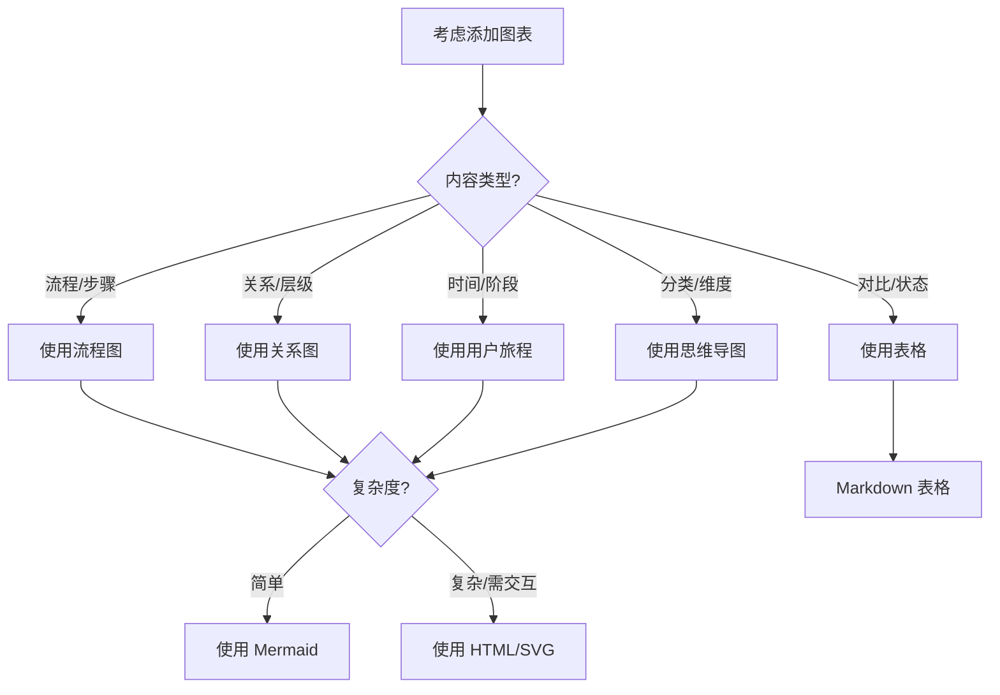

### 图表 vs 文字的选择

| 使用图表 | 使用文字 |
|---------|---------|
| 展示流程步骤 | 详细说明每个步骤 |
| 展示关系连接 | 解释关系含义 |
| 展示层级结构 | 描述层级逻辑 |
| 展示状态转换 | 说明转换条件 |
| 多维度对比 | 单一维度说明 |

**原则**：图表辅助理解，不替代文字说明。

---

## Mermaid 图表组件

### 1. 流程图（Flowchart）

**适用场景**：步骤流程、决策分支、工作流

**基础模板**：

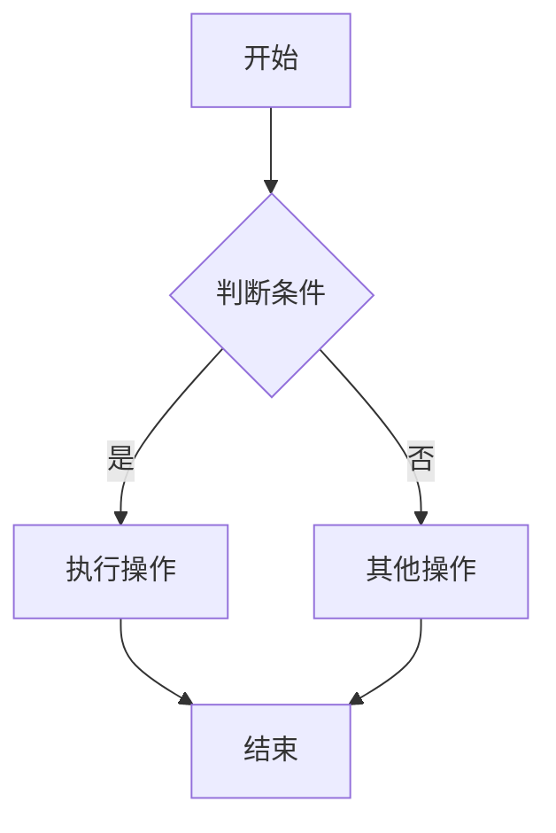

**进阶样式**：

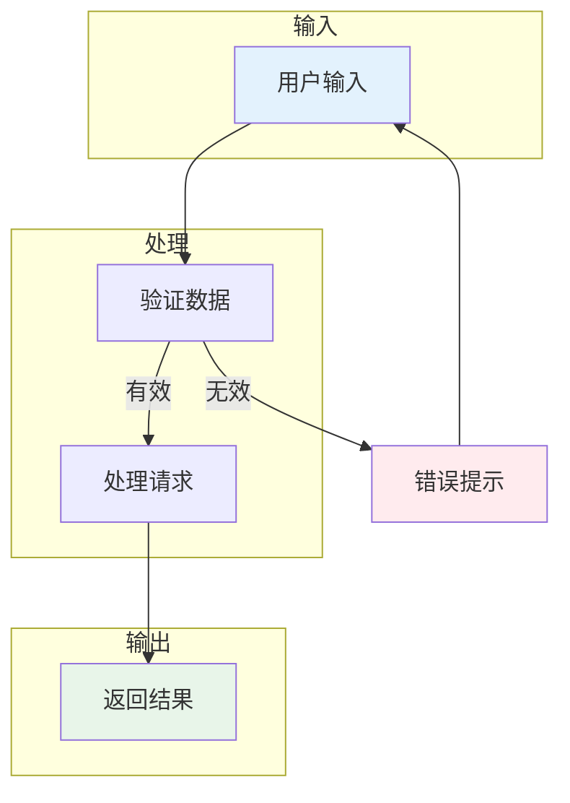

**使用建议**：
- 节点数控制在 10 个以内
- 使用子图（subgraph）组织相关节点
- 用颜色区分不同类型节点
- 箭头标注清晰的条件

---

### 2. 关系图（Graph）

**适用场景**：知识图谱、依赖关系、模块结构

**基础模板**：

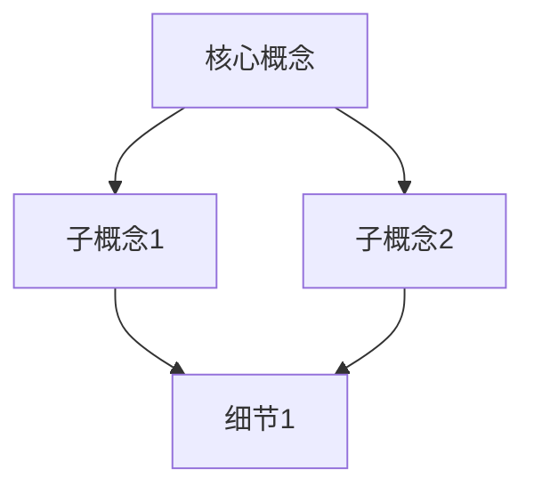

**进阶样式**：

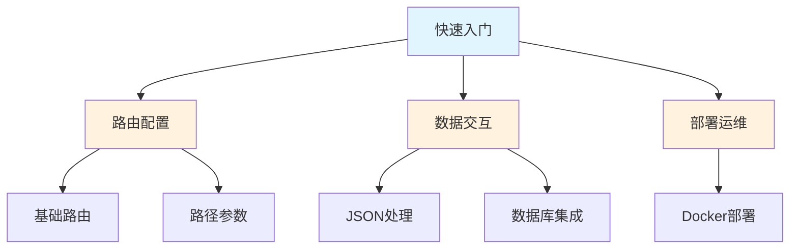

**使用建议**：
- 使用方向控制（TD/LR/RL/BT）优化布局
- 用颜色区分层级或类型
- 避免交叉线，调整节点位置

---

### 3. 用户旅程（Journey）

**适用场景**：学习路径、用户体验、情感曲线

**基础模板**：

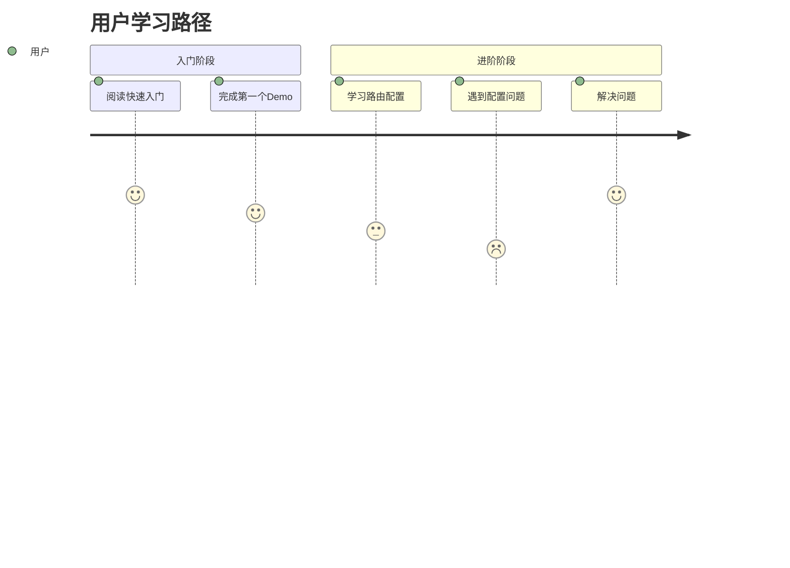

**使用建议**：
- 评分 1-5，5 为最佳体验
- 标注角色（用户/系统/AI）
- 展示情感波动

---

### 4. 思维导图（Mindmap）

**适用场景**：知识分类、维度展开、检查清单

**基础模板**：

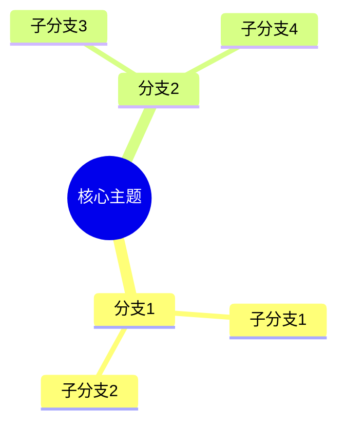

**进阶样式**：

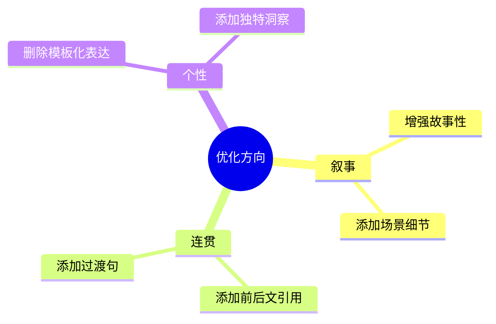

**使用建议**：
- 层级不超过 3 层
- 每个节点文字简洁
- 用于展示分类而非流程

---

### 5. 时序图（Sequence）

**适用场景**：交互流程、API 调用、组件通信

**基础模板**：

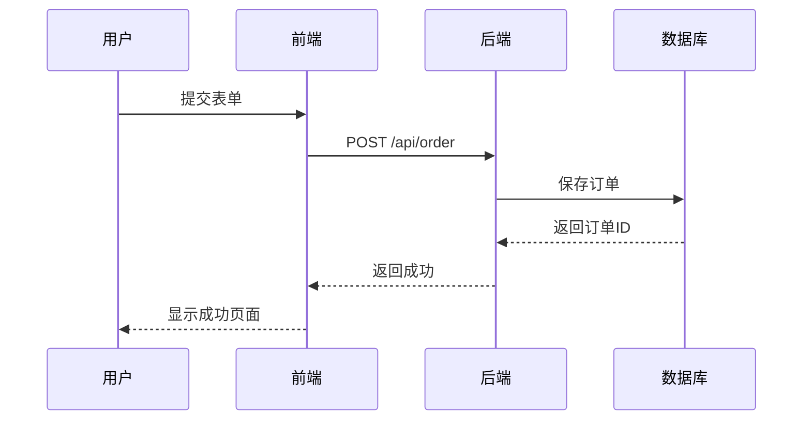

**使用建议**：
- 参与者控制在 5 个以内
- 使用激活框（+/-）表示处理中
- 标注关键消息

---

### 6. 状态图（StateDiagram）

**适用场景**：状态机、生命周期、订单状态

**基础模板**：

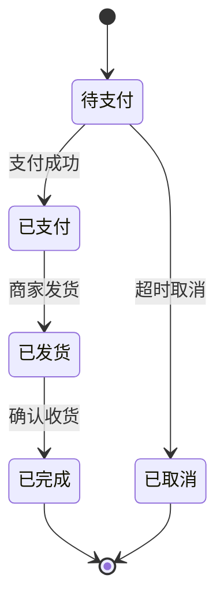

**使用建议**：
- 状态名简洁明确
- 标注触发条件
- 展示终态和初态

---

### 7. 甘特图（Gantt）

**适用场景**：项目计划、学习进度、里程碑

**基础模板**：

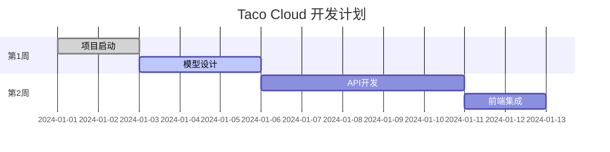

**使用建议**：
- 使用状态标记（done/active/crit）
- 合理设置时间粒度
- 标注关键里程碑

---

## 图表决策树

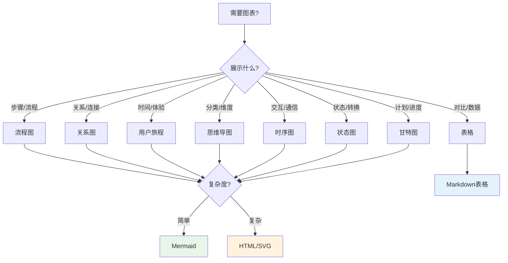

---

## 使用规范

### 代码块格式

```mdx
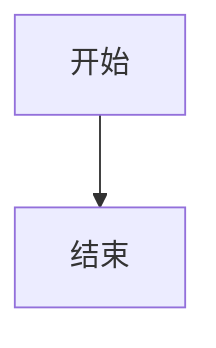
```

### 图表标题

每个图表前应有说明文字：

```mdx
以下是 xxx 的流程：


**图 1**：xxx 流程图
```

### 图表大小控制

- 流程图：节点数 ≤ 15
- 关系图：节点数 ≤ 20
- 时序图：参与者 ≤ 5
- 思维导图：层级 ≤ 3

### 颜色使用

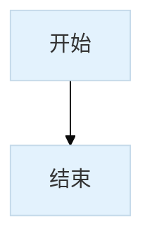

**推荐配色**：
- 主节点：`#e3f2fd`（浅蓝）
- 成功/完成：`#e8f5e9`（浅绿）
- 警告/错误：`#ffebee`（浅红）
- 普通节点：`#fff3e0`（浅橙）

---

## 常见场景速查

| 场景 | 推荐图表 | 示例 |
|------|---------|------|
| 写作流程 | 流程图 | 见本文档开头 |
| 知识图谱 | 关系图 | 见 00-writing-philosophy.md |
| 学习路径 | 用户旅程 | 见 06-quality-checklist.md |
| 优化维度 | 思维导图 | 见 06-quality-checklist.md |
| 章节规划 | 流程图 | 见 07-in-action-style.md |
| API 调用 | 时序图 | 见本文档时序图示例 |
| 订单状态 | 状态图 | 见本文档状态图示例 |
| 开发计划 | 甘特图 | 见本文档甘特图示例 |

---

## 与 feat-illustrator 协作

### 何时调用 feat-illustrator

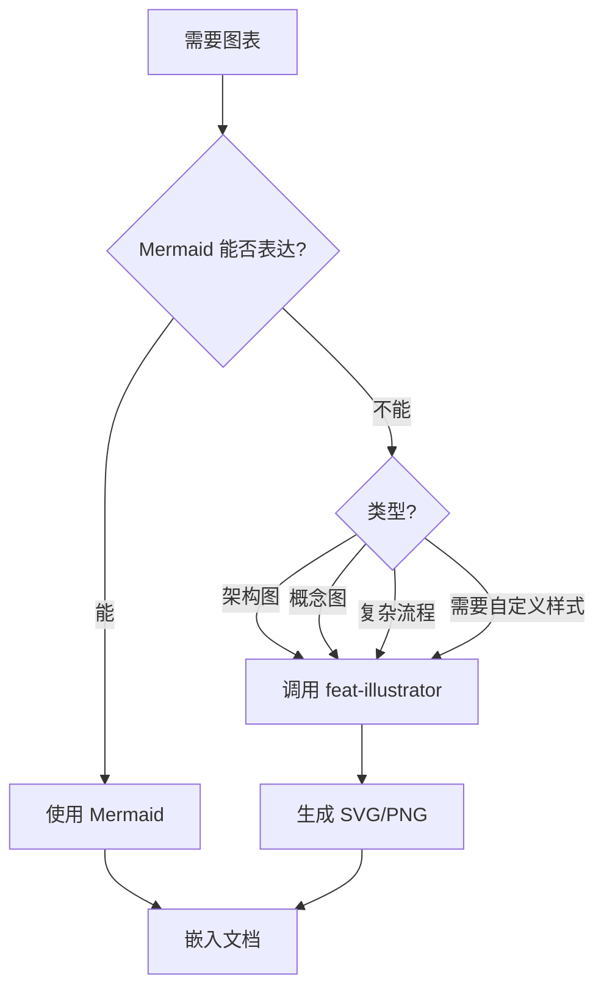

### 调用方式

```
使用 Skill 工具，传入 name: "feat-illustrator"
参数：
- type: "architecture" | "concept" | "flow"
- description: "详细描述"
- style: "minimalist" | "detailed"
```

### 协作流程

1. 完成文字内容
2. 标记需要插图的位置
3. 判断 Mermaid 是否足够
4. 如不够，调用 feat-illustrator
5. 在文档中引用图片（添加 alt 文本）
