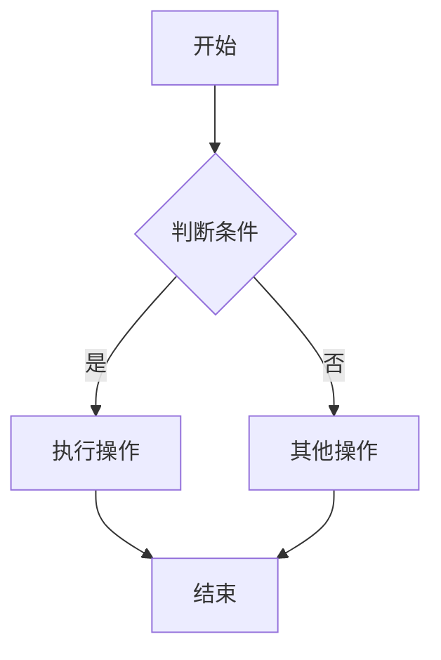
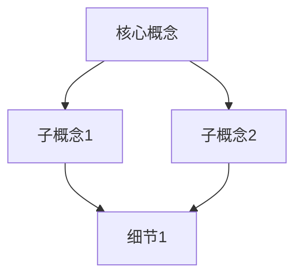
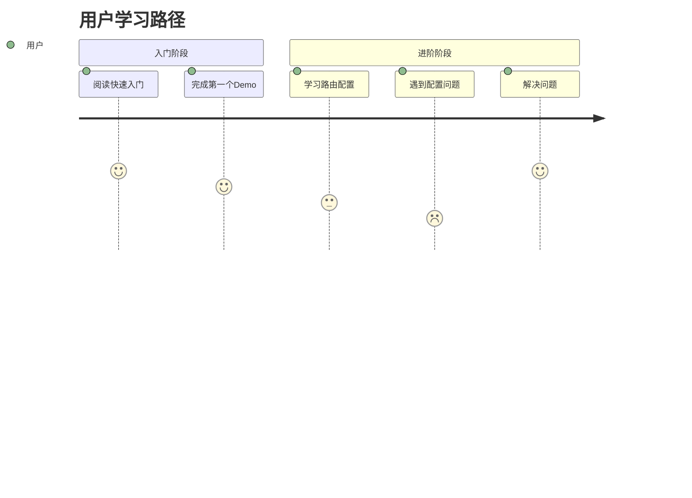
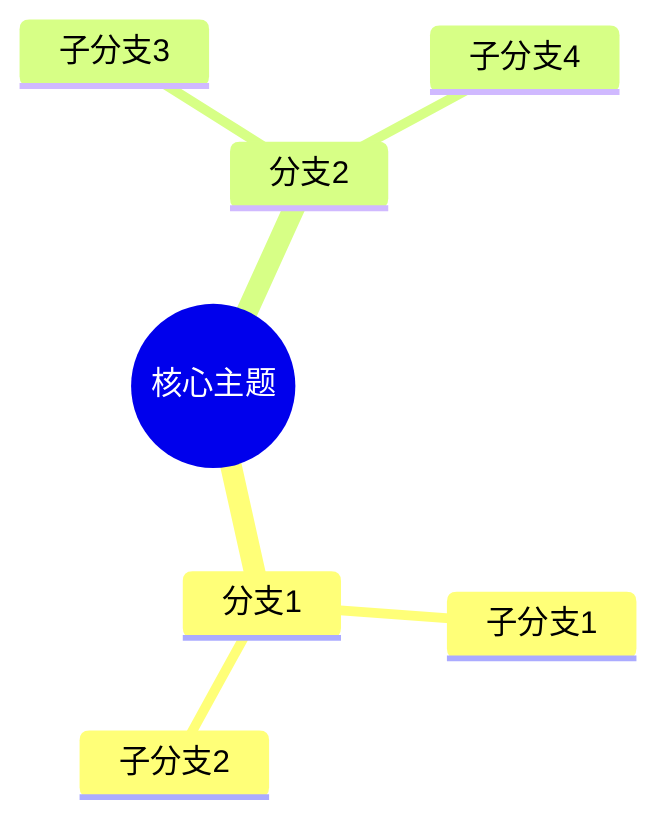
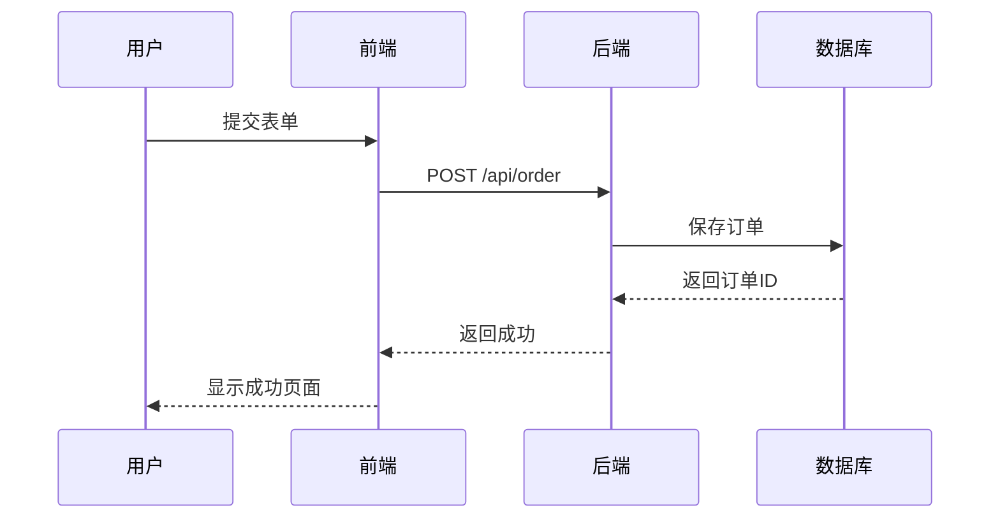
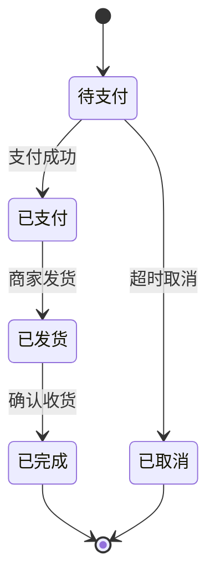
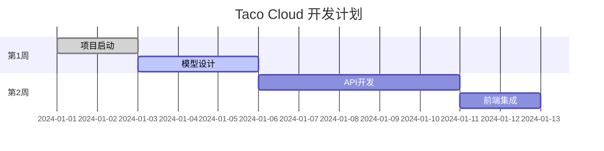
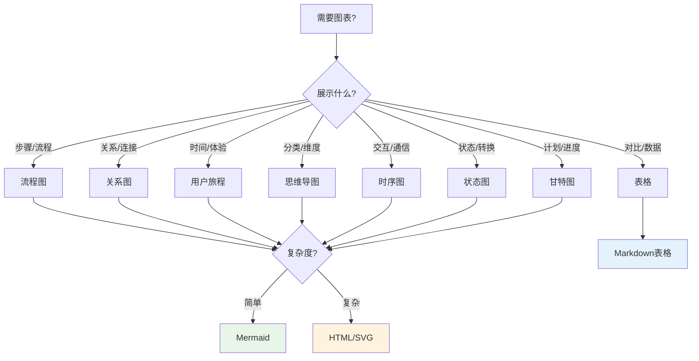
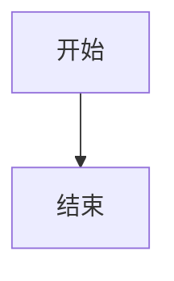
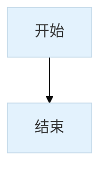

# 图表标准与组件库

## 设计原则

**核心原则**：图表辅助理解，不替代文字说明。

| 使用图表 | 使用文字 |
|---------|---------|
| 展示流程步骤 | 详细说明每个步骤 |
| 展示关系连接 | 解释关系含义 |
| 展示层级结构 | 描述层级逻辑 |
| 展示状态转换 | 说明转换条件 |
| 多维度对比 | 单一维度说明 |

---

## Mermaid 图表组件

### 1. 流程图（Flowchart）

**适用场景**：步骤流程、决策分支、工作流

**基础模板**：



**使用建议**：
- 节点数控制在 10 个以内
- 使用子图（subgraph）组织相关节点
- 用颜色区分不同类型节点
- 箭头标注清晰的条件
- **节点文字控制在 4-6 个汉字以内**

---

### 2. 关系图（Graph）

**适用场景**：知识图谱、依赖关系、模块结构

**基础模板**：



**使用建议**：
- 使用方向控制（TD/LR/RL/BT）优化布局
- 用颜色区分层级或类型
- 避免交叉线，调整节点位置
- **复杂关系图考虑分层展示，而非一张大图**

---

### 3. 用户旅程（Journey）

**适用场景**：学习路径、用户体验、情感曲线

**基础模板**：



**使用建议**：
- 评分 1-5，5 为最佳体验
- 标注角色（用户/系统/AI）
- 展示情感波动

---

### 4. 思维导图（Mindmap）

**适用场景**：知识分类、维度展开、检查清单

**基础模板**：



**使用建议**：
- 层级不超过 3 层
- 每个节点文字简洁
- 用于展示分类而非流程

---

### 5. 时序图（Sequence）

**适用场景**：交互流程、API 调用、组件通信

**基础模板**：



**使用建议**：
- 参与者控制在 5 个以内
- 使用激活框（+/-）表示处理中
- 标注关键消息

---

### 6. 状态图（StateDiagram）

**适用场景**：状态机、生命周期、订单状态

**基础模板**：



**使用建议**：
- 状态名简洁明确
- 标注触发条件
- 展示终态和初态

---

### 7. 甘特图（Gantt）

**适用场景**：项目计划、学习进度、里程碑

**基础模板**：



**使用建议**：
- 使用状态标记（done/active/crit）
- 合理设置时间粒度
- 标注关键里程碑

---

## 图表决策树



---

## 使用规范

### 代码块格式

```mdx

```

### 图表标题

每个图表前应有说明文字：

```mdx
以下是 xxx 的流程：


**图 1**：xxx 流程图
```

### 图表大小控制

**核心原则：当 Mermaid 文字看不清时，说明图表过于复杂，需要拆分或换方案。**

| 图表类型 | 建议最大节点数 | 文字可读性临界点 |
|---------|--------------|----------------|
| 流程图 | ≤ 10 | 超过 8 个节点时考虑子图 |
| 关系图 | ≤ 15 | 超过 12 个节点时考虑分层 |
| 时序图 | ≤ 4 个参与者 | 超过 3 个参与者时考虑简化 |
| 思维导图 | ≤ 3 层，每层 ≤ 5 个节点 | 节点文字超过 6 个字符时简化 |

**⚠️ 警告信号（出现以下情况必须优化）：**
- 节点文字被截断或显示为省略号
- 节点内文字字号小于 12px
- 节点之间连线过于密集，难以分辨
- 需要放大页面才能看清文字
- 移动端查看时文字几乎不可读

### 颜色使用



**推荐配色**：
- 主节点：`#e3f2fd`（浅蓝）
- 成功/完成：`#e8f5e9`（浅绿）
- 警告/错误：`#ffebee`（浅红）
- 普通节点：`#fff3e0`（浅橙）

### 复杂图表的替代方案

**当 Mermaid 无法满足需求时，按以下优先级选择：**

| 场景 | 推荐方案 | 说明 |
|------|---------|------|
| 节点数在限制内，但需要交互效果 | **Astro 组件** | 悬停提示、点击展开等交互 |
| 需要精确控制布局样式 | **Astro 组件** | 完全自定义节点位置、颜色、字体 |
| 节点数超出限制，且无法简化 | **专业设计工具** | 生成 SVG/PNG 插图 |
| 表格类数据 | Markdown 表格 | 清晰展示多维度对比 |
| 代码结构展示 | 代码块 + 注释 | 比图表更直观 |

**Mermaid vs Astro 组件选择标准**：
- **使用 Mermaid**：简单图表、快速绘制、无需交互、标准布局可接受
- **使用 Astro 组件**：需要交互效果、精确控制布局、自定义样式、响应式适配

---

## 常见场景速查

| 场景 | 推荐图表 | 节点限制 |
|------|---------|---------|
| 写作流程 | 流程图 | ≤ 8 |
| 知识图谱 | 关系图 | ≤ 12 |
| 学习路径 | 用户旅程 | ≤ 6 个阶段 |
| 优化维度 | 思维导图 | ≤ 3 层 |
| 章节规划 | 流程图 | ≤ 8 |
| API 调用 | 时序图 | ≤ 4 参与者 |
| 订单状态 | 状态图 | ≤ 6 状态 |
| 开发计划 | 甘特图 | ≤ 10 任务 |

**超出限制时**：拆分图表、使用文字描述，或使用 Astro 组件/专业设计工具。
