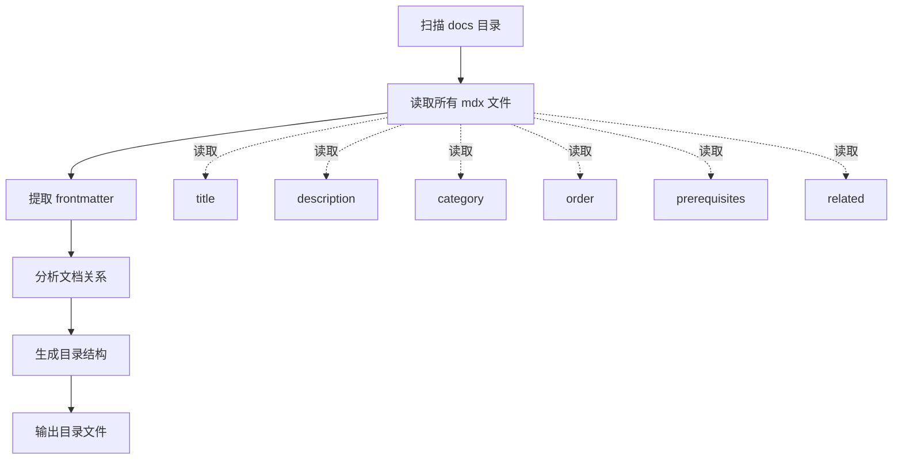
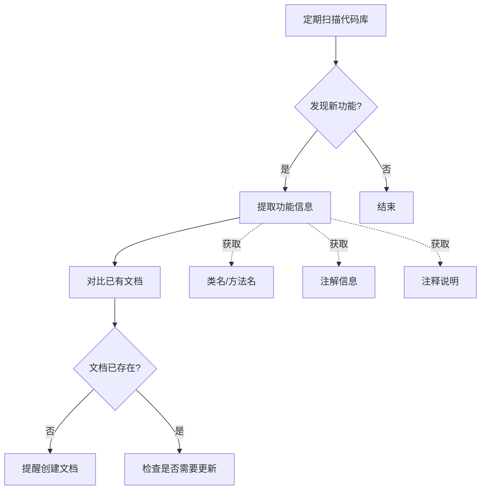
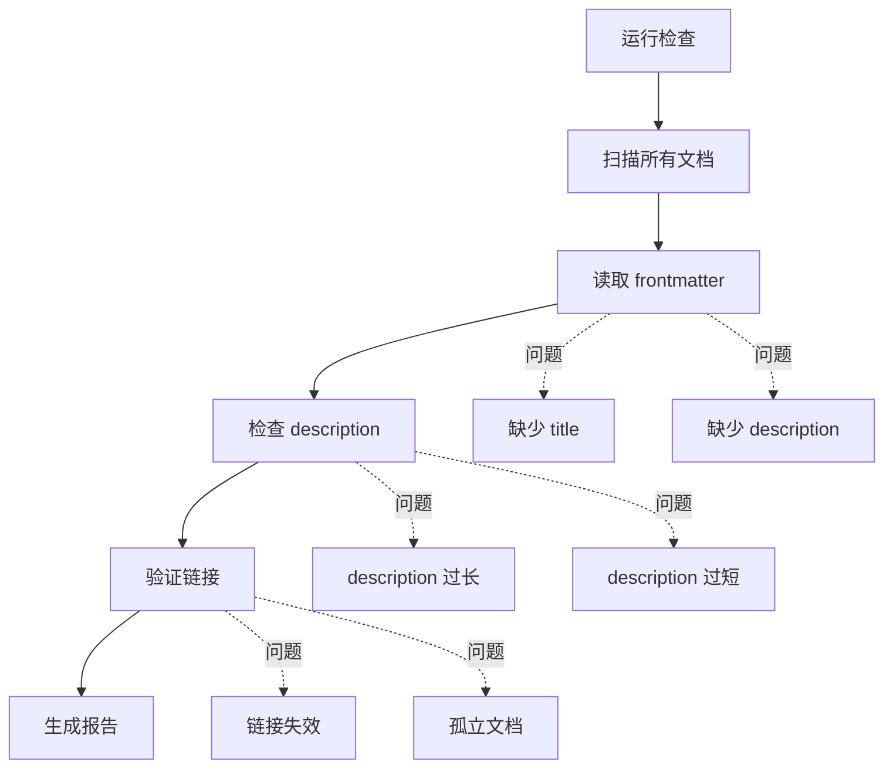

# 教程目录管理

## 职责

读取 `pages/src/content/docs/` 下的 mdx 文档信息，用于更新缓存的目录结构。

**注意**：本模块只负责**读取** mdx 文档中的信息，不干预文档的元数据标准。文档的 frontmatter 标准由其他规范定义。

---

## 读取的信息

从每个 `.mdx` 文件的 frontmatter 中读取：

| 字段 | 用途 | 是否必需 |
|------|------|---------|
| `title` | 显示标题 | 是 |
| `description` | 目录描述 | 是 |
| `category` | 分类归属 | 否 |
| `order` | 排序序号 | 否 |
| `prerequisites` | 前置知识 | 否 |
| `related` | 相关文档 | 否 |

---

## 目录生成流程



---

## 输出格式

### 目录文件

生成的 `_meta.json` 位于 `.agents/skills/feat-docs-tutorial/_meta.json`：

```json
{
  "server": {
    "title": "Server 模块",
    "description": "Feat HTTP 服务器核心功能",
    "children": {
      "getstart": {
        "title": "快速入门",
        "description": "5分钟快速上手 Feat Server"
      },
      "router": {
        "title": "路由配置",
        "description": "学习 Feat 的路由配置，包括路径匹配、参数提取和中间件"
      }
    }
  }
}
```

### 目录树格式

```
Feat 官方文档
├── 快速入门
│   └── 快速入门（5分钟上手）
├── Server 模块
│   ├── 路由配置（路径匹配、参数提取）
│   ├── 拦截器（请求拦截和权限控制）
│   └── 静态资源（静态文件服务）
├── Cloud 模块
│   ├── 依赖注入（IoC 容器使用）
│   ├── 数据库集成（JDBC 和连接池）
│   └── 配置管理（多环境配置）
└── AI 模块
    ├── Chat 模型（对话接口使用）
    └── Vector 存储（向量数据库集成）
```

---

## 新功能检测

### 检测流程



### 检测规则

1. **新模块检测**
   - 扫描 `feat-*/src/main/java/tech/smartboot/feat/*`
   - 发现新的顶级包目录
   - 示例：`feat-ai` 模块新增 `agent` 包

2. **新功能检测**
   - 扫描 `@Bean` 注解的类
   - 扫描公开 API 方法
   - 对比已有文档，发现未覆盖功能

3. **版本变更检测**
   - 监听版本发布
   - 检测新增/废弃功能
   - 提醒更新文档

---

## 目录更新场景

### 新增文档

当新文档创建时：
1. 读取新文档的 frontmatter
2. 更新目录结构
3. 同步 description 到目录

### 修改文档

当文档修改时：
1. 检测 frontmatter 变更
2. 更新目录中的对应信息
3. 保持其他信息不变

### 删除文档

当文档删除时：
1. 从目录中移除对应项
2. 检查是否有其他文档引用
3. 提醒更新相关链接

---


## 使用示例

### 生成完整目录

```
扫描 pages/src/content/docs/ 目录
读取所有 mdx 文件的 frontmatter
生成目录结构
输出到 .agents/skills/feat-docs-tutorial/_meta.json
```

### 检测缺失文档

```
扫描 feat-core/src/main/java 代码
提取公开 API
对比已有文档
发现未覆盖功能：
  - WebSocket 支持（无文档）
  - SSE 推送（无文档）
提醒用户创建文档
```

### 更新单个文档

```
用户修改了 router.mdx
读取 frontmatter 变更
更新目录中的 description
```

---

## 质量检查

### 目录健康度指标

- [ ] 所有文档都有 description
- [ ] description 长度符合规范（30-50 字）
- [ ] 无孤立文档（至少有一个相关链接）
- [ ] 目录层级不超过 3 层
- [ ] 排序逻辑清晰

### 自动化检查



---

## 注意事项

1. **只读操作**：本模块只读取 mdx 文件信息，不修改文档内容
2. **缓存更新**：目录信息用于更新缓存，供导航、搜索等功能使用
3. **元数据标准**：文档的 frontmatter 标准由写作规范定义，本模块只负责读取
4. **description 来源**：目录中显示的 description 直接来自 mdx 文件的 frontmatter
5. **输出位置**：生成的 `_meta.json` 位于 `.agents/skills/feat-docs-tutorial/_meta.json`，供 Skill 内部使用
