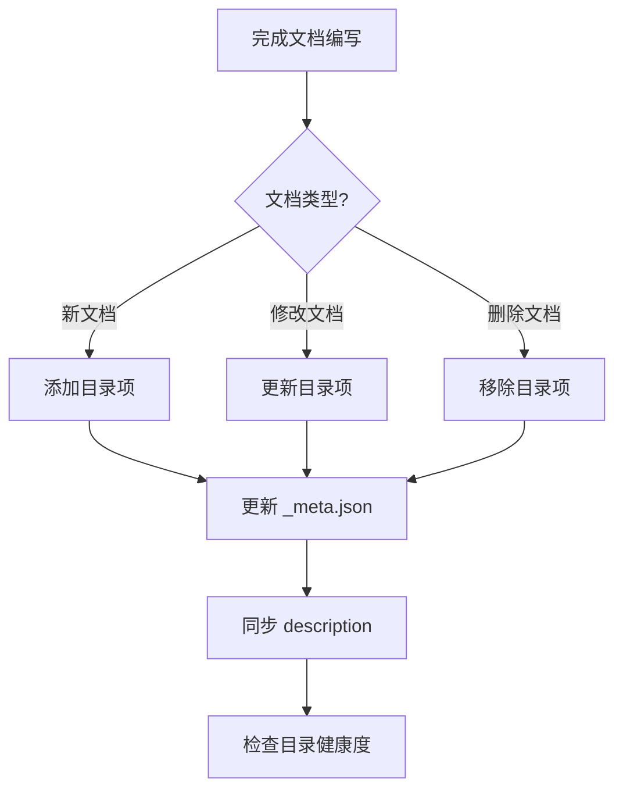
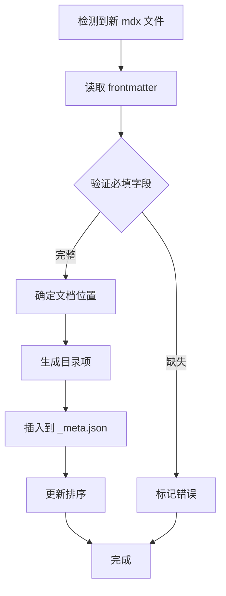
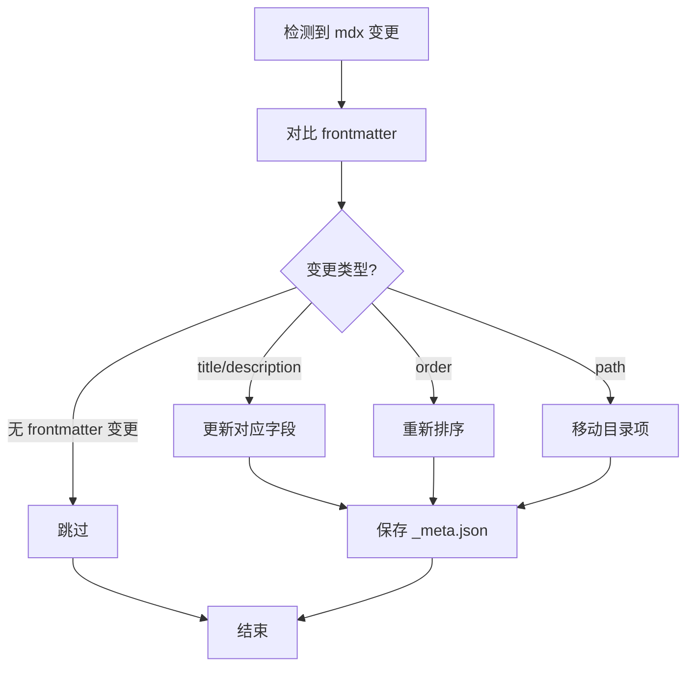
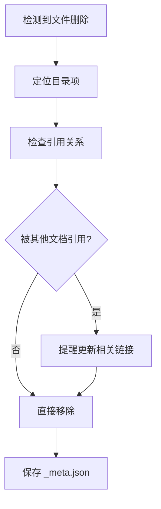
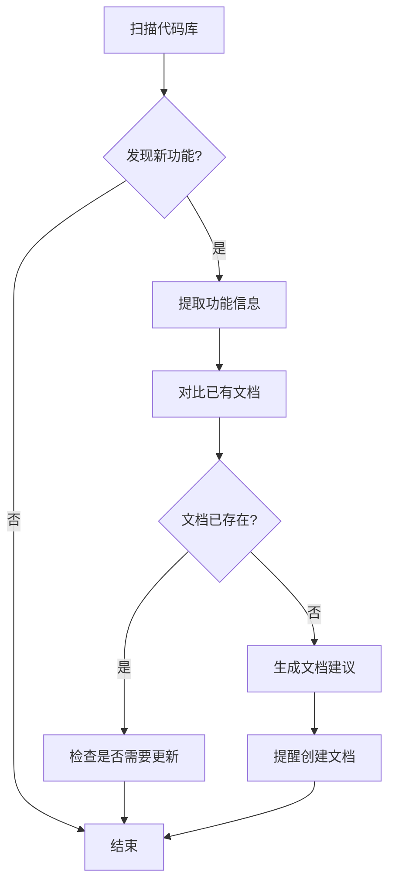
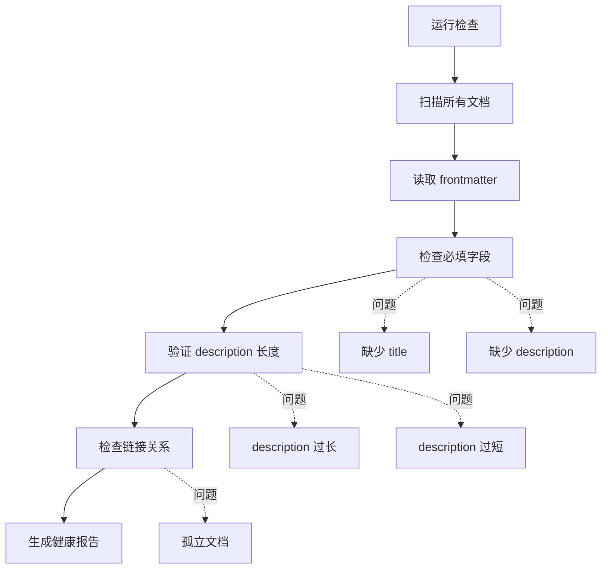

# 教程目录管理

## 定位与职责

### 在整体流程中的位置

本模块是 **Feat 官方教程写作专家** 的**第 5 步**：完成文档编写后，更新教程目录结构。



### 核心职责

1. **读取** `pages/src/content/docs/` 下的 mdx 文档 frontmatter 信息
2. **生成** 目录结构数据（`_meta.json`）
3. **更新** 缓存，供导航、搜索等功能使用

**注意**：本模块只负责**读取**和**生成**，不干预文档的元数据标准。文档的 frontmatter 标准由写作规范定义。

---

## 数据流

### 输入：mdx frontmatter

从每个 `.mdx` 文件的 frontmatter 中读取：

| 字段 | 用途 | 是否必需 | 说明 |
|------|------|---------|------|
| `title` | 显示标题 | 是 | 文档在目录中的显示名称 |
| `description` | 目录描述 | 是 | 30-50 字，用于目录展示和搜索摘要 |
| `category` | 分类归属 | 否 | 用于分组展示，如"核心功能"、"高级特性" |
| `order` | 排序序号 | 否 | 数字越小排序越靠前，默认按文件名排序 |
| `prerequisites` | 前置知识 | 否 | 学习本文档前建议阅读的其他文档 |
| `related` | 相关文档 | 否 | 与本文档相关的其他文档，用于推荐 |

### 输出：_meta.json

生成的 `_meta.json` 位于 `.agents/skills/feat-docs-tutorial/_meta.json`：

```json
{
  "server": {
    "title": "Server 模块",
    "description": "Feat HTTP 服务器核心功能",
    "path": "server",
    "children": {
      "getstart": {
        "title": "快速入门",
        "description": "5分钟快速上手 Feat Server",
        "path": "server/getstart",
        "order": 1
      },
      "router": {
        "title": "路由配置",
        "description": "学习 Feat 的路由配置，包括路径匹配、参数提取和中间件",
        "path": "server/router",
        "order": 2
      }
    }
  }
}
```

### 消费方

`_meta.json` 被以下功能使用：

- **文档导航**：生成侧边栏导航结构
- **相关推荐**：根据 `related` 字段推荐相关文档
- **学习路径**：根据 `prerequisites` 构建学习路径
- **搜索索引**：提供文档标题和描述用于搜索

---

## 触发方式

### 自动触发

以下场景会自动触发目录更新：

1. **完成文档编写** - 当 Skill 完成一篇文档的编写后
2. **文档修改保存** - 当检测到 mdx 文件内容变更时
3. **文档删除** - 当检测到 mdx 文件被删除时

### 手动触发

以下场景需要手动触发目录更新：

1. **强制刷新** - 当自动更新失败或缓存异常时
2. **修复目录错误** - 当发现目录结构与实际文档不符时
3. **批量更新** - 当外部批量修改了多个文档时

---

## 操作流程

### 新增文档流程

当创建新文档时：



**操作步骤**：
1. 读取新文档的 frontmatter
2. 验证 `title` 和 `description` 是否完整
3. 根据文件路径确定目录位置
4. 生成目录项并插入到 `_meta.json`
5. 根据 `order` 字段更新排序

### 修改文档流程

当文档修改时：



**操作步骤**：
1. 检测 frontmatter 变更
2. 根据变更类型更新对应信息
3. 保持其他信息不变
4. 保存更新后的 `_meta.json`

### 删除文档流程

当文档删除时：



**操作步骤**：
1. 从目录中定位并移除对应项
2. 检查是否有其他文档通过 `prerequisites` 或 `related` 引用
3. 如有引用，提醒更新相关链接
4. 保存更新后的 `_meta.json`

---

## 新功能检测

### 检测触发条件

定期扫描代码库，发现以下情况时触发：

1. **新模块** - 发现新的 `feat-*` 模块
2. **新包** - 模块中新增顶级包目录
3. **新 API** - 发现新的公开 API 类或方法

### 检测流程



### 检测结果处理

发现未覆盖功能时：

1. **生成建议** - 根据代码结构生成文档创建建议
2. **提醒用户** - 提示需要创建新文档
3. **提供模板** - 提供符合规范的文档模板

---

## 质量检查与修复

### 目录健康度指标

- [ ] 所有文档都有 `title` 和 `description`
- [ ] `description` 长度符合规范（30-50 字）
- [ ] 无孤立文档（至少有一个 `related` 或 `prerequisites` 链接）
- [ ] 目录层级不超过 3 层
- [ ] 排序逻辑清晰（`order` 无重复）

### 自动检查流程



### 问题修复指南

| 问题类型 | 修复方式 |
|---------|---------|
| 缺少必填字段 | 提醒补充 frontmatter |
| description 过长/过短 | 提醒修改至 30-50 字 |
| 孤立文档 | 建议添加 `related` 或 `prerequisites` |
| 排序冲突 | 自动重新分配 `order` 或提醒手动调整 |

---

## 异常处理

### 常见错误及处理方式

| 错误场景 | 处理方式 | 说明 |
|---------|---------|------|
| frontmatter 解析失败 | 记录错误并跳过该文件 | 继续处理其他文档 |
| 必填字段缺失 | 标记为待修复，生成错误报告 | 不中断流程 |
| 重复 title/description | 提醒修改，保留先出现的文档 | 需要人工确认 |
| 文件读取失败 | 重试 3 次后跳过 | 可能是临时文件锁定 |
| JSON 生成失败 | 保留上次成功的缓存 | 避免目录数据丢失 |

### 错误报告格式

```json
{
  "timestamp": "2026-01-15T10:30:00Z",
  "errors": [
    {
      "file": "server/router.mdx",
      "type": "missing_field",
      "field": "description",
      "message": "缺少必填字段 description"
    },
    {
      "file": "ai/chat.mdx",
      "type": "parse_error",
      "message": "frontmatter YAML 解析失败"
    }
  ],
  "warnings": [
    {
      "file": "cloud/config.mdx",
      "type": "orphan_document",
      "message": "文档未被任何其他文档引用"
    }
  ]
}
```

---

## 附录

### 目录结构约定

```
pages/src/content/docs/
├── _meta.json           # 生成的目录数据
├── guides/              # 通用指南（一级目录）
│   ├── _meta.json       # 子目录配置（可选）
│   ├── getstart.mdx     # 快速入门文档
│   └── best-practices/
│       └── index.mdx    # 子目录文档
├── server/              # Server 模块（一级目录）
│   ├── getstart.mdx     # 排序: 1
│   ├── router.mdx       # 排序: 2
│   └── interceptor.mdx  # 排序: 3
├── cloud/               # Cloud 模块
├── ai/                  # AI 模块
└── client/              # Client 模块
```

**层级规则**：
- **一级目录**：模块名称（server、cloud、ai、client、guides）
- **二级目录**：功能分类（可选，用于组织大量文档）
- **三级**：具体文档

**frontmatter 继承规则**：
- 子目录文档继承父目录的 `category`（如果未指定）
- 子目录文档的 `order` 相对于同级文档生效

### 版本管理说明

当前版本暂不支持多版本文档管理。未来扩展时：

1. **版本标记** - 在 frontmatter 中增加 `version` 字段
2. **版本目录** - 使用 `v1/`、`v2/` 等子目录区分
3. **版本切换** - 在 `_meta.json` 中维护版本映射关系
