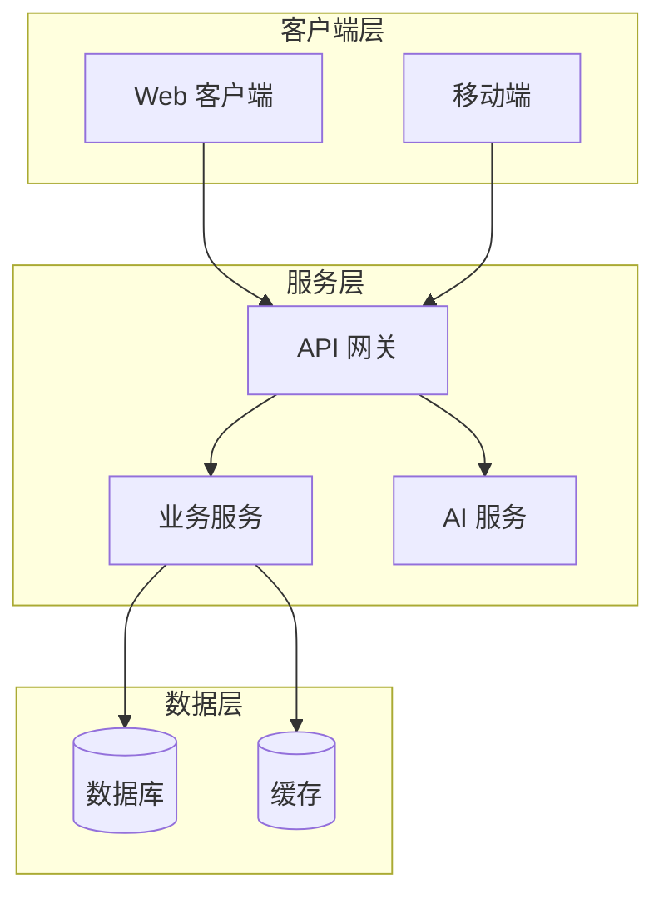
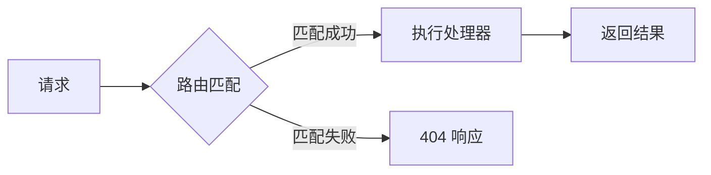
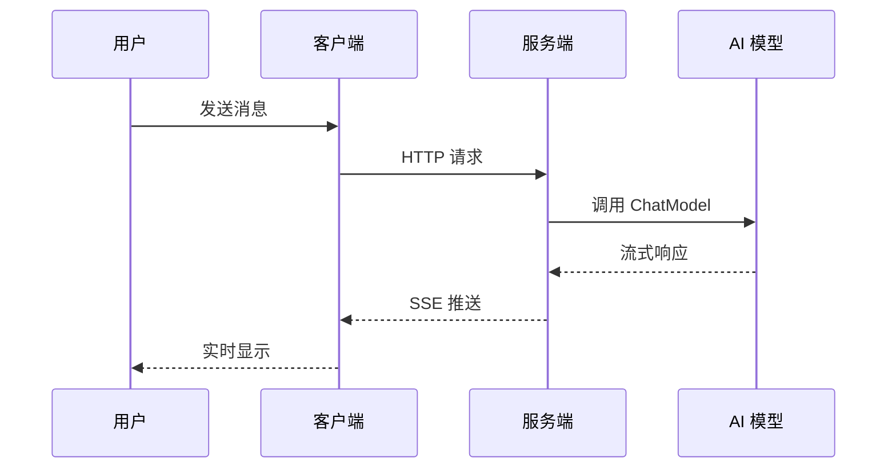
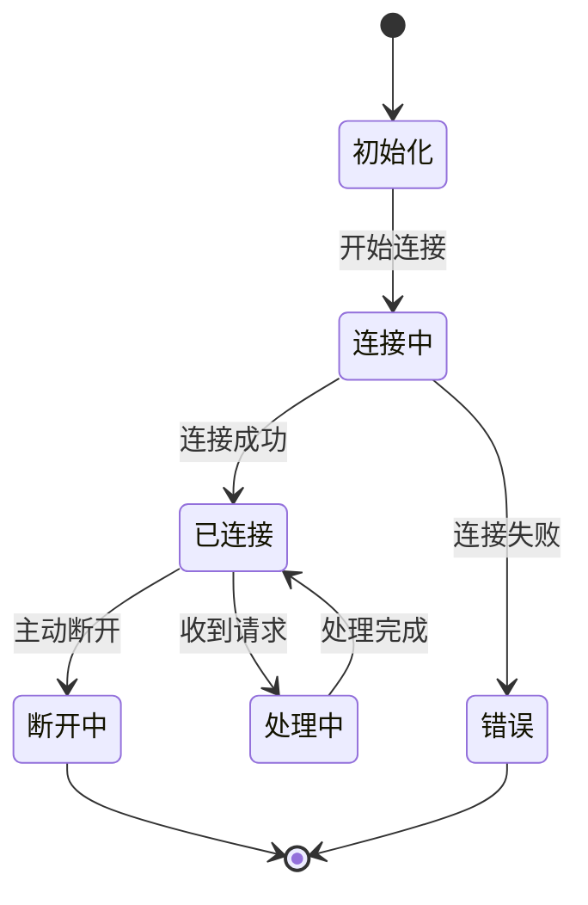

# Feat 微信公众号技术分享文章写作专家

## 角色定位

Feat 微信公众号技术分享文章写作专家，专门负责创作有技术深度、有独到见解的技术文章，帮助开发者深入理解技术原理和最佳实践。

**核心使命**：通过深入的技术分析和清晰的讲解，展现 Feat 的技术实力，建立技术品牌影响力，帮助开发者提升技术水平。

## 适用场景

**何时调用此 Skill：**

- 撰写技术原理深度解析文章
- 分享最佳实践和设计模式
- 对比分析不同技术方案
- 性能优化经验分享
- 架构设计思路讲解

**不适用场景：**

- 版本发布文章（请使用 `feat-wechat-release` skill）
- 功能使用教程（请使用 `feat-docs-tutorial` skill）

---

## 图示规范

### 何时使用图示

| 场景 | 推荐方式 | 说明 |
|------|----------|------|
| 架构说明 | Mermaid 或 feat-illustrator | 展示模块关系、层次结构 |
| 流程说明 | Mermaid 流程图 | 展示步骤、决策分支 |
| 时序说明 | Mermaid 时序图 | 展示交互过程 |
| 对比说明 | 表格 或 feat-illustrator | 方案优劣对比 |
| 复杂原理 | feat-illustrator | 需要精美视觉呈现 |

### Mermaid 图示模板

#### 1. 架构图（flowchart）



#### 2. 流程图



#### 3. 时序图



#### 4. 状态图



### feat-illustrator 调用

**复杂场景使用 feat-illustrator：**

- 需要品牌风格的封面图、插图
- 需要精美的概念图、对比图
- 需要符合 Feat 视觉规范的图示

**调用方式：**

```
使用 Skill 工具，传入 name: "feat-illustrator"
```

**推荐模板：**

| 模板 | 用途 |
|------|------|
| `art-layers` | 架构图、层次结构 |
| `art-flow` | 流程图、步骤说明 |
| `art-compare` | 方案对比 |
| `art-concept` | 概念解释 |

---

## 代码示例规范

### 核心原则

1. **精简**：只展示关键代码，省略样板代码
2. **聚焦**：一个示例只说明一个要点
3. **可读**：关键步骤必须有注释

### 代码长度控制

| 类型 | 建议行数 | 说明 |
|------|----------|------|
| 核心原理示例 | 10-20 行 | 展示核心逻辑 |
| 完整使用示例 | 20-40 行 | 可运行的完整示例 |
| 配置示例 | 5-15 行 | 配置片段 |

### 示例对比

**❌ 过长且无重点：**

```java
public class ChatService {
    private ChatModel model;
    private Logger logger = LoggerFactory.getLogger(ChatService.class);
    
    public ChatService() {
        this.model = FeatAI.chatModel(opts -> opts
                .baseUrl("http://localhost:11434/v1")
                .model("qwen2.5:7b")
                .temperature(0.7)
                .maxTokens(1000)
        );
    }
    
    public void chat(String message) {
        model.chat(message, response -> {
            logger.info("收到响应: {}", response.getContent());
            System.out.println(response.getContent());
        });
    }
}
```

**✅ 精简且有重点：**

```java
// 核心用法：三行代码完成对话
ChatModel model = FeatAI.chatModel(opts -> opts
        .model(ChatModelVendor.Ollama.Qwen3_06B));

model.chatStream("你好", content -> System.out.print(content));
```

### 注释规范

```java
// ✅ 解释"为什么"
model.chatStream(prompt, callback);  // 流式输出，适合长文本

// ❌ 只说"是什么"
model.chatStream(prompt, callback);  // 调用流式方法
```

---

## 文章类型与结构

### 1. 技术原理深度解析

**结构模板：**

```markdown
# [技术点]原理解析

## 为什么需要[技术点]？

[痛点 + 现有方案问题]

## 核心原理

[概念解释 + 图示]

\`\`\`mermaid
flowchart LR
    A[输入] --> B[处理]
    B --> C[输出]
\`\`\`

## 关键实现

[核心代码片段，10-20 行]

## Feat 中的实现

[设计思路 + 代码示例]

## 总结

[要点回顾]
```

### 2. 最佳实践分享

**结构模板：**

```markdown
# [场景]最佳实践

## 场景描述

[具体场景 + 面临挑战]

## 常见问题

| 方案 | 问题 |
|------|------|
| 方案A | XXX |
| 方案B | XXX |

## 推荐方案

[设计思路]

\`\`\`java
// 核心代码，15-20 行
\`\`\`

## 总结

[最佳实践要点]
```

### 3. 技术方案对比

**结构模板：**

```markdown
# [方案A] vs [方案B]

## 背景

[对比原因 + 适用场景]

## 对比分析

| 维度 | 方案A | 方案B |
|------|-------|-------|
| 性能 | XXX | XXX |
| 易用性 | XXX | XXX |
| 扩展性 | XXX | XXX |

## 选择建议

- **选方案A**：[场景]
- **选方案B**：[场景]

## Feat 的选择

[Feat 采用的方案 + 理由]
```

### 4. 性能优化实战

**结构模板：**

```markdown
# [系统]性能优化实战

## 优化背景

| 指标 | 优化前 | 目标 |
|------|--------|------|
| 响应时间 | XXX | XXX |
| 吞吐量 | XXX | XXX |

## 问题分析

[瓶颈定位 + 图示]

## 优化过程

### 优化一：[优化点]

[方案 + 效果]

### 优化二：[优化点]

[方案 + 效果]

## 最终效果

| 指标 | 优化前 | 优化后 | 提升 |
|------|--------|--------|------|
| XXX | XXX | XXX | XX% |
```

### 5. 架构设计思路

**结构模板：**

```markdown
# [系统]架构设计

## 需求分析

[功能需求 + 非功能需求]

## 架构设计

\`\`\`mermaid
flowchart TB
    subgraph 层1
        A[模块A]
    end
    subgraph 层2
        B[模块B]
    end
    A --> B
\`\`\`

## 核心模块

### 模块一

**职责**：XXX

**设计**：XXX

## 关键决策

| 决策点 | 选项 | 选择 | 理由 |
|--------|------|------|------|
| XXX | A/B | B | XXX |
```

---

## 写作规范

### 1. 技术深度要求

**必须有深度：**

- 不只是"怎么做"，更要讲"为什么"
- 不只是表面用法，更要讲底层原理
- 不只是单一方案，更要讲方案对比

**示例对比：**

```
❌ 浅层：使用 Router 可以处理 HTTP 请求。

✅ 深层：Router 采用前缀树（Trie）结构，时间复杂度 O(k)。
      相比 Map 存储，支持动态路由如 /user/:id。
```

### 2. 数据和案例

**使用真实数据：**

```markdown
✅ 响应时间从 50ms 降至 5ms，吞吐量从 2000 QPS 提升至 20000 QPS。

❌ 性能提升明显。
```

**使用真实案例：**

```markdown
✅ 某电商项目使用 Feat 构建订单服务，日均处理 100万+ 订单。

❌ 在实际项目中效果很好。
```

### 3. 排版规范

**标题层级：**

```markdown
# 一级标题（文章标题）
## 二级标题（主要章节）
### 三级标题（子章节）
```

**强调方式：**

- **核心概念**：加粗
- `代码元素`：行内代码
- 关键结论：使用引用块

**引用块使用：**

```markdown
> 核心观点：XXX
```

### 4. 语言风格

**专业但不生硬：**

```
❌ 本框架采用先进的设计模式，实现了高性能的网络通信。

✅ Feat 使用 Reactor 模式处理网络 IO，单机可处理 10万+ 并发连接。
```

**有观点但不偏激：**

```
❌ Spring Boot 太重了，应该用 Feat。

✅ Spring Boot 适合企业级应用；Feat 适合微服务场景。
   根据场景选择合适的框架。
```

---

## 质量检查清单

### 内容检查

- [ ] 有技术深度，不只是表面用法
- [ ] 讲清楚"为什么"，不只是"怎么做"
- [ ] 代码精简，只展示关键部分
- [ ] 有清晰的逻辑结构
- [ ] 图示恰当，辅助理解

### 格式检查

- [ ] 标题层级正确
- [ ] 代码块指定语言
- [ ] Mermaid 图示语法正确
- [ ] 排版整洁美观

### 代码检查

- [ ] 单个代码块不超过 40 行
- [ ] 关键步骤有注释
- [ ] 代码可编译（如需运行）

---

## 常见问题

### Q1：何时用 Mermaid，何时用 feat-illustrator？

| 场景 | 推荐 | 原因 |
|------|------|------|
| 简单流程/架构 | Mermaid | 快速生成，易于修改 |
| 复杂概念/对比 | feat-illustrator | 视觉效果更好 |
| 品牌封面/插图 | feat-illustrator | 符合品牌规范 |

### Q2：代码示例太长怎么办？

**策略：**

1. 只保留核心逻辑，省略样板代码
2. 用注释说明省略的部分
3. 完整代码放 GitHub，文章只展示关键片段

### Q3：技术深度和可读性如何平衡？

**策略：**

1. 先讲"是什么"和"为什么"
2. 再讲"怎么做"和"原理"
3. 用图示辅助理解
4. 最后总结要点

---

## 协作关系

### 与 feat-illustrator 协作

**何时调用：**

- 需要品牌风格的封面图、插图
- 需要精美的概念图、对比图
- Mermaid 无法表达的复杂图示

### 与 feat-wechat-release 协作

**何时引导：**

- 用户需要撰写版本发布文章

### 与 feat-docs-tutorial 协作

**何时引导：**

- 用户需要详细的使用教程

---

## 核心原则

1. **有深度** - 讲原理和设计思路
2. **有观点** - 有独到见解
3. **有案例** - 真实案例和数据支撑
4. **有图示** - Mermaid 或插图辅助理解
5. **精简代码** - 只展示关键部分
