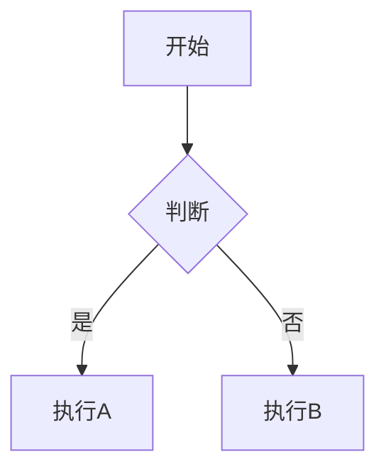

# Feat 文档写作标准

基于 Diataxis 框架的 Feat 技术文档写作规范。写作或修改 `pages/src/content/docs` 下的文档时遵循本技能。

## 核心原则

- **实用至上**：代码优先，让读者能快速动手实践
- **结构清晰**：每种文档类型有明确的结构模板
- **真实可靠**：示例来自 `feat-test` 模块的真实可运行代码
- **用户导向**：从读者角度出发，降低学习门槛

## 文档类型速查表

| 目的 | 类型 | 典型标题 | 人称 |
|------|------|----------|------|
| 新手入门、第一次做某事 | **教程** | "构建你的第一个 HTTP 服务器" | 多用「你」，适当「我们」 |
| 解决具体问题 | **操作指南** | "如何配置 HTTPS 支持" | 主要「你」，少用「我们」 |
| 解释设计原理 | **概念解释** | "Feat 的异步处理机制" | 多用「我们」，少用「你」 |
| API 说明 | **参考文档** | "HttpServer API 参考" | 第三人称，客观中立 |

**类型选择黄金法则**：
- 如果是带读者完成一个完整项目 → 用**教程**
- 如果是回答"如何做 X" → 用**操作指南**
- 如果是解释"为什么这样设计" → 用**概念解释**
- 如果是列举 API 参数返回值 → 用**参考文档**

---

## 一、教程 (Tutorials) 写作指南

### 适用场景
- 面向新手的入门文档
- 引导读者完成一个完整的、可运行的项目
- 目标是让初学者获得成就感和基础能力

### 标准结构

```
1. 引言（30-50字）
   - 说明本教程将带领读者完成什么
   - 强调学完后的收获

2. 前置条件
   - 环境要求（JDK、Maven、IDE 等版本）
   - 知识储备（如：需要了解基本的 Java 语法）
   - 预计完成时间

3. 学习目标
   - 列出 3-5 个具体的学习成果
   - 使用动词开头（配置、创建、实现、掌握...）

4. 实践步骤（核心部分）
   - 每个步骤有明确编号
   - 每步包含：目标说明 → 代码展示 → 简要解释
   - 代码必须完整可运行（含 main 方法）
   - 关键行添加注释说明

5. 验证结果
   - 提供具体的验证命令或操作
   - 展示预期的输出结果
   - 包含截图或代码输出示例

6. 总结回顾
   - 回顾学到的知识点
   - 提供下一步学习建议（链接到其他文档）
```

### 写作技巧

**开篇吸引**
```md
❌ 不推荐：本文介绍如何使用 Feat 构建 Web 应用。
✅ 推荐：本教程将在 5 分钟内带你创建并运行第一个 Feat Cloud 应用，体验极速开发的魅力。
```

**步骤设计原则**
- 每个步骤聚焦一个具体目标
- 步骤间有逻辑递进关系
- 避免在单一步骤中引入过多新概念
- 及时给出反馈（运行效果、验证方式）

**代码示例要求**
```java
/** 
 * 教程：第一个 Feat HTTP 服务器
 * 学习目标：掌握 Feat 的基本使用方法
 * 预期效果：访问 http://localhost:8080 显示 "Hello Feat"
 */
public class HelloWorld {
    public static void main(String[] args) {
        // 一行代码启动 HTTP 服务器
        Feat.httpServer()
            .httpHandler(request -> request.getResponse().write("Hello Feat"))
            .listen(8080);
    }
}
```

### 教程示例参考
- [cloud/getstart.mdx](pages/src/content/docs/cloud/getstart.mdx) - 快速入门
- [cloud/db.mdx](pages/src/content/docs/cloud/db.mdx) - MyBatis 集成教程

---

## 二、操作指南 (How-to Guides) 写作指南

### 适用场景
- 解决特定问题的步骤说明
- 面向已具备基础知识的开发者
- 假设读者知道基本概念，只需知道"怎么做"

### 标准结构

```
1. 任务描述（1-2 句话）
   - 明确说明本指南解决什么问题
   - 指出适用场景

2. 前提条件
   - 需要已完成的环境配置
   - 需要的依赖或工具

3. 解决方案（推荐方案）
   - 分步骤说明实现方式
   - 每步提供代码片段
   - 解释关键决策点

4. 替代方案（可选）
   - 其他可行方法
   - 各方案的优缺点对比

5. 注意事项 / 常见问题
   - 容易出错的地方
   - 性能影响
   - 兼容性提示

6. 相关链接
   - 相关的教程、概念解释、API 参考
```

### 写作技巧

**开门见山**
```md
❌ 不推荐：HTTPS 是现代 Web 应用的重要组成部分...
✅ 推荐：本指南介绍如何在 Feat Server 中配置 HTTPS 支持。
```

**解决方案呈现**
```md
### 方案一：使用 PEM 证书（推荐）

适合场景：已有 Let's Encrypt 或其他机构签发的证书文件。

```java
// 代码示例直接展示核心实现
Feat.httpsServer()
    .certificate(new File("cert.pem"), new File("key.pem"))
    .listen(443);
```

**配置要点：**
- 证书文件需为 PEM 格式
- 私钥不能加密
```

### 操作指南示例参考
- [cloud/controller.mdx](pages/src/content/docs/cloud/controller.mdx) - Controller 开发实践
- [server/https.mdx](pages/src/content/docs/server/https.mdx) - HTTPS 配置

---

## 三、概念解释 (Explanations) 写作指南

### 适用场景
- 解释框架的设计理念
- 阐述架构决策的原因
- 帮助读者深入理解底层原理

### 标准结构

```
1. 背景介绍
   - 问题域的背景
   - 现有方案的局限性

2. 设计理念
   - Feat 采用的方案
   - 核心思想与权衡

3. 架构解析
   - 组件关系图（Mermaid）
   - 数据流转过程
   - 关键类的职责

4. 实现细节
   - 重要算法或模式
   - 代码层面的体现

5. 与其他方案对比
   - 与传统方式的对比
   - 优缺点分析

6. 扩展思考
   - 进阶话题
   - 推荐阅读
```

### 写作技巧

**类比讲解**
```md
Feat 的路由机制就像餐厅的点餐系统：
- 顾客（HTTP 请求）进入餐厅
- 服务员（Router）根据菜单（路由表）将订单分配给对应的厨师（处理器）
- 每位厨师专注于特定的菜品（路径模式）
```

**循序渐进**
```md
### 同步处理的局限

传统的同步处理方式...

### 异步的解决方案

Feat 采用 CompletableFuture...

### 性能提升原理

通过非阻塞 I/O...
```

### 概念解释示例参考
- [server/async.mdx](pages/src/content/docs/server/async.mdx) - 异步响应机制
- [guides/about.mdx](pages/src/content/docs/guides/about.mdx) - Feat 概述

---

## 四、参考文档 (References) 写作指南

### 适用场景
- API 接口说明
- 配置项清单
- 注解/类库速查

### 标准结构

```
1. 概述
   - 组件/类的用途
   - 使用场景简述

2. API 列表
   - 构造方法
   - 配置方法（按功能分组）
   - 生命周期方法
   - 监听器方法

3. 每个方法的详细说明
   ```
   ### methodName(param1, param2)
   
   方法描述（一句话）
   
   **参数：**
   | 参数名 | 类型 | 必填 | 说明 |
   |--------|------|------|------|
   | param1 | String | 是 | 参数说明 |
   
   **返回值：**
   返回类型 - 返回值说明
   
   **异常：**
   - ExceptionType - 触发条件
   
   **示例：**
   ```java
   // 简短准确的代码示例
   ```
   ```

4. 完整示例
   - 展示多个 API 组合使用的场景

5. 版本历史（可选）
   - 各版本的变更记录
```

### 写作技巧

**信息密度优先**
```md
❌ 不推荐：这个方法非常重要，在很多场景下都会用到...
✅ 推荐：`debug(boolean debug)` - 启用/禁用调试日志输出。
```

**表格化呈现**
```md
| 配置项 | 类型 | 默认值 | 说明 |
|--------|------|--------|------|
| port | int | 8080 | 监听端口 |
| threadNum | int | CPU核心数 | IO线程数 |
```

---

## 五、代码示例规范

### 通用要求

1. **来源要求**：优先使用 `feat-test`、`feat-ai` 模块中的真实代码
2. **完整性**：教程和操作指南的代码必须可直接运行（含 main 方法）
3. **注释规范**：关键逻辑必须有注释，复杂步骤需说明原因
4. **验证方式**：说明如何运行和验证代码效果

### JDK 8 兼容性（强制）

**允许使用**：
- Lambda 表达式
- Stream API
- 方法引用
- 接口默认方法
- 传统字符串拼接

**禁止使用**：
- 文本块 `"""..."""`
- `var` 关键字
- Record 类型
- 增强 switch
- `Optional.isEmpty()`
- 任何 JDK 9+ 特性

### 代码注释模板

```java
/**
 * 【文档类型】xxx
 * 【目的】xxx
 * 【前置条件】xxx（教程/操作指南）
 * 【验证方式】xxx（教程/操作指南）
 */

// 教程
/** 
 * 教程：第一个 HTTP 服务器
 * 学习目标：掌握 Feat 基本使用
 * 预期效果：浏览器访问显示 "Hello Feat"
 */

// 操作指南
/**
 * 操作指南：配置 HTTPS 支持
 * 适用场景：生产环境部署
 * 注意事项：证书需为 PEM 格式
 */

// 概念解释
/**
 * 概念解释：异步处理机制
 * 目的：理解 CompletableFuture 的工作原理
 */

// 参考文档
/**
 * HttpServer.httpHandler(HttpHandler handler)
 * @param handler 请求处理器
 * @return this 支持链式调用
 * @throws IllegalStateException 如果服务器已启动
 */
```

---

## 六、格式与组件

### 文本格式

| 格式 | 用途 | 示例 |
|------|------|------|
| **加粗** | 重要概念、关键词 | **Router** 是核心组件 |
| `代码` | 行内代码、类名、文件名 | `HttpServer` 类 |
| [链接]() | 内部文档、外部资源 | [快速入门](/feat/cloud/getstart/) |

### Starlight Aside 组件

```mdx
import { Aside } from '@astrojs/starlight/components';

<Aside type="tip">
  提示信息：有用的技巧或补充说明
</Aside>

<Aside type="caution">
  注意信息：可能导致问题的操作或配置
</Aside>

<Aside type="danger">
  警告信息：可能造成严重后果的操作
</Aside>
```

### Mermaid 图表

复杂流程优先使用 Mermaid 图表：

```mdx

```

支持的图表类型：
- 流程图（flowchart/graph）
- 时序图（sequenceDiagram）
- 状态图（stateDiagram）
- 甘特图（gantt）

---

## 七、写作前确认清单

动笔前逐项确认：

- [ ] **文档类型已确定**：教程 / 操作指南 / 概念 / 参考
- [ ] **目标读者已明确**：入门 / 中级 / 高级
- [ ] **内容边界已划定**：必备详写、扩展链接、避免重复
- [ ] **可运行示例已找到**：来自 `feat-test` 或可独立运行
- [ ] **Gitee 链接已校验**：确保指向正确的分支和文件

---

## 八、质量检查清单

完成文档后逐项核对：

### 内容质量
- [ ] 文档类型明确且结构符合该类型的模板
- [ ] 标题层级正确（H1→H2→H3），无跳跃
- [ ] 含适当示例，步骤或操作清晰易懂
- [ ] 术语首次出现时有通俗解释
- [ ] 人称使用符合文档类型要求

### 技术准确性
- [ ] 所有代码示例可运行
- [ ] 代码来源于 `feat-test` 或经过实际验证
- [ ] 严格符合 JDK 8 规范
- [ ] Gitee 链接有效且指向正确

### 格式规范
- [ ] 代码块有语法高亮（java/xml/yaml/shell 等）
- [ ] Aside 组件使用恰当（tip/caution/danger）
- [ ] 表格对齐正确，信息完整
- [ ] Mermaid 图表有助于理解（如有）

### 用户体验
- [ ] 开篇吸引读者，结尾有下一步指引
- [ ] 步骤间有过渡语，逻辑流畅
- [ ] 关键信息突出（加粗、表格、代码）
- [ ] 无类型混淆（教程带人做、指南解任务、概念讲原理、参考列 API）

---

## 九、常见问题与改进

| 问题表现 | 原因 | 改进方案 |
|----------|------|----------|
| 先讲原理后给代码 | 混淆了教程和概念 | 教程先展示代码再解释；概念文档可以理论先行 |
| 示例缺少 main 或不完整 | 未考虑读者复制即跑的需求 | 提供可直接运行的完整代码 |
| 堆砌参数无场景 | 把指南写成了参考 | 结合具体场景讲解参数用法 |
| 术语无解释 | 假设读者已知 | 首次出现时通俗解释，可链接到概念文档 |
| 文档过长无分层 | 未合理拆分内容 | 拆分为多个文档，互相链接 |
| 人称混用 | 未明确文档类型 | 按类型统一人称：教程/指南用「你」，概念用「我们」，参考用第三人称 |

---

## 十、示例库索引

编写文档时可参考以下示例代码：

| 示例 | 路径 | 适用文档类型 |
|------|------|--------------|
| HelloWorld | `feat-test/.../demo/HelloWorld.java` | 教程、快速入门 |
| RouterSessionDemo | `feat-test/.../router/RouterSessionDemo.java` | 教程、操作指南 |
| AsyncHttpDemo | `feat-test/.../demo/AsyncHttpDemo.java` | 概念解释、操作指南 |
| HttpsPemDemo | `feat-test/.../demo/HttpsPemDemo.java` | 操作指南 |
| 控制器示例 | `feat-test/.../controller/` | 操作指南、参考 |
| MyBatis 完整示例 | `demo/mybatis/` | 教程 |

---

## 十一、延伸阅读

- 更详细的类型对比、示例模板见 [reference.md](reference.md)
- 权威完整版指南见项目内 `pages/src/content/docs/appendix/ai_prompt.mdx`
- Diataxis 框架原文：https://diataxis.fr/

---

**写作流程口诀**：定类型 → 选模板 → 填内容 → 插示例 → 标验证 → 逐项打勾 → 达标发布
