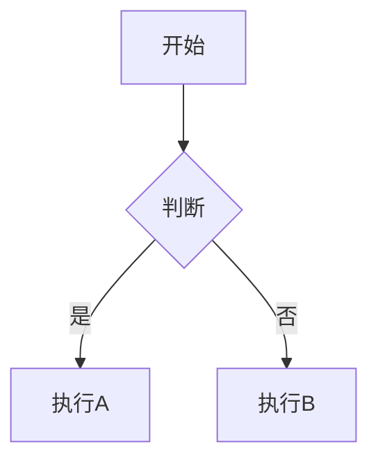

# Feat 文档写作标准

基于 Diataxis 框架的 Feat 技术文档写作规范。写作或修改 `pages/src/content/docs` 下的文档时遵循本技能。

---

## 🌟 AI 写作哲学（重要）

**你的判断比现有文档更重要。**

当你撰写或优化文档时，请遵循以下原则：

1. **独立思考，而非照搬现有模式**
   - 现有文档可能存在结构不合理、表述不清、遗漏关键信息等问题
   - 你应从读者需求出发，重新构思最佳的文档组织方式
   - 不要因为"其他文档都这样写"就照搬，问自己：这样真的是最好的吗？

2. **创造性重构优于机械修补**
   - 如果发现现有文档结构有根本性问题，敢于推翻重写
   - 新增内容时不必强行套用现有模板，选择最适合的表达方式
   - 模板是参考工具，不是必须遵守的规则

3. **主动发现问题并改进**
   - 阅读现有文档时，带着批判性思维：是否有更好的表达方式？
   - 检查是否有概念解释模糊、示例不清晰、步骤跳跃等问题
   - 发现问题后，主动提出并实施改进

4. **以读者为中心，而非以现有文档为中心**
   - 思考：读者真正需要什么？现有文档是否满足了这些需求？
   - 不要为了保持"一致性"而牺牲可读性和实用性
   - 如果现有风格不适合当前内容，就采用新的风格

**记住：你是文档的创作者，不是现有内容的搬运工。**

---

## 核心原则

- **创造优先**：以 AI 的判断为中心，现有文档仅供参考而非标准。AI 应当独立思考最佳的文档结构、表达方式和内容组织，不必拘泥于现有模式
- **质疑改进**：现有文档可能存在不足，AI 应主动发现并改进：优化结构、补充遗漏、修正错误、提升可读性
- **实用至上**：代码优先，让读者能快速动手实践
- **结构清晰**：参考模板但不被模板束缚，选择最适合当前内容的表现形式
- **真实可靠**：示例优先来自 `demo` 模块的真实可运行代码，也可参考 `feat-test` 模块
- **用户导向**：从读者角度出发，降低学习门槛

## 文档类型速查表

| 目的 | 类型 | 典型标题 | 人称 |
|------|------|----------|------|
| 新手入门、第一次做某事 | **教程** | "构建你的第一个 HTTP 服务器" | 多用「你」，适当「我们」 |
| 解决具体问题 | **操作指南** | "如何配置 HTTPS 支持" | 主要「你」，少用「我们」 |
| 解释设计原理 | **概念解释** | "Feat 的异步处理机制" | 多用「我们」，少用「你」 |
| API 说明 | **参考文档** | "HttpServer API 参考" | 第三人称，客观中立 |

**类型选择黄金法则**：
- 如果是带读者完成一个完整项目 → 用**教程**
- 如果是回答"如何做 X" → 用**操作指南**
- 如果是解释"为什么这样设计" → 用**概念解释**
- 如果是列举 API 参数返回值 → 用**参考文档**

---

## 一、文档体系与内容边界

### 1.1 知识分层架构

Feat 文档采用三层知识体系，每层有明确的职责边界：

```
┌─────────────────────────────────────────────────────────────┐
│  第一层：入门层（Getting Started）                           │
│  - cloud/getstart.mdx - Feat Cloud 快速入门                  │
│  - server/getstart.mdx - Feat Server 快速入门               │
│  【目标】让新用户在 5 分钟内看到效果                          │
├─────────────────────────────────────────────────────────────┤
│  第二层：实践层（Guides & Tutorials）                        │
│  - cloud/controller.mdx - Controller 使用指南               │
│  - cloud/db.mdx - MyBatis 集成教程                          │
│  - server/router.mdx - Router 路由指南                      │
│  【目标】掌握具体功能的使用方法                               │
├─────────────────────────────────────────────────────────────┤
│  第三层：深度层（Explanations & References）                 │
│  - server/async.mdx - 异步处理原理                          │
│  - cloud/options.mdx - CloudOptions API 参考                │
│  【目标】理解底层原理或查阅精确信息                           │
└─────────────────────────────────────────────────────────────┘
```

### 1.2 内容边界规则

**必须遵守的边界原则**：

| 规则 | 说明 | 示例 |
|------|------|------|
| **单一职责** | 每个文档只解决一类问题 | 教程不讲深层原理，只带读者完成目标 |
| **链接引用** | 已在其他文档讲解的内容，使用链接引用 | 在 Router 教程中不解释什么是拦截器，而是链接到拦截器概念文档 |
| **渐进深入** | 先出现的文档只讲基础，进阶内容放在后面 | getstart 只讲基本路由，复杂路由模式在 router.mdx 讲解 |
| **避免重复** | 同样的概念不在多个文档中重复阐述 | `@RequestMapping` 的参数列表只在 controller.mdx 出现一次 |

### 1.3 文档依赖关系

写作时需明确本文档在知识体系中的位置：

```
前置依赖 → [本文档] → 后续扩展
   ↓           ↓            ↓
需要先了解   当前专注     学完可以深入
的内容       的主题       的方向
```

**示例**：编写 `cloud/db.mdx` 时
- **前置依赖**：假设读者已完成 `cloud/getstart.mdx`，了解基本的 Controller 写法
- **本文档定位**：专注于 MyBatis 集成，不重复讲解 Controller 基础知识
- **后续扩展**：可链接到数据库连接池优化、事务管理等高级主题

### 1.4 交叉引用规范

当需要提及其他文档已覆盖的内容时：

```md
<!-- ✅ 正确：简要提及 + 链接到详细文档 -->
本示例使用 `@Controller` 注解定义控制器，关于 Controller 的完整用法请参考 [Controller 开发实践](/feat/cloud/controller/)。

<!-- ❌ 错误：在本文档中重复详细讲解 -->
`@Controller` 注解用于标记类为控制器，它有以下参数：
- value: Controller 基础路径
- gzip: 是否启用 gzip 压缩...
（此处不应展开，应链接到专门文档）
```

---

## 二、教程 (Tutorials) 写作指南

### 适用场景
- 面向新手的入门文档
- 引导读者完成一个完整的、可运行的项目
- 目标是让初学者获得成就感和基础能力

### 标准结构

```
1. 引言（30-50字）
   - 说明本教程将带领读者完成什么
   - 强调学完后的收获

2. 前置条件
   - 环境要求（JDK、Maven、IDE 等版本）
   - 知识储备（如：需要了解基本的 Java 语法）
   - 预计完成时间

3. 学习目标
   - 列出 3-5 个具体的学习成果
   - 使用动词开头（配置、创建、实现、掌握...）

4. 实践步骤（核心部分）
   - 每个步骤有明确编号
   - 每步包含：目标说明 → 代码展示 → 简要解释
   - 代码必须完整可运行（含 main 方法）
   - 关键行添加注释说明

5. 验证结果
   - 提供具体的验证命令或操作
   - 展示预期的输出结果
   - 包含截图或代码输出示例

6. 总结回顾
   - 回顾学到的知识点
   - 提供下一步学习建议（链接到其他文档）
```

### 内容边界（重要）

**教程中应该做的**：
- ✅ 聚焦一个具体的学习目标（如：构建第一个 HTTP 服务器）
- ✅ 提供可直接复制的完整代码
- ✅ 每一步都有即时的反馈（能看到运行效果）
- ✅ 对涉及的概念只做最简要的说明
- ✅ 对已详细讲解的概念提供链接而非重复

**教程中不应该做的**：
- ❌ 深入讲解底层原理（留给概念解释文档）
- ❌ 罗列所有可能的配置选项（留给参考文档）
- ❌ 重复前置教程中已讲解的内容
- ❌ 引入过多新概念导致认知负荷过重

### 写作技巧

**开篇吸引**
```md
❌ 不推荐：本文介绍如何使用 Feat 构建 Web 应用。
✅ 推荐：本教程将在 5 分钟内带你创建并运行第一个 Feat Cloud 应用，体验极速开发的魅力。
```

**步骤设计原则**
- 每个步骤聚焦一个具体目标
- 步骤间有逻辑递进关系
- 避免在单一步骤中引入过多新概念
- 及时给出反馈（运行效果、验证方式）

**处理已有概念的示例**
```md
### 步骤 3：创建 Controller

我们创建一个简单的 Controller 来处理 HTTP 请求：

```java
@Controller
public class HelloController {
    @RequestMapping("/hello")
    public String hello() {
        return "Hello, Feat!";
    }
}
```

<Aside type="tip">
  如果你不熟悉 Controller 的工作原理，建议先阅读 [Controller 开发实践](/feat/cloud/controller/) 了解详细用法。
</Aside>
```

### 教程示例参考
- [cloud/getstart.mdx](pages/src/content/docs/cloud/getstart.mdx) - 快速入门
- [cloud/db.mdx](pages/src/content/docs/cloud/db.mdx) - MyBatis 集成教程

---

## 三、操作指南 (How-to Guides) 写作指南

### 适用场景
- 解决特定问题的步骤说明
- 面向已具备基础知识的开发者
- 假设读者知道基本概念，只需知道"怎么做"

### 标准结构

```
1. 任务描述（1-2 句话）
   - 明确说明本指南解决什么问题
   - 指出适用场景

2. 前提条件
   - 需要已完成的环境配置
   - 需要的依赖或工具
   - 假设读者已掌握的前置知识（链接到相关教程）

3. 解决方案（推荐方案）
   - 分步骤说明实现方式
   - 每步提供代码片段
   - 解释关键决策点

4. 替代方案（可选）
   - 其他可行方法
   - 各方案的优缺点对比

5. 注意事项 / 常见问题
   - 容易出错的地方
   - 性能影响
   - 兼容性提示

6. 相关链接
   - 相关的教程、概念解释、API 参考
```

### 内容边界（重要）

**操作指南中应该做的**：
- ✅ 开门见山，直接说明解决什么问题
- ✅ 假设读者已了解基础概念，不做过多解释
- ✅ 对首次出现的专业术语提供简短解释或链接
- ✅ 提供多种方案供读者选择

**操作指南中不应该做的**：
- ❌ 从零开始讲解基础概念（前置教程已完成）
- ❌ 深入解释"为什么"（留给概念解释文档）
- ❌ 罗列所有 API 细节（留给参考文档）
- ❌ 与其他文档重复相同的内容

### 写作技巧

**开门见山**
```md
❌ 不推荐：HTTPS 是现代 Web 应用的重要组成部分，它通过 SSL/TLS 协议加密数据传输...
✅ 推荐：本指南介绍如何在 Feat Server 中配置 HTTPS 支持。假设你已了解 SSL 证书的基本概念。
```

**引用前置知识**
```md
### 前提条件

- 已完成 [Feat Server 快速入门](/feat/server/getstart/)
- 拥有有效的 SSL 证书文件
- 了解基本的 TLS/SSL 概念（如需了解请参考 [HTTPS 工作原理](/feat/guides/https-concepts/)）
```

**解决方案呈现**
```md
### 方案一：使用 PEM 证书（推荐）

适合场景：已有 Let's Encrypt 或其他机构签发的证书文件。

```java
// 代码示例直接展示核心实现
Feat.httpsServer()
    .certificate(new File("cert.pem"), new File("key.pem"))
    .listen(443);
```

**配置要点：**
- 证书文件需为 PEM 格式
- 私钥不能加密
```

### 操作指南示例参考
- [cloud/controller.mdx](pages/src/content/docs/cloud/controller.mdx) - Controller 开发实践
- [server/https.mdx](pages/src/content/docs/server/https.mdx) - HTTPS 配置

---

## 四、概念解释 (Explanations) 写作指南

### 适用场景
- 解释框架的设计理念
- 阐述架构决策的原因
- 帮助读者深入理解底层原理

### 标准结构

```
1. 背景介绍
   - 问题域的背景
   - 现有方案的局限性

2. 设计理念
   - Feat 采用的方案
   - 核心思想与权衡

3. 架构解析
   - 组件关系图（Mermaid）
   - 数据流转过程
   - 关键类的职责

4. 实现细节
   - 重要算法或模式
   - 代码层面的体现

5. 与其他方案对比
   - 与传统方式的对比
   - 优缺点分析

6. 扩展思考
   - 进阶话题
   - 推荐阅读
```

### 内容边界（重要）

**概念解释中应该做的**：
- ✅ 用类比和图示帮助理解抽象概念
- ✅ 结合代码片段说明原理（非完整示例）
- ✅ 分析设计权衡（为什么选择方案 A 而不是 B）
- ✅ 链接到相关的操作指南和参考文档

**概念解释中不应该做的**：
- ❌ 提供完整可运行的教程式代码
- ❌ 详细罗列 API 参数（留给参考文档）
- ❌ 重复操作指南中的步骤说明
- ❌ 过于理论化而没有联系实际代码

### 写作技巧

**类比讲解**
```md
Feat 的路由机制就像餐厅的点餐系统：
- 顾客（HTTP 请求）进入餐厅
- 服务员（Router）根据菜单（路由表）将订单分配给对应的厨师（处理器）
- 每位厨师专注于特定的菜品（路径模式）
```

**循序渐进**
```md
### 同步处理的局限

传统的同步处理方式...

### 异步的解决方案

Feat 采用 CompletableFuture...

### 性能提升原理

通过非阻塞 I/O...
```

**关联实践文档**
```md
了解了异步处理的原理后，你可以查看 [异步响应操作指南](/feat/server/async-guide/) 了解具体如何使用。
```

### 概念解释示例参考
- [server/async.mdx](pages/src/content/docs/server/async.mdx) - 异步响应机制
- [guides/about.mdx](pages/src/content/docs/guides/about.mdx) - Feat 概述

---

## 五、参考文档 (References) 写作指南

### 适用场景
- API 接口说明
- 配置项清单
- 注解/类库速查

### 标准结构

```
1. 概述
   - 组件/类的用途
   - 使用场景简述

2. API 列表
   - 构造方法
   - 配置方法（按功能分组）
   - 生命周期方法
   - 监听器方法

3. 每个方法的详细说明
   ```
   ### methodName(param1, param2)
   
   方法描述（一句话）
   
   **参数：**
   | 参数名 | 类型 | 必填 | 说明 |
   |--------|------|------|------|
   | param1 | String | 是 | 参数说明 |
   
   **返回值：**
   返回类型 - 返回值说明
   
   **异常：**
   - ExceptionType - 触发条件
   
   **示例：**
   ```java
   // 简短准确的代码示例
   ```
   ```

4. 完整示例
   - 展示多个 API 组合使用的场景

5. 版本历史（可选）
   - 各版本的变更记录
```

### 内容边界（重要）

**参考文档中应该做的**：
- ✅ 信息密度高，便于快速查找
- ✅ 每个参数都有类型、默认值、说明
- ✅ 简短准确的示例（不需要完整 main）
- ✅ 链接到相关的教程和操作指南

**参考文档中不应该做的**：
- ❌ 长篇大论地讲解使用场景（教程和指南已完成）
- ❌ 解释设计原理（概念解释已完成）
- ❌ 提供冗长的示例代码
- ❌ 与其他参考文档重复相同的信息

### 写作技巧

**信息密度优先**
```md
❌ 不推荐：这个方法非常重要，在很多场景下都会用到，特别是在你需要调试应用程序的时候...
✅ 推荐：`debug(boolean debug)` - 启用/禁用调试日志输出。
```

**表格化呈现**
```md
| 配置项 | 类型 | 默认值 | 说明 |
|--------|------|--------|------|
| port | int | 8080 | 监听端口 |
| threadNum | int | CPU核心数 | IO线程数 |
```

**关联学习资源**
```md
<Aside type="tip">
  不熟悉这些配置？建议先阅读 [ServerOptions 配置指南](/feat/server/serveroptions-guide/) 了解各选项的使用场景。
</Aside>
```

---

## 六、代码示例规范

### 通用要求

1. **来源要求**：优先使用 `demo` 模块中的真实代码，也可参考 `feat-test` 模块
2. **完整性**：教程和操作指南的代码必须可直接运行（含 main 方法）
3. **注释规范**：关键逻辑必须有注释，复杂步骤需说明原因
4. **验证方式**：说明如何运行和验证代码效果

### 代码匹配度验证标准

文档中的代码示例必须与实际源码保持一致，验证维度如下：

| 验证维度 | 权重 | 说明 | 验证方法 |
|----------|------|------|----------|
| **API 调用正确性** | 40% | 方法名、参数类型、返回值类型与源码一致 | 对比文档示例与源码中的方法签名 |
| **代码可运行性** | 30% | 代码完整，无缺失的 import 或配置 | 在 feat-test 中找到对应的可运行示例 |
| **版本同步性** | 20% | 反映最新的 API 变化，无过时的方法调用 | 检查源码是否有新增/废弃的方法 |
| **类型准确性** | 10% | 泛型参数、异常类型等细节正确 | 对比源码中的类型定义 |

**匹配度等级**：

| 等级 | 匹配度 | 说明 |
|------|--------|------|
| ✅ 优秀 | 95%+ | 代码完全匹配，可直接复制运行 |
| ⚠️ 良好 | 80%-94% | 核心逻辑正确，少量细节需调整 |
| ❌ 需修正 | <80% | 存在 API 错误或过时代码，必须修复 |

**常见匹配度问题**：

| 问题类型 | 示例 | 严重程度 |
|----------|------|----------|
| 方法签名错误 | `CompletableFuture<Object>` 应为 `CompletableFuture<Void>` | **P0 必须修复** |
| 参数值错误 | `future.complete(this)` 应为 `future.complete(null)` | **P0 必须修复** |
| 缺少类型说明 | Session 只支持 String 类型，文档未说明 | P1 建议修复 |
| API 未更新 | 源码新增方法，文档未记录 | P2 后续补充 |

### JDK 8 兼容性（强制）

**允许使用**：
- Lambda 表达式
- Stream API
- 方法引用
- 接口默认方法
- 传统字符串拼接

**禁止使用**：
- 文本块 `"""..."""`
- `var` 关键字
- Record 类型
- 增强 switch
- `Optional.isEmpty()`
- 任何 JDK 9+ 特性

### 代码注释模板

```java
/**
 * 【文档类型】xxx
 * 【目的】xxx
 * 【前置条件】xxx（教程/操作指南）
 * 【验证方式】xxx（教程/操作指南）
 */

// 教程
/** 
 * 教程：第一个 HTTP 服务器
 * 学习目标：掌握 Feat 基本使用
 * 预期效果：浏览器访问显示 "Hello Feat"
 */

// 操作指南
/**
 * 操作指南：配置 HTTPS 支持
 * 适用场景：生产环境部署
 * 注意事项：证书需为 PEM 格式
 */

// 概念解释
/**
 * 概念解释：异步处理机制
 * 目的：理解 CompletableFuture 的工作原理
 */

// 参考文档
/**
 * HttpServer.httpHandler(HttpHandler handler)
 * @param handler 请求处理器
 * @return this 支持链式调用
 * @throws IllegalStateException 如果服务器已启动
 */
```

---

## 七、格式与组件

### 文本格式

| 格式 | 用途 | 示例 |
|------|------|------|
| **加粗** | 重要概念、关键词 | **Router** 是核心组件 |
| `代码` | 行内代码、类名、文件名 | `HttpServer` 类 |
| [链接]() | 内部文档、外部资源 | [快速入门](/feat/cloud/getstart/) |

### Starlight Aside 组件

```mdx
import { Aside } from '@astrojs/starlight/components';

<Aside type="tip">
  提示信息：有用的技巧或补充说明
</Aside>

<Aside type="caution">
  注意信息：可能导致问题的操作或配置
</Aside>

<Aside type="danger">
  警告信息：可能造成严重后果的操作
</Aside>
```

### Mermaid 图表质量标准

Mermaid 图表的质量不应仅以"有无"来判断，应从以下维度评估：

#### 评估维度

| 维度 | 权重 | 说明 | 判断标准 |
|------|------|------|----------|
| **必要性** | 30% | 是否解决文字难以表达的问题 | ❌ 文字能清晰说明的无需图表；✅ 复杂流程、多组件交互必须有图 |
| **准确性** | 30% | 是否与代码逻辑完全一致 | 图表中的组件名称、流程方向、条件分支必须与源码一致 |
| **清晰度** | 20% | 是否简洁易懂，无冗余元素 | 节点数量控制在 10 个以内，避免信息过载 |
| **类型适配** | 20% | 图表类型是否适合表达的内容 | 选择最能表达意图的图表类型 |

#### 图表类型选择指南

| 内容类型 | 推荐图表 | 适用场景 |
|----------|----------|----------|
| 处理流程、时序交互 | `sequenceDiagram` | 多个组件按顺序交互，如 AOT 编译流程、请求处理链 |
| 类继承、组件结构 | `classDiagram` | 展示类的继承关系、方法列表 |
| 状态流转 | `stateDiagram` | 生命周期管理、状态机（如 Bean 生命周期、Session 状态） |
| 层级结构、决策树 | `flowchart TD/BT` | 路由匹配、条件分支、组织架构 |
| 并行流程 | `flowchart LR` | 横向展示并行处理的模块 |

#### 质量等级评定

| 等级 | 标准 | 示例 |
|------|------|------|
| ✅ **优秀 (A)** | 必要性强、准确性高、清晰度好、类型适配 | AOT 编译时序图：准确展示编译器→处理器→生成器的交互流程 |
| ⚠️ **合格 (B)** | 准确但必要性一般，或清晰度可改进 | 路由匹配树形图：正确但过于简单，可添加具体 URL 匹配示例 |
| ❌ **待改进 (C)** | 与代码不符、类型不当或冗余过多 | 过于复杂的类图：包含 20+ 个类，信息过载 |

#### 使用示例

```mdx

```

#### 常见问题

| 问题 | 表现 | 改进建议 |
|------|------|----------|
| **形式主义** | 为了有图而加图，文字已足够清晰 | 删除图表，保持文字说明 |
| **信息过载** | 单图超过 15 个节点 | 拆分为多个子图或分层展示 |
| **类型错误** | 用流程图展示类继承 | 改用 classDiagram |
| **准确性不足** | 图表与代码逻辑不一致 | 对照源码逐项核对 |

---

## 八、写作前确认清单

动笔前逐项确认：

### 独立思考（最重要）
- [ ] **我是否质疑了现有模式**：现有文档的做法是最好的吗？有没有更好的表达方式？
- [ ] **我是否从读者角度思考**：读者真正需要什么？现有文档是否满足这些需求？
- [ ] **我是否敢于创新**：如果有更好的结构或表达方式，我敢于打破现有模式吗？

### 基础准备
- [ ] **文档类型已确定**：教程 / 操作指南 / 概念 / 参考（可灵活调整，不必强行套用）
- [ ] **目标读者已明确**：入门 / 中级 / 高级
- [ ] **内容边界已划定**：必备详写、扩展链接、避免重复
- [ ] **前置依赖已识别**：本文档假设读者已了解的内容
- [ ] **可运行示例已找到**：来自 `feat-test` 或可独立运行
- [ ] **Gitee 链接已校验**：确保指向正确的分支和文件

---

## 九、质量检查清单

完成文档后逐项核对：

### 创造性思考
- [ ] **文档是否有我的独立判断**：不是简单复制现有模式，而是经过了我的思考
- [ ] **我是否改进了现有问题**：发现并修正了现有文档的不足之处
- [ ] **表达方式是否最适合读者**：选择了最适合当前内容的表现形式，而非机械套用模板

### 内容质量
- [ ] 文档类型明确，结构合理（参考模板但不被模板束缚）
- [ ] 标题层级正确（H1→H2→H3），无跳跃
- [ ] 含适当示例，步骤或操作清晰易懂
- [ ] 术语首次出现时有通俗解释
- [ ] 人称使用符合文档类型要求
- [ ] **无内容重复**：没有与其他文档重复阐述相同内容

### 技术准确性
- [ ] 所有代码示例可运行
- [ ] 代码来源于 `feat-test` 或经过实际验证
- [ ] 严格符合 JDK 8 规范
- [ ] Gitee 链接有效且指向正确

### 格式规范
- [ ] 代码块有语法高亮（java/xml/yaml/shell 等）
- [ ] Aside 组件使用恰当（tip/caution/danger）
- [ ] 表格对齐正确，信息完整
- [ ] Mermaid 图表有助于理解（如有）

### 用户体验
- [ ] 开篇吸引读者，结尾有下一步指引
- [ ] 步骤间有过渡语，逻辑流畅
- [ ] 关键信息突出（加粗、表格、代码）
- [ ] 无类型混淆（教程带人做、指南解任务、概念讲原理、参考列 API）
- [ ] **文档间链接完整**：相关概念都链接到了对应文档

---

## 十、常见问题与改进

| 问题表现 | 原因 | 改进方案 |
|----------|------|----------|
| 先讲原理后给代码 | 混淆了教程和概念 | 教程先展示代码再解释；概念文档可以理论先行 |
| 示例缺少 main 或不完整 | 未考虑读者复制即跑的需求 | 提供可直接运行的完整代码 |
| 堆砌参数无场景 | 把指南写成了参考 | 结合具体场景讲解参数用法 |
| 术语无解释 | 假设读者已知 | 首次出现时通俗解释，可链接到概念文档 |
| 文档过长无分层 | 未合理拆分内容 | 拆分为多个文档，互相链接 |
| 人称混用 | 未明确文档类型 | 按类型统一人称：教程/指南用「你」，概念用「我们」，参考用第三人称 |
| **内容重复** | 未建立文档体系意识 | 建立知识分层，相同内容只在一个地方详细讲解，其他地方链接引用 |
| **文档割裂** | 缺乏交叉引用 | 在涉及其他文档概念时主动添加链接，形成知识网络 |

---

## 十一、内容边界判定表

各类型文档的职责边界速查：

| 文档类型 | 应该详写 | 应该链接 | 应该避免 |
|----------|----------|----------|----------|
| **入门教程** | 环境搭建、第一个程序、验证运行 | 深入的功能教程、概念解释 | API 详细参数、高级配置 |
| **功能教程** | 完成特定功能的完整步骤 | 前置的入门教程、相关的概念解释 | 基础环境配置、无关的高级特性 |
| **操作指南** | 解决问题的具体步骤 | 涉及的 API 参考、相关教程 | 背景原理讲解、入门知识 |
| **概念解释** | 设计原理、架构分析、权衡比较 | 涉及的具体 API 参考 | 操作步骤、入门引导 |
| **参考文档** | 参数列表、方法签名、返回值 | 相关的使用教程 | 原理讲解、长篇示例 |

> 💡 **提示**：以上边界仅供参考。如果发现现有文档结构不合理，你可以重新组织内容。例如，一个概念解释文档如果加入实际代码示例会更易懂，就大胆加入，不必拘泥于「概念解释不应该有操作步骤」的规则。

---

## 十一、常见问题主动发现与改进

写作时主动检查以下问题，发现即改进：

| 现有文档常见问题 | 改进思路 |
|------------------|----------|
| **结构混乱**：读者需要反复跳转才能理解 | 重新组织内容顺序，按读者思维路径编排 |
| **示例不完整**：代码片段缺少上下文 | 补充完整的可运行示例，或添加清晰的前置说明 |
| **术语堆砌**：大量专业名词无解释 | 添加通俗解释或类比，降低理解门槛 |
| **缺少场景**：只讲"是什么"不讲"何时用" | 补充使用场景、最佳实践、注意事项 |
| **链接断裂**：文档间缺乏关联 | 添加相关文档的交叉链接，形成知识网络 |
| **版本过时**：API 已变更但文档未更新 | 对照源码核实，更新为最新用法 |
| **过度模板化**：为了套模板而牺牲可读性 | 灵活调整结构，选择最适合的表达方式 |

**改进原则**：
- 发现问题比遵循模板更重要
- 可读性比一致性更重要
- 读者需求比规则更重要

---

## 十二、示例库索引

编写文档时可参考以下示例代码。**优先使用 `demo` 模块中的示例**，也可参考 `feat-test` 模块。

### demo 模块示例（优先）

| 示例 | 路径 | 适用文档类型 |
|------|------|--------------|
| HelloWorld | `demo/feat_static/src/main/java/.../Bootstrap.java` | 教程、快速入门 |
| MyBatis 完整示例 | `demo/mybatis/` | 教程、数据库集成 |
| 文件服务器 | `demo/feat_static/src/main/java/...` | 操作指南 |
| Native Image 示例 | `demo/helloworld_native/` | Native Image 部署 |

### feat-test 模块示例（补充参考）

| 示例 | 路径 | 适用文档类型 |
|------|------|--------------|
| HelloFeat | `feat-test/src/main/java/.../demo/HelloFeat.java` | 教程、快速入门 |
| RouterSessionDemo | `feat-test/src/main/java/.../router/RouterSessionDemo.java` | 教程、操作指南 |
| AsyncHttpDemo | `feat-test/src/main/java/.../demo/AsyncHttpDemo.java` | 概念解释、操作指南 |
| HttpsPemDemo | `feat-test/src/main/java/.../demo/HttpsPemDemo.java` | 操作指南 |
| 控制器示例 | `feat-test/src/main/java/.../controller/` | 操作指南、参考 |
| WebSocket 示例 | `feat-test/src/main/java/.../demo/WebSocketDemo.java` | 操作指南 |
| SSE 示例 | `feat-test/src/main/java/.../demo/SSEDemo.java` | 操作指南 |

<Aside type="tip">
  如果当前 demo 模块中缺少所需示例，可使用 `feat-docs-example-generator` skill 自动生成新的示例模块。
</Aside>

---

## 十二、延伸阅读

- Diataxis 框架原文：https://diataxis.fr/

---

**写作流程口诀**：独立思考 → 定类型 → 划边界 → 选模板 → 填内容 → 插示例 → 标验证 → 建链接 → 逐项打勾 → 达标发布

**核心要诀**：**你的判断比模板更重要。现有文档仅供参考，敢于创造更好的内容。**
