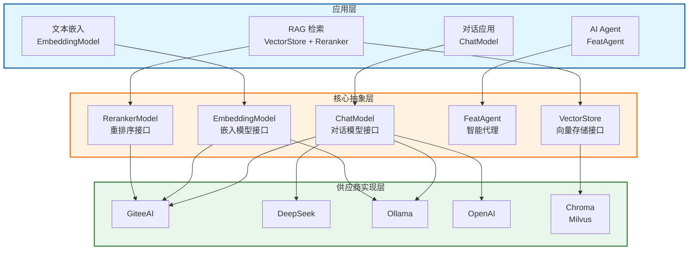

import { Aside, Tabs, TabItem } from '@astrojs/starlight/components';
import CheckAuthorize from '../../../components/CheckAuthorize.astro'

<CheckAuthorize/>

Feat AI 是一个 Java 语言的 AI 应用开发框架，旨在简化与大语言模型（LLM）的集成。

## 架构概览

Feat AI 采用分层架构设计，让开发者可以灵活地在不同层级上使用框架能力：



Feat AI 通过统一抽象层，让一套代码可以无缝切换不同的 AI 供应商实现。

## 为什么需要 Feat AI？

与大语言模型集成并非易事。除了基本的 API 调用，你还需要处理：

- **对话历史管理** - 维护多轮对话的上下文
- **工具调用** - 让 AI 能够执行外部函数
- **向量检索** - 构建 RAG 应用的核心能力
- **智能代理** - 实现自主决策的 AI Agent

Feat AI 通过统一的抽象层和声明式 API，将这些复杂性封装起来，让你专注于业务逻辑而非底层实现。

## 核心设计理念

### 统一抽象

Feat AI 为所有 AI 能力提供一致的编程接口：

| 能力 | 核心抽象 | 关键类 |
|------|----------|--------|
| 聊天对话 | Chat Model | [`ChatModel`](https://gitee.com/smartboot/feat/blob/master/feat-ai/src/main/java/tech/smartboot/feat/ai/chat/ChatModel.java) |
| 文本嵌入 | Embedding Model | [`EmbeddingModel`](https://gitee.com/smartboot/feat/blob/master/feat-ai/src/main/java/tech/smartboot/feat/ai/embedding/EmbeddingModel.java) |
| 向量存储 | Vector Store | [`VectorStore`](https://gitee.com/smartboot/feat/blob/master/feat-ai/src/main/java/tech/smartboot/feat/ai/vector/VectorStore.java) |
| 智能代理 | Agent | [`FeatAgent`](https://gitee.com/smartboot/feat/blob/master/feat-ai/src/main/java/tech/smartboot/feat/ai/agent/FeatAgent.java) |
| 结果重排 | Reranker | [`RerankerModel`](https://gitee.com/smartboot/feat/blob/master/feat-ai/src/main/java/tech/smartboot/feat/ai/reranker/RerankerModel.java) |

### 供应商无关

一套代码，自由切换不同 AI 供应商：

```java
// GiteeAI
ChatModel model = FeatAI.chatModel(opts -> opts
    .model(ChatModelVendor.GiteeAI.Qwen2_5_72B_Instruct)
    .apiKey(System.getenv("GITEE_AI_API_KEY"))
);

// DeepSeek - 只需修改配置
ChatModel model = FeatAI.chatModel(opts -> opts
    .baseUrl("https://api.deepseek.com/v1")
    .apiKey(System.getenv("DEEPSEEK_API_KEY"))
    .model("deepseek-chat")
);

// Ollama 本地部署
ChatModel model = FeatAI.chatModel(opts -> opts
    .baseUrl("http://localhost:11434/v1")
    .model("qwen2.5:7b")
);
```

### 流式优先

基于 `CompletableFuture` 的响应式设计，天然支持流式输出和高并发：

```java
// 流式响应 - 实时输出
model.chatStream("讲一个故事", chunk -> {
    System.out.print(chunk);  // 逐字显示
});

// 异步非阻塞
CompletableFuture<Void> future = model.chatAsync("问题", response -> {
    // 处理结果
});
```

## 快速开始

### 添加依赖

```xml
<dependency>
    <groupId>tech.smartboot.feat</groupId>
    <artifactId>feat-ai</artifactId>
    <version>1.4.3</version>
</dependency>
```

### 第一个 AI 程序

<Tabs>
<TabItem label="GiteeAI">

```java
import tech.smartboot.feat.ai.FeatAI;
import tech.smartboot.feat.ai.chat.ChatModel;
import tech.smartboot.feat.ai.chat.ChatModelVendor;

public class HelloAI {
    public static void main(String[] args) {
        ChatModel model = FeatAI.chatModel(opts -> opts
            .model(ChatModelVendor.GiteeAI.Qwen2_5_72B_Instruct)
            .apiKey(System.getenv("GITEE_AI_API_KEY"))
        );
        
        model.chat("你好，请介绍一下 Feat AI", response -> {
            System.out.println(response.getContent());
        });
    }
}
```

</TabItem>
<TabItem label="DeepSeek">

```java
import tech.smartboot.feat.ai.FeatAI;
import tech.smartboot.feat.ai.chat.ChatModel;

public class HelloAI {
    public static void main(String[] args) {
        ChatModel model = FeatAI.chatModel(opts -> opts
            .baseUrl("https://api.deepseek.com/v1")
            .apiKey(System.getenv("DEEPSEEK_API_KEY"))
            .model("deepseek-chat")
        );
        
        model.chat("你好，请介绍一下 Feat AI", response -> {
            System.out.println(response.getContent());
        });
    }
}
```

</TabItem>
<TabItem label="Ollama (本地)">

```java
import tech.smartboot.feat.ai.FeatAI;
import tech.smartboot.feat.ai.chat.ChatModel;

public class LocalAI {
    public static void main(String[] args) {
        ChatModel model = FeatAI.chatModel(opts -> opts
            .baseUrl("http://localhost:11434/v1")
            .model("qwen2.5:7b")
        );

        model.chat("解释什么是 RAG", response -> {
            System.out.println(response.getContent());
        });
    }
}
```

</TabItem>
</Tabs>

## 核心模块详解

### ChatModel - 对话模型

统一的聊天模型接口，支持同步、异步和流式调用：

```java
ChatModel model = FeatAI.chatModel(opts -> opts
    .model(ChatModelVendor.GiteeAI.Qwen2_5_72B_Instruct)
);

// 非流式调用
model.chat("你好", response -> {
    System.out.println(response.getContent());
});

// 流式调用
model.chatStream("你好", chunk -> {
    System.out.print(chunk);
});
```

**关键特性：**
- 自动对话历史管理
- 工具调用（Function Calling）
- JSON 结构化输出
- 提示词模板支持

### Embedding - 文本嵌入

将文本转换为向量表示，用于语义搜索：

```java
import tech.smartboot.feat.ai.FeatAI;
import tech.smartboot.feat.ai.embedding.EmbeddingModel;
import tech.smartboot.feat.ai.vendor.EmbeddingModelVendor;

EmbeddingModel embedding = FeatAI.embedding(opts -> opts
    .model(EmbeddingModelVendor.GiteeAI.BGE_M3)
);

List<Float> vector = embedding.embed("需要嵌入的文本");
```

### VectorStore - 向量存储

支持多种向量数据库，实现语义检索：

```java
import tech.smartboot.feat.ai.vector.VectorStore;
import tech.smartboot.feat.ai.vector.Document;

// 创建 Chroma 向量存储
VectorStore store = VectorStore.chroma(opts -> opts
    .url("http://localhost:8000")
    .collectionName("my-docs")
);

// 添加文档
Document doc = new Document("doc1", 
    "Feat AI 是一个基于开源 LLM 的工具包");
store.add(doc);

// 语义搜索
List<Document> results = store.similaritySearch("什么是 Feat AI", 5);
```

**支持的存储：**
- [Chroma](chroma.mdx) - 轻量级本地向量数据库
- Milvus - 企业级分布式向量数据库

### Agent - 智能代理

基于 ReAct 范式的智能 Agent，能够自主规划、使用工具完成复杂任务：

```java
import tech.smartboot.feat.ai.FeatAI;
import tech.smartboot.feat.ai.agent.FeatAgent;

FeatAgent agent = FeatAI.agent(opts -> opts
    .maxIterations(20)
    .chatOptions()
        .model(ChatModelVendor.GiteeAI.Kimi_K25_Instruct)
);

// 执行复杂任务
String result = agent.execute(
    "搜索 Feat 框架的最新版本，并计算 1.0 版本距今多少天了"
).get();
```

### Reranker - 结果重排序

提升 RAG 检索质量的交叉编码器：

```java
import tech.smartboot.feat.ai.FeatAI;
import tech.smartboot.feat.ai.reranker.RerankerModel;

RerankerModel reranker = FeatAI.reranker(opts -> opts
    .model(RerankerModelVendor.GiteeAI.Qwen3_Reranker_8B)
);

// 对搜索结果重排序
List<Document> reranked = reranker.rerank(query, documents, 5);
```

## 下一步

根据你的需求选择学习路径：

- **[对话模型](chat.mdx)** - 学习如何与 LLM 进行交互
- **[文本嵌入](embedding.mdx)** - 了解文本向量化
- **[向量存储](chroma.mdx)** - 构建语义检索能力
- **[智能代理](agent.mdx)** - 实现自主决策的 AI Agent
