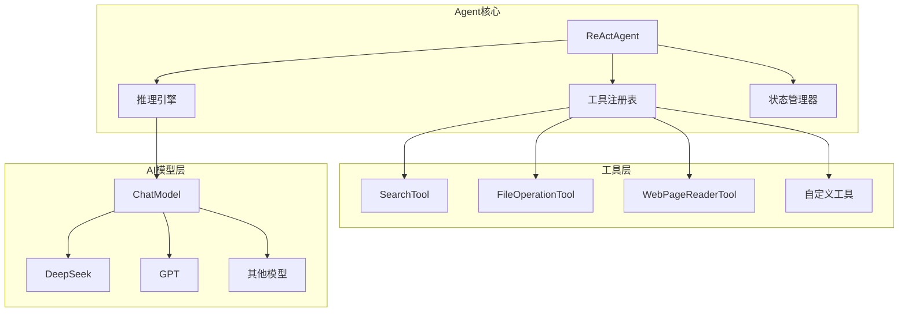
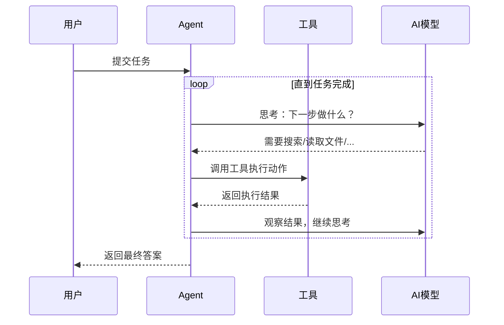
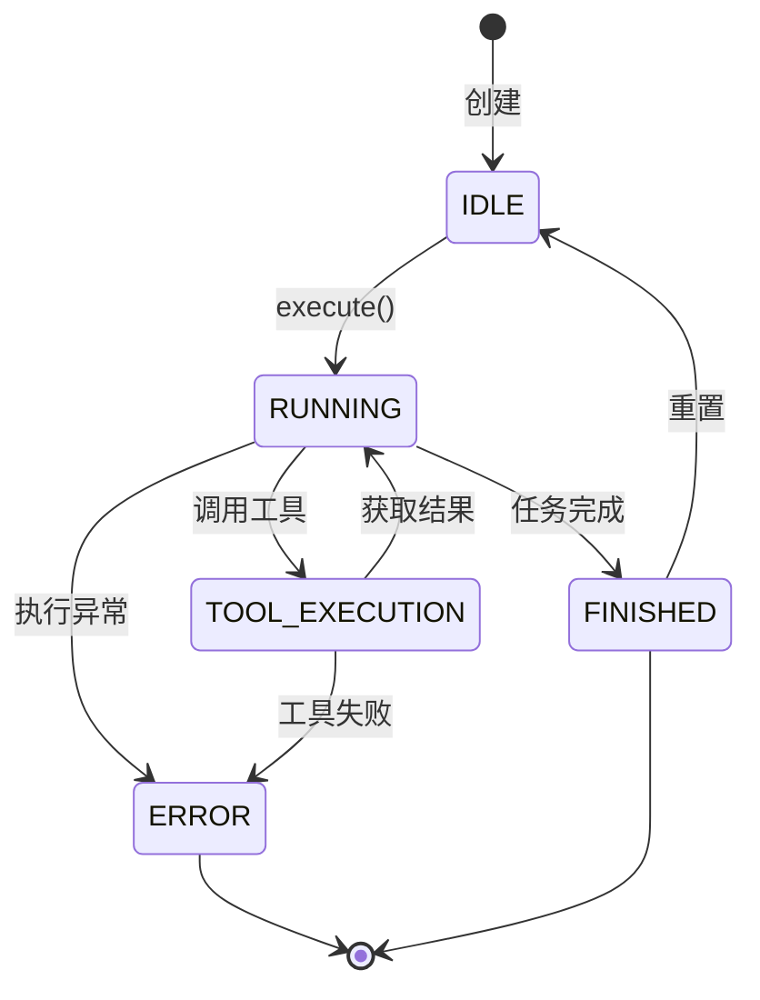

import { Aside } from '@astrojs/starlight/components';
import CheckAuthorize from '../../../components/CheckAuthorize.astro'

<CheckAuthorize/>

**Feat AI Agent** 是一个基于 ReAct（Reasoning + Acting）范式的智能代理框架。它使 AI 能够像人一样**思考 → 行动 → 观察 → 再思考**，通过多轮迭代自动完成复杂的多步骤任务。

### 为什么选择 Feat Agent?

- **开箱即用**：内置搜索、文件操作、网页阅读等常用工具
- **异步设计**：基于 `CompletableFuture`，天然支持高并发场景
- **可扩展**：轻松集成自定义工具和 AI 模型
- **类型安全**：纯 Java 实现，编译期类型检查

### 架构概览



**核心组件：**

| 组件 | 职责 | 关键类 |
|------|------|--------|
| **Agent** | 任务调度、推理循环 | `ReActAgent`, `FeatAgent` |
| **Tool** | 执行具体动作 | `AgentTool` 接口 |
| **ChatModel** | AI 模型交互 | `ChatModel` 配置 |
| **State** | 执行状态追踪 | `AgentState` 枚举 |

---

## 核心概念

### ReAct 范式

ReAct = **Reasoning（推理）** + **Acting（行动）**

Agent 通过循环执行以下步骤完成任务：



### Agent 生命周期



---

## 快速入门

### 安装

在 `pom.xml` 中添加依赖：

```xml
<dependency>
    <groupId>tech.smartboot.feat</groupId>
    <artifactId>feat-ai</artifactId>
    <version>1.4.3</version>
</dependency>
```

### 最小示例

```java
import tech.smartboot.feat.ai.agent.ReActAgent;
import tech.smartboot.feat.ai.agent.FeatAgent;
import java.util.concurrent.ExecutionException;

public class QuickStart {
    public static void main(String[] args) throws ExecutionException, InterruptedException {
        // 1. 初始化 Agent（使用默认配置）
        FeatAgent agent = new ReActAgent();
        
        // 2. 执行任务并获取结果
        String result = agent.execute(
            "搜索 Java 21 新特性并总结"
        ).get();
        
        System.out.println(result);
    }
}
```

**预期输出：**
```
Thought: 用户需要了解 Java 21 的新特性，我应该先搜索相关信息。
Action: search
Action Input: {"query": "Java 21 新特性"}
Observation: 搜索结果显示 Java 21 主要特性包括...
Thought: 现在我已经获得了足够的信息，可以总结了。
Final Answer: Java 21 的主要新特性包括：1. 虚拟线程正式发布... 2. ...
```

---

## 深入指南

### Agent 配置

#### 配置 AI 模型

```java
import tech.smartboot.feat.ai.chat.ChatModelVendor;

// 方式 1：使用默认配置（GiteeAI + DeepSeek V3）
FeatAgent agent = new ReActAgent();

// 方式 2：指定模型
FeatAgent agent = new ReActAgent(opts -> {
    opts.chatOptions()
        .model(ChatModelVendor.GiteeAI.DeepSeek_V32);
});

// 方式 3：完整配置
FeatAgent agent = new ReActAgent(opts -> {
    opts.chatOptions()
        .model(ChatModelVendor.GiteeAI.DeepSeek_V32)
        .temperature(0.7f)      // 创造性程度
        .maxTokens(2000);       // 最大输出长度
});
```

#### 控制迭代次数

防止任务陷入无限循环：

```java
FeatAgent agent = new ReActAgent(opts -> {
    opts.maxIterations(20);  // 最大思考-行动循环次数
});
```

<Aside type="caution">
迭代次数包括所有思考轮次，复杂任务可能需要 20-50 次。建议始终设置上限。
</Aside>

### 工具系统

#### 内置工具

ReActAgent 默认注册以下工具：

**SearchTool - 网络搜索**

```java
// Agent 会自动调用，格式如下：
Action: search
Action Input: {
    "query": "搜索关键词",
    "engine": "baidu",    // 或 "bing"
    "max_results": 5
}
```

**WebPageReaderTool - 网页内容提取**

```java
Action: web_page_reader
Action Input: {
    "url": "https://example.com/page"
}
```

**FileOperationTool - 文件操作**

支持的操作：
- `read_file` - 读取文件内容
- `write_file` - 写入文件
- `list_directory` - 列出目录

```java
Action: file_operation
Action Input: {
    "action": "read_file",
    "path": "./data.txt"
}
```

#### 自定义工具

实现 `AgentTool` 接口创建自定义工具：

```java
import tech.smartboot.feat.ai.agent.AgentTool;
import com.alibaba.fastjson2.JSONObject;
import java.util.concurrent.CompletableFuture;

/**
 * 自定义计算器工具示例
 */
public class CalculatorTool implements AgentTool {
    
    @Override
    public String getName() {
        return "calculator";
    }
    
    @Override
    public String getDescription() {
        return "执行数学计算。输入应为有效的数学表达式，如 '2 + 2' 或 'sqrt(16)'";
    }
    
    @Override
    public String getParametersSchema() {
        return "{"
            + "  \"type\": \"object\","
            + "  \"properties\": {"
            + "    \"expression\": {"
            + "      \"type\": \"string\","
            + "      \"description\": \"数学表达式\""
            + "    }"
            + "  },"
            + "  \"required\": [\"expression\"]"
            + "}";
    }
    
    @Override
    public CompletableFuture<String> execute(JSONObject params) {
        String expression = params.getString("expression");
        // 执行计算逻辑
        String result = evaluate(expression);
        return CompletableFuture.completedFuture(result);
    }
    
    private String evaluate(String expr) {
        // 计算实现...
        return "计算结果";
    }
}
```

注册自定义工具：

```java
FeatAgent agent = new ReActAgent(opts -> {
    opts.addTool(new CalculatorTool())
        .addTool(new AnotherCustomTool());
});
```

### 异步与并发

#### 为什么使用异步？

Agent 的核心操作（调用 AI 模型、执行工具）都涉及 I/O 等待。采用异步设计可以：

- **提高吞吐量**：不阻塞线程，单个线程可管理多个 Agent
- **资源高效**：减少线程创建，降低内存开销
- **组合灵活**：利用 `CompletableFuture` 组合多个任务

#### 基础异步调用

```java
import java.util.concurrent.CompletableFuture;

// 提交任务，立即返回 Future
CompletableFuture<String> future = agent.execute("搜索 Java 新特性");

// 非阻塞方式处理结果
future.thenAccept(result -> {
    System.out.println("任务完成: " + result);
});

// 或者阻塞等待
String result = future.get();
```

#### 批量并发处理

```java
import java.util.Arrays;
import java.util.List;
import java.util.ArrayList;
import java.util.concurrent.CompletableFuture;

public class ConcurrentDemo {
    public static void main(String[] args) {
        FeatAgent agent = new ReActAgent();
        
        // 定义多个任务
        List<String> tasks = Arrays.asList(
            "搜索 Spring Boot 最新版本",
            "搜索 Vue 3 新特性",
            "搜索 React 18 更新"
        );
        
        // 同时提交所有任务
        List<CompletableFuture<String>> futures = new ArrayList<>();
        for (String task : tasks) {
            futures.add(agent.execute(task));
        }
        
        // 等待全部完成
        CompletableFuture<Void> allDone = CompletableFuture.allOf(
            futures.toArray(new CompletableFuture[0])
        );
        
        // 处理结果
        allDone.thenRun(() -> {
            for (CompletableFuture<String> f : futures) {
                try {
                    System.out.println(f.get());
                } catch (Exception e) {
                    e.printStackTrace();
                }
            }
        }).join();
    }
}
```

#### 超时与异常处理

```java
import java.util.concurrent.TimeUnit;

String result = agent.execute("复杂任务")
    .orTimeout(30, TimeUnit.SECONDS)  // 30 秒超时
    .exceptionally(ex -> {
        System.err.println("任务失败: " + ex.getMessage());
        return "执行失败，请重试";
    })
    .get();
```

### 状态监控

#### 获取当前状态

```java
import tech.smartboot.feat.ai.agent.AgentState;

AgentState state = agent.getState();
System.out.println("当前状态: " + state);
```

| 状态 | 含义 | 可执行操作 |
|------|------|-----------|
| `IDLE` | 空闲，等待任务 | `execute()` |
| `RUNNING` | 正在推理 | `getState()`, `cancel()` |
| `TOOL_EXECUTION` | 执行工具中 | `getState()`, `cancel()` |
| `FINISHED` | 任务完成 | `execute()`（新任务） |
| `ERROR` | 执行出错 | `execute()`（重试） |

#### 取消任务

```java
// 启动任务
CompletableFuture<String> future = agent.execute("长时间运行的任务");

// 5 秒后取消
Thread.sleep(5000);
agent.cancel();

// 处理取消异常
try {
    future.get();
} catch (InterruptedException e) {
    System.out.println("任务已取消");
}
```

---

## 完整示例

### 场景：自动化调研报告生成

需求：调研某个技术主题，自动收集资料并生成报告文件。

```java
import tech.smartboot.feat.ai.agent.ReActAgent;
import tech.smartboot.feat.ai.agent.FeatAgent;
import java.util.concurrent.ExecutionException;

public class ResearchReportGenerator {
    
    public static void main(String[] args) throws ExecutionException, InterruptedException {
        // 初始化 Agent，配置更多迭代次数
        FeatAgent agent = new ReActAgent(opts -> {
            opts.maxIterations(30)
                .chatOptions()
                .temperature(0.5f);  // 降低随机性，更聚焦
        });
        
        // 定义调研任务
        String topic = "微服务框架 2024 发展趋势";
        String task = String.format(
            "请完成以下调研任务：\n" +
            "1. 搜索 \"%s\" 相关信息\n" +
            "2. 阅读至少 3 篇相关文章\n" +
            "3. 总结关键趋势和技术要点\n" +
            "4. 生成格式化的 Markdown 报告\n" +
            "5. 将报告保存到 ./report.md",
            topic
        );
        
        System.out.println("开始调研：" + topic);
        
        // 执行任务
        long startTime = System.currentTimeMillis();
        String result = agent.execute(task).get();
        long duration = (System.currentTimeMillis() - startTime) / 1000;
        
        System.out.println("调研完成！耗时：" + duration + " 秒");
        System.out.println("\n执行摘要：");
        System.out.println(result);
    }
}
```

---

## 最佳实践

### 任务描述

**推荐做法：**

```java
// ✅ 清晰、具体、可验证
agent.execute(
    "读取 ./data/sales.csv，统计第三列的平均值，" +
    "将结果保存到 ./output/average.txt"
);
```

**避免做法：**

```java
// ❌ 过于模糊
agent.execute("帮我处理这个文件");

// ❌ 缺少上下文
agent.execute("分析一下数据");
```

### 迭代次数设置

| 任务复杂度 | 建议迭代次数 | 示例 |
|-----------|-------------|------|
| 简单（单次查询） | 5-10 | "查询天气" |
| 中等（多步骤） | 10-20 | "搜索并总结" |
| 复杂（调研报告） | 20-50 | "多源信息整合" |

### 错误处理策略

```java
try {
    String result = agent.execute(task).get();
} catch (ExecutionException e) {
    Throwable cause = e.getCause();
    if (cause instanceof TimeoutException) {
        // 重试或降级
        System.err.println("任务超时，建议减少任务范围");
    } else {
        System.err.println("执行失败: " + cause.getMessage());
    }
} catch (InterruptedException e) {
    Thread.currentThread().interrupt();
    System.err.println("任务被中断");
}
```

### 性能优化

1. **复用 Agent 实例**：Agent 是线程安全的，可以复用
2. **合理设置超时**：防止长时间等待
3. **批量并发**：使用异步 API 同时处理多个独立任务
4. **选择合适的模型**：简单任务用轻量级模型

---

## API 参考

### FeatAgent 接口

```java
public interface FeatAgent {
    /**
     * 执行任务，返回 CompletableFuture
     * @param task 任务描述
     * @return 异步结果
     */
    CompletableFuture<String> execute(String task);
    
    /**
     * 获取当前状态
     */
    AgentState getState();
    
    /**
     * 取消正在执行的任务
     */
    void cancel();
}
```

### ReActAgent 构造选项

```java
new ReActAgent(opts -> {
    opts.maxIterations(int)              // 最大迭代次数
        .addTool(AgentTool)              // 添加自定义工具
        .chatOptions()                   // 模型配置
            .model(ModelVendor)          // 选择模型
            .temperature(float)          // 温度参数
            .maxTokens(int);             // 最大 token 数
});
```

---

## 常见问题

**Q: 任务总是超时怎么办？**

A: 1) 增加 `maxIterations` 2) 简化任务描述 3) 拆分为多个小任务

**Q: 如何让 Agent 更听话？**

A: 降低 `temperature`（如 0.3），提供更详细的任务描述和示例

**Q: 自定义工具不生效？**

A: 检查 `getName()` 是否返回唯一标识，`getDescription()` 是否清晰描述了工具用途

---