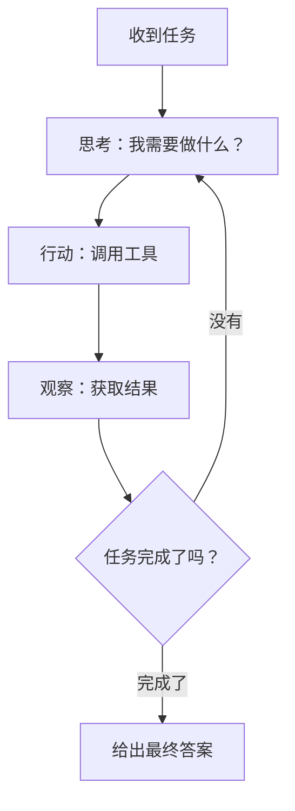

import { Aside } from '@astrojs/starlight/components';
import CheckAuthorize from '../../../components/CheckAuthorize.astro'

<CheckAuthorize/>

## Agent 是什么？

想象你有一个智能助手，不仅能理解你的需求，还能主动采取行动去完成任务——搜索信息、操作文件、分解任务、管理待办事项，甚至调用其他 AI 来帮忙。这就是 **Feat AI Agent**。

它基于 **ReAct（推理+行动）** 范式，能像人一样**思考 → 行动 → 观察 → 再思考**，通过循环迭代解决复杂的多步骤任务。

<Aside type="tip">Agent 特别适合处理需要多步骤、多工具协作的复杂任务。</Aside>

---

## 三分钟上手

### 运行你的第一个 Agent

```java
import tech.smartboot.feat.ai.agent.ReActAgent;
import tech.smartboot.feat.ai.agent.FeatAgent;
import java.util.concurrent.ExecutionException;

public class AgentDemo {
    public static void main(String[] args) throws ExecutionException, InterruptedException {
        // 创建一个 Agent
        FeatAgent agent = new ReActAgent();
        
        // 交给它一个任务
        String result = agent.execute(
            "搜索最新的 Java 21 新特性，总结成 3 个要点"
        ).get();  // 使用 .get() 获取异步结果
        
        System.out.println(result);
    }
}
```

<Aside type="tip">`execute()` 方法返回 `CompletableFuture<String>`，需要调用 `.get()` 获取最终结果。</Aside>

运行这段代码，Agent 会自动：
1. 分析任务需要搜索信息
2. 调用搜索工具查询 Java 21 特性
3. 读取搜索结果
4. 总结成 3 个要点返回给你

完整示例请参见 [ReActAgentTest.java](https://gitee.com/smartboot/feat/blob/master/feat-ai/src/test/java/tech/smartboot/feat/ai/agent/ReActAgentTest.java)

---

## ReAct 是怎么工作的？

ReAct = **Reasoning（推理）+ Acting（行动）**



举个例子：

你说："查找 Feat 框架的最新版本，并阅读它的更新日志"

Agent 的思考过程可能是：

1. **思考**：需要知道 Feat 的最新版本号
2. **行动**：调用搜索工具搜索"Feat 框架最新版本"
3. **观察**：得到版本号是 1.4.3
4. **思考**：现在需要读取更新日志
5. **行动**：调用网页阅读工具访问更新日志页面
6. **观察**：获取到更新内容
7. **思考**：已经获得足够信息，可以总结答案了
8. **完成**：返回整理好的更新日志

---

## 内置工具一览

ReActAgent 默认自带 5 个常用工具，开箱即用：

### 1. 搜索工具（SearchTool）

搜索网络信息，支持百度和必应。

```json
Action: search
Action Input: {
  "query": "Feat 框架最新版本",
  "engine": "baidu",
  "max_results": 5
}
```

### 2. 网页阅读工具（WebPageReaderTool）

读取网页内容，提取文本。

```json
Action: web_page_reader
Action Input: {
  "url": "https://gitee.com/smartboot/feat/releases"
}
```

### 3. 文件操作工具（FileOperationTool）

读写文件、创建目录、列出文件等。

```json
// 读取文件
Action: file_operation
Action Input: {
  "action": "read_file",
  "path": "./README.md"
}

// 写入文件
Action: file_operation
Action Input: {
  "action": "write_file",
  "path": "./report.txt",
  "content": "分析报告内容..."
}

// 列出目录
Action: file_operation
Action Input: {
  "action": "list_directory",
  "path": "./docs",
  "recursive": true
}
```

### 4. 待办事项工具（TodoListTool）

管理任务列表，用于分解复杂任务。

```json
// 创建待办列表
Action: todo_list
Action Input: { "action": "create" }

// 添加任务
Action: todo_list
Action Input: {
  "action": "add",
  "list_id": "todo_list_123",
  "title": "搜索资料",
  "description": "搜索 Java 21 新特性相关资料"
}

// 标记完成
Action: todo_list
Action Input: {
  "action": "complete",
  "list_id": "todo_list_123",
  "item_id": 1
}
```

### 5. 子 Agent 工具（SubAgentTool）

创建子 Agent 处理子任务，实现任务委派。

```json
Action: sub_agent
Action Input: {
  "agent_name": "research_agent",
  "task": "深入研究 Java 21 的虚拟线程特性"
}
```

---

## 自定义配置

### 选择 AI 模型

```java
import tech.smartboot.feat.ai.chat.ChatModelVendor;

ReActAgent agent = new ReActAgent(opts -> {
    opts.chatOptions()
        .model(ChatModelVendor.GiteeAI.DeepSeek_V32);  // 使用 DeepSeek V3
});
```

### 设置迭代次数

防止复杂任务陷入无限循环：

```java
ReActAgent agent = new ReActAgent(opts -> {
    opts.maxIterations(15);  // 最多迭代 15 次
});
```

<Aside type="caution">复杂任务可能需要更多迭代次数，但也要设置上限避免无限循环。</Aside>

### 完整配置示例

```java
ReActAgent agent = new ReActAgent(opts -> {
    opts.maxIterations(20)                          // 最大迭代次数
        .chatOptions()
        .model(ChatModelVendor.GiteeAI.DeepSeek_V32)  // 选择模型
        .temperature(0.7f);                         // 控制创造性
});
```

---

## 自定义工具

如果内置工具不够用，你可以创建自己的工具。

### 实现 AgentTool 接口

```java
import tech.smartboot.feat.ai.agent.AgentTool;
import com.alibaba.fastjson2.JSONObject;
import java.util.concurrent.CompletableFuture;

public class CalculatorTool implements AgentTool {
    
    @Override
    public CompletableFuture<String> execute(JSONObject parameters) {
        String expression = parameters.getString("expression");
        // 执行计算逻辑...
        String result = "计算结果";
        return CompletableFuture.completedFuture(result);
    }
    
    @Override
    public String getName() {
        return "calculator";
    }
    
    @Override
    public String getDescription() {
        return "执行数学计算，参数：expression (string) 数学表达式";
    }
    
    @Override
    public String getParametersSchema() {
        return "{\n"
            + "  \"type\": \"object\",\n"
            + "  \"properties\": {\n"
            + "    \"expression\": {\"type\": \"string\", \"description\": \"数学表达式\"}\n"
            + "  },\n"
            + "  \"required\": [\"expression\"]\n"
            + "}";
    }
}
```

### 注册自定义工具

```java
ReActAgent agent = new ReActAgent(opts -> {
    opts.addTool(new CalculatorTool());
});
```

现在 Agent 就能使用 `calculator` 工具执行数学计算了。

---

## 监控 Agent 状态

```java
import tech.smartboot.feat.ai.agent.AgentState;

// 获取当前状态
AgentState state = agent.getState();
System.out.println("Agent 状态: " + state);
```

状态说明：

| 状态 | 说明 |
|------|------|
| `IDLE` | 空闲，等待任务 |
| `RUNNING` | 正在推理 |
| `TOOL_EXECUTION` | 正在执行工具 |
| `FINISHED` | 任务完成 |
| `ERROR` | 执行出错 |

### 取消任务

```java
agent.cancel();  // 取消正在执行的任务
```

---

## 实战案例

### 案例：自动化调研报告

```java
import tech.smartboot.feat.ai.agent.ReActAgent;
import tech.smartboot.feat.ai.agent.FeatAgent;
import java.util.concurrent.ExecutionException;

public class ResearchReport {
    public static void main(String[] args) throws ExecutionException, InterruptedException {
        FeatAgent agent = new ReActAgent();
        
        String task = "请帮我完成以下任务：\n"
            + "1. 搜索 \"微服务框架 2024 发展趋势\"\n"
            + "2. 阅读 3 篇相关文章\n"
            + "3. 总结关键趋势\n"
            + "4. 将报告保存到 ./report.md";
        
        String result = agent.execute(task).get();
        System.out.println("调研完成！");
        System.out.println(result);
    }
}
```

Agent 会自动：
1. 搜索相关文章
2. 逐一阅读网页内容
3. 提取关键信息并总结
4. 将报告写入文件

---

## 最佳实践

### 1. 任务描述要清晰

❌ 模糊的任务："帮我处理这个文件"

✅ 清晰的任务："读取 ./data.csv，统计第三列的平均值，将结果保存到 ./result.txt"

### 2. 合理设置迭代次数

- 简单任务（单次搜索）：5-10 次
- 中等任务（多步骤处理）：10-20 次
- 复杂任务（需要多轮推理）：20-50 次

### 3. 选择合适的模型

- **快速任务**：轻量级模型
- **复杂推理**：DeepSeek V3、GPT-4、Claude
- **代码相关**：Codex、CodeLlama

### 4. 错误处理

```java
import java.util.concurrent.ExecutionException;

try {
    String result = agent.execute(task).get();
} catch (ExecutionException e) {
    System.err.println("Agent 执行失败: " + e.getCause().getMessage());
    // 重试或降级处理
} catch (InterruptedException e) {
    Thread.currentThread().interrupt();
    System.err.println("任务被中断");
}
```

---

## 总结

**Agent 的核心价值：**

- 🤖 **自动化**：一次指令，自动完成多步骤任务
- 🛠️ **工具化**：内置搜索、文件操作等常用工具
- 🔧 **可扩展**：轻松添加自定义工具
- 🧠 **智能化**：基于 ReAct 范式，能推理、能行动

**适用场景：**

- 信息收集与整理
- 文档处理与生成
- 代码审查与分析
- 自动化测试与部署
- 任何需要多步骤协作的任务

现在，你可以开始用 Agent 构建自己的智能应用了！
