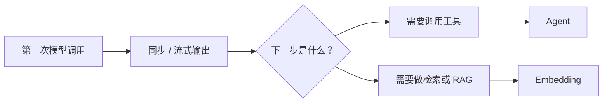

import { Aside, CardGrid, LinkCard } from '@astrojs/starlight/components';

Feat AI 这一组文档不是为了教你“什么是大模型”，而是为了回答更具体的问题：

- 我怎么把模型接进 Java 服务
- 我什么时候该用对话、Embedding 或 Agent
- 这些能力之间应该按什么顺序学习

<CardGrid>
  <LinkCard
    title="第一次调用"
    href="/feat/ai/getstart/"
    description="先把模型真正调通，再谈更高层能力。"
  />
  <LinkCard
    title="对话与流式"
    href="/feat/ai/chat/"
    description="学会配置模型、同步调用和流式输出。"
  />
  <LinkCard
    title="Agent"
    href="/feat/ai/agent/"
    description="当模型开始需要调用工具时，从这里继续。"
  />
  <LinkCard
    title="Embedding"
    href="/feat/ai/embedding/"
    description="当你开始做检索增强、RAG 或语义搜索时，再进入这一页。"
  />
</CardGrid>

## 这组文档适合谁

- 你已经会写 Java 服务，现在想把模型能力接进来
- 你不想从 Python 或单独 AI 框架起步
- 你希望对话、Agent 和向量能力能和 Feat 的服务端模型放在一起理解

## 推荐阅读顺序

通常最自然的顺序是：

1. [完成第一次 Feat AI 调用](/feat/ai/getstart/)
2. [配置对话模型并处理流式输出](/feat/ai/chat/)
3. [使用 Agent](/feat/ai/agent/)
4. [Embedding 与向量](/feat/ai/embedding/)

<Aside type="tip">
如果你只是想验证 API Key、本地 Ollama 或模型连通性，停在 quickstart 和 chat 这两页通常就够了，不需要一开始就跳进 Agent。
</Aside>
