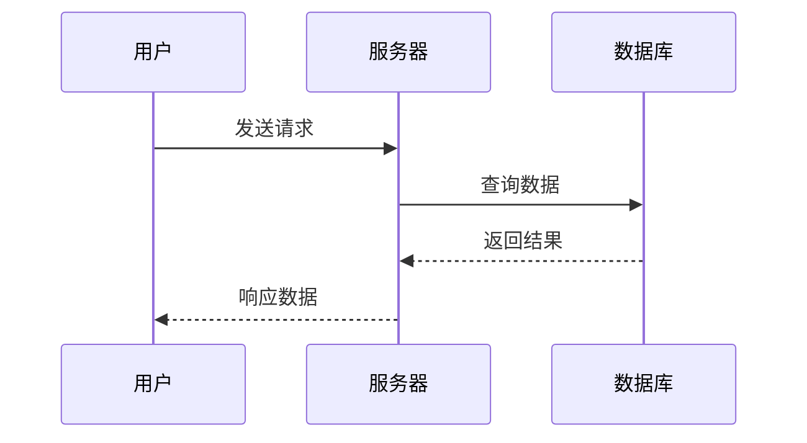
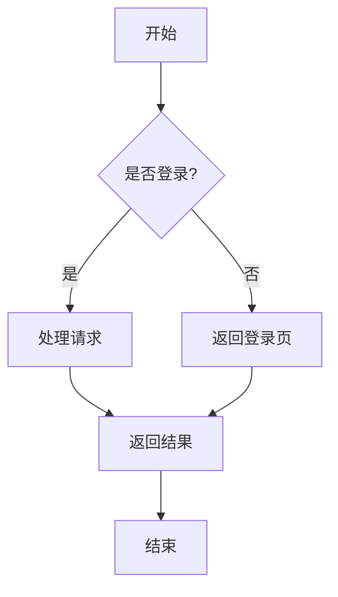

import { Aside } from '@astrojs/starlight/components';

## 写作理念

Feat 文档遵循**"让读者先跑起来"**的理念。我们相信，最好的学习方式是动手实践——所以文档应该尽快让读者运行第一段代码，然后再解释原理。

**目标读者是谁？**

Java 开发者，有一定编程基础，想快速上手 Feat 框架。他们不想读冗长的理论，只想知道"怎么写代码"。

---

## 文档应该长什么样？

一篇好的 Feat 文档，通常遵循这样的结构：

```
📄 文档开头
   ├── 一句话说明这个功能是什么
   ├── 什么场景下会用到它
   └── 最简代码示例（让读者 30 秒内跑起来）

📄 主体内容
   ├── 快速开始：能运行的最小示例
   ├── 基础用法：常见场景和配置
   ├── 进阶用法：高级特性和技巧
   └── 原理解析：简要说明工作原理

📄 文档结尾
   ├── 要点回顾
   └── 相关文档链接
```

<Aside type="tip">不用严格按照这个结构，根据功能复杂度灵活调整。简单功能可以合并章节，复杂功能可以拆分。</Aside>

---

## 开始写作前的准备

在动笔之前，建议先想清楚这几个问题：

**1. 这个功能解决什么问题？**

比如 WebSocket 功能——它解决了服务器实时推送数据到客户端的问题，适用于聊天室、股票行情、协同编辑等场景。

**2. 读者看完文档后应该能做什么？**

目标要具体。不是"了解 WebSocket"，而是"能用 Feat 搭建一个聊天室后端"。

**3. 有哪些现成的代码可以参考？**

去 `feat-test` 模块找找相关示例，确认代码能运行。好文档基于真实代码，而不是凭空想象。

---

## 如何组织内容？

### 先给代码，再讲道理

读者打开文档，最想看到的是**能运行的代码**。所以：

- ✅ 前 30% 的内容，让读者能运行第一个示例
- ✅ 每个概念配一个代码示例
- ✅ 先展示"能工作的代码"，再解释"为什么这样写"

**举个例子：**

❌ **不太好的做法**：

> HTTP 服务器是基于 TCP 协议的应用层协议，它使用请求-响应模型。在 Feat 中，你可以通过 HttpServer 类来创建服务器...

读者读了三段，还不知道代码怎么写。

✅ **更好的做法**：

> 三行代码，创建一个 HTTP 服务器：
> ```java
> Feat.httpServer()
>     .httpHandler(req -> req.getResponse().write("Hello"))
>     .listen(8080);
> ```
> 运行后访问 `http://localhost:8080`，你会看到 "Hello"。
> 好奇这是怎么做到的？让我们展开讲讲...

### 标题怎么写？

- **不要用 `#`**：Frontmatter 里已经有 `title` 了
- **用 `##` 表示章节**：如"快速开始"、"基础用法"
- **用 `###` 表示小节**：如"配置线程池"、"处理异常"
- **最多三级**：结构太深会让读者迷失

**章节标题建议用动词开头**：

- ✅ "创建 HTTP 服务器"
- ✅ "配置 WebSocket"
- ❌ "HTTP 服务器的创建"
- ❌ "WebSocket 配置说明"

---

## 语言风格：像朋友一样交流

### 用"你"和"我们"

- **"你"**：指导读者操作
  - "你可以通过 `httpHandler` 方法来处理请求"
  - "当你运行这段代码时..."

- **"我们"**：营造共同学习的氛围
  - "让我们来看看这个示例..."
  - "我们需要先理解这个概念..."

### 解释抽象概念时，用类比

技术概念往往很抽象，用生活中的事物类比，读者更容易理解。

**比如解释 NIO：**

> 想象一个餐厅：
> - **传统阻塞 IO**：每个服务员服务一位顾客，点菜时干等着。100 个顾客需要 100 个服务员。
> - **NIO**：服务员把菜单给顾客后，立刻去服务下一位。10 个服务员就能服务 1000 个顾客。
>
> Feat 用的就是第二种方式，所以能处理大量并发连接。

### 示例对比

| 生硬表达 | 自然表达 |
|---------|---------|
| 该功能用于处理 HTTP 请求。 | 这个功能让处理 HTTP 请求变得轻而易举，只需几行代码就能搭建起一个高性能的服务器。 |
| 参数配置错误会导致异常。 | 如果参数配置不正确，程序会抛出异常提醒你——别担心，我们稍后会详细介绍如何正确配置。 |
| 本文档介绍 WebSocket 的使用方法。 | 在这篇文章里，我们会一起用 Feat 搭建一个实时聊天室，你会学到 WebSocket 的核心用法和最佳实践。 |

---

## 代码示例：文档的灵魂

### 示例的三个层次

| 层次 | 目的 | 位置 |
|------|------|------|
| **最小示例** | 让读者最快看到效果 | 文档开头/快速开始 |
| **完整示例** | 展示常用配置和方法 | 基础用法 |
| **场景示例** | 基于真实业务场景 | 进阶用法/最佳实践 |

### 代码应该包含什么？

**每段代码必备：**

1. **简要说明**（1-3 句话）：这段代码是做什么的
2. **关键注释**：解释重要参数和逻辑
3. **运行指引**：如何运行，预期结果是什么
4. **JDK 8 兼容**：所有代码必须使用 JDK 8 语法

### JDK 8 语法规范

Feat 框架基于 JDK 8 开发，所有代码示例必须兼容 JDK 8。

**✅ 使用 JDK 8 语法**：
- Lambda 表达式：`() -> { }`
- Stream API：`list.stream().filter().collect()`
- 方法引用：`String::valueOf`
- 接口默认方法
- 传统的字符串拼接和格式化

**❌ 避免使用 JDK 9+ 特性**：
- 文本块（Text Blocks）：`"""..."""`
- `var` 局部变量类型推断
- `switch` 表达式增强
- Record 类
- `Optional.isEmpty()`（JDK 11）

**示例对比**：

| ❌ JDK 15+ 文本块 | ✅ JDK 8 字符串拼接 |
|----------------|-------------------|
| `String sql = """`<br/>`SELECT * FROM user`<br/>`WHERE id = ?`<br/>`""";` | `String sql = "SELECT * FROM user " +`<br/>`"WHERE id = ?";` |

<Aside type="tip">如果不确定某特性是否属于 JDK 8，请查阅官方文档或假设目标用户仍在使用 JDK 8。</Aside>

**举个例子：**

```java
// ✅ 好的示例
/**
 * 创建 HTTP 服务器，返回 "Hello Feat"
 * 运行后访问 http://localhost:8080 即可看到效果
 */
public class HelloServer {
    public static void main(String[] args) {
        Feat.httpServer()
            .httpHandler(request -> {
                // 向客户端返回响应内容
                request.getResponse().write("Hello Feat");
            })
            .listen(8080);  // 监听 8080 端口
    }
}
```

### 代码必须真实

<Aside type="caution">所有代码示例必须基于 `feat-test` 模块的实际源码，禁止虚构。链接必须指向 Gitee 仓库。</Aside>

**引用代码的方式：**

```md
完整示例请参见 [HelloWorld.java](https://gitee.com/smartboot/feat/blob/master/feat-test/src/main/java/tech/smartboot/feat/demo/HelloWorld.java)
```

---

## 格式和排版

### 强调重点

| 方式 | 用途 |
|------|------|
| **加粗** | 关键词、重要概念 |
| `代码` | 行内代码、命令、文件名 |
| <Aside>提示</Aside> | 补充说明、背景知识 |
| <Aside type="tip">技巧</Aside> | 最佳实践、优化建议 |
| <Aside type="caution">注意</Aside> | 需要警惕的问题 |
| <Aside type="danger">警告</Aside> | 危险操作、破坏性变更 |

### 使用 Mermaid 画图

**优先使用 Mermaid 图表**来解释流程和原理，特别是：
- **泳道图（Sequence Diagram）**：展示多角色交互流程
- **流程图（Flowchart）**：展示执行步骤和决策分支
- **状态图（State Diagram）**：展示状态变化

**为什么要用图表？**
- 一张图胜过千言万语，能直观展示复杂流程
- 泳道图特别适合展示「谁做了什么」的交互过程
- 读者看一眼就能理解整体流程

**示例 - 泳道图展示请求处理流程：**



**示例 - 流程图展示条件分支：**



<Aside type="tip">复杂流程优先画图，简单流程用文字。能用图说明的，不要写长篇大论。</Aside>

---

## 常见错误与建议

| ❌ 不太好的做法 | ✅ 更好的做法 |
|---------------|-------------|
| 先讲 500 字原理，再给代码 | 先给代码，再简要解释原理 |
| 示例代码不完整，缺导入和主方法 | 提供能直接运行的完整示例 |
| 堆砌 API 文档式的参数列表 | 在场景中讲解参数用法 |
| 术语不解释，假设读者都懂 | 首次出现时给出通俗解释 |
| 只展示正常流程，不提异常处理 | 包含常见错误和解决方法 |
| 从头到尾都是陈述句 | 适当用设问句、类比、小例子 |

---

## 质量检查清单

文档写完后，花 5 分钟检查一下：

**内容完整性**
- [ ] 前 30% 内容能让读者运行第一个示例
- [ ] 覆盖快速开始、基础用法、进阶用法
- [ ] 有要点回顾和相关链接

**技术准确性**
- [ ] 代码示例能运行
- [ ] 代码基于 `feat-test` 实际源码
- [ ] 链接指向 Gitee 且有效

**格式规范**
- [ ] 正确使用 `##` 和 `###`，没用 `#`
- [ ] 代码块有语法高亮（如 `java`）
- [ ] 恰当使用 Aside 组件

**语言表达**
- [ ] 用"你"和"我们"，没用"用户"
- [ ] 首次出现的术语有解释
- [ ] 读起来自然流畅，不生硬

---

## 总结

写好 Feat 文档的关键：

1. **让读者先跑起来**——前 30% 内容给出可运行代码
2. **基于真实代码**——所有示例来自 `feat-test`
3. **像朋友一样交流**——用"你"和"我们"，用类比解释概念
4. **聚焦实践**——多展示怎么用，少讲空洞的理论

记住：好的技术文档不是说明书，而是**向导**——带着读者从"不会"走到"会"。
