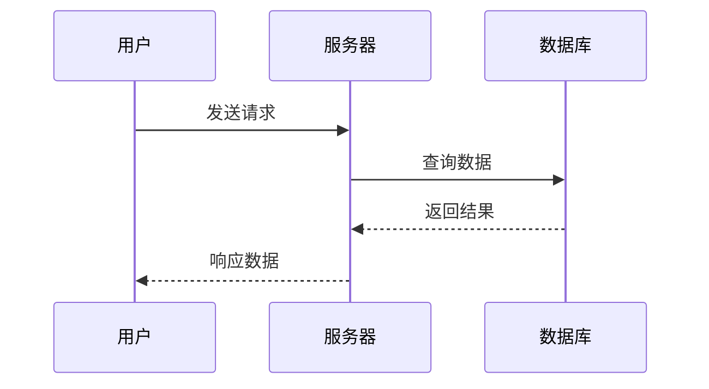

import { Aside } from '@astrojs/starlight/components';

## 核心理念

优秀的技术文档应该：

- **实用至上**：让开发者快速解决问题
- **循序渐进**：从简单示例到复杂应用
- **真实可靠**：基于实际可运行的代码

我们的目标读者是：有 Java 基础的开发者，希望快速掌握 Feat 框架的核心功能。

---

## 文档结构

推荐的标准文档结构：

1. **功能概述** - 一句话说明用途和适用场景
2. **快速开始** - 最小可运行示例（30秒内见效）
3. **基础用法** - 常见配置和典型应用场景
4. **进阶用法** - 高级特性和最佳实践
5. **原理解析** - 核心机制和工作原理
6. **总结回顾** - 关键要点和相关链接

<Aside type="tip">根据功能复杂度灵活调整结构。简单功能可合并章节，复杂功能可进一步细分。</Aside>

---

## 写作准备

动笔前明确三个关键问题：

**解决什么问题？**
WebSocket 解决服务器实时推送数据的需求，适用于聊天室、实时通知等场景。

**达成什么目标？**
具体而非笼统："能用 Feat 构建聊天室后端"而非"了解 WebSocket"。

**有何参考依据？**
优先使用 `feat-test` 模块的真实示例代码，确保可运行性。

---

## 内容组织原则

### 实践优先

开发者首先关心的是"怎么用"，而非"是什么"。

**核心策略：**
- 前30%内容展示可运行示例
- 每个概念配备对应代码
- 先展示结果，再解释原理

**对比示例：**

❌ 理论先行：
> HTTP 服务器基于 TCP 协议的请求-响应模型。在 Feat 中可通过 HttpServer 类创建...

✅ 实践导向：
> 三行代码创建 HTTP 服务器：
> ```java
> Feat.httpServer()
>     .httpHandler(req -> req.getResponse().write("Hello"))
>     .listen(8080);
> ```
> 访问 `http://localhost:8080` 查看效果，后续详解实现原理。

### 标题规范

- 使用 `##` 标记章节（如"快速开始"）
- 使用 `###` 标记小节（如"配置线程池"）
- 最多三级结构，避免层级过深
- 章节标题采用动词开头：
  - ✅ "创建 HTTP 服务器"
  - ✅ "配置 WebSocket"
  - ❌ "HTTP 服务器的创建"

---

## 表达风格

### 人称使用

- **"你"**：指导操作
  - "通过 `httpHandler` 方法处理请求"
  - "运行代码时会看到..."

- **"我们"**：营造共学氛围
  - "来看这个示例..."
  - "先理解这个概念..."

### 概念解释

用生活化类比解释技术概念：

**NIO 类比：**
> 餐厅服务模式：
> - 传统阻塞 IO：一个服务员服务一位顾客
> - NIO：服务员下单后立即服务下一位
> 
> Feat 采用后者，支持高并发连接。

### 表达对比

| 生硬表达 | 自然表达 |
|---------|---------|
| 处理 HTTP 请求的功能 | 几行代码搭建高性能 HTTP 服务器 |
| 配置错误导致异常 | 配置不当会报错，后面详述正确方法 |
| 介绍 WebSocket 用法 | 一起构建实时聊天室，掌握核心用法 |

---

## 代码示例规范

### 示例层次

| 类型 | 目的 | 应用场景 |
|------|------|----------|
| 最小示例 | 快速验证功能 | 文档开头 |
| 完整示例 | 展示标准配置 | 基础用法 |
| 场景示例 | 真实业务应用 | 进阶用法 |

### 代码要求

每个示例必须包含：
1. 简要功能说明（1-3句话）
2. 关键逻辑注释
3. 明确运行指引和预期结果
4. JDK 8 语法兼容

### JDK 兼容性

所有示例必须兼容 JDK 8：

**支持特性：**
- Lambda 表达式
- Stream API
- 方法引用
- 接口默认方法
- 传统字符串操作

**禁用特性：**
- 文本块（JDK 15+）
- `var` 关键字（JDK 10+）
- 增强 switch（JDK 14+）
- Record 类（JDK 16+）
- `Optional.isEmpty()`（JDK 11+）

<Aside type="tip">不确定时，默认采用 JDK 8 语法以确保最大兼容性。</Aside>

### 示例模板

```java
/**
 * HTTP 服务器示例，返回 "Hello Feat"
 * 访问 http://localhost:8080 查看效果
 */
public class HelloServer {
    public static void main(String[] args) {
        Feat.httpServer()
            .httpHandler(request -> {
                // 返回响应内容
                request.getResponse().write("Hello Feat");
            })
            .listen(8080);  // 监听端口
    }
}
```

### 真实性要求

<Aside type="caution">所有示例必须基于 `feat-test` 模块真实代码，链接指向 Gitee 仓库。</Aside>

**引用格式：**
```md
完整示例：[HelloWorld.java](https://gitee.com/smartboot/feat/blob/master/feat-test/src/main/java/tech/smartboot/feat/demo/HelloWorld.java)
```

---

## 格式规范

### 强调方式

| 格式 | 用途 |
|------|------|
| **加粗** | 重要概念、关键词 |
| `代码` | 行内代码、文件名 |
| <Aside>提示</Aside> | 补充说明 |
| <Aside type="tip">技巧</Aside> | 最佳实践 |
| <Aside type="caution">注意</Aside> | 警惕事项 |
| <Aside type="danger">警告</Aside> | 危险操作 |

### 图表使用

优先采用 Mermaid 图表解释复杂流程：

**适用场景：**
- 泳道图：多角色交互流程
- 流程图：执行步骤和决策分支
- 状态图：状态变化过程

**优势：**
- 直观展示复杂逻辑
- 一图胜过千言万语
- 快速理解整体流程

**示例 - 请求处理流程：**



<Aside type="tip">复杂流程优先用图，简单情况用文字说明。</Aside>

---

## 常见问题

| 问题表现 | 改进建议 |
|---------|----------|
| 先讲原理后给代码 | 先展示代码再解释原理 |
| 示例不完整缺主方法 | 提供可直接运行的完整代码 |
| 堆砌参数列表 | 结合场景讲解参数用法 |
| 术语无解释 | 首次出现时通俗解释 |
| 忽略异常处理 | 包含常见错误和解决方案 |
| 表达过于正式 | 适度使用设问和类比 |

---

## 质量检查

完成文档后核查以下要点：

**内容完整性**
- [ ] 前30%可运行首个示例
- [ ] 涵盖快速开始到进阶用法
- [ ] 包含要点总结和相关链接

**技术准确性**
- [ ] 所有代码可正常运行
- [ ] 基于 `feat-test` 真实代码
- [ ] Gitee 链接有效可用

**格式规范**
- [ ] 正确使用标题层级
- [ ] 代码块包含语法高亮
- [ ] 合理使用提示组件

**表达质量**
- [ ] 使用"你"和"我们"人称
- [ ] 首次术语给予解释
- [ ] 语言自然流畅易懂

---

## 核心要点

优质技术文档的四个要素：

1. **实践导向** - 前30%展示可运行代码
2. **真实可靠** - 基于 `feat-test` 实际示例
3. **友好表达** - 用对话式语言和生活类比
4. **注重应用** - 聚焦使用方法而非理论阐述

记住：优秀文档是向导而非说明书，引导读者从"不会"走向"会"。
