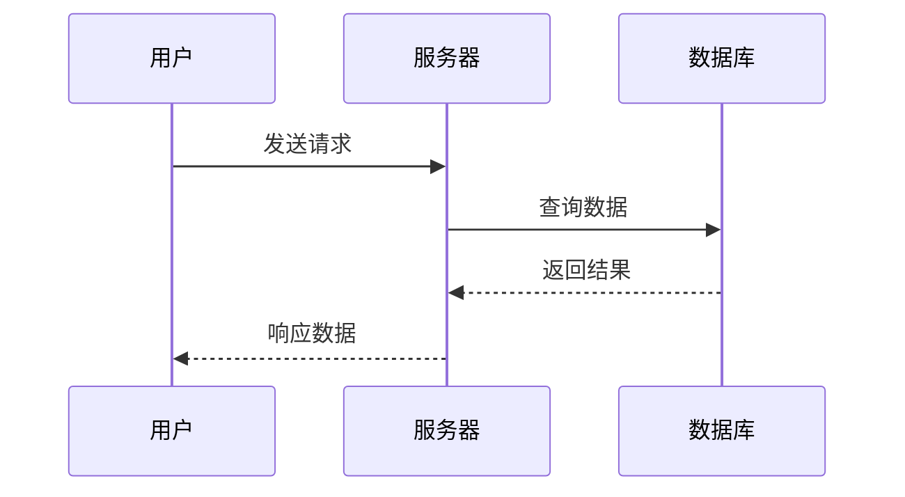

import { Aside } from '@astrojs/starlight/components';

## 核心理念

基于 Diataxis 框架的文档分类体系：

### 四大文档类型

1. **教程 (Tutorials)** - 学习导向
   - 带领读者完成实际活动的课程
   - 通过实践帮助理解概念和相互作用
   - 展示实现目标的一种方式，非多种路径

2. **操作指南 (How-to Guides)** - 任务导向
   - 逐步引导完成特定任务
   - 假设读者具备相关概念基础
   - 探讨替代方法和权衡点

3. **概念解释 (Explanations)** - 理解导向
   - 解释设计原则和理论背景
   - 阐述为何某些设计存在
   - 避免过多代码细节，专注理念

4. **参考文档 (References)** - 查询导向
   - 详细描述 API 和特性
   - 简洁有序地描述功能
   - 由产品描述驱动而非用户需求

### 写作原则

- **实用至上**：让开发者快速解决问题
- **结构清晰**：严格按照文档类型组织内容
- **真实可靠**：基于实际可运行的代码
- **用户导向**：根据不同读者群体调整表达方式

---

## 文档结构设计

### 按文档类型组织

#### 教程文档结构 (Tutorials)

```
1. 学习目标 - 明确要掌握的技能
2. 前置条件 - 所需基础知识和环境
3. 实践步骤 - 带领完成的详细过程
4. 验证结果 - 确认学习成果
5. 总结回顾 - 核心知识点梳理
```

#### 操作指南结构 (How-to Guides)

```
1. 任务描述 - 要解决的具体问题
2. 解决方案 - 推荐的实现路径
3. 替代方案 - 其他可行的选择
4. 注意事项 - 常见陷阱和最佳实践
5. 相关链接 - 关联的教程和参考
```

#### 概念文档结构 (Explanations)

```
1. 背景介绍 - 问题产生的原因
2. 设计理念 - 核心思想和原则
3. 架构解析 - 系统设计思路
4. 权衡分析 - 选择此方案的理由
5. 扩展思考 - 相关概念关联
```

#### 参考文档结构 (References)

```
1. API 概览 - 功能简介和主要用途
2. 参数详解 - 输入输出参数说明
3. 使用示例 - 典型应用场景代码
4. 异常处理 - 可能的错误和解决方案
5. 版本差异 - 不同版本间的变更
```

<Aside type="tip">
**文档类型选择指南：**
- 新功能介绍 → 教程
- 具体问题解决 → 操作指南
- 设计原理阐述 → 概念解释
- API 详细说明 → 参考文档
</Aside>

---

## 写作准备流程

### 第一步：确定文档类型

根据写作目的选择合适的文档类型：

| 写作目的 | 推荐类型 | 典型标题 |
|---------|---------|---------|
| 帮助新手入门 | 教程 | "构建你的第一个 HTTP 服务器" |
| 解决具体问题 | 操作指南 | "如何配置 HTTPS 支持" |
| 解释设计原理 | 概念文档 | "Feat 的异步处理机制" |
| API 使用说明 | 参考文档 | "HttpServer API 参考" |

### 第二步：明确写作要素

**目标读者分析：**
- 初学者：需要详细步骤和背景知识
- 中级开发者：关注最佳实践和进阶用法
- 高级用户：重视性能优化和架构设计

**内容边界界定：**
- 哪些是必备知识（必须详述）
- 哪些是扩展内容（可以链接）
- 哪些是重复信息（应当避免）

**参考资源确认：**
- 优先使用 `feat-test` 模块真实示例
- 确保所有代码可正常运行
- 验证 Gitee 链接的有效性

---

## 内容组织原则

### 按类型差异化组织

#### 教程类文档
- **学习导向**：前50%展示完整可运行示例
- **循序渐进**：从简单到复杂的知识点递进
- **即时反馈**：每个步骤都有验证环节
- **技能导向**：重点培养解决问题的能力

#### 操作指南类
- **任务导向**：直接解决具体问题
- **方案对比**：提供多种实现路径
- **风险提示**：标注常见陷阱和注意事项
- **实用性强**：聚焦可复制的操作步骤

#### 概念解释类
- **理论导向**：深入阐述设计思想
- **架构视角**：从系统层面理解设计
- **决策依据**：解释技术选型的理由
- **关联性强**：与其他概念建立联系

#### 参考文档类
- **查询导向**：便于快速查找信息
- **标准化**：统一的格式和表述方式
- **完整性**：涵盖所有参数和返回值
- **准确性**：确保信息的时效性和正确性

**不同类型文档示例对比：**

**教程示例：**
> 🎯 **学习目标**：构建一个完整的用户管理系统
> 
> 🔧 **实践步骤**：
> ```java
> // 第一步：创建基础服务器
> Feat.httpServer()
>     .httpHandler(req -> req.getResponse().write("用户管理服务已启动"))
>     .listen(8080);
> ```
> 访问 `http://localhost:8080` 验证服务器是否正常运行。

**操作指南示例：**
> 📋 **任务**：为 HTTP 服务器配置 HTTPS 支持
> 
> 💡 **推荐方案**：
> ```java
> Feat.httpServer()
>     .sslContext(SSLContext.getDefault())
>     .listen(8443);
> ```
> ⚠️ **注意事项**：需要预先配置 SSL 证书

**概念解释示例：**
> 🧠 **设计原理**：为什么 Feat 采用异步非阻塞架构
> 
> 传统的同步阻塞模型中，每个连接都需要一个线程处理，
> 当并发连接数很高时会造成严重的资源浪费。
> Feat 采用事件驱动的异步模型，一个线程可以处理
> 成千上万个连接，大大提升了系统的并发处理能力。

**参考文档示例：**
> 📚 **HttpServer.listen() 方法**
> 
> **签名**：`HttpServer listen(int port)`
> **参数**：port - 监听端口号（1-65535）
> **返回**：配置完成的 HttpServer 实例
> **异常**：IllegalArgumentException（端口无效时）

### 标题层级规范

不同文档类型采用相应的标题结构：

**教程类 (## → ### → ####)：**
```
## 构建你的第一个 HTTP 服务器
### 准备开发环境
### 编写基础代码
### 运行和测试
### 扩展功能
```

**操作指南类 (## → ### → ####)：**
```
## 如何配置 WebSocket 支持
### 问题描述
### 解决方案
### 配置步骤
### 验证方法
### 常见问题
```

**概念解释类 (## → ### → ####)：**
```
## Feat 异步处理机制解析
### 背景和动机
### 核心设计思想
### 实现原理
### 性能优势
### 与其他框架对比
```

**参考文档类 (## → ### → ####)：**
```
## HttpServer API 参考
### 构造方法
### 配置方法
### 生命周期方法
### 监听器方法
```

---

## 表达风格规范

### 人称使用策略

根据文档类型调整人称使用：

**教程类文档：**
- 主要用"你"：指导学习者操作
- 适当用"我们"：营造共同学习氛围

**操作指南类：**
- 主要用"你"：直接指导完成任务
- 少用"我们"：保持专业客观

**概念解释类：**
- 多用"我们"：引导思考和理解
- 少用"你"：避免指令性语气

**参考文档类：**
- 使用第三人称：保持客观中立
- 避免主观色彩：确保权威性

### 概念解释技巧

针对不同抽象层次采用相应解释方式：

**技术概念类比：**
> **NIO 类比餐厅服务：**
> - 传统阻塞 IO：一个服务员专门服务一位顾客
> - NIO：服务员下单后立即服务下一位顾客
> 
> Feat 采用后者，支持高并发连接。

**架构设计比喻：**
> **路由机制像交通管制：**
> Router 就像智能交通信号灯，
> 根据不同的道路情况（请求路径）
> 指引车辆（请求）到达正确的目的地（处理器）。

**抽象概念具象化：**
> **Session 状态管理：**
> 可以把 Session 想象成一个带编号的储物柜，
> 每个用户都有自己的专属柜子存放个人信息，
> 通过唯一的钥匙（Session ID）可以随时存取物品。

### 表达风格对比

| 场景 | 生硬表达 | 自然表达 | 对应文档类型 |
|------|---------|---------|-------------|
| 功能介绍 | 处理 HTTP 请求的功能 | 几行代码搭建高性能 HTTP 服务器 | 教程/操作指南 |
| 错误说明 | 配置错误导致异常 | 配置不当会报错，后面详述正确方法 | 操作指南 |
| 学习引导 | 介绍 WebSocket 用法 | 一起构建实时聊天室，掌握核心用法 | 教程 |
| 原理解释 | 异步处理提高性能 | 异步机制让一个线程处理 thousands of connections | 概念解释 |
| API 说明 | 返回 HttpServer 实例 | 返回配置完成的服务器实例，可用于链式调用 | 参考文档 |

---

## 代码示例规范

### 按文档类型设计示例

#### 教程示例结构

```java
/**
 * 教程：构建用户管理系统
 * 学习目标：掌握 RESTful API 设计
 * 预期效果：实现完整的用户增删改查功能
 */
public class UserManagementTutorial {
    public static void main(String[] args) {
        // 第一步：创建基础服务器
        Router router = new Router();
        
        // 第二步：实现用户列表接口
        router.route("/users", ctx -> {
            ctx.Response.write("[{\"id\":1,\"name\":\"张三\"}]");
        });
        
        // 第三步：启动服务
        Feat.httpServer()
            .httpHandler(router)
            .listen(8080);
        
        System.out.println("用户管理服务已启动，访问 http://localhost:8080/users");
    }
}
```

#### 操作指南示例结构

```java
/**
 * 操作指南：配置 HTTPS 支持
 * 适用场景：生产环境部署
 * 注意事项：需要有效的 SSL 证书
 */
public class HttpsConfiguration {
    public static void configureHttps() {
        try {
            // 方案一：使用默认 SSL 上下文
            Feat.httpServer()
                .sslContext(SSLContext.getDefault())
                .listen(8443);
                
        } catch (Exception e) {
            // 方案二：自定义 SSL 配置
            System.err.println("SSL 配置失败: " + e.getMessage());
        }
    }
}
```

#### 概念解释示例结构

```java
/**
 * 概念解释：异步处理机制演示
 * 目的：理解非阻塞 I/O 的工作原理
 * 说明：此代码用于教学，非生产环境使用
 */
public class AsyncConceptDemo {
    // 同步处理方式（阻塞）
    public void syncProcessing() {
        // 每个请求占用一个线程
        Thread thread = new Thread(() -> {
            // 模拟长时间处理
            try { Thread.sleep(1000); } catch (InterruptedException ignored) {}
        });
        thread.start();
    }
    
    // 异步处理方式（非阻塞）
    public void asyncProcessing() {
        // 事件循环处理多个请求
        // 一个线程可以处理 thousands of connections
    }
}
```

#### 参考文档示例结构

```java
/**
 * HttpServer.listen() 方法参考
 * @param port 监听端口号 (1-65535)
 * @return 配置完成的 HttpServer 实例
 * @throws IllegalArgumentException 端口无效时抛出
 * 
 * 使用示例：
 * Feat.httpServer().listen(8080);  // 监听 8080 端口
 * Feat.httpServer().listen(0);     // 使用随机可用端口
 */
public HttpServer listen(int port) {
    if (port < 1 || port > 65535) {
        throw new IllegalArgumentException("端口号必须在 1-65535 之间");
    }
    // 实现细节...
    return this;
}
```

### 示例质量要求

**通用要求：**
1. 所有示例必须基于 `feat-test` 模块真实代码
2. 提供完整的可运行代码（包含 main 方法）
3. 添加必要的注释说明关键步骤
4. 指明预期运行结果和验证方法
5. 遵循 JDK 8 语法规范

**类型特定要求：**
- **教程示例**：步骤清晰，注释详细，便于跟随练习
- **操作指南**：提供多种解决方案和错误处理
- **概念解释**：代码服务于理解，不追求实用性
- **参考文档**：示例简洁准确，突出 API 用法

### JDK 兼容性规范

所有示例必须严格遵循 JDK 8 语法：

✅ **支持的特性：**
- Lambda 表达式：`(req) -> req.getResponse().write("Hello")`
- Stream API：`list.stream().filter(...).collect(...)`
- 方法引用：`String::toLowerCase`
- 接口默认方法：`interface Handler { default void handle() {} }`
- 传统字符串操作：`"Hello" + name`

❌ **禁止使用的特性：**
- 文本块（JDK 15+）：```"""多行字符串"""```
- `var` 关键字（JDK 10+）：`var server = Feat.httpServer()`
- 增强 switch（JDK 14+）：`switch(expr) { case 1 -> "one"; }`
- Record 类（JDK 16+）：`record Point(int x, int y) {}`
- `Optional.isEmpty()`（JDK 11+）：`optional.isEmpty()`

<Aside type="caution">
所有代码示例都将被验证兼容性，不符合 JDK 8 规范的示例将被拒绝合并。
</Aside>

---

## 格式规范

### 强调方式

| 格式 | 用途 |
|------|------|
| **加粗** | 重要概念、关键词 |
| `代码` | 行内代码、文件名 |
| <Aside>提示</Aside> | 补充说明 |
| <Aside type="tip">技巧</Aside> | 最佳实践 |
| <Aside type="caution">注意</Aside> | 警惕事项 |
| <Aside type="danger">警告</Aside> | 危险操作 |

### 图表使用

优先采用 Mermaid 图表解释复杂流程：

**适用场景：**
- 泳道图：多角色交互流程
- 流程图：执行步骤和决策分支
- 状态图：状态变化过程

**优势：**
- 直观展示复杂逻辑
- 一图胜过千言万语
- 快速理解整体流程

**示例 - 请求处理流程：**



<Aside type="tip">复杂流程优先用图，简单情况用文字说明。</Aside>

---

## 常见问题及解决方案

### 内容组织问题

| 问题表现 | 改进建议 | 对应文档类型 |
|---------|----------|-------------|
| 先讲原理后给代码 | 先展示代码再解释原理 | 教程/操作指南 |
| 示例不完整缺主方法 | 提供可直接运行的完整代码 | 所有类型 |
| 堆砌参数列表 | 结合场景讲解参数用法 | 参考文档 |
| 术语无解释 | 首次出现时通俗解释 | 教程/概念解释 |
| 忽略异常处理 | 包含常见错误和解决方案 | 操作指南 |
| 表达过于正式 | 适度使用设问和类比 | 教程/概念解释 |
| 混淆文档类型 | 明确区分四类文档的写作目的 | 所有类型 |

### 文档类型混淆问题

**常见错误识别：**

❌ **把教程写成参考文档：**
> 详细介绍 HttpServer 的所有构造方法和参数含义

✅ **正确做法：**
> 带领读者一步步构建一个完整的 HTTP 服务应用

❌ **把概念解释写成操作指南：**
> 如何配置线程池大小来优化性能

✅ **正确做法：**
> 解释为什么 Feat 采用事件驱动架构设计

### 质量检查清单

完成文档后必须核查以下要点：

**内容完整性检查：**
- [ ] 明确标识文档类型（教程/操作指南/概念/参考）
- [ ] 符合对应类型的结构要求
- [ ] 包含适当的示例代码
- [ ] 提供清晰的学习路径或操作步骤

**技术准确性检查：**
- [ ] 所有代码示例可正常运行
- [ ] 基于 `feat-test` 模块真实代码
- [ ] Gitee 链接有效且指向正确位置
- [ ] 遵循 JDK 8 语法规范

**表达质量检查：**
- [ ] 人称使用符合文档类型要求
- [ ] 首次出现的专业术语给予解释
- [ ] 语言自然流畅，避免过度正式
- [ ] 适当使用类比和比喻辅助理解

**格式规范检查：**
- [ ] 正确使用标题层级结构
- [ ] 代码块包含适当的语法高亮
- [ ] 合理使用提示组件（Aside）
- [ ] 图表使用恰当且有助于理解

### 文档维护建议

**定期更新：**
- 跟随框架版本更新 API 参考文档
- 根据用户反馈优化教程和操作指南
- 保持示例代码与最新版本兼容

**质量监控：**
- 建立文档评审机制
- 定期验证示例代码的可运行性
- 收集用户使用反馈持续改进

**协作规范：**
- 明确文档贡献流程
- 统一写作风格和术语使用
- 建立文档版本控制机制

---


## 核心要点总结

基于 Diataxis 框架的优质技术文档四要素：

### 1. 分类明确 - 四大文档类型各司其职
- **教程**：学习导向，培养技能
- **操作指南**：任务导向，解决问题
- **概念解释**：理解导向，阐述原理
- **参考文档**：查询导向，提供规范

### 2. 结构规范 - 严格按照类型组织内容
- 教程：学习目标 → 实践步骤 → 验证结果
- 操作指南：问题描述 → 解决方案 → 注意事项
- 概念解释：背景介绍 → 设计理念 → 架构解析
- 参考文档：API 概览 → 参数详解 → 使用示例

### 3. 表达精准 - 因材施教的人称策略
- 教程：多用"你"指导，"我们"共学
- 操作指南：直接用"你"指导完成任务
- 概念解释：善用"我们"引导思考理解
- 参考文档：使用第三人称保持客观

### 4. 质量保障 - 严格的验证和维护机制
- 所有示例必须基于真实可运行代码
- 严格遵循 JDK 8 语法兼容性要求
- 建立完善的质量检查和维护流程

<Aside type="tip">
**记住：优秀的文档是向导而非说明书**

引导读者从"不会"走向"会用"，从"会用"走向"精通"。
不同类型的文档承担不同使命，协同构成完整的知识体系。
</Aside>
