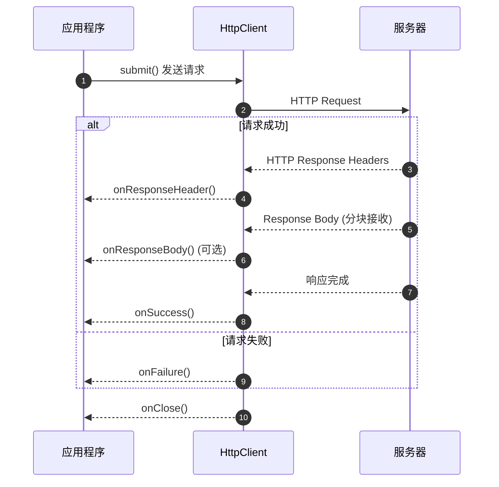

import { Aside, Tabs, TabItem } from '@astrojs/starlight/components';

这篇指南的目标：让你在 5 分钟内掌握 Feat HttpClient 的核心用法，从简单的 GET 请求到复杂的文件上传和流式处理。

Feat HttpClient 采用异步回调模型，适合高并发场景。如果你正在寻找一个轻量级、高性能的 HTTP 客户端替代方案，这篇文档就是为你准备的。

## 创建与配置

### 创建客户端

使用 Feat 工厂方法创建客户端实例：

```java
import tech.smartboot.feat.Feat;
import tech.smartboot.feat.core.client.HttpClient;

// 基础创建
HttpClient client = Feat.httpClient("https://api.example.com");

// 带配置选项
HttpClient client = Feat.httpClient("https://api.example.com", options -> {
    options.debug(true)
           .connectTimeout(5000)
           .idleTimeout(30000);
});
```

<Aside type="caution">
`HttpClient(String url)` 必须包含协议头（`http://` 或 `https://`），否则将抛出异常。
</Aside>

### 连接配置

```java
HttpClient client = Feat.httpClient("https://api.example.com", options -> {
    options.debug(true)                    // 开启调试日志
           .connectTimeout(5000)           // 连接超时（毫秒）
           .idleTimeout(30000)             // 空闲超时（毫秒）
           .readBufferSize(8192)           // 读缓冲区大小
           .setWriteBufferSize(8192);      // 写缓冲区大小
});
```

### HTTP 代理

```java
// 基础代理
HttpClient client = Feat.httpClient("https://api.example.com", options -> {
    options.proxy("proxy.example.com", 8080);
});

// 带认证的代理
HttpClient client = Feat.httpClient("https://api.example.com", options -> {
    options.proxy("proxy.example.com", 8080, "username", "password");
});
```

### 连接池

HttpClient 内部自动维护连接池，通过 `keepalive` 配置启用连接复用：

```java
client.get("/users")
        .header(header -> header.keepalive(true))  // 启用连接复用
        .submit();
```

## 发送请求

### GET 请求

GET 请求用于获取资源，支持链式添加查询参数：

```java
client.get("/users")
        .addQueryParam("page", "1")
        .addQueryParam("size", "20")
        .onSuccess(response -> System.out.println(response.body()))
        .submit();
```

### POST 请求

POST 请求支持多种数据格式：

<Tabs>
<TabItem label="JSON">

```java
Map<String, Object> payload = new HashMap<>();
payload.put("name", "feat");

client.post("/users")
        .postJson(payload)  // 自动序列化并设置 Content-Type
        .onSuccess(response -> System.out.println(response.body()))
        .submit();
```

<Aside type="tip">
`postJson()` 会自动序列化对象并设置 Content-Type 为 application/json。
</Aside>

</TabItem>
<TabItem label="表单">

```java
import java.util.HashMap;
import java.util.Map;

Map<String, String> formData = new HashMap<>();
formData.put("name", "feat");
formData.put("version", "1.0");

client.post("/users")
        .postBody(body -> body.formUrlencoded(formData))
        .submit();
```

</TabItem>
<TabItem label="原始 Body">

```java
client.post("/users")
        .body(body -> body.write("raw data".getBytes()))
        .header(header -> header.set(HeaderName.CONTENT_TYPE, "text/plain"))
        .submit();
```

</TabItem>
</Tabs>

### PUT、DELETE 等请求

使用 `rest()` 方法发送 PUT、DELETE 等请求：

```java
client.rest("PUT", "/users/1")
        .postJson(userData)
        .onSuccess(response -> System.out.println(response.body()))
        .submit();
```

### 请求头配置

```java
import tech.smartboot.feat.core.common.HeaderName;

client.get("/users")
        .header(header -> header
                .set(HeaderName.USER_AGENT, "Feat-Client/1.0")
                .set(HeaderName.AUTHORIZATION, "Bearer token123")
                .keepalive(true))
        .submit();
```

**set() vs add()：**

- `set()` - 覆盖同名 header，适合设置唯一值（如 Content-Type）
- `add()` - 追加 header，支持同名多值（如 Set-Cookie）

```java
client.post("/upload")
        .header(header -> {
            header.set(HeaderName.CONTENT_TYPE, "application/json");  // 覆盖
            header.add("X-Custom-Header", "value1");  // 追加
            header.add("X-Custom-Header", "value2");  // 同名追加
        })
        .submit();
```

## 处理响应

### 异步回调

Feat 采用异步回调模型处理响应：

```java
client.get("/users")
        .onResponseHeader(response -> {
            // 收到响应头时触发
            System.out.println("Status: " + response.statusCode());
        })
        .onSuccess(response -> {
            // 收到完整响应体时触发
            System.out.println("Body: " + response.body());
        })
        .onFailure(error -> {
            // 请求失败时触发
            error.printStackTrace();
        })
        .onClose(() -> {
            // 连接关闭时触发
            System.out.println("Connection closed");
        })
        .submit();
```

以下泳道图展示了请求过程中各回调的触发时机：



**回调触发顺序说明：**

1. **请求发送** - 调用 `submit()` 后，请求开始发送
2. **收到响应头** - 服务器返回响应头时触发 `onResponseHeader()`，此时可以获取状态码和响应头
3. **接收响应体** - 如果注册了 `onResponseBody()`，会分块接收响应体数据
4. **请求成功** - 响应体完整接收后触发 `onSuccess()`
5. **请求失败** - 网络异常或超时等情况下触发 `onFailure()`
6. **连接关闭** - 无论成功或失败，连接关闭时都会触发 `onClose()`

<Aside type="tip">
`onClose()` 是**最终回调**，无论请求成功还是失败都会执行，适合用于资源清理操作。
</Aside>

### 读取响应数据

**响应体：**

```java
client.get("/users")
        .onSuccess(response -> {
            String body = response.body();  // 获取响应体字符串
        })
        .submit();
```

**响应头：**

```java
client.get("/users")
        .onResponseHeader(response -> {
            // 获取单个头
            String contentType = response.getHeader(HeaderName.CONTENT_TYPE);
            
            // 获取所有头名称
            Collection<String> headerNames = response.getHeaderNames();
            
            // 获取指定头的所有值（支持多值）
            Collection<String> values = response.getHeaders("Set-Cookie");
            
            System.out.println("Status: " + response.statusCode());
            System.out.println("Protocol: " + response.getProtocol());
        })
        .submit();
```

### 同步等待

如需阻塞等待响应，使用 `CompletableFuture.get()`：

```java
HttpResponse response = client.get("/users")
        .submit()
        .get();  // 阻塞等待

System.out.println(response.body());
```

<Aside type="tip">
异步模式不会阻塞线程，适合高并发服务端；同步模式适合简单脚本和测试场景。
</Aside>

## 高级用法

### 文件上传（Multipart）

上传文件使用 `multipart` 表单：

```java
import tech.smartboot.feat.core.client.Multipart;
import java.io.File;

File avatar = new File("/path/to/avatar.jpg");

client.post("/upload")
        .postBody(body -> body.multipart(Arrays.asList(
                Multipart.newFormMultipart("name", "feat"),
                Multipart.newFormMultipart("version", "1.0"),
                Multipart.newFileMultipart("avatar", avatar)
        )))
        .onSuccess(response -> System.out.println(response.body()))
        .submit();
```

### 流式响应处理

如需处理二进制数据或大文件，使用 `onResponseBody` 流式处理：

```java
client.get("/large-file.zip")
        .onResponseBody((response, bytes, end) -> {
            // 分块接收响应体数据
            // bytes: 当前数据块
            // end: 是否为最后一块
        })
        .submit();
```

### 大文件下载

使用流式 API 处理大文件，避免内存溢出：

```java
FileOutputStream fos = new FileOutputStream("download.zip");

client.get("/large-file.zip")
        .onResponseBody((response, bytes, end) -> {
            fos.write(bytes);
            if (end) {
                fos.close();
            }
        })
        .submit();
```

### SSE 客户端

处理 Server-Sent Events 流式响应。详见 [SSE 客户端](/feat/client/sse_client/) 章节。

```java
client.get("/events")
        .onSSE(sse -> {
            sse.onOpen(response -> System.out.println("SSE connection opened"));
            sse.onData(event -> System.out.println("Received: " + event.getData()));
        })
        .submit();
```

### 动态路径构造

使用 `HttpClient(String host, int port)` 构造方式，适合需要动态指定路径的场景：

```java
HttpClient client = new HttpClient("api.example.com", 443);
client.get("/users").submit();  // 必须指定 path
```

<Aside type="caution">
使用 `HttpClient(host, port)` 构造后，必须调用带参的 `get(String uri)` / `post(String uri)` 方法，调用无参方法将抛出 `UnsupportedOperationException`。
</Aside>

## 完整示例

```java title="HttpClientDemo.java"
import tech.smartboot.feat.Feat;
import tech.smartboot.feat.core.client.HttpClient;
import tech.smartboot.feat.core.client.HttpResponse;
import tech.smartboot.feat.core.common.HeaderName;

public class HttpClientDemo {
    public static void main(String[] args) throws Exception {
        // 1. 创建客户端
        HttpClient client = Feat.httpClient("https://api.github.com", options -> {
            options.debug(true).connectTimeout(5000);
        });
        
        // 2. 发送请求
        client.get("/users/smartboot")
                .header(header -> header
                        .set(HeaderName.USER_AGENT, "Feat-Client")
                        .set(HeaderName.ACCEPT, "application/json"))
                .onResponseHeader(response -> {
                    System.out.println("Status: " + response.statusCode());
                })
                .onSuccess(response -> {
                    System.out.println("Body: " + response.body());
                })
                .onFailure(Throwable::printStackTrace)
                .submit()
                .get();
    }
}
```

