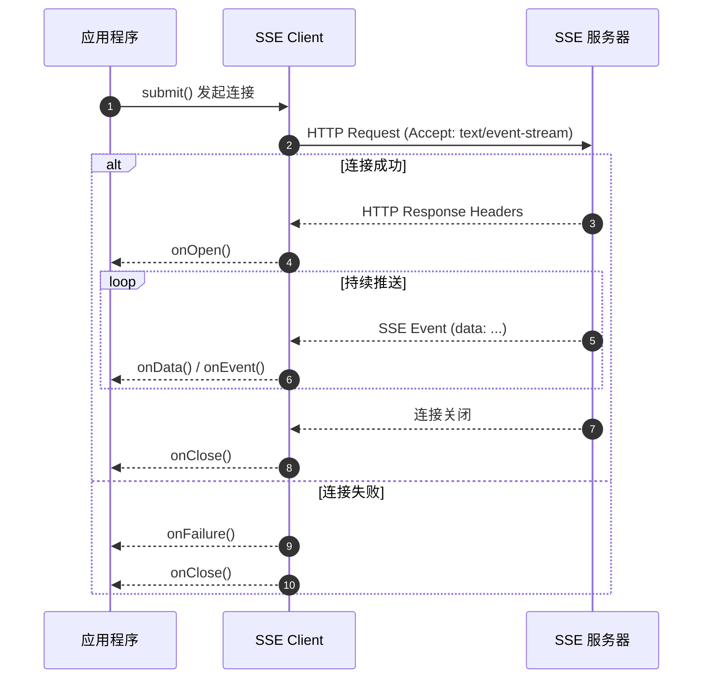

import { Aside, Tabs, TabItem } from '@astrojs/starlight/components';

SSE 客户端基于 HttpClient 构建，用于接收服务端推送的流式事件，适合实时通知、日志流、监控指标等场景。

## 创建与配置

### 基础连接

使用 Feat 工厂方法创建 SSE 连接：

```java
import tech.smartboot.feat.Feat;

Feat.httpClient("http://localhost:8080")
        .get("/events")
        .onSSE(sse -> sse
                .onOpen(response -> {
                    System.out.println("连接成功，状态码: " + response.statusCode());
                })
                .onData(event -> {
                    System.out.println("收到事件: " + event.getData());
                }))
        .onFailure(error -> {
            System.err.println("连接失败: " + error.getMessage());
        })
        .submit();
```

<Aside type="caution">
SSE 端点 URL 必须包含协议头（`http://` 或 `https://`），否则将抛出异常。
</Aside>

### 带配置的连接

```java
Feat.httpClient("http://localhost:8080", options -> {
    options.debug(true)
           .connectTimeout(5000)
           .idleTimeout(30000);
})
        .get("/events")
        .onSSE(sse -> sse.onData(event -> System.out.println(event.getData())))
        .submit();
```

## 事件处理

### 基本事件监听

SSE 事件对象包含三个核心字段：

```java
public interface SseEvent {
    String getId();      // 事件 ID（用于断点续传）
    String getType();    // 事件类型（event 字段）
    String getData();    // 事件数据（data 字段）
}
```

### 处理命名事件

SSE 支持通过 `event:` 字段定义事件类型，客户端可以为不同类型注册不同处理器：

```java
Feat.httpClient("http://localhost:8080")
        .get("/events")
        .onSSE(sse -> sse
                .onOpen(response -> System.out.println("已连接"))
                // 默认事件处理器
                .onData(event -> {
                    System.out.println("默认事件: " + event.getData());
                })
                // 命名事件处理器
                .onEvent("message", event -> {
                    System.out.println("消息事件: " + event.getData());
                })
                .onEvent("notification", event -> {
                    System.out.println("通知事件: " + event.getData());
                }))
        .submit();
```

<Aside type="note">
如果收到未注册的事件类型，会落入默认的 `onData` 处理器。
</Aside>

### 回调触发顺序

以下泳道图展示了 SSE 连接过程中各回调的触发时机：



**回调触发顺序说明：**

1. **发起连接** - 调用 `submit()` 后，客户端发送 HTTP 请求
2. **连接成功** - 收到响应头时触发 `onOpen()`，此时可以获取状态码和响应头
3. **接收事件** - 服务端推送事件时触发 `onData()` 或对应的 `onEvent()`
4. **连接失败** - 网络异常或超时等情况下触发 `onFailure()`
5. **连接关闭** - 无论成功或失败，连接关闭时都会触发 `onClose()`

<Aside type="tip">
`onClose()` 是**最终回调**，无论连接成功还是失败都会执行，适合用于资源清理操作。
</Aside>

## 请求配置

### 添加请求头

```java
import tech.smartboot.feat.core.common.HeaderName;

Feat.httpClient("http://localhost:8080")
        .get("/events")
        .header(header -> header
                .set(HeaderName.AUTHORIZATION, "Bearer token123")
                .add("Last-Event-ID", "event-100"))  // 断点续传
        .onSSE(sse -> sse.onData(event -> {
            System.out.println(event.getData());
        }))
        .submit();
```

### 常用 SSE 请求头

| 请求头 | 说明 |
|-------|------|
| `Accept: text/event-stream` | 必需，声明接受 SSE 格式 |
| `Last-Event-ID` | 可选，断点续传时指定上次接收的事件 ID |
| `Authorization` | 可选，认证令牌 |
| `Cache-Control: no-cache` | 可选，禁用缓存 |

## 连接管理

### 手动关闭连接

SSE 是长连接，程序不会自动退出，需要显式关闭。

```java
import tech.smartboot.feat.core.client.HttpRest;

HttpRest rest = Feat.httpClient("http://localhost:8080")
        .get("/events")
        .onSSE(sse -> sse.onData(event -> {
            System.out.println("收到: " + event.getData());
            // 收到特定消息后关闭
            if ("complete".equals(event.getData())) {
                rest.close();
            }
        }))
        .onFailure(Throwable::printStackTrace);

rest.submit();

// 或者定时关闭
// Thread.sleep(30000);
// rest.close();
```


## 完整示例

### 本地测试服务端

```java title="SimpleSseServer.java"
import tech.smartboot.feat.Feat;
import tech.smartboot.feat.core.server.upgrade.sse.SSEUpgrade;
import tech.smartboot.feat.core.server.upgrade.sse.SseEmitter;

import java.io.IOException;
import java.util.concurrent.Executors;
import java.util.concurrent.TimeUnit;

public class SimpleSseServer {
    public static void main(String[] args) {
        Feat.httpServer().httpHandler(req -> {
            if (!"/events".equals(req.getRequestURI())) {
                req.getResponse().write("use /events");
                return;
            }
            
            req.upgrade(new SSEUpgrade() {
                @Override
                public void onOpen(SseEmitter emitter) throws IOException {
                    emitter.send(SseEmitter.event()
                            .name("connected")
                            .data("Welcome to SSE"));
                    
                    // 定时发送消息
                    Executors.newSingleThreadScheduledExecutor().scheduleAtFixedRate(() -> {
                        try {
                            emitter.send(SseEmitter.event()
                                    .name("message")
                                    .id(String.valueOf(System.currentTimeMillis()))
                                    .data("Server time: " + System.currentTimeMillis()));
                        } catch (IOException e) {
                            e.printStackTrace();
                        }
                    }, 1, 1, TimeUnit.SECONDS);
                }
            });
        }).listen(8080);
    }
}
```

### 客户端完整代码

```java title="SseClientDemo.java"
import tech.smartboot.feat.Feat;
import tech.smartboot.feat.core.client.HttpRest;
import tech.smartboot.feat.core.common.HeaderName;

public class SseClientDemo {
    public static void main(String[] args) throws Exception {
        HttpRest rest = Feat.httpClient("http://localhost:8080")
                .get("/events")
                .header(header -> header
                        .set(HeaderName.ACCEPT, "text/event-stream")
                        .set(HeaderName.CACHE_CONTROL, "no-cache"))
                .onSSE(sse -> sse
                        .onOpen(response -> {
                            System.out.println("连接成功!");
                        })
                        .onEvent("connected", event -> {
                            System.out.println("[连接事件] " + event.getData());
                        })
                        .onEvent("message", event -> {
                            System.out.println("[消息事件] ID: " + event.getId() + ", Data: " + event.getData());
                        })
                        .onData(event -> {
                            System.out.println("[默认处理] Type: " + event.getType());
                        }))
                .onFailure(error -> {
                    System.err.println("连接失败: " + error.getMessage());
                });
        
        rest.submit();
        
        // 保持程序运行
        Thread.sleep(60000);
        rest.close();
    }
}
```

