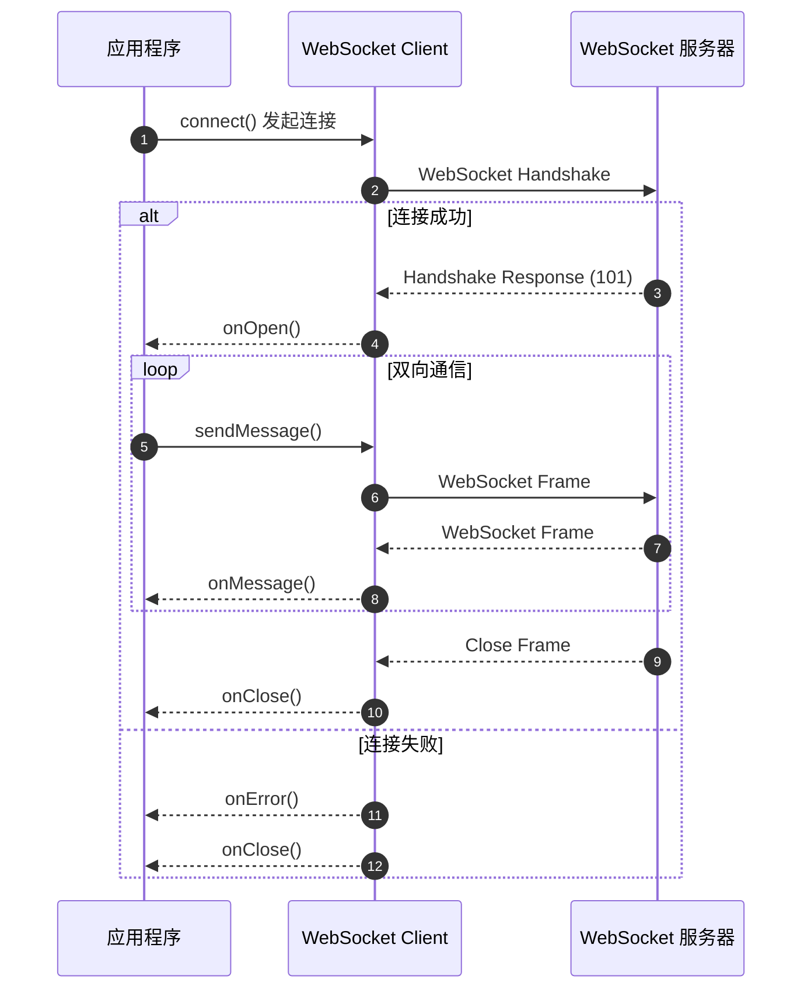

import { Aside, Tabs, TabItem } from '@astrojs/starlight/components';

这篇指南的目标：让你在 5 分钟内掌握 Feat WebSocket 客户端的核心用法，从简单的连接到复杂的消息处理和生命周期管理。

Feat WebSocket 客户端采用异步回调模型，适合高并发场景。如果你正在寻找一个轻量级、高性能的 WebSocket 客户端替代方案，这篇文档就是为你准备的。

## 创建与配置

### 创建客户端

使用 Feat 工厂方法创建 WebSocket 连接：

```java
import tech.smartboot.feat.Feat;
import tech.smartboot.feat.core.client.WebSocketListener;

Feat.websocket("ws://localhost:8080/chat", new WebSocketListener() {
    @Override
    public void onOpen(WebSocketClient client, WebSocketResponse response) {
        System.out.println("连接已建立");
    }
    
    @Override
    public void onMessage(WebSocketClient client, String message) {
        System.out.println("收到消息: " + message);
    }
});
```

<Aside type="caution">
WebSocket URL 必须使用 `ws://`（非加密）或 `wss://`（加密）协议头。
</Aside>

### 带配置的连接

```java
WebSocketClient client = new WebSocketClient("ws://localhost:8080/chat");
client.options()
        .debug(true)
        .connectTimeout(5000)
        .readBufferSize(8192);

client.connect(new WebSocketListener() {
    @Override
    public void onOpen(WebSocketClient client, WebSocketResponse response) {
        System.out.println("连接成功!");
    }
    
    @Override
    public void onMessage(WebSocketClient client, String message) {
        System.out.println("收到: " + message);
    }
    
    @Override
    public void onClose(WebSocketClient client, WebSocketResponse response, CloseReason reason) {
        System.out.println("连接关闭: " + reason);
    }
    
    @Override
    public void onError(WebSocketClient client, Throwable error) {
        error.printStackTrace();
    }
});
```

### 连接配置

```java
WebSocketClient client = new WebSocketClient("ws://localhost:8080");

client.options()
        .debug(true)                    // 开启调试日志
        .connectTimeout(5000)          // 连接超时（毫秒）
        .readTimeout(30000)            // 读取超时（毫秒）
        .readBufferSize(8192)          // 读缓冲区大小
        .writeBufferSize(8192)         // 写缓冲区大小
        .maxFrameSize(65536);          // 最大帧大小
```

### 自定义请求头

```java
import tech.smartboot.feat.core.common.HeaderName;

WebSocketClient client = new WebSocketClient("ws://localhost:8080");

client.header(header -> header
        .set(HeaderName.USER_AGENT, "Feat-WebSocket-Client")
        .set(HeaderName.AUTHORIZATION, "Bearer token123"));

client.connect(listener);
```

## 消息收发

### 发送消息

```java
@Override
public void onOpen(WebSocketClient client, WebSocketResponse response) {
    try {
        // 发送文本消息
        client.sendMessage("Hello, WebSocket!");
        client.sendMessage("{\"type\":\"chat\",\"content\":\"hello\"}");
        
        // 发送二进制消息
        byte[] data = "Binary data".getBytes(StandardCharsets.UTF_8);
        client.sendBinary(data);
    } catch (IOException e) {
        e.printStackTrace();
    }
}
```

### 接收消息

```java
@Override
public void onMessage(WebSocketClient client, String message) {
    // 处理文本消息
    System.out.println("收到文本: " + message);
}

@Override
public void onMessage(WebSocketClient client, byte[] message) {
    // 处理二进制消息
    System.out.println("收到二进制: " + message.length + " bytes");
}
```

## 生命周期管理

### 回调触发顺序

以下泳道图展示了 WebSocket 连接过程中各回调的触发时机：



**回调触发顺序说明：**

1. **发起连接** - 调用 `connect()` 后，客户端发送 WebSocket 握手请求
2. **连接成功** - 握手成功（HTTP 101）时触发 `onOpen()`，此时可以开始发送消息
3. **接收消息** - 收到服务端消息时触发 `onMessage()`
4. **连接失败** - 握手失败或网络异常时触发 `onError()`
5. **连接关闭** - 无论成功或失败，连接关闭时都会触发 `onClose()`

<Aside type="tip">
`onClose()` 是**最终回调**，无论连接成功还是失败都会执行，适合用于资源清理操作。
</Aside>

### 完整生命周期示例

```java
import tech.smartboot.feat.core.client.WebSocketClient;
import tech.smartboot.feat.core.client.WebSocketListener;
import tech.smartboot.feat.core.common.codec.websocket.CloseReason;

public class ChatClient {
    private WebSocketClient client;
    
    public void connect(String url) throws IOException {
        client = new WebSocketClient(url);
        client.options().debug(true).connectTimeout(5000);
        
        client.connect(new WebSocketListener() {
            @Override
            public void onOpen(WebSocketClient client, WebSocketResponse response) {
                System.out.println("[连接成功] " + response.getStatusCode());
                try {
                    client.sendMessage("{\"type\":\"join\",\"room\":\"lobby\"}");
                } catch (IOException e) {
                    e.printStackTrace();
                }
            }
            
            @Override
            public void onMessage(WebSocketClient client, String message) {
                System.out.println("[收到消息] " + message);
            }
            
            @Override
            public void onClose(WebSocketClient client, WebSocketResponse response, CloseReason reason) {
                System.out.println("[连接关闭] Code: " + reason.getCode());
            }
            
            @Override
            public void onError(WebSocketClient client, Throwable error) {
                System.err.println("[错误] " + error.getMessage());
            }
        });
    }
    
    public void send(String message) throws IOException {
        if (client != null && client.isConnected()) {
            client.sendMessage(message);
        }
    }
    
    public void close() throws IOException {
        if (client != null) {
            client.close(1000, "Normal closure");
        }
    }
}
```

## 连接管理

### 手动关闭连接

WebSocket 是长连接，程序不会自动退出，需要显式关闭。

```java
// 正常关闭
client.close(1000, "Normal closure");

// 强制关闭
client.close();
```

### 实现重连

```java
public void onClose(WebSocketClient client, WebSocketResponse response, CloseReason reason) {
    if (reconnectAttempts < MAX_RECONNECT) {
        reconnectAttempts++;
        System.out.println("连接断开，尝试重连 (" + reconnectAttempts + "/" + MAX_RECONNECT + ")");
        try {
            Thread.sleep(3000);
            doConnect();  // 重新建立连接
        } catch (Exception e) {
            e.printStackTrace();
        }
    }
}
```

## 关闭码说明

| 代码 | 名称 | 说明 |
|-----|------|------|
| 1000 | Normal Closure | 正常关闭 |
| 1001 | Going Away | 服务端或客户端离开 |
| 1002 | Protocol Error | 协议错误 |
| 1006 | Abnormal Closure | 异常关闭（连接意外断开） |
| 1009 | Message Too Big | 消息太大 |
| 1011 | Internal Error | 服务端内部错误 |

## 完整示例

### 回声服务端

```java title="EchoWebSocketServer.java"
import tech.smartboot.feat.Feat;
import tech.smartboot.feat.core.server.WebSocketRequest;
import tech.smartboot.feat.core.server.WebSocketResponse;
import tech.smartboot.feat.core.server.upgrade.websocket.WebSocketUpgrade;

public class EchoWebSocketServer {
    public static void main(String[] args) {
        Feat.httpServer().httpHandler(req -> {
            req.upgrade(new WebSocketUpgrade(65536) {
                @Override
                public void handleTextMessage(WebSocketRequest request, WebSocketResponse response, String data) {
                    System.out.println("收到: " + data);
                    response.sendTextMessage("Echo: " + data);
                }
            });
        }).listen(8080);
    }
}
```

### 交互式客户端

```java title="InteractiveWebSocketClient.java"
import tech.smartboot.feat.core.client.WebSocketClient;
import tech.smartboot.feat.core.client.WebSocketListener;
import tech.smartboot.feat.core.common.codec.websocket.CloseReason;

import java.io.BufferedReader;
import java.io.InputStreamReader;

public class InteractiveWebSocketClient {
    private static WebSocketClient client;
    
    public static void main(String[] args) throws Exception {
        client = new WebSocketClient("ws://localhost:8080");
        client.options().debug(true);
        
        client.connect(new WebSocketListener() {
            @Override
            public void onOpen(WebSocketClient client, WebSocketResponse response) {
                System.out.println("已连接到服务器，输入消息（输入 'exit' 退出）：");
            }
            
            @Override
            public void onMessage(WebSocketClient client, String message) {
                System.out.println("服务器: " + message);
            }
            
            @Override
            public void onClose(WebSocketClient client, WebSocketResponse response, CloseReason reason) {
                System.out.println("连接已关闭: " + reason);
            }
        });
        
        // 读取用户输入
        BufferedReader reader = new BufferedReader(new InputStreamReader(System.in));
        String line;
        while ((line = reader.readLine()) != null) {
            if ("exit".equalsIgnoreCase(line)) {
                client.close(1000, "User requested");
                break;
            }
            client.sendMessage(line);
        }
    }
}
```

## 常见问题

**连接失败**

检查清单：
1. URL 是否为 `ws://` 或 `wss://`
2. 服务端是否支持 WebSocket 升级
3. 端口和路径是否正确

**`sendMessage` 抛出 IOException**

连接未就绪或已断开。只在 `onOpen` 回调后发送消息：
```java
if (client.isConnected()) {
    client.sendMessage("data");
}
```

**程序不退出**

WebSocket 是长连接，需要手动关闭：
```java
// 正常关闭
client.close(1000, "Normal closure");

// 强制关闭
client.close();
```

## 适用场景

### 什么时候用 Feat WebSocket 客户端

Feat WebSocket 客户端适合以下场景：

- **高并发服务端** - 异步非阻塞模型，不会阻塞线程
- **微服务间通信** - 轻量级，启动快，内存占用低
- **需要双向实时通信** - 聊天、协作编辑、实时游戏等
- **嵌入式场景** - 不依赖 Spring 等重量级框架

### 什么时候不该用

以下情况你可能需要考虑其他方案：

- **只需要服务端单向推送** → 考虑使用 [SSE 客户端](/feat/client/sse_client/)
- **简单的请求-响应场景** → 考虑使用 [HTTP 客户端](/feat/client/http_client/)
- **需要完整的 Reactive Streams 支持**（Mono/Flux）→ 考虑 WebFlux 的 WebClient
- **团队已深度使用 Spring** 且需要无缝集成 → Spring 生态的 WebSocket 集成更好

<Aside type="tip">
Feat WebSocket 客户端的设计哲学是**简单高效**。相比其他复杂的 WebSocket 库，Feat 使用标准的回调模型，学习成本更低，更容易上手。如果你需要 WebSocket 客户端但不想引入复杂的依赖，Feat 是一个很好的选择。
</Aside>

