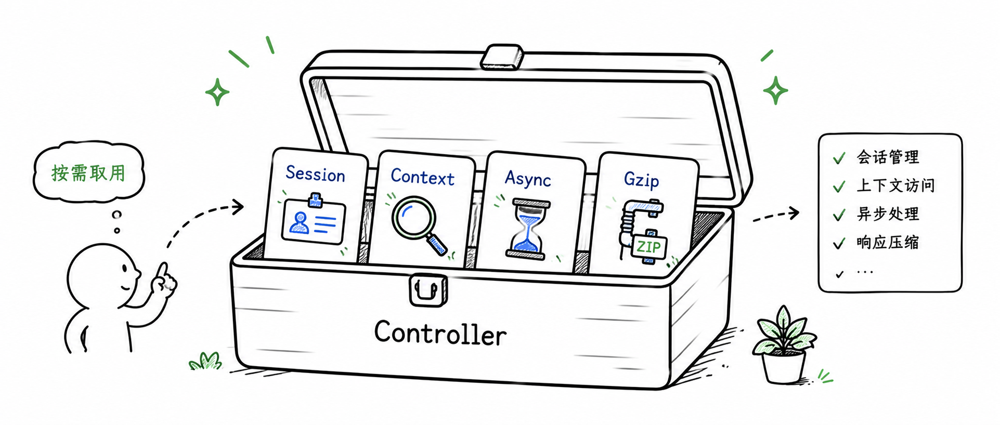

import { Aside, Tabs, TabItem } from '@astrojs/starlight/components'

Feat Cloud 的控制器写起来和 Spring Boot 很像：一个类加 `@Controller`，方法加 `@RequestMapping`。但底层实现不同：路由映射在编译期生成，运行时不再反射扫描。

这一章集中讲 HTTP 请求进入 Controller 的完整过程：URL 如何映射到方法，参数从哪里来，请求体如何绑定成对象，以及少数需要直接接触运行时上下文的能力。


## 第一个控制器

下面是一个最小但完整的控制器。它只做一件事：访问 `http://localhost:8080/users/hello` 时返回一段文本。

```java title="UserController.java"
package com.example.controller;

import tech.smartboot.feat.cloud.annotation.Controller;
import tech.smartboot.feat.cloud.annotation.RequestMapping;
import tech.smartboot.feat.cloud.annotation.RequestMethod;

@Controller("users")
public class UserController {

    @RequestMapping(value = "/hello", method = RequestMethod.GET)
    public String hello() {
        return "hello controller";
    }
}
```

启动应用后，控制台会输出路由注册信息：

```text title="路由注册日志"
Feat Router:
 |-> /users/hello ==> UserController@hello
http://0.0.0.0:8080/
```

验证：

```shell title="curl 验证"
curl http://localhost:8080/users/hello
```

```text title="响应结果"
hello controller
```

## 基础路径

`@Controller` 的 `value` 属性定义该控制器下所有方法的 URL 前缀。

| 控制器路径 | 方法路径 | 完整 URL |
|-----------|---------|---------|
| `users` | `/hello` | `/users/hello` |
| `api/v1` | `/users` | `/api/v1/users` |
| （空） | `/hello` | `/hello` |

基础路径为空时，方法路径就是完整 URL。

## 查询参数

使用 `@Param` 注解从 URL 查询字符串提取参数值。

```java title="UserController.java"
@RequestMapping(value = "/search", method = RequestMethod.GET)
public String search(@Param("keyword") String keyword,
                     @Param("page") Integer page) {
    int currentPage = page == null ? 1 : page;
    return "搜索: " + keyword + ", 页码: " + currentPage;
}
```

<Tabs>
  <TabItem label="请求">
    ```shell title="curl 请求"
    curl "http://localhost:8080/users/search?keyword=feat&page=1"
    ```
  </TabItem>
  <TabItem label="响应">
    ```text title="响应结果"
    搜索: feat, 页码: 1
    ```
  </TabItem>
</Tabs>

<Aside type="caution">
可能缺失的查询参数建议声明为包装类型，例如 `Integer`、`Long`、`Boolean`。如果用 `int` 这类基本类型，缺失参数在拆箱时可能触发 `NullPointerException`。
</Aside>

## 路径参数

使用 `@PathParam` 注解从 URL 路径提取变量值。

```java title="UserController.java"
@RequestMapping(value = "/:userId", method = RequestMethod.GET)
public String getUser(@PathParam("userId") String userId) {
    return "用户ID: " + userId;
}
```

```shell title="curl 请求"
curl http://localhost:8080/users/12345
```

Feat Cloud 支持两种路径参数写法：

- 冒号形式：`/:userId`
- 花括号形式：`/{userId}`

两种写法功能等价，团队内部统一即可。如果团队来自前端路由或 Feat Core 路由体系，`:id` 会更自然；如果团队长期使用 Spring MVC，`{id}` 往往更容易迁移。

## JSON 请求体

创建和更新资源时，参数通常不会继续塞在 URL 里，而是放进 JSON 请求体。Controller 方法可以直接声明一个自定义 POJO 参数，不需要额外注解。

```java title="User.java"
public class User {
    private String username;
    private String password;
    private String role;

    public String getUsername() { return username; }
    public void setUsername(String username) { this.username = username; }

    public String getPassword() { return password; }
    public void setPassword(String password) { this.password = password; }

    public String getRole() { return role; }
    public void setRole(String role) { this.role = role; }
}
```

```java title="UserController.java"
@RequestMapping(value = "/", method = RequestMethod.POST)
public String create(User user) {
    return "created user: " + user.getUsername();
}
```

请求时带上 `Content-Type: application/json`：

```shell title="curl 请求"
curl -X POST http://localhost:8080/users/ \
  -H 'Content-Type: application/json' \
  -d '{"username":"Bob","password":"123456","role":"admin"}'
```

进入正式业务接口后，常见做法是用路径表达资源位置，用请求体承载要创建或更新的数据。

## HTTP 方法

`RequestMethod` 覆盖常见 HTTP 方法：

```java title="RequestMethod.java"
public enum RequestMethod {
    GET, HEAD, POST, PUT, PATCH, DELETE, OPTIONS, TRACE
}
```

为同一路径配置不同方法：

```java title="UserController.java"
@RequestMapping(value = "/", method = RequestMethod.GET)
public String list() {
    return "list all users";
}

@RequestMapping(value = "/", method = RequestMethod.POST)
public String create(User user) {
    return "created user: " + user.getUsername();
}

@RequestMapping(value = "/:id", method = RequestMethod.GET)
public String get(@PathParam("id") String id) {
    return "get user: " + id;
}

@RequestMapping(value = "/:id", method = RequestMethod.PUT)
public String update(@PathParam("id") String id, User user) {
    return "updated user " + id + " to " + user.getUsername();
}

@RequestMapping(value = "/:id", method = RequestMethod.DELETE)
public String delete(@PathParam("id") String id) {
    return "deleted user: " + id;
}
```

## 运行时能力

大部分接口只需要 `@RequestMapping`、`@Param`、`@PathParam` 和请求体绑定。遇到下面这些场景时，再使用更靠近运行时的能力。

### 注入 Context

需要直接读取请求头、设置响应头或访问完整 URI 时，注入 `Context`。

```java title="UserController.java"
import tech.smartboot.feat.router.Context;

@RequestMapping(value = "/context", method = RequestMethod.GET)
public String context(Context context) {
    String uri = context.Request.getRequestURI();
    String method = context.Request.getMethod();
    return "URI: " + uri + ", Method: " + method;
}
```

### 异步响应

当方法内部需要调用远程服务或执行耗时操作时，可以返回 `AsyncResponse`，避免阻塞 Feat 的工作线程。

```java title="UserController.java"
import tech.smartboot.feat.cloud.AsyncResponse;
import tech.smartboot.feat.cloud.RestResult;
import java.util.concurrent.CompletableFuture;

@RequestMapping(value = "/async", method = RequestMethod.GET)
public AsyncResponse async() {
    AsyncResponse response = new AsyncResponse();

    CompletableFuture.runAsync(() -> {
        try {
            Thread.sleep(1000);
            response.complete(RestResult.ok("异步响应完成"));
        } catch (InterruptedException e) {
            response.complete(RestResult.fail(e.getMessage()));
        }
    });

    return response;
}
```

生产环境请把 `CompletableFuture.runAsync` 换成自定义线程池，避免占满 common pool。

### Gzip 压缩

在 `@Controller` 上开启 Gzip，可以压缩返回的大段文本或 JSON。默认阈值是 256 字节，低于该值的响应不会压缩。

```java title="ApiController.java"
import tech.smartboot.feat.cloud.annotation.Controller;

@Controller(
    value = "api",
    gzip = true,
    gzipThreshold = 256
)
public class ApiController {

    @RequestMapping(value = "/large", method = RequestMethod.GET)
    public String largeResponse() {
        return "这是一段很长的文本内容，重复多次使其超过 256 字节。".repeat(10);
    }
}
```

可以用带 `Accept-Encoding: gzip` 的请求验证压缩效果：

```shell title="Gzip 请求"
curl -H "Accept-Encoding: gzip" http://localhost:8080/api/large --compressed
```

## 路由映射是怎么发生的

传统框架在运行时才去扫描类路径、解析注解、生成代理。Feat Cloud 在编译期就做完了这些事。

当你运行 `mvn compile` 时，`feat-cloud-starter` 中的注解处理器会：

1. 扫描 `@Controller` 类
2. 解析 `@RequestMapping` 的路径和方法
3. 生成 `CloudService` 实现类
4. 把路由注册到 `Router`

带来的直接好处：调用开销接近直接方法调用、内存占用更低、启动更快，也更容易构建 Native Image。
