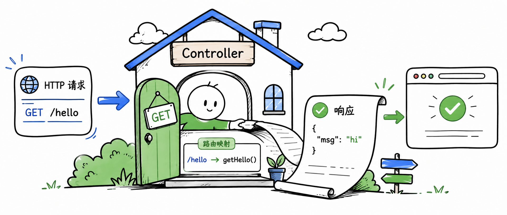

import { Aside } from '@astrojs/starlight/components'

Feat Cloud 的控制器写起来和 Spring Boot 很像：一个类加 `@Controller`，方法加 `@RequestMapping`。但底层实现不同：路由映射在编译期生成，运行时不再反射扫描。

这一章先讲控制器如何组织 URL。请求参数、请求体和统一响应会在后面的章节展开。

## 第一个控制器

下面是一个最小但完整的控制器。它只做一件事：访问 `http://localhost:8080/users/hello` 时返回一段文本。

```java title="UserController.java"
package com.example.controller;

import tech.smartboot.feat.cloud.annotation.Controller;
import tech.smartboot.feat.cloud.annotation.RequestMapping;
import tech.smartboot.feat.cloud.annotation.RequestMethod;

@Controller("users")
public class UserController {

    @RequestMapping(value = "/hello", method = RequestMethod.GET)
    public String hello() {
        return "hello controller";
    }
}
```

启动应用后，控制台会输出路由注册信息：

```text title="路由注册日志"
Feat Router:
 |-> /users/hello ==> UserController@hello
http://0.0.0.0:8080/
```

访问 `http://localhost:8080/users/hello`：

```shell title="curl 验证"
curl http://localhost:8080/users/hello
```

返回：

```text title="响应结果"
hello controller
```

## 基础路径

`@Controller` 的 `value` 属性定义该控制器下所有方法的 URL 前缀。

| 控制器路径 | 方法路径 | 完整 URL |
|-----------|---------|---------|
| `users` | `/hello` | `/users/hello` |
| `api/v1` | `/users` | `/api/v1/users` |
| （空） | `/hello` | `/hello` |

基础路径为空时，方法路径就是完整 URL。

## 简单返回值

Feat Cloud 会根据返回类型决定响应格式。这里先看最常见的两类：

| 返回类型 | 输出格式 |
|---------|---------|
| `String` | 直接输出为纯文本 |
| 对象或集合 | 自动序列化为 JSON |

```java title="UserController.java"
import java.util.HashMap;
import java.util.Map;

@RequestMapping(value = "/info", method = RequestMethod.GET)
public Map<String, Object> info() {
    Map<String, Object> data = new HashMap<>();
    data.put("framework", "Feat");
    data.put("version", "2.1");
    return data;
}
```

访问 `/users/info` 会返回 JSON：

```text title="响应结果"
{"framework":"Feat","version":"2.1"}
```

<Aside type="tip">
这里的 JSON 序列化由 Feat Cloud 在编译期生成，不需要你写 `ObjectMapper` 或引入额外的 JSON 库。
</Aside>

## 路由映射是怎么发生的

传统框架在运行时才去扫描类路径、解析注解、生成代理。Feat Cloud 在编译期就做完了这些事。

当你运行 `mvn compile` 时，`feat-cloud-starter` 中的注解处理器会：

1. 扫描 `@Controller` 类
2. 解析 `@RequestMapping` 的路径和方法
3. 生成 `CloudService` 实现类
4. 把路由注册到 `Router`

带来的直接好处：调用开销接近直接方法调用、内存占用更低、启动更快，也更容易构建 Native Image。

## 继续扩展这个控制器

给 `UserController` 添加一个新接口，访问 `http://localhost:8080/users/time` 时返回当前时间字符串。

```java title="UserController.java"
@RequestMapping(value = "/time", method = RequestMethod.GET)
public String time() {
    return java.time.LocalDateTime.now().toString();
}
```

验证：

```shell title="curl 验证"
curl http://localhost:8080/users/time
```

当你能稳定新增这样的接口，就可以继续进入请求映射与参数绑定：让同一个 Controller 不只是返回固定内容，而是能从 URL、路径和请求体里接收输入。
