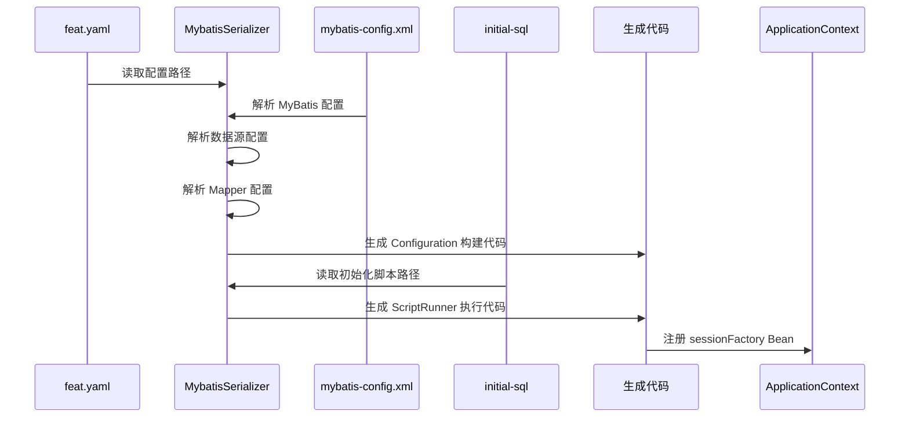

import { Aside } from '@astrojs/starlight/components'
import CheckAuthorize from '../../../components/CheckAuthorize.astro'

<CheckAuthorize/>

本章介绍如何在 Feat Cloud 中集成 MyBatis，实现数据持久化操作。

<Aside type="tip">
本章假设你已熟悉 MyBatis 基础用法。如需了解 Feat Cloud Controller 开发，请先阅读 [Controller 开发实践](/feat/cloud/controller/)。
</Aside>

有关完整示例，请参见 [Gitee 仓库中的 MyBatis 示例](https://gitee.com/smartboot/feat/tree/master/demo/mybatis)。

---

## 添加依赖

在 `pom.xml` 中添加 MyBatis 和数据库驱动依赖：

```xml
<dependency>
    <groupId>tech.smartboot.feat</groupId>
    <artifactId>feat-cloud-starter</artifactId>
    <version>1.5.3</version><!--以当前最新版本号为准-->
</dependency>

<dependency>
    <groupId>org.mybatis</groupId>
    <artifactId>mybatis</artifactId>
    <version>3.5.15</version>
</dependency>

<!-- 使用 H2 内存数据库演示 -->
<dependency>
    <groupId>com.h2database</groupId>
    <artifactId>h2</artifactId>
    <version>2.2.224</version>
</dependency>
```

---

## 配置 MyBatis

### feat.yaml 配置

在 `src/main/resources` 目录下创建 `feat.yaml`：

```yaml
feat:
  mybatis:
    path: mybatis/mybatis-config.xml
    initial-sql: mybatis/ddl/schema.sql
```

**配置项说明：**

| 配置项 | 必填 | 说明 |
|--------|------|------|
| `feat.mybatis.path` | 是 | MyBatis XML 配置文件路径，相对于 `src/main/resources` |
| `feat.mybatis.initial-sql` | 否 | 数据库初始化 SQL 脚本路径，应用启动时自动执行 |

<Aside type="tip">
配置 `initial-sql` 后，Feat Cloud 会在应用启动时自动执行 SQL 初始化脚本，无需手动编写初始化代码。
</Aside>

### MyBatis 配置文件

在 `src/main/resources/mybatis` 目录下创建 `mybatis-config.xml`：

```xml title="mybatis-config.xml"
<?xml version="1.0" encoding="UTF-8"?>
<!DOCTYPE configuration
        PUBLIC "-//mybatis.org//DTD Config 3.0//EN"
        "https://mybatis.org/dtd/mybatis-3-config.dtd">
<configuration>
    <settings>
        <!-- 开启 SQL 日志输出 -->
        <setting name="logImpl" value="STDOUT_LOGGING"/>
    </settings>
    <environments default="h2_mem">
        <environment id="h2_mem">
            <transactionManager type="JDBC"/>
            <dataSource type="POOLED">
                <property name="driver" value="org.h2.Driver"/>
                <property name="url" value="jdbc:h2:mem:feat-demo;NON_KEYWORDS=value;mode=mysql;"/>
            </dataSource>
        </environment>
    </environments>
    <mappers>
        <package name="tech.smartboot.feat.demo.mybatis.mapper"/>
    </mappers>
</configuration>
```

<Aside type="caution">
当前仅支持 `POOLED` 数据源类型和 `JDBC` 事务管理器。
</Aside>

### 数据库初始化脚本

在 `src/main/resources/mybatis/ddl` 目录下创建 `schema.sql`：

```sql title="schema.sql"
-- 用户信息表
CREATE TABLE IF NOT EXISTS user_info
(
    username    varchar(32)  NOT NULL COMMENT '用户名',
    password    varchar(128) NOT NULL COMMENT '密码',
    `desc`      varchar(256) COMMENT '备注',
    role        varchar(32) COMMENT '角色',
    create_time timestamp DEFAULT CURRENT_TIMESTAMP COMMENT '创建时间',
    edit_time   timestamp DEFAULT CURRENT_TIMESTAMP ON UPDATE CURRENT_TIMESTAMP COMMENT '更新时间',
    INDEX       idx_user_password (username, password),
    PRIMARY KEY (username)
);

-- 初始数据
INSERT IGNORE INTO user_info(username, password, role, `desc`)
VALUES ('feat', 'feat', 'admin', '超级账户');

INSERT IGNORE INTO user_info(username, password, role, `desc`)
VALUES ('admin', 'admin123', 'admin', '管理员用户');
```

---

## 创建应用启动类

配置完成后，只需创建一个简单的启动类：

```java title="Bootstrap.java"
@Bean
public class Bootstrap {
    public static void main(String[] args) {
        FeatCloud.cloudServer().listen();
    }
}
```

<Aside type="tip">
Feat Cloud 在编译期自动解析 `feat.yaml` 配置，生成 `SqlSessionFactory` Bean。生成的 Bean 名称 为 `sessionFactory`，可直接通过 `@Autowired` 注入使用。
</Aside>

---

## 多数据源配置

当需要连接多个数据库时，可以通过 `@Bean` 注解手动定义多个 `SqlSessionFactory`：

```java title="Bootstrap.java"
@Bean
public class Bootstrap {

    // 主数据源
    @Bean
    public SqlSessionFactory primarySessionFactory() throws IOException {
        InputStream inputStream = Resources.getResourceAsStream("mybatis/mybatis-config-primary.xml");
        SqlSessionFactory sessionFactory = new SqlSessionFactoryBuilder().build(inputStream);

        // 执行主数据源初始化脚本
        ScriptRunner runner = new ScriptRunner(sessionFactory.openSession().getConnection());
        runner.setLogWriter(null);
        runner.runScript(Resources.getResourceAsReader("mybatis/ddl/schema-primary.sql"));

        return sessionFactory;
    }

    // 从数据源
    @Bean
    public SqlSessionFactory secondarySessionFactory() throws IOException {
        InputStream inputStream = Resources.getResourceAsStream("mybatis/mybatis-config-secondary.xml");
        SqlSessionFactory sessionFactory = new SqlSessionFactoryBuilder().build(inputStream);

        // 执行从数据源初始化脚本
        ScriptRunner runner = new ScriptRunner(sessionFactory.openSession().getConnection());
        runner.setLogWriter(null);
        runner.runScript(Resources.getResourceAsReader("mybatis/ddl/schema-secondary.sql"));

        return sessionFactory;
    }

    public static void main(String[] args) {
        FeatCloud.cloudServer().listen();
    }
}
```

在 Service 中通过指定 Bean 名称注入对应的 `SqlSessionFactory`：

```java title="UserService.java"
@Bean
public class UserService {

    @Autowired("primarySessionFactory")
    private SqlSessionFactory primarySessionFactory;

    @Autowired("secondarySessionFactory")
    private SqlSessionFactory secondarySessionFactory;

    public User findFromPrimary(String username) {
        SqlSession session = primarySessionFactory.openSession();
        UserMapper mapper = session.getMapper(UserMapper.class);
        return mapper.selectByUsername(username);
    }

    public User findFromSecondary(String username) {
        SqlSession session = secondarySessionFactory.openSession();
        UserMapper mapper = session.getMapper(UserMapper.class);
        return mapper.selectByUsername(username);
    }
}
```

<Aside type="caution">
使用多数据源时，不要在 `feat.yaml` 中配置 `feat.mybatis.path`，避免与手动定义的 Bean 产生冲突。
</Aside>

---

## 定义实体类

创建与数据库表对应的实体类：

```java title="User.java"
public class User {
    private String username;
    private String password;
    private String desc;
    private String role;
    private Date createTime;
    private Date editTime;

    // 必须有无参构造方法
    public User() {}

    public User(String username, String password, String desc, String role) {
        this.username = username;
        this.password = password;
        this.desc = desc;
        this.role = role;
    }

    // Getter 和 Setter 方法
    public String getUsername() { return username; }
    public void setUsername(String username) { this.username = username; }
    public String getPassword() { return password; }
    public void setPassword(String password) { this.password = password; }
    public String getDesc() { return desc; }
    public void setDesc(String desc) { this.desc = desc; }
    public String getRole() { return role; }
    public void setRole(String role) { this.role = role; }
    public Date getCreateTime() { return createTime; }
    public void setCreateTime(Date createTime) { this.createTime = createTime; }
    public Date getEditTime() { return editTime; }
    public void setEditTime(Date editTime) { this.editTime = editTime; }
}
```

---

## 实现 Mapper 接口

使用 MyBatis 注解定义数据访问接口：

```java title="UserMapper.java"
@Mapper
public interface UserMapper {

    @Select("SELECT * FROM user_info WHERE username = #{username}")
    @Results({
        @Result(property = "username", column = "username"),
        @Result(property = "password", column = "password"),
        @Result(property = "desc", column = "desc"),
        @Result(property = "role", column = "role"),
        @Result(property = "createTime", column = "create_time"),
        @Result(property = "editTime", column = "edit_time")
    })
    User selectByUsername(@Param("username") String username);

    @Select("SELECT * FROM user_info")
    @Results({
        @Result(property = "username", column = "username"),
        @Result(property = "password", column = "password"),
        @Result(property = "desc", column = "desc"),
        @Result(property = "role", column = "role"),
        @Result(property = "createTime", column = "create_time"),
        @Result(property = "editTime", column = "edit_time")
    })
    List<User> selectAll();

    @Insert("INSERT INTO user_info(username, password, `desc`, role) VALUES(#{username}, #{password}, #{desc}, #{role})")
    int insert(User user);

    @Update("UPDATE user_info SET password=#{password}, `desc`=#{desc}, role=#{role} WHERE username=#{username}")
    int update(User user);

    @Delete("DELETE FROM user_info WHERE username = #{username}")
    int deleteByUsername(@Param("username") String username);
}
```

<Aside type="tip">
`@Results` 注解用于指定列名到属性名的映射。如果列名与属性名一致（如 `username`），可省略该列的映射配置。
</Aside>

---

## 构建 Service 层

使用 `@Bean` 和 `@Autowired` 注解构建业务逻辑层：

```java title="UserService.java"
@Bean
public class UserService {

    @Autowired
    private UserMapper userMapper;

    public User findByUsername(String username) {
        return userMapper.selectByUsername(username);
    }

    public List<User> findAll() {
        return userMapper.selectAll();
    }

    public boolean insert(User user) {
        try {
            return userMapper.insert(user) > 0;
        } catch (Exception e) {
            e.printStackTrace();
            return false;
        }
    }

    public boolean update(User user) {
        try {
            return userMapper.update(user) > 0;
        } catch (Exception e) {
            e.printStackTrace();
            return false;
        }
    }

    public boolean deleteByUsername(String username) {
        try {
            return userMapper.deleteByUsername(username) > 0;
        } catch (Exception e) {
            e.printStackTrace();
            return false;
        }
    }
}
```

---

## 创建 REST API

使用 `@Controller` 注解创建 RESTful API，完整用法请参考 [Controller 开发实践](/feat/cloud/controller/)：

```java title="UserController.java"
@Controller
public class UserController {

    @Autowired
    private UserService userService;

    // GET /users - 获取所有用户
    @RequestMapping("/users")
    public RestResult<List<User>> getAllUsers() {
        return RestResult.ok(userService.findAll());
    }

    // GET /users/{username} - 根据用户名获取用户
    @RequestMapping("/users/{username}")
    public RestResult<User> getUserByUsername(@PathParam("username") String username) {
        User user = userService.findByUsername(username);
        if (user != null) {
            return RestResult.ok(user);
        }
        return RestResult.fail("User not found");
    }

    // POST /users - 创建用户
    @RequestMapping(value = "/users", method = RequestMethod.POST)
    public RestResult<String> createUser(User user) {
        boolean success = userService.insert(user);
        return success ? RestResult.ok("User created successfully")
                       : RestResult.fail("Failed to create user");
    }

    // PUT /users - 更新用户
    @RequestMapping(value = "/users", method = RequestMethod.PUT)
    public RestResult<String> updateUser(User user) {
        boolean success = userService.update(user);
        return success ? RestResult.ok("User updated successfully")
                       : RestResult.fail("Failed to update user");
    }

    // DELETE /users/{username} - 删除用户
    @RequestMapping(value = "/users/{username}", method = RequestMethod.DELETE)
    public RestResult<String> deleteUser(@PathParam("username") String username) {
        boolean success = userService.deleteByUsername(username);
        return success ? RestResult.ok("User deleted successfully")
                       : RestResult.fail("Failed to delete user");
    }
}
```

---

## 测试 API

启动应用后，可以通过 HTTP 请求测试 API：

```http
### 获取所有用户
GET http://localhost:8080/users

### 根据用户名获取用户
GET http://localhost:8080/users/feat

### 创建新用户
POST http://localhost:8080/users
Content-Type: application/json

{
  "username": "newuser",
  "password": "password123",
  "desc": "New test user",
  "role": "user"
}

### 更新用户
PUT http://localhost:8080/users
Content-Type: application/json

{
  "username": "newuser",
  "password": "newpassword",
  "desc": "Updated user",
  "role": "user"
}

### 删除用户
DELETE http://localhost:8080/users/newuser
```

---

## 事务管理

Feat Cloud 暂不提供事务注解，需手动管理事务：

```java
@Bean
public class UserService {

    @Autowired
    private SqlSessionFactory sessionFactory;

    public boolean batchInsert(List<User> users) {
        SqlSession sqlSession = sessionFactory.openSession();
        try {
            UserMapper userMapper = sqlSession.getMapper(UserMapper.class);
            for (User user : users) {
                userMapper.insert(user);
            }
            sqlSession.commit();
            return true;
        } catch (Exception e) {
            sqlSession.rollback();
            return false;
        } finally {
            sqlSession.close();
        }
    }
}
```

<Aside type="caution">
事务管理必须在 `SqlSession` 级别手动控制，记得在 `finally` 块中关闭 `SqlSession`。
</Aside>

---

## 工作原理

Feat Cloud 在编译期解析 `feat.yaml` 和 MyBatis XML 配置，自动生成 `SqlSessionFactory` Bean。



---

## 总结

通过本章，你已学会：

1. 配置 MyBatis 环境和数据库连接
2. 使用 `feat.mybatis.initial-sql` 自动初始化数据库
3. 实现 Mapper、Service、Controller 三层架构
4. 构建 RESTful API 进行 CRUD 操作
5. 手动管理数据库事务
6. 通过 `@Bean` 方式配置多数据源
