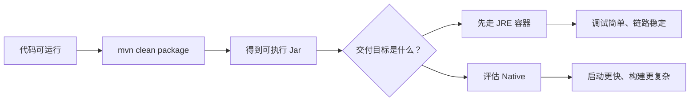

import { Aside } from '@astrojs/starlight/components';

到了这一页，默认你已经能把应用跑起来了。  
现在要解决的问题不再是“怎么写 Controller”，而是“怎么把它交给别的环境去跑”。

本文不追求覆盖所有部署形态，而是基于仓库里的 `demo/helloworld_docker` 给出一条最短交付路径。




## 先回答一个问题：你要交付什么

对于 Feat Cloud 应用，最常见的两种交付物是：

1. 一个可执行 Fat Jar
2. 一个容器镜像

而容器镜像又常见地分成两种：

- 基于 JRE 运行 Jar
- 基于 GraalVM Native Image 运行本地可执行文件

## 第一步：先把 Jar 打出来

`demo/helloworld_docker/pom.xml` 里已经给出了典型的 `maven-shade-plugin` 配置：

```xml title="pom.xml"
<plugin>
    <groupId>org.apache.maven.plugins</groupId>
    <artifactId>maven-shade-plugin</artifactId>
    <version>3.5.0</version>
    <executions>
        <execution>
            <phase>package</phase>
            <goals>
                <goal>shade</goal>
            </goals>
            <configuration>
                <transformers>
                    <transformer
                            implementation="org.apache.maven.plugins.shade.resource.AppendingTransformer">
                        <resource>META-INF/services/tech.smartboot.feat.cloud.CloudService</resource>
                    </transformer>
                    <transformer
                            implementation="org.apache.maven.plugins.shade.resource.ManifestResourceTransformer">
                        <mainClass>tech.smartboot.feat.demo.Bootstrap</mainClass>
                    </transformer>
                </transformers>
            </configuration>
        </execution>
    </executions>
</plugin>
```

这里最关键的不是 Shade 本身，而是两件事：

- 合并 `CloudService` 的服务发现文件
- 把启动主类写进 manifest

打包命令：

```bash
mvn clean package
```

完成后，`target/` 目录下就会出现可执行 Jar。

## 第二步：决定你是走 JRE 还是 Native

### 方案一：JRE 容器

如果你想要更简单、调试更直接的交付方式，先用 JRE 镜像。

`demo/helloworld_docker/Dockerfile_jre`：

```dockerfile title="Dockerfile_jre"
FROM eclipse-temurin:21.0.7_6-jre-alpine
WORKDIR /feat
COPY target/helloworld_docker*.jar helloworld.jar

EXPOSE 8080

CMD ["java", "-jar", "helloworld.jar"]
```

这是最容易理解的一种交付方式：

- 你交付的是 Jar
- 容器里只负责提供 JRE
- 启动命令仍然是 `java -jar`

### 方案二：Native 容器

如果你的目标是更快启动、更小运行时依赖，可以考虑 Native Image。

`demo/helloworld_docker/Dockerfile_native`：

```dockerfile title="Dockerfile_native"
FROM container-registry.oracle.com/graalvm/native-image:21-ol8 AS builder

COPY target/helloworld_docker*.jar helloworld.jar

RUN native-image --no-fallback -jar helloworld.jar

FROM ubuntu:18.04
EXPOSE 8080

COPY --from=builder /app/helloworld helloworld
ENTRYPOINT ["/helloworld"]
```

这条路径的核心区别是：

- 前半段用 GraalVM 生成本地可执行文件
- 后半段运行时不再需要完整 JRE

## 第三步：构建并运行

示例工程里给了一个简单的 `Makefile`：

```makefile
native:
	mvn clean package
	podman build -t feat-docker:native -f Dockerfile_native
	podman build -t feat-docker:jre -f Dockerfile_jre
```

如果你使用 `docker`，把 `podman` 替换掉即可。

手动执行也很直接：

```bash
mvn clean package
docker build -t feat-docker:jre -f Dockerfile_jre demo/helloworld_docker
docker run -p 8080:8080 feat-docker:jre
```

然后访问：

```text
http://localhost:8080/hello
```

## 怎么选

### 先选 JRE 容器，如果：

- 你更在乎交付简单
- 你还在频繁调试
- 你希望运行环境和本地 Java 行为更接近

### 再考虑 Native，如果：

- 你很在意启动时间
- 你部署在资源敏感环境
- 你已经能稳定构建并运行普通 Jar 版本

不要一开始就把 Native 当默认路径。  
先把 JRE 交付链路跑通，再上 Native，通常更稳。

## 实际交付时最容易漏掉什么

### 1. 忘了配置 Shade 插件

结果通常是：

- Jar 打出来了
- 但运行时找不到 Feat Cloud 生成的服务信息

### 2. `mainClass` 写错

结果是 Jar 可以打包，但不能直接启动。

### 3. Dockerfile 的 `COPY` 路径对不上

尤其是模块项目里，经常会因为构建目录和 Docker build 上下文不一致导致文件根本没复制进去。

