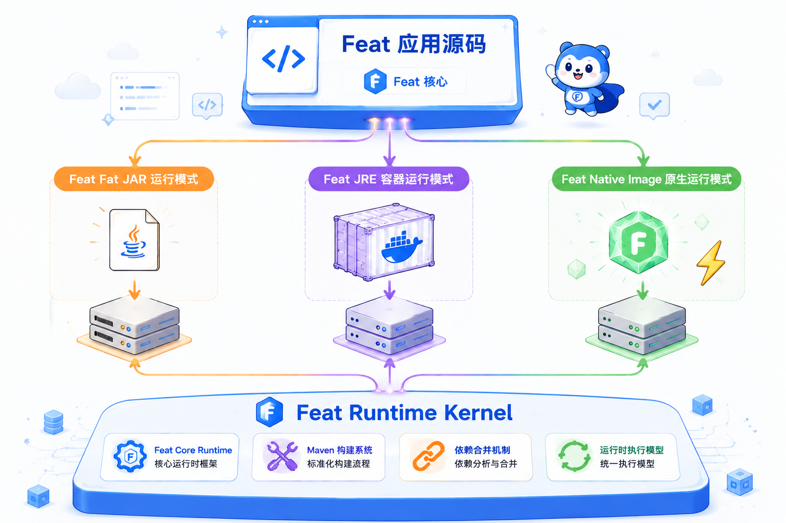

到这一页，应用已经不只是“能在 IDE 里跑”。部署要回答的是另一个问题：怎样把编译期生成的 `CloudService`、运行期依赖和启动入口一起打进可交付产物里。

Feat Cloud 的部署路线可以分成两层：

- **Fat Jar**：最短路径，适合普通服务器或快速验证
- **JRE 容器镜像**：更适合标准化交付和容器平台

Native Image 是另一条优化路线，建议在 JRE 交付稳定之后再评估。

## 打包前先确认服务发现文件

Feat Cloud 依赖 Java `ServiceLoader` 加载编译期生成的 `CloudService`。  
这意味着打包时必须保留并合并这个文件：

```text
META-INF/services/tech.smartboot.feat.cloud.CloudService
```

如果 Fat Jar 打包时把它覆盖掉，应用能启动，但路由会全部丢失。  
所以 `maven-shade-plugin` 里必须配置 `AppendingTransformer`。

```xml title="pom.xml"
<plugin>
    <groupId>org.apache.maven.plugins</groupId>
    <artifactId>maven-shade-plugin</artifactId>
    <version>${maven-shade-plugin.version}</version>
    <executions>
        <execution>
            <phase>package</phase>
            <goals><goal>shade</goal></goals>
            <configuration>
                <transformers>
                    <transformer implementation="org.apache.maven.plugins.shade.resource.AppendingTransformer">
                        <resource>META-INF/services/tech.smartboot.feat.cloud.CloudService</resource>
                    </transformer>
                    <transformer implementation="org.apache.maven.plugins.shade.resource.ManifestResourceTransformer">
                        <mainClass>com.example.Bootstrap</mainClass>
                    </transformer>
                </transformers>
            </configuration>
        </execution>
    </executions>
</plugin>
```

`AppendingTransformer` 保留生成服务，`ManifestResourceTransformer` 指定 `java -jar` 的启动入口。两者缺一不可。

## 构建 Fat Jar

执行：

```bash
mvn clean package
```

`target/` 下会生成一个可执行 Fat Jar（shaded jar 默认替换原始 jar，文件名不带 `-shaded` 后缀）：

```
target/yourapp-1.0.jar
```

直接运行：

```bash
java -jar target/yourapp-1.0.jar
```

验证：

```bash
curl http://localhost:8080/hello
```

后台运行：

```bash
nohup java -jar yourapp-1.0.jar > app.log 2>&1 &
```

## 构建 JRE 容器镜像

容器化时，Fat Jar 仍然是交付物。Dockerfile 只负责提供 JRE 环境并启动它：

```dockerfile
FROM eclipse-temurin:21-jre-alpine

WORKDIR /app

COPY target/yourapp-1.0.jar app.jar

EXPOSE 8080

CMD ["java", "-jar", "app.jar"]
```

构建并运行：

```bash
docker build -t yourapp:latest .
docker run -p 8080:8080 yourapp:latest
```

如果你需要进一步追求启动速度和更小运行时，再进入 [Native Image](/feat/cloud/native-image/)。

## 常见问题

**启动后路由全部 404**：`AppendingTransformer` 未配置，导致 `CloudService` 服务发现文件被覆盖。检查 `pom.xml` 确认配置完整。

**`java -jar` 启动报错**：`mainClass` 写错或未配置。可用以下命令验证 Manifest：

```bash
unzip -p target/yourapp-1.0.jar META-INF/MANIFEST.MF
```

输出里应包含 `Main-Class: com.example.Bootstrap`。

**Docker `COPY` 找不到文件**：确认 `docker build` 的执行目录，`COPY` 路径相对于构建上下文，不能使用绝对路径。
