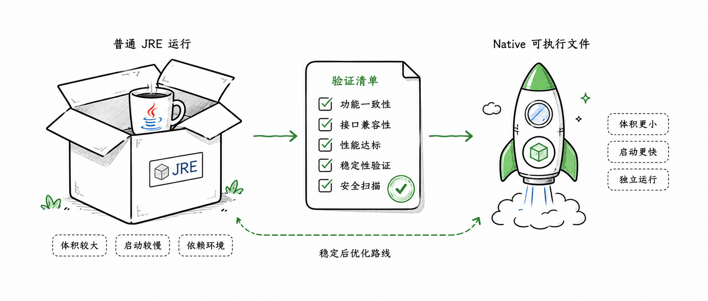

import { Aside } from "@astrojs/starlight/components";


到这一页，应用已经不只是“能在 IDE 里跑”。部署要回答的是另一个问题：怎样把编译期生成的 `CloudService`、运行期依赖和启动入口一起打进可交付产物里。

Feat Cloud 的交付路线可以分成三层：

- **Fat Jar**：最短路径，适合普通服务器或快速验证
- **JRE 容器镜像**：适合标准化交付和容器平台
- **Native Image**：稳定之后再评估的优化路线

建议顺序是先跑通普通 jar，再容器化，最后再决定是否投入 Native。

## 常规交付路线

先把应用作为普通 Java 服务交付。这个阶段的目标很明确：生成可执行 jar，确认 `CloudService` 服务发现文件没有丢，再把同一个 jar 放进 JRE 容器。

### 打包前先确认服务发现文件

Feat Cloud 依赖 Java `ServiceLoader` 加载编译期生成的 `CloudService`。这意味着打包时必须保留并合并这个文件：

```text title="服务发现文件"
META-INF/services/tech.smartboot.feat.cloud.CloudService
```

如果 Fat Jar 打包时把它覆盖掉，应用能启动，但路由会全部丢失。所以 `maven-shade-plugin` 里必须配置 `AppendingTransformer`。

```xml title="pom.xml"
<plugin>
    <groupId>org.apache.maven.plugins</groupId>
    <artifactId>maven-shade-plugin</artifactId>
    <version>${maven-shade-plugin.version}</version>
    <executions>
        <execution>
            <phase>package</phase>
            <goals><goal>shade</goal></goals>
            <configuration>
                <transformers>
                    <transformer implementation="org.apache.maven.plugins.shade.resource.AppendingTransformer">
                        <resource>META-INF/services/tech.smartboot.feat.cloud.CloudService</resource>
                    </transformer>
                    <transformer implementation="org.apache.maven.plugins.shade.resource.ManifestResourceTransformer">
                        <mainClass>com.example.Bootstrap</mainClass>
                    </transformer>
                </transformers>
            </configuration>
        </execution>
    </executions>
</plugin>
```

`AppendingTransformer` 保留生成服务，`ManifestResourceTransformer` 指定 `java -jar` 的启动入口。两者缺一不可。

### 构建 Fat Jar

执行：

```bash title="构建"
mvn clean package
```

`target/` 下会生成一个可执行 Fat Jar：

```text title="构建产物"
target/yourapp-1.0.jar
```

直接运行：

```bash title="运行"
java -jar target/yourapp-1.0.jar
```

验证：

```bash title="验证"
curl http://localhost:8080/hello
```

后台运行：

```bash title="后台运行"
nohup java -jar yourapp-1.0.jar > app.log 2>&1 &
```

### 构建 JRE 容器镜像

容器化时，Fat Jar 仍然是交付物。Dockerfile 只负责提供 JRE 环境并启动它：

```dockerfile title="Dockerfile"
FROM eclipse-temurin:21-jre-alpine

WORKDIR /app

COPY target/yourapp-1.0.jar app.jar

EXPOSE 8080

CMD ["java", "-jar", "app.jar"]
```

构建并运行：

```bash title="构建并运行容器"
docker build -t yourapp:latest .
docker run -p 8080:8080 yourapp:latest
```

到这里，已经完成了最常见的服务交付路线。Native Image 是另一条优化路线，不建议一开始就作为默认目标。

## Native 优化路线

只有当 JRE 版本已经稳定，且启动速度、内存或镜像体积真的成为问题时，再进入 Native Image。



### 先稳定 JRE 版本

如果你当前只是：

- 刚完成第一个 Controller
- 还在调整 `feat.yml`
- 还没有稳定的 Fat Jar
- 还没有跑通过 JRE 容器镜像

那就先停在 JRE 路线。普通 `java -jar` 能更快暴露业务错误、配置错误和依赖冲突。等应用的启动入口、生成代码、资源文件和打包方式都稳定之后，再进入 Native，排查范围会小很多。

### 适合投入 Native 的场景

- 你非常在意启动速度
- 你运行在资源受限环境
- 你部署在 Serverless 或弹性伸缩场景
- 你希望容器镜像里不再携带完整 JRE
- 你的依赖边界相对清晰，反射、动态代理和运行时扫描较少

如果这些收益对当前项目不关键，Native 往往不是优先级最高的工作。它能带来明显收益，也会把构建链路、调试方式和兼容性验证一起变复杂。

### Native 推荐构建节奏

Native Image 的关键不是记住某条命令，而是把验证顺序安排对。

1. 先用 Maven 构建普通 jar，确认 `CloudService` 服务发现文件存在
2. 用 `java -jar` 启动，确认 HTTP 路由、Profile、MyBatis、Session 等能力正常
3. 再使用 GraalVM 构建 native executable
4. 对 Native 产物跑同一组接口验证
5. 只有收益明确时，再把 Native 构建加入 CI 或发布流水线

一个常见的容器化构建可以写成多阶段 Dockerfile：

```dockerfile title="Dockerfile.native"
FROM container-registry.oracle.com/graalvm/native-image:21 AS builder

WORKDIR /app
COPY target/yourapp-1.0.jar app.jar
RUN native-image --no-fallback -jar app.jar yourapp

FROM debian:bookworm-slim
WORKDIR /app
COPY --from=builder /app/yourapp /app/yourapp
EXPOSE 8080
CMD ["/app/yourapp"]
```

构建镜像：

```bash title="构建 Native 镜像"
docker build -f Dockerfile.native -t yourapp:native .
```

运行验证：

```bash title="验证 Native 镜像"
docker run --rm -p 8080:8080 yourapp:native
curl http://localhost:8080/hello
```

<Aside type="caution">
不同依赖对 Native Image 的支持程度不同。只要引入了运行时反射、动态代理、资源扫描或 JNI，就可能需要额外配置。Feat Cloud 能减少框架自身的动态行为，但不能替第三方库消除所有 Native 约束。
</Aside>

### 验证什么才算通过

Native 产物能启动，只是第一步。真正应该验证的是完整业务路径：

- 控制台能打印预期路由
- `feat.profiles.active` 选择的环境正确
- 静态资源、MyBatis Mapper、SQL 初始化脚本等资源能被读取
- Session 的本地或 Redis 存储行为与 JRE 版本一致
- MCP 端点能被客户端发现并调用

如果 Native 版本和 JRE 版本行为不一致，先回到普通 jar 确认问题是否已经存在。只有 JRE 路线稳定而 Native 异常时，才把排查焦点放到 Native Image 的资源、反射和初始化配置上。

## 常见问题

**启动后路由全部 404**：`AppendingTransformer` 未配置，导致 `CloudService` 服务发现文件被覆盖。检查 `pom.xml` 确认配置完整。

**`java -jar` 启动报错**：`mainClass` 写错或未配置。可用以下命令验证 Manifest：

```bash title="检查 Manifest"
unzip -p target/yourapp-1.0.jar META-INF/MANIFEST.MF
```

输出里应包含 `Main-Class: com.example.Bootstrap`。

**Docker `COPY` 找不到文件**：确认 `docker build` 的执行目录，`COPY` 路径相对于构建上下文，不能使用绝对路径。

如果问题不止发生在部署阶段，可以继续看 [故障排查](/feat/cloud/troubleshooting/)。
