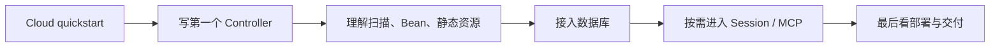

import { Aside, CardGrid, LinkCard } from "@astrojs/starlight/components";

<Aside type="caution">
Feat 主线仓库采用 Apache 2.0；其中 Feat Cloud 通过赞助支持模式开放。如需使用 Feat Cloud，请先[成为赞助者](/feat/sponsors/)获取授权。
</Aside>

Feat Cloud 适合已经接受 Feat 技术路线，但又希望用更接近 Spring Boot 的注解式开发体验来构建应用的团队。

如果你还在评估 Feat、但暂时不准备使用赞助能力，建议先从 [Feat Core 快速入门](/feat/server/getstart/) 或 [Feat AI 简介](/feat/ai/) 进入。

<CardGrid>
  <LinkCard
    title="快速开始"
    href="/feat/cloud/quickstart/"
    description="写出第一个 Controller 并验证路由映射成功。"
  />
  <LinkCard
    title="Controller"
    href="/feat/cloud/controller/"
    description="继续完善参数绑定、路径参数和请求方法映射。"
  />
  <LinkCard
    title="CloudOptions"
    href="/feat/cloud/options/"
    description="控制扫描范围、外部 Bean 和静态资源。"
  />
  <LinkCard
    title="MyBatis"
    href="/feat/cloud/db/"
    description="当你开始接数据库时，从这里继续。"
  />
</CardGrid>

## 建议顺序

如果你是第一次接触 Feat Cloud，建议这样读：

1. [构建第一个 Feat Cloud 应用](/feat/cloud/quickstart/)
2. [Controller 开发实践](/feat/cloud/controller/)
3. [CloudOptions 配置指南](/feat/cloud/options/)
4. [MyBatis 集成](/feat/cloud/db/)

`Session`、`MCP`、`Native Image`、`打包与部署` 更适合在你已经有实际项目时按需进入。
