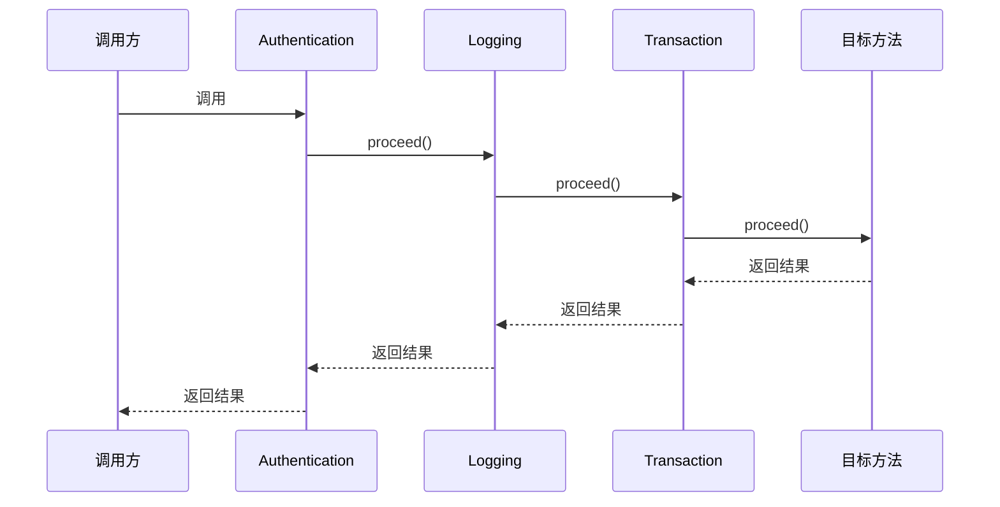

import { Aside } from '@astrojs/starlight/components';

日志、鉴权、计时、事务边界这类逻辑有一个共同点：它们需要包围业务方法执行，却不应该散落在每个业务方法里。

Feat Cloud 提供了一组精简的方法拦截器 API。它参考了 Jakarta Interceptors 的核心设计：用 `@Interceptor` 声明拦截器，用 `@AroundInvoke` 定义环绕方法，用 `InvocationContext.proceed()` 推进调用链，再用 `@Interceptors` 把拦截器绑定到类或方法。

Feat 没有完整实现 Jakarta Interceptors 规范。它只保留了方法拦截所需的部分，并结合 Feat Cloud 的 AOT 工作模型，在编译期生成普通 Java 调用代码。

<Aside type="note">
Feat 的注解位于 `tech.smartboot.feat.cloud.annotation.interceptor`，不是 `jakarta.interceptor`。两者设计思路相近，但 API 不可直接互换。
</Aside>

## 第一个拦截器

先实现一个记录方法名称、参数和耗时的拦截器。

```java title="LoggingInterceptor.java"
package com.example.interceptor;

import tech.smartboot.feat.cloud.annotation.interceptor.AroundInvoke;
import tech.smartboot.feat.cloud.annotation.interceptor.Interceptor;
import tech.smartboot.feat.cloud.interceptor.InvocationContext;

import java.util.Arrays;

@Interceptor
public class LoggingInterceptor {

    @AroundInvoke
    public Object intercept(InvocationContext context) throws Exception {
        String methodName = context.getMethod().getDeclaringClass().getSimpleName()
                + "." + context.getMethod().getName();
        long start = System.nanoTime();

        System.out.println("进入 " + methodName
                + ", 参数=" + Arrays.toString(context.getParameters()));
        try {
            Object result = context.proceed();
            System.out.println("完成 " + methodName + ", 返回值=" + result);
            return result;
        } finally {
            long elapsed = System.nanoTime() - start;
            System.out.println("耗时 " + elapsed + " ns");
        }
    }
}
```

一个 Feat 拦截器由两部分组成：

- `@Interceptor` 把类注册为拦截器
- `@AroundInvoke` 标记真正执行环绕逻辑的方法

每个 `@Interceptor` 类必须且只能有一个 `@AroundInvoke` 方法。建议固定使用下面的签名：

```java
public Object intercept(InvocationContext context) throws Exception
```

调用 `context.proceed()` 时，控制权会进入下一个拦截器；如果当前已经是链尾，则执行目标业务方法。

## 把拦截器绑定到方法

通过 `@Interceptors` 指定要执行的拦截器类型。

```java title="OrderController.java"
package com.example.controller;

import com.example.interceptor.LoggingInterceptor;
import tech.smartboot.feat.cloud.annotation.Controller;
import tech.smartboot.feat.cloud.annotation.RequestMapping;
import tech.smartboot.feat.cloud.annotation.interceptor.Interceptors;

@Controller("orders")
public class OrderController {

    @RequestMapping("/42")
    @Interceptors(LoggingInterceptor.class)
    public String findOrder() {
        return "order-42";
    }
}
```

重新编译并访问：

```shell title="重新编译"
mvn compile
```

```shell title="发起请求"
curl http://localhost:8080/orders/42
```

控制台中的执行过程类似：

```text
进入 OrderController.findOrder, 参数=[]
完成 OrderController.findOrder, 返回值=order-42
耗时 325100 ns
```

拦截器声明属于 AOT 输入。新增、删除或调整 `@Interceptor`、`@AroundInvoke`、`@Interceptors` 后，需要重新编译，旧的生成代码不会在运行时自动更新。

## 调用链如何执行

假设一个方法声明了三个拦截器：

```java
@Interceptors({AuthenticationInterceptor.class,
               LoggingInterceptor.class,
               TransactionInterceptor.class})
public String createOrder() {
    return "created";
}
```

每个拦截器在 `proceed()` 之前的代码按声明顺序执行，在 `proceed()` 之后的代码按相反顺序返回。



这就是典型的“洋葱模型”。最先进入的拦截器最后退出，因此通常可以这样安排：

1. 鉴权或限流放在前面，尽早拒绝无效调用
2. 日志、链路追踪放在外层，覆盖完整执行过程
3. 事务等资源边界靠近目标方法

## 类级与方法级拦截器

`@Interceptors` 可以标在类上，也可以标在方法上。

```java title="OrderService.java"
import tech.smartboot.feat.cloud.annotation.Bean;
import tech.smartboot.feat.cloud.annotation.interceptor.Interceptors;

@Bean
@Interceptors(AuthenticationInterceptor.class)
public class OrderService {

    public String find(String id) {
        return "order-" + id;
    }

    @Interceptors({LoggingInterceptor.class, TransactionInterceptor.class})
    public String create(String id) {
        return "created-" + id;
    }
}
```

合并规则如下：

| 调用方法 | 实际拦截器顺序 |
| --- | --- |
| `find(...)` | `AuthenticationInterceptor` |
| `create(...)` | `AuthenticationInterceptor` → `LoggingInterceptor` → `TransactionInterceptor` |

方法级拦截器不会覆盖类级拦截器，而是追加在类级列表之后。数组顺序就是进入顺序，Feat 不会按类名或注册时间重新排序。

除了 Controller，普通 `@Bean` 的公共实例方法也可以使用同样的方式拦截。这样可以把事务、审计等规则放在业务服务边界，而不是只放在 HTTP 入口。

## 使用 `InvocationContext`

`InvocationContext` 表示当前这一次方法调用。Feat 保留了四个核心操作：

| 方法 | 用途 |
| --- | --- |
| `getTarget()` | 获取当前被调用的 Bean 增强实例 |
| `getMethod()` | 获取被拦截方法的 `java.lang.reflect.Method` |
| `getParameters()` | 按形参顺序读取本次调用的参数数组 |
| `proceed()` | 调用下一个拦截器或最终目标方法 |

例如，可以通过方法和参数信息生成审计日志：

```java
@AroundInvoke
public Object audit(InvocationContext context) throws Exception {
    System.out.println("target=" + context.getTarget().getClass().getName());
    System.out.println("method=" + context.getMethod().getName());
    System.out.println("arguments=" + Arrays.toString(context.getParameters()));
    return context.proceed();
}
```

<Aside type="caution">
`getParameters()` 用于读取调用参数。Feat 不提供 `setParameters(...)`，也不应依赖修改返回数组来改变目标方法的实际入参。需要调整数据时，请在进入拦截链前完成，或把转换逻辑放进业务方法。
</Aside>

## 短路调用链

`proceed()` 不是自动执行的。如果拦截器直接返回，后续拦截器和目标方法都不会运行。这可以用于权限拒绝、限流、缓存命中或维护模式。

```java title="MaintenanceInterceptor.java"
import tech.smartboot.feat.cloud.RestResult;
import tech.smartboot.feat.cloud.annotation.interceptor.AroundInvoke;
import tech.smartboot.feat.cloud.annotation.interceptor.Interceptor;
import tech.smartboot.feat.cloud.interceptor.InvocationContext;

@Interceptor
public class MaintenanceInterceptor {

    private boolean maintenance = true;

    @AroundInvoke
    public Object intercept(InvocationContext context) throws Exception {
        if (maintenance) {
            return RestResult.fail("系统维护中，请稍后再试");
        }
        return context.proceed();
    }
}
```

目标方法也使用 `RestResult` 作为返回类型：

```java
@RequestMapping("/create")
@Interceptors(MaintenanceInterceptor.class)
public RestResult<String> createOrder() {
    return RestResult.ok("created");
}
```

短路返回值必须与目标方法的返回类型兼容。否则生成代码在接收调用链结果时可能出现类型转换错误。对于 `void` 方法，拦截器返回值会被忽略。

## 与 Jakarta Interceptors 的关系

Feat 采用了 Jakarta Interceptors 最容易理解、也最常用的环绕调用模型，但没有把完整规范搬进来。

| 能力 | Jakarta Interceptors | Feat Cloud |
| --- | --- | --- |
| 拦截器声明 | `@Interceptor` | `@Interceptor` |
| 环绕方法 | `@AroundInvoke` | `@AroundInvoke` |
| 显式绑定 | `@Interceptors` | `@Interceptors` |
| 调用上下文 | 完整 `InvocationContext` | 仅保留目标、方法、参数读取和 `proceed()` |
| 参数替换 | 支持 `setParameters(...)` | 不支持 |
| 拦截器绑定注解 | 支持 | 不支持，直接使用 `@Interceptors` |
| 优先级与默认拦截器 | 支持规范定义的排序机制 | 使用数组声明顺序 |
| 生命周期与构造拦截 | 支持更多拦截类型 | 当前只支持方法调用拦截 |
| 发现方式 | 由 Jakarta 容器管理 | Feat AOT 编译期生成并注册 |

这种取舍让 API 保持很小：没有绑定注解、优先级体系、上下文数据 Map、Timer 或参数替换。需要理解的核心只有“声明拦截器、绑定拦截器、调用 `proceed()`”三件事。

## AOT 约束

Feat 通过生成子类覆盖业务方法来接入调用链，因此被拦截代码需要满足一些条件：

- 目标方法必须是 `public` 实例方法
- `static`、`final` 和非 `public` 方法不会生成拦截逻辑
- 包含被拦截方法的类不能声明为 `final`
- 拦截器类需要可实例化，建议提供可访问的无参构造方法
- 每个拦截器类只能有一个 `@AroundInvoke` 方法
- `@AroundInvoke` 方法应接收一个 `InvocationContext` 并返回 `Object`
- 当前 AOT 调用链不处理构造方法拦截

<Aside type="tip">
如果拦截器没有执行，先运行 `mvn clean compile`，再检查目标方法是否为 `public`、是否带有 `final` 或 `static`，以及拦截器类中是否存在唯一的 `@AroundInvoke` 方法。
</Aside>

## 使用建议

适合放进拦截器的逻辑通常具有明显的横切特征：

- 权限校验和调用准入
- 统一日志、审计与链路追踪
- 方法耗时统计
- 限流、幂等与缓存命中
- 事务或资源边界

不要把具体业务流程藏进拦截器。订单状态变更、库存扣减、价格计算这类逻辑应继续留在业务方法中。一个简单判断标准是：如果移除拦截器后，业务规则本身就不完整，那么这段代码通常不属于横切逻辑。

最后记住调用链最重要的规则：

```text
调用 proceed()  -> 继续执行后续拦截器和目标方法
不调用 proceed() -> 在当前拦截器短路并直接返回
```
