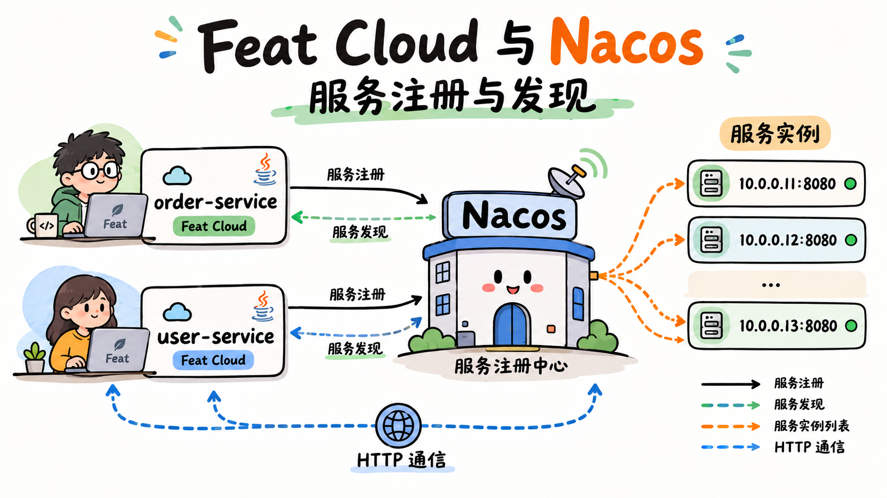

import { Aside } from '@astrojs/starlight/components';

单体应用里，配置跟着代码一起发布，调用方直接写死对端地址。进入多环境、多实例部署后，数据库地址、功能开关、限流阈值必须独立管理，实例上下线也得自动感知——配置中心和服务注册发现就是干这两件事的。

Nacos 把配置管理（Config）和服务管理（Naming）做在了同一个客户端里。本文用一个类对应一个能力：`ConfigBootstrap` 管配置，`RegisterBootstrap` 管注册，`DiscoverBootstrap` 管发现。三个类结构同构，套路一致。


## 准备依赖与基础配置

**Feat Cloud 没有内置 Nacos starter。** 本文直接使用官方 `nacos-client`，不额外封装。多写几十行胶水代码，换来的是完全透明的链路——连接在哪建立、配置在哪回调、坏配置为什么被拦截，全部一目了然。

### 引入 Nacos 客户端

在已有 Feat Cloud 应用基础上，加上 `nacos-client`：

```xml title="pom.xml"
<dependency>
    <groupId>com.alibaba.nacos</groupId>
    <artifactId>nacos-client</artifactId>
    <version>3.2.3</version>
</dependency>
```

`nacos-client` 是运行期依赖，`feat-cloud-starter` 仍然负责编译期生成代码。两者各管各的，互不替代。

### 在 feat.yml 里声明连接信息

Nacos 服务地址、各能力的 dataId / serviceName / group 这类"环境之间会变、但启动后不变"的参数，放进 `feat.yml` 最合适。下面这份配置同时承载了配置中心、服务注册、服务发现三组参数：

```yaml title="feat.yml"
nacos:
  serverAddr: 127.0.0.1:8848
  config:
    dataId: config1
    group: feat
    timeout: 1000
  register:
    serviceName: feat-nacos-demo
    group: DEFAULT_GROUP
    ip: 127.0.0.1
    port: 8082
  discover:
    serviceName: feat-nacos-demo
    group: DEFAULT_GROUP
```

这些值会在编译期通过 `@Value` 解析并注入到字段里。`@Value` 支持 `String`、`int`、`String[]`、`List<String>` 等少量类型，把 Nacos 连接参数统一用字符串或整数声明最省事。

<Aside type="tip">
`@Value` 注入依赖字段对应的 setter 方法。字段叫 `serverAddr`，就得有 `setServerAddr(...)`；编译时找不到 setter 会直接报错。嵌套配置用 `nacos.config.dataId` 这种点号路径，自动映射到 `nacos` 下的 `config` 节点。具体规则可以回看 [Bean 与依赖注入](/feat/cloud/bean/) 里的「从配置注入值」。
</Aside>

### 按环境拆分 Nacos 连接

本地开发连本机 Nacos，测试环境连测试集群，生产环境连生产集群。这是典型的 Profile 场景。

```yaml title="feat-dev.yml"
nacos:
  serverAddr: dev-nacos.example.com:8848
  config:
    dataId: config1
```

```yaml title="feat-prod.yml"
nacos:
  serverAddr: prod-nacos.example.com:8848
  register:
    ip: 10.0.1.23
    port: 8082
```

启动时通过 `feat.profiles.active` 选择当前环境：

```bash title="选择生产环境启动"
java -Dfeat.profiles.active=prod -jar yourapp.jar
```

<Aside type="caution">
生产环境的 Nacos 用户名和口令不要硬编码进 `feat-prod.yml` 提交到代码仓库。可以用 `${}` 占位符引用，效果类似 Spring：

```yaml title="feat-prod.yml"
nacos:
  username: ${nacos.username}
  password: ${nacos.password}
```

`${nacos.username}` 这种写法会同时兼容两种来源：JVM 参数 `-Dnacos.username`，以及系统环境变量 `NACOS_USERNAME`（点号转下划线、全大写），解析优先级是系统属性 > 环境变量。配置文件本身可以安全提交到代码仓库，敏感信息运行时注入：

```bash
# 任选其一
java -Dnacos.username=admin -Dnacos.password=xxx -Dfeat.profiles.active=prod -jar yourapp.jar
# 或者用环境变量
NACOS_USERNAME=admin NACOS_PASSWORD=xxx java -Dfeat.profiles.active=prod -jar yourapp.jar
```
</Aside>

## 配置中心接入

配置中心最核心的需求不是"能读到配置"，而是"配置变更时应用能安全地用上新值"。`ConfigBootstrap` 一个类完成连接、拉取、监听和对外暴露，保持最小结构。

```java title="ConfigBootstrap.java"
package tech.smartboot.feat.nacos;

import com.alibaba.nacos.api.NacosFactory;
import com.alibaba.nacos.api.PropertyKeyConst;
import com.alibaba.nacos.api.config.ConfigService;
import com.alibaba.nacos.api.config.listener.AbstractListener;
import tech.smartboot.feat.cloud.FeatCloud;
import tech.smartboot.feat.cloud.annotation.Controller;
import tech.smartboot.feat.cloud.annotation.PostConstruct;
import tech.smartboot.feat.cloud.annotation.PreDestroy;
import tech.smartboot.feat.cloud.annotation.RequestMapping;
import tech.smartboot.feat.cloud.annotation.Value;

import java.util.Properties;

@Controller
public class ConfigBootstrap {

    @Value("${nacos.serverAddr}")
    private String serverAddr;

    @Value("${nacos.config.dataId}")
    private String configDataId;

    @Value("${nacos.config.group}")
    private String configGroup;

    @Value("${nacos.config.timeout}")
    private int configTimeout;

    private volatile String config = "";
    private ConfigService configService;

    private final AbstractListener configListener = new AbstractListener() {
        @Override
        public void receiveConfigInfo(String configInfo) {
            config = configInfo == null ? "" : configInfo;
        }
    };

    @PostConstruct
    public void init() throws Exception {
        Properties properties = new Properties();
        properties.put(PropertyKeyConst.SERVER_ADDR, serverAddr);

        try {
            configService = NacosFactory.createConfigService(properties);
            // 一次调用完成"拉取初始配置 + 注册监听器"，避免拉取与注册之间的空窗期
            String initialConfig = configService.getConfigAndSignListener(
                    configDataId,
                    configGroup,
                    configTimeout,
                    configListener
            );
            config = initialConfig == null ? "" : initialConfig;
        } catch (Exception e) {
            destroy();
            throw e;
        }
    }

    @PreDestroy
    public void destroy() throws Exception {
        if (configService == null) {
            return;
        }
        configService.removeListener(configDataId, configGroup, configListener);
        configService.shutDown();
        configService = null;
    }

    @RequestMapping("/nacos")
    public String nacos() {
        return config;
    }

    public static void main(String[] args) {
        FeatCloud.cloudServer(opt -> opt.setPackages(ConfigBootstrap.class.getName())).listen(8081);
    }

    // setter
    public void setServerAddr(String serverAddr) { this.serverAddr = serverAddr; }
    public void setConfigDataId(String configDataId) { this.configDataId = configDataId; }
    public void setConfigGroup(String configGroup) { this.configGroup = configGroup; }
    public void setConfigTimeout(int configTimeout) { this.configTimeout = configTimeout; }
}
```

这段代码做了四件事：

1. **建立连接**：用 `nacos.serverAddr` 创建 `ConfigService`
2. **拉取 + 监听**：通过 `getConfigAndSignListener` 一次调用拿到初始值并注册监听器，省去先 `getConfig` 再 `addListener` 的两步操作，也避免两者之间的空窗期
3. **异常自愈**：初始化失败时先 `destroy()` 释放已建好的连接，再抛出异常让启动失败暴露问题
4. **优雅关闭**：停机时先 `removeListener` 再 `shutDown`，断开长连接并清理回调

几个值得注意的细节：

- **`volatile`**：监听器回调由 Nacos 客户端的长轮询线程触发，`config` 字段被主请求线程读取，加 `volatile` 保证可见性。
- **`AbstractListener` 而非裸 `Listener`**：`Listener` 接口要求实现 `getExecutor()`，多数场景用不上自定义线程池；`AbstractListener` 给了默认实现，省一个空方法。
- **dataId / group / timeout 全部走配置**：不写死成常量，换环境只改 `feat.yml`，不用动代码。

启动后：

```shell title="验证配置读取"
curl http://localhost:8081/nacos
```

然后去 Nacos 控制台修改 `config1` / `feat` 这个配置的内容，稍等片刻再请求一次，应该能看到新值。

<Aside type="tip">
生产环境要开鉴权时，把 `namespace`、`username`、`password` 也声明到 `feat.yml`，在 `init()` 里一并塞进 `Properties`：

```java
properties.put(PropertyKeyConst.NAMESPACE, namespace);
if (username != null && !username.isEmpty()) {
    properties.put(PropertyKeyConst.USERNAME, username);
    properties.put(PropertyKeyConst.PASSWORD, password);
}
```

口令不要硬编码进仓库，用环境变量注入。
</Aside>

## 服务注册

实例启动后把自己登记到 Nacos，消费者才能发现并调用。`RegisterBootstrap` 的结构和配置中心几乎一致，只是把 `ConfigService` 换成了 `NamingService`，把"拉取 + 监听"换成了"注册"。

```java title="RegisterBootstrap.java"
package tech.smartboot.feat.nacos;

import com.alibaba.nacos.api.NacosFactory;
import com.alibaba.nacos.api.PropertyKeyConst;
import com.alibaba.nacos.api.naming.NamingService;
import tech.smartboot.feat.cloud.FeatCloud;
import tech.smartboot.feat.cloud.annotation.Controller;
import tech.smartboot.feat.cloud.annotation.PostConstruct;
import tech.smartboot.feat.cloud.annotation.PreDestroy;
import tech.smartboot.feat.cloud.annotation.RequestMapping;
import tech.smartboot.feat.cloud.annotation.Value;

import java.util.Properties;

/**
 * 服务注册示例：将当前实例注册到 Nacos，供服务消费者发现。
 */
@Controller
public class RegisterBootstrap {

    @Value("${nacos.serverAddr}")
    private String serverAddr;

    @Value("${nacos.register.serviceName}")
    private String serviceName;

    @Value("${nacos.register.group}")
    private String namingGroup;

    @Value("${nacos.register.ip}")
    private String namingIp;

    @Value("${nacos.register.port}")
    private int namingPort;

    private NamingService namingService;

    @PostConstruct
    public void init() throws Exception {
        Properties properties = new Properties();
        properties.put(PropertyKeyConst.SERVER_ADDR, serverAddr);

        namingService = NacosFactory.createNamingService(properties);
        namingService.registerInstance(serviceName, namingGroup, namingIp, namingPort);
    }

    @PreDestroy
    public void destroy() throws Exception {
        if (namingService != null) {
            namingService.shutDown();
            namingService = null;
        }
    }

    @RequestMapping("/nacos/register")
    public String register() {
        return "registered: " + serviceName + " -> " + namingIp + ":" + namingPort;
    }

    public static void main(String[] args) {
        FeatCloud.cloudServer(opt -> opt.setPackages(RegisterBootstrap.class.getName())).listen(8082);
    }

    // setter
    public void setServerAddr(String serverAddr) { this.serverAddr = serverAddr; }
    public void setServiceName(String serviceName) { this.serviceName = serviceName; }
    public void setNamingGroup(String namingGroup) { this.namingGroup = namingGroup; }
    public void setNamingIp(String namingIp) { this.namingIp = namingIp; }
    public void setNamingPort(int namingPort) { this.namingPort = namingPort; }
}
```

`registerInstance` 把 `ip:port` 绑定到 `serviceName` / `group` 上。停机时 `shutDown` 会自动反注册，Nacos 通过心跳超时也会摘除实例，两条保险一起兜底。

<Aside type="caution">
`namingIp` 在容器化部署里不能写死成 `127.0.0.1`。容器外调用方访问不到回环地址，需要注入容器/宿主机的真实可达 IP，否则注册上去的实例谁也连不上。
</Aside>

## 服务发现

消费者订阅服务，实例上下线时 Nacos 主动推送变更列表。`DiscoverBootstrap` 的监听模式和配置中心如出一辙——`subscribe` 注册回调，`NamingEvent` 里带最新实例列表。

```java title="DiscoverBootstrap.java"
package tech.smartboot.feat.nacos;

import com.alibaba.nacos.api.NacosFactory;
import com.alibaba.nacos.api.PropertyKeyConst;
import com.alibaba.nacos.api.naming.NamingService;
import com.alibaba.nacos.api.naming.listener.EventListener;
import com.alibaba.nacos.api.naming.listener.NamingEvent;
import com.alibaba.nacos.api.naming.pojo.Instance;
import tech.smartboot.feat.cloud.FeatCloud;
import tech.smartboot.feat.cloud.annotation.Controller;
import tech.smartboot.feat.cloud.annotation.PostConstruct;
import tech.smartboot.feat.cloud.annotation.PreDestroy;
import tech.smartboot.feat.cloud.annotation.RequestMapping;
import tech.smartboot.feat.cloud.annotation.Value;

import java.util.ArrayList;
import java.util.Collections;
import java.util.List;
import java.util.Properties;

/**
 * 服务发现示例：订阅 Nacos 中的服务实例变更，并对外暴露当前可用实例列表。
 */
@Controller
public class DiscoverBootstrap {

    @Value("${nacos.serverAddr}")
    private String serverAddr;

    @Value("${nacos.discover.serviceName}")
    private String serviceName;

    @Value("${nacos.discover.group}")
    private String namingGroup;

    private volatile List<Instance> instances = Collections.emptyList();
    private NamingService namingService;

    private final EventListener namingListener = event -> {
        if (event instanceof NamingEvent) {
            updateInstances(((NamingEvent) event).getInstances());
        }
    };

    @PostConstruct
    public void init() throws Exception {
        Properties properties = new Properties();
        properties.put(PropertyKeyConst.SERVER_ADDR, serverAddr);

        namingService = NacosFactory.createNamingService(properties);
        namingService.subscribe(serviceName, namingGroup, namingListener);
    }

    private void updateInstances(List<Instance> changedInstances) {
        if (changedInstances == null || changedInstances.isEmpty()) {
            instances = Collections.emptyList();
        } else {
            // 拷贝一份不可变快照，避免回调线程和请求线程并发读写同一个列表
            instances = Collections.unmodifiableList(new ArrayList<>(changedInstances));
        }
    }

    @PreDestroy
    public void destroy() throws Exception {
        if (namingService != null) {
            namingService.unsubscribe(serviceName, namingGroup, namingListener);
            namingService.shutDown();
            namingService = null;
        }
    }

    @RequestMapping("/nacos/instances")
    public List<Instance> instances() {
        return instances;
    }

    public static void main(String[] args) {
        FeatCloud.cloudServer(opt -> opt.setPackages(DiscoverBootstrap.class.getName())).listen(8083);
    }

    // setter
    public void setServerAddr(String serverAddr) { this.serverAddr = serverAddr; }
    public void setServiceName(String serviceName) { this.serviceName = serviceName; }
    public void setNamingGroup(String namingGroup) { this.namingGroup = namingGroup; }
}
```

把 `RegisterBootstrap`（8082）和 `DiscoverBootstrap`（8083）都跑起来，先请求发现接口确认能看到注册的实例，然后停掉注册端，过几秒再请求发现接口，实例会自动消失——这就是动态感知。

```shell title="验证服务发现"
curl http://localhost:8083/nacos/instances
# 停掉 RegisterBootstrap 后等待 10-30 秒，实例列表自动清空
curl http://localhost:8083/nacos/instances
```

注意 `updateInstances` 里做了一次拷贝并包成不可变列表。Nacos 的回调直接传的是内部列表引用，不拷贝的话请求线程遍历时正好被回调线程改写，会抛 `ConcurrentModificationException`。

## 生产环境注意事项

上线前记住几件事就够了：

- **开鉴权**：Nacos 服务端开启鉴权，`namespace` / 用户名 / 口令通过环境变量注入，不要写死在仓库里
- **先校验再刷新**：监听到新配置后先检查格式和必填字段，坏配置不要覆盖内存值
- **拷贝回调数据**：`receiveConfigInfo` / `NamingEvent.getInstances()` 返回的是 Nacos 内部引用，回调线程和请求线程并发访问时务必拷贝快照
- **容器里别用回环 IP**：注册的 `ip` 必须是调用方可达地址，容器化部署要注入真实 IP
- **优雅关闭**：`@PreDestroy` 里先 `removeListener` / `unsubscribe` 再 `shutDown`，避免停机时还在回调已释放的资源

这几条基本就覆盖了大多数生产问题。

## 一条可验证的完整链路

把三个类拼起来，你应该能验证下面三条链路：

```text
配置:   Nacos 配置中心 -> ConfigBootstrap -> /nacos
注册:   本实例 -> RegisterBootstrap -> Nacos 实例列表
发现:   Nacos 实例变更 -> DiscoverBootstrap -> /nacos/instances
```

可以用这些命令验证：

```shell title="配置中心验证"
curl http://localhost:8081/nacos
# 修改 Nacos 里的 config1 / feat，等待 1-3 秒后再请求
curl http://localhost:8081/nacos
```

```shell title="服务注册与发现验证"
# 注册端运行时，发现端能看到实例
curl http://localhost:8083/nacos/instances
# 停掉注册端，等待 10-30 秒，实例自动消失
curl http://localhost:8083/nacos/instances
```

如果两次请求分别返回修改前后的配置内容、实例列表随上下线动态变化，说明 Nacos 已经完整接入了。

## 边界与套路

Feat 不包一层 starter，也不重写配置中心和服务发现。Nacos 的 `ConfigService`、`NamingService`、`Listener`、长轮询全是官方原生的东西；Feat 只负责把它接进生命周期：编译期注入、启动时初始化、停机时释放。

三个 Bootstrap 放在一起看，套路完全一致：**依赖 + `@Value` + `@PostConstruct` + `@PreDestroy`，中间按官方文档来。** 多写几十行胶水代码，换来的是每一行都看得见——连接在哪建立、配置在哪回调、坏配置为什么被拦截、实例为什么被摘除。排查线上问题时，你能立刻定位是 Feat 的生命周期、Nacos 客户端，还是配置内容本身出了问题。

接 Sentinel、Redis、RocketMQ 时，套路一样。
