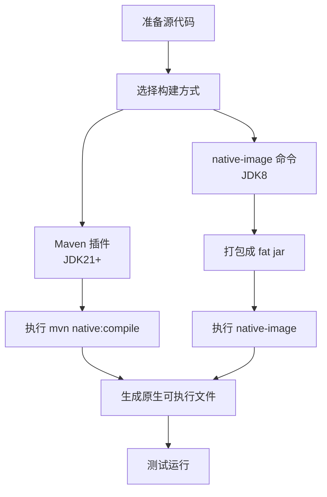

import CheckAuthorize from '../../../components/CheckAuthorize.astro'
import {Aside, TabItem, Tabs} from "@astrojs/starlight/components";

<CheckAuthorize/>

本指南介绍如何使用 GraalVM Native Image 将 Feat 应用编译为本地可执行文件。

## GraalVM Native Image 简介

GraalVM Native Image 是一种将 Java 应用程序编译为本地可执行文件的技术，相比传统 JVM 运行方式具有显著优势：

- **极速启动**：从秒级缩短到毫秒级
- **低内存占用**：减少 5-10 倍内存使用
- **独立部署**：不依赖 JVM，单文件可执行
- **容器优化**：更适合云原生和 Serverless 环境

## 前置要求

- GraalVM 21（推荐）或更高版本
- Maven 3.6+
- 原生镜像构建工具（`native-image`）

<Aside type="caution">
  当前 fastjson2 还不兼容 GraalVM 25，请使用 GraalVM 21 版本来构建原生镜像。
</Aside>

## 方式一：使用 Maven 插件构建（推荐）

适用于 JDK 21+ 项目。

### 配置 pom.xml

```xml
<plugin>
    <groupId>org.graalvm.buildtools</groupId>
    <artifactId>native-maven-plugin</artifactId>
    <version>0.11.3</version>
    <extensions>true</extensions>
    <configuration>
        <mainClass>tech.smartboot.feat.Bootstrap</mainClass>
        <buildArgs>
            <argument>--no-fallback</argument>
        </buildArgs>
    </configuration>
</plugin>
```

### 执行构建

```bash
mvn clean native:compile -Dmaven.compiler.source=8 -Dmaven.compiler.target=8
```

## 方式二：使用 native-image 命令构建

适用于 JDK 8 项目。

### 第一步：打包为 Fat Jar

```bash
mvn clean package
```

### 第二步：执行 native-image 命令

```bash
native-image \
  --no-fallback \
  --enable-url-protocols=http,https \
  -H:Name=helloworld_native \
  -jar target/helloworld_native.jar
```

## 完整示例

以下是一个简单的 Feat 应用示例，完整代码可在 [Gitee 示例项目](https://gitee.com/smartboot/feat/tree/master/demo/helloworld_native) 中找到：

```java
@Controller
public class Bootstrap {

    @RequestMapping("/hello")
    public String helloWorld() {
        return "hello Feat Cloud";
    }

    public static void main(String[] args) {
        FeatCloud.cloudServer().listen();
    }
}
```

## 测试原生镜像

构建完成后，测试原生镜像的运行效果：

```bash
# 启动原生镜像
./helloworld_native

# 测试基本功能
curl http://localhost:8080/hello
```

## 构建流程



## 最佳实践

### 避免运行时动态特性

尽量避免使用运行时动态特性：

```java
// 不推荐
Class<?> clazz = Class.forName(className);
Method method = clazz.getMethod("methodName");

// 推荐
// 使用 Feat AOT 编译替代运行时反射
```

### 使用 Feat AOT 优势

Feat 框架通过 [AOT 编译机制](/feat/appendix/aot/)，天然适合 GraalVM Native Image 构建。相比其他框架需要大量配置才能构建原生镜像，Feat 几乎无需额外工作即可获得高性能原生应用。

## 故障排除

### 常见问题

| 问题 | 原因 | 解决方案 |
|------|------|----------|
| ClassNotFoundException | 缺少类路径配置 | 检查依赖完整性 |
| NoSuchMethodException | 反射配置缺失 | 添加反射配置 |
| Resource not found | 资源文件未包含 | 配置资源包含规则 |

### 调试技巧

启用 GraalVM 诊断输出以定位问题：

```bash
native-image \
  --no-fallback \
  -H:+PrintAnalysisCallTree \
  -H:AnalysisLogLevel=INFO \
  -jar target/helloworld_native.jar
```

## 性能对比

| 指标 | JVM 模式 | Native Image |
|------|----------|--------------|
| 启动时间 | 秒级 | 毫秒级 |
| 内存占用 | 较高 | 降低 5-10 倍 |
| 包体积 | 较小（需 JVM） | 较大（独立运行） |
| 峰值性能 | JIT 优化后高 | 略低于 JIT |

## 适用场景

- **云原生应用**：容器化部署、Kubernetes
- **Serverless**：函数计算、Lambda
- **微服务**：快速启动、弹性伸缩
- **边缘计算**：资源受限环境
