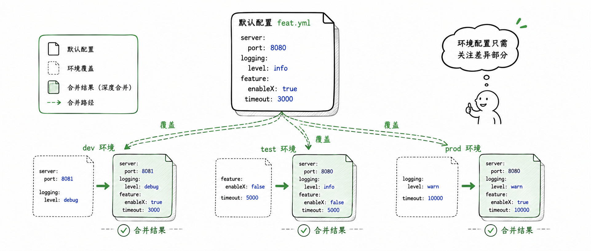

import { Aside } from '@astrojs/starlight/components';

Feat Cloud 里有三类配置容易混在一起：

- `CloudOptions`：启动应用时传给 Feat Cloud 的运行时选项
- `feat.yml` / `feat-{env}.yml`：编译期生成代码时读取的配置输入
- `${...}` 占位符：写在 `feat.yml` 的值里，运行时从系统属性/环境变量取值

这章分两段展开：

- 前半段讲 `CloudOptions`：启动入口里本次应用怎么跑
- 后半段讲 `feat.yml`：不同环境如何参与编译期生成，以及值如何在运行时注入

核心判断：**启动入口里本次怎么跑，看 `CloudOptions`；会影响生成代码的环境差异，看 `feat.yml`；要在运行时注入密钥等值，用 `${}`。**

## CloudOptions 启动配置

这一部分只处理启动入口里的运行时选项：扫描哪些包、提前注册哪些对象、是否托管静态资源。

### 先划清边界

`CloudOptions` 继承自 [`ServerOptions`](/feat/server/serveroptions/)，所以端口、线程数、调试模式、HTTPS 这类基础能力仍然在 `ServerOptions` 里配置。

遇到这些问题时，通常看 `CloudOptions`：

- 控制器已经写好，但你想限制哪些包会被接受
- 有对象必须在 Feat Cloud 容器启动前就准备好
- 应用需要顺手托管 `classpath` 或文件系统里的静态资源
- 本次启动要临时调整端口、debug 或 Router

遇到这些问题时，通常看 `feat.yml` 或 Profile：

- 不同环境使用不同端口、数据库或 Redis
- Session 存储方式在本地和生产不同
- MyBatis、Redis 等扩展需要参与编译期生成
- 修改后需要重新构建才生效

### 启动时最常碰到的三件事

| 配置项 | 方法 | 典型用途 |
|------|------|------|
| 包扫描 | `setPackages(String...)` | 控制 Controller / Bean 的扫描范围 |
| 外部 Bean | `registerBean(String, Object)` | 把启动前已有对象注册进容器 |
| 静态资源 | `setStaticLocations(String)` | 托管类路径或本地目录里的静态文件 |

### 收窄扫描边界

如果你的启动类和控制器不在同一个合理的根包下，或者你只想限制扫描范围，可以显式设置包路径。

```java title="Bootstrap.java"
import tech.smartboot.feat.cloud.FeatCloud;

public class Bootstrap {
    public static void main(String[] args) {
        FeatCloud.cloudServer(options -> {
            options.setPackages(
                    "com.example.controller",
                    "com.example.service"
            );
        }).listen();
    }
}
```

什么时候应该用它：

- 多模块项目里，控制器不在启动类同包或子包
- 你只想扫描少量包，提高启动阶段的可控性
- 你要避免把不相关 demo 或测试类扫进来

如果启动类本身已经位于合理根包下，很多情况下不需要写 `setPackages(...)`。

### 把已有对象交给容器

有些对象不是通过 Feat Cloud 自己创建的，比如数据源、第三方客户端、配置对象。这时可以在启动时手动注册。

```java title="ExternalBeanDemo.java"
import tech.smartboot.feat.cloud.FeatCloud;

public class ExternalBeanDemo {
    public static void main(String[] args) {
        FeatCloud.cloudServer(options -> {
            options.registerBean("dataSource", createDataSource());
            options.registerBean("buildVersion", "1.0.0");
        }).listen();
    }

    private static Object createDataSource() {
        return new Object();
    }
}
```

`registerBean(...)` 的 key 不能重复。源码里如果发现同名 key，会直接抛 `FeatException`。

```java title="重复注册同名 Bean 会失败"
options.registerBean("dataSource", ds1);
options.registerBean("dataSource", ds2); // 会失败
```

### 托管静态资源

Feat Cloud 默认静态资源目录是 `classpath:static`。如果你项目里有前端页面、上传后的公开文件或静态文档，可以直接改位置。

```java title="StaticLocationDemo.java"
import tech.smartboot.feat.cloud.FeatCloud;

public class StaticLocationDemo {
    public static void main(String[] args) {
        FeatCloud.cloudServer(options -> {
            options.setStaticLocations("classpath:public");
        }).listen();
    }
}
```

你可以使用两种路径形式：

```java title="静态资源配置"
options.setStaticLocations("classpath:static");
options.setStaticLocations("classpath:public");
options.setStaticLocations("/var/www/static");
options.setStaticLocations("./public");
```

当你配置静态资源目录后，Feat Cloud 会使用静态资源处理器提供目录首页、常见文件类型识别、`Last-Modified` 缓存和 404 返回。

<Aside type="caution">
`setStaticLocations(...)` 不只是记住一个路径，它会顺手创建一个新的 `Router` 来挂载静态资源处理器。所以如果你还要自定义底层路由，请明确知道谁是最终生效的 Router。
</Aside>

### 把启动策略写在入口

实际项目里，这几个配置项经常一起出现：

```java title="CloudOptionsDemo.java"
import tech.smartboot.feat.cloud.FeatCloud;

public class CloudOptionsDemo {
    public static void main(String[] args) {
        FeatCloud.cloudServer(options -> {
            options.port(8080);
            options.debug(true);

            options.setPackages("com.example.controller", "com.example.service");
            options.registerBean("dataSource", createDataSource());
            options.setStaticLocations("classpath:public");
        }).listen();
    }

    private static Object createDataSource() {
        return new Object();
    }
}
```

这段代码表达的是本次应用如何启动。它不会替代 `feat.yml` 的环境配置，也不会改变已经生成好的代码结构。

## Profile 环境配置

从这里开始，关注点从“本次启动怎么跑”切到“不同环境如何生成代码”。



### 文件命名

业务应用很少只有一个运行环境。本地开发可能连本机数据库，测试环境要打开更多日志，生产环境则使用独立的数据库、Redis 和端口。

默认配置文件有两种写法：

- `feat.yml`
- `feat.yaml`

环境配置文件也有两种写法：

- `feat-dev.yml`
- `feat-dev.yaml`
- `feat-prod.yml`
- `feat-prod.yaml`

其中 `dev`、`prod` 就是环境名。环境名只能包含字母和数字，例如 `dev`、`test`、`prod`、`gray1`。

<Aside type="caution">
不要使用 `feat-prod-us.yml` 这类带横线的环境名。当前环境名只允许字母和数字，横线、下划线和点号都不会被识别为合法环境名。
</Aside>

### 最小可用结构

一个典型项目可以这样组织资源文件：

```text title="src/main/resources"
src/main/resources/
├── feat.yml
├── feat-dev.yml
└── feat-prod.yml
```

`feat.yml` 放所有环境都共享的默认值：

```yaml title="feat.yml"
server:
  port: 8080

feat:
  datasource:
    url: jdbc:mysql://localhost:3306/app
    username: app
    password: app
```

`feat-dev.yml` 只写开发环境要覆盖的内容：

```yaml title="feat-dev.yml"
server:
  port: 8081

feat:
  datasource:
    url: jdbc:mysql://localhost:3306/app_dev
    username: dev
    password: dev
```

### `server:` 块支持的配置项

`feat.yml` 的 `server:` 块并不是所有 `ServerOptions` 选项都能配。AOT 只会绑定 `int` 和 `String` 类型的字段，因此 `boolean`、`long` 类字段写在这里不生效。

| 配置项 | 类型 | 说明 |
|------|------|------|
| `port` | int | 监听端口 |
| `host` | String | 绑定地址 |
| `threadNum` | int | 工作线程数 |
| `headerLimiter` | int | 请求头数量上限 |
| `readBufferSize` / `writeBufferSize` | int | 读写缓冲区大小 |
| `autoSSL` | 特殊 | 设为 `true` 启用自动 HTTPS |
| `session.store-type` | 特殊 | 设为 `redis` 切换为 Redis 会话存储 |
| `session.timeout` | 特殊 | 会话超时时间 |

这些值同样支持 `${}` 占位符，例如 `port: ${port}`。

<Aside type="caution">
`debug` 看起来像 `server:` 的一项，但它不是字段、而是方法，且 `boolean` 不在可绑定类型内，写在 `feat.yml` 里不会生效。调试模式只能通过启动入口的 `options.debug(true)` 打开。
</Aside>

### 合并规则

Feat Cloud 会先读取默认配置，再读取环境配置。

对 `dev` 环境来说，顺序是：

1. 读取 `feat.yml`
2. 读取 `feat-dev.yml`
3. 将 `feat-dev.yml` 的内容覆盖到默认配置上

覆盖粒度遵循一个规则：**对象深度合并，普通值和数组整体替换。**

```yaml title="feat.yml"
server:
  port: 8080
  host: 0.0.0.0
```

```yaml title="feat-dev.yml"
server:
  port: 8081
```

合并后，`server.port` 会被覆盖，而 `host` 会继续保留：

```yaml title="dev 环境最终配置"
server:
  port: 8081
  host: 0.0.0.0
```

如果环境文件里的值是数组，则以环境配置为准，不会和默认数组拼接。

### 用 `${}` 引用系统属性和环境变量

`feat.yml` 里的值不一定要写死。只要把值写成 `${...}` 形式，Feat Cloud 就不会把它当成字面量，而是在运行时从系统属性和环境变量里解析。这正是把敏感信息（数据库口令、Nacos 凭据、第三方 Token）从代码仓库里挪出去的官方做法。

```yaml title="feat.yml"
feat:
  datasource:
    url: jdbc:mysql://localhost:3306/app
    username: ${db.username}
    password: ${db.password}
```

`username`、`password` 整条值都是 `${...}`，运行时会解析。打包后，配置文件本身可以安全提交到仓库；真正的密钥在启动时注入：

```bash title="运行时注入"
java -Ddb.username=app -Ddb.password=secret -jar yourapp.jar
# 或者用环境变量
DB_USERNAME=app DB_PASSWORD=secret java -jar yourapp.jar
```

<Aside type="warning">
`${}` 只在**整个值**恰好是 `${...}` 时才解析，不能嵌在更长字符串中间。`url: jdbc:mysql://${db.host}/app` 不会被替换，`db.host` 会原样留在地址里。如果整条地址也要注入，就把它作为一个完整变量：`url: ${db.url}`，再通过 `-Ddb.url=...` 或 `DB_URL` 提供。
</Aside>

#### 支持的写法

| 写法 | 含义 |
|------|------|
| `${name}` | 运行时解析 `name`，找不到则字符串为 `null`、整数为 `0` |
| `${name:default}` | 找不到时使用 `default` 作为字面默认值，按第一个 `:` 拆分 |

`default` 是一段普通文本，不会被再次解析。`:` 只在第一个出现时作为分隔符，所以含 `:` 的默认值可以放心写，例如 `${db.url:jdbc:mysql://localhost:3306/app}` 的默认值就是整条地址。

<Aside type="caution">
整数类型的占位符只用 `${name}` 这一种写法，不要带非零默认值。带非零默认值的整数占位，在系统属性/环境变量确实提供值时会解析失败。需要默认端口，直接把数字写进 `feat.yml` 更稳妥。
</Aside>

#### 解析来源与优先级

`feat.yml` 里的 `${name}` 不是引用另一条配置项，而是去外部取值，顺序是：

1. **JVM 系统属性**：名字原样使用，例如 `-Ddb.password=secret` 匹配 `${db.password}`
2. **操作系统环境变量**：名字按“点号转下划线、全大写”规则转换，例如 `${db.password}` 对应环境变量 `DB_PASSWORD`
3. 都没有时，使用 `:default`，没有默认值则字符串为 `null`、整数为 `0`

<Aside type="caution">
这不是 Spring 那种“配置项之间互相引用”的占位符。`${db.password}` 不会去读 `feat.yml` 里的另一条 `db.password`，它只看系统属性和环境变量。如果你要的是“把 `feat.yml` 里某个值注入到某个 Bean 字段”，那是 `@Value("${...}")` 注解的职责，见 [Bean 注入](/feat/cloud/bean/)，两者名字像但机制不同。
</Aside>

#### 哪些配置项支持

`${}` 只对 Feat Cloud 在编译期消费的配置值生效，典型包括：

- `server.*` 启动项，例如 `server.port: ${port}`
- `feat.datasource.*` 的 `url`、`username`、`password`、`driver`
- `feat.redis.*` 的 `username`、`password`、`database`
- 被 `@Value("${...}")` 注入的字段所引用的配置值

自己用代码直接从配置里读出来的值不会被替换。所以 `${}` 应该写在 Feat Cloud 已经接管的那几个配置块里，而不是任意 YAML 键上。

#### 和 Profile 的关系

`${}` 解析发生在运行时，而 `feat.profiles.active` 选择环境也发生在运行时，但两者互不依赖：每个环境的 `feat-{env}.yml` 都可以各自使用 `${}`。常见做法是把结构性的环境差异（端口、地址）交给 Profile，把同一份配置里需要保密的值交给 `${}`，配合使用：

```yaml title="feat-prod.yml"
feat:
  datasource:
    url: jdbc:mysql://prod-db.example.com:3306/app
    username: ${db.username}
    password: ${db.password}
```

这样生产环境的地址走 Profile 覆盖，凭据走运行时注入，仓库里既看不到口令，也不必为每个环境硬编码账号。Nacos 凭据的同一种用法可以参考 [Nacos 接入](/feat/cloud/nacos/)。

### 编译期会生成什么

如果项目里只有 `feat.yml`，Feat Cloud 只会生成默认环境的一套代码。

如果同时存在 `feat-dev.yml`、`feat-prod.yml`，Feat Cloud 会为每个环境生成一套完整代码：

| 配置文件 | 生成类名示例 |
|---------|-------------|
| `feat.yml` | `FeatApplication` |
| `feat-dev.yml` | `FeatApplicationDev` |
| `feat-prod.yml` | `FeatApplicationProd` |

Controller、Bean、Mapper 等生成类也会追加同样的环境后缀。这样做是为了让每个环境都有独立的配置结果，同时避免生成类同名冲突。

### 运行时如何选择环境

打包后的应用里可能已经包含多套环境代码。启动时通过 `feat.profiles.active` 选择其中一套：

```bash title="使用 JVM 参数"
java -Dfeat.profiles.active=dev -jar yourapp.jar
```

也可以使用环境变量：

```bash title="使用环境变量"
FEAT_PROFILES_ACTIVE=prod java -jar yourapp.jar
```

如果两者都没有设置，Feat Cloud 会使用默认环境，也就是 `feat.yml` 对应的那套生成结果。

### 什么时候应该拆环境配置

适合拆分的内容通常有这些：

- 端口
- 数据库地址
- Redis 地址
- 会话存储方式
- 第三方服务地址
- 只在某个环境启用的 Feat Cloud 扩展配置

不建议把业务开关、灰度策略或用户级动态规则放进 `feat-{env}.yml`。这些配置更适合放进数据库、配置中心或业务自己的配置系统，因为它们通常需要运行时调整。

### 重新构建才会生效

多环境配置影响的是编译期生成结果。如果你修改了 `feat-dev.yml`，只重启已经打好的 jar 不会生效，需要重新执行构建。

```bash title="重新生成代码并打包"
mvn clean package
```

这也是 Feat Cloud profile 与传统运行期 profile 最大的区别：它追求的是启动时少扫描、少反射、少动态决策，而不是运行时随时重载配置。
