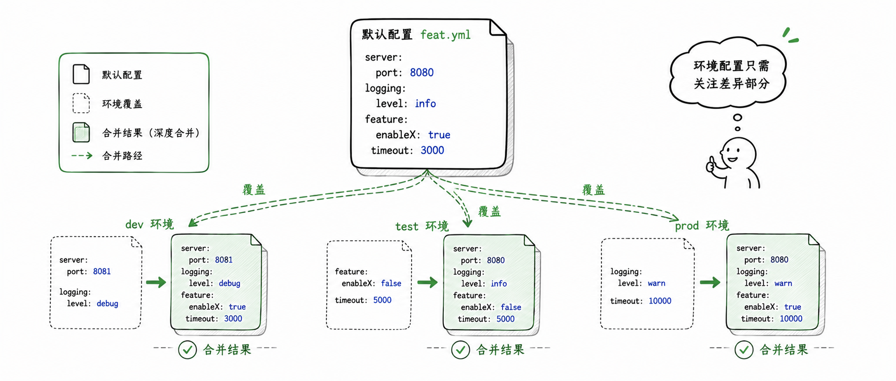

import { Aside } from "@astrojs/starlight/components";

业务应用很少只有一个运行环境。本地开发可能连本机数据库，测试环境要打开更多日志，生产环境则使用独立的数据库、Redis 和端口。

如果你只需要改端口、数据库地址或 Redis 地址，不应该为每个环境维护一份 Java 代码。  
更合理的做法是把公共配置放在 `feat.yml`，再用 `feat-dev.yml`、`feat-prod.yml` 写环境差异。

## 为什么它发生在编译期

Feat Cloud 的很多能力来自编译期生成：Controller 路由、Bean 装配、配置值注入都会提前转成 Java 代码。  
这和运行时读取配置再反射装配的框架不同。

所以 `feat.yml` 不是一个普通的运行时配置文件。  
对 Feat Cloud 来说，它是注解处理器生成代码时读取的输入。

这带来两个结果：

- 配置变更后需要重新编译，生成代码才会更新
- 多环境配置会在编译期展开成多套生成代码

## 文件命名约定

默认配置文件有两种写法：

- `feat.yml`
- `feat.yaml`

环境配置文件也有两种写法：

- `feat-dev.yml`
- `feat-dev.yaml`
- `feat-prod.yml`
- `feat-prod.yaml`

其中 `dev`、`prod` 就是环境名。环境名只能包含字母和数字，例如 `dev`、`test`、`prod`、`gray1`。

<Aside type="caution">
不要使用 `feat-prod-us.yml` 这类带横线的环境名。当前环境名只允许字母和数字，横线、下划线和点号都不会被识别为合法环境名。
</Aside>

## 最小可用结构

一个典型项目可以这样组织资源文件：

```text title="src/main/resources"
src/main/resources/
├── feat.yml
├── feat-dev.yml
└── feat-prod.yml
```

`feat.yml` 放所有环境都共享的默认值：

```yaml title="feat.yml"
server:
  port: 8080
  debug: false

feat:
  datasource:
    url: jdbc:mysql://localhost:3306/app
    username: app
    password: app
```

`feat-dev.yml` 只写开发环境要覆盖的内容：

```yaml title="feat-dev.yml"
server:
  port: 8081

feat:
  datasource:
    url: jdbc:mysql://localhost:3306/app_dev
    username: dev
    password: dev
```

`feat-prod.yml` 写生产环境差异：

```yaml title="feat-prod.yml"
server:
  port: 80

feat:
  datasource:
    url: jdbc:mysql://db.prod:3306/app
    username: app
    password: prod-password
```

## 合并规则

Feat Cloud 会先读取默认配置，再读取环境配置。

对 `dev` 环境来说，顺序是：

1. 读取 `feat.yml`
2. 读取 `feat-dev.yml`
3. 将 `feat-dev.yml` 的内容覆盖到默认配置上

这里最容易误解的是“覆盖”的粒度。  
Feat Cloud 会对 YAML 对象做深度合并：同名对象继续向下合并，普通值和数组则由环境配置替换默认配置。

看这个例子：

```yaml title="feat.yml"
server:
  port: 8080
  debug: false
  host: 0.0.0.0
```

```yaml title="feat-dev.yml"
server:
  port: 8081
```

合并后，`server.port` 会被 `feat-dev.yml` 覆盖，而 `debug` 和 `host` 会继续保留默认值：

```yaml title="dev 环境最终参与生成的 server 配置"
server:
  port: 8081
  debug: false
  host: 0.0.0.0
```

如果环境文件里的值不是对象，而是普通值或数组，就会整体替换默认值。比如：

```yaml title="feat-dev.yml"
server:
  interceptors:
    - devTrace
```

这里的 `interceptors` 会以 `feat-dev.yml` 中的数组为准，不会和默认数组拼接。对象深度合并，数组整体替换，这是多环境配置最重要的判断规则。

## 编译期会生成什么

如果项目里只有 `feat.yml`，Feat Cloud 只会生成默认环境的一套代码。

如果同时存在 `feat-dev.yml`、`feat-prod.yml`，Feat Cloud 会为每个环境生成一套完整代码：

| 配置文件 | 生成类名示例 |
|---------|-------------|
| `feat.yml` | `FeatApplication` |
| `feat-dev.yml` | `FeatApplicationDev` |
| `feat-prod.yml` | `FeatApplicationProd` |

Controller、Bean、Mapper 等生成类也会追加同样的环境后缀。这样做是为了让每个环境都有独立的配置结果，同时避免生成类同名冲突。

## 运行时如何选择环境

打包后的应用里可能已经包含多套环境代码。启动时通过 `feat.profiles.active` 选择其中一套：

```bash title="使用 JVM 参数"
java -Dfeat.profiles.active=dev -jar yourapp.jar
```

也可以使用环境变量：

```bash title="使用环境变量"
FEAT_PROFILES_ACTIVE=prod java -jar yourapp.jar
```

如果两者都没有设置，Feat Cloud 会使用默认环境，也就是 `feat.yml` 对应的那套生成结果。

<Aside type="tip">
如果项目里只有一份默认配置，就不需要设置 `feat.profiles.active`。这时生成代码里不会多出 profile 判断，启动行为和普通单环境项目一致。
</Aside>

## 什么时候应该拆环境配置

适合拆分的内容通常有这些：

- 端口
- 数据库地址
- Redis 地址
- 会话存储方式
- 第三方服务地址
- 只在某个环境启用的 Feat Cloud 扩展配置

不建议把业务开关、灰度策略或用户级动态规则放进 `feat-{env}.yml`。  
这些配置更适合放进数据库、配置中心或业务自己的配置系统，因为它们通常需要运行时调整。

## 重新构建才会生效

多环境配置影响的是编译期生成结果。  
如果你修改了 `feat-dev.yml`，只重启已经打好的 jar 不会生效，需要重新执行构建。

```bash title="重新生成代码并打包"
mvn clean package
```

这也是 Feat Cloud profile 与传统运行期 profile 最大的区别：它追求的是启动时少扫描、少反射、少动态决策，而不是运行时随时重载配置。
