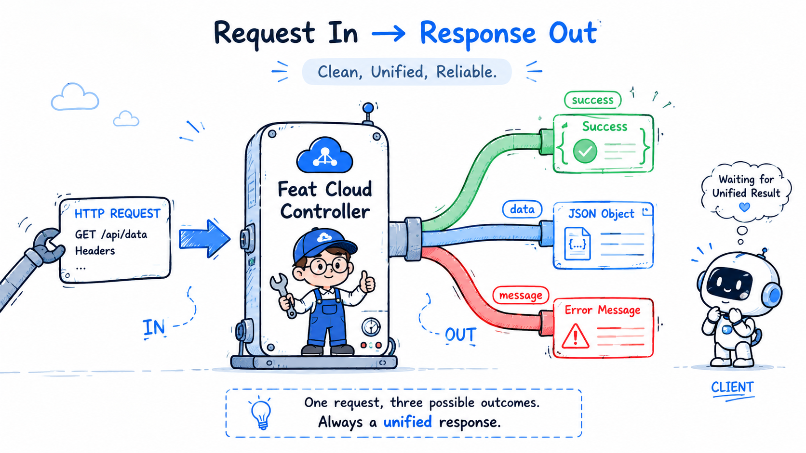
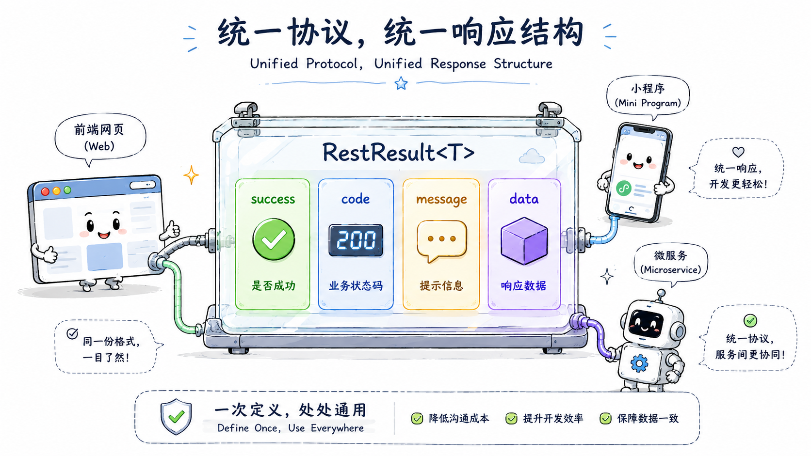

import { Aside, Tabs, TabItem } from '@astrojs/starlight/components';

前面的章节已经解决了“请求如何进入方法”。这一章换到出口：Controller 方法返回什么，Feat Cloud 就如何把它写回客户端。

对业务接口来说，返回值不只是“能输出 JSON”。它还承担三个职责：让调用方知道请求是否成功，拿到业务数据，并在失败时得到可处理的错误信息。

## 基础返回值

先看最直接的两类返回值：文本和对象。

### 直接返回文本

最短的接口可以直接返回 `String`。这种方式适合健康检查、简单文本响应或非常小的演示接口。

```java title="HealthController.java"
import tech.smartboot.feat.cloud.annotation.Controller;
import tech.smartboot.feat.cloud.annotation.RequestMapping;
import tech.smartboot.feat.cloud.annotation.RequestMethod;

@Controller("health")
public class HealthController {

    @RequestMapping(value = "/ping", method = RequestMethod.GET)
    public String ping() {
        return "pong";
    }
}
```

验证：

```shell title="curl 验证"
curl http://localhost:8080/health/ping
```

返回：

```text title="响应结果"
pong
```

### 返回对象或集合

如果返回的是自定义对象、集合或 `Map`，Feat Cloud 会把它序列化为 JSON。

```java title="UserController.java"
import java.util.HashMap;
import java.util.Map;

@RequestMapping(value = "/info", method = RequestMethod.GET)
public Map<String, Object> info() {
    Map<String, Object> data = new HashMap<>();
    data.put("framework", "Feat Cloud");
    data.put("type", "aot-web");
    return data;
}
```

返回结果类似：

```json title="响应结果"
{
  "framework": "Feat Cloud",
  "type": "aot-web"
}
```

这种写法适合很小的内部接口。只要接口会被前端、移动端或其他服务长期依赖，就建议使用统一响应对象。

## 统一业务响应

当接口会被前端、移动端或其他服务长期依赖时，建议使用稳定响应结构。

### 用 RestResult 统一业务响应
`RestResult<T>` 是 Feat Cloud 提供的通用响应封装。它把一次业务调用拆成四个字段：

| 字段 | 含义 |
|------|------|
| `success` | 业务是否成功 |
| `code` | 业务响应码 |
| `message` | 失败说明 |
| `data` | 成功时返回的数据 |

```java title="UserController.java"
import tech.smartboot.feat.cloud.RestResult;
import tech.smartboot.feat.cloud.annotation.Controller;
import tech.smartboot.feat.cloud.annotation.PathParam;
import tech.smartboot.feat.cloud.annotation.RequestMapping;

@Controller("users")
public class UserController {

    @RequestMapping("/{username}")
    public RestResult<User> getUser(@PathParam("username") String username) {
        User user = findUser(username);
        if (user == null) {
            return RestResult.fail("User not found");
        }
        return RestResult.ok(user);
    }
}
```

示例里的 `User` 和 `findUser(...)` 可以替换成你自己的领域对象和查询逻辑。这里重点看响应结构。

<Tabs>
  <TabItem label="成功响应">
    ```json title="响应结果"
    {
      "success": true,
      "code": 200,
      "data": {
        "username": "feat",
        "role": "admin"
      }
    }
    ```
  </TabItem>
  <TabItem label="失败响应">
    ```json title="响应结果"
    {
      "success": false,
      "code": 500,
      "message": "User not found"
    }
    ```
  </TabItem>
</Tabs>

`RestResult.fail(...)` 表达的是业务失败，不等同于 HTTP 传输失败。也就是说，客户端仍然拿到一个结构稳定的 JSON 响应，可以按 `success` 和 `code` 做统一处理。

### 什么时候不用 RestResult

不是所有接口都必须包一层 `RestResult`。

- 健康检查、纯文本页面、简单调试接口，可以直接返回 `String`
- 文件下载、图片、静态资源这类响应，更适合交给底层响应能力或静态资源处理
- 对外稳定业务 API，建议使用 `RestResult`

关键不是形式统一，而是调用方能不能稳定理解你的响应。

## 编译期序列化如何工作

把它先理解成一件很具体的事：**你写业务返回值，Feat Cloud 在编译期替你补上“怎么写到响应流里”这段样板代码**。

如果只说“编译期生成代码”，读者很容易觉得抽象。更直观的方式，是直接看它生成出来大概长什么样。

以一个返回 `String` 的接口为例，源码里你只写：

```java
public String helloWorld() {
    return "hello world";
}
```

但编译后，框架实际做的事情大致类似下面这样：

```java
String rst = bean.helloWorld();
byte[] bytes = rst.getBytes("UTF-8");
if (bytes.length > 256) {
    bytes = tech.smartboot.feat.core.common.FeatUtils.gzip(bytes);
    ctx.Response.setHeader("Content-Encoding", "gzip");
}
ctx.Response.setContentLength(bytes.length);
ctx.Response.write(bytes);
```

换句话说，编译期序列化不是“神秘地帮你返回 JSON”，而是把“把返回值转成字节并写出去”这件事提前展开成了普通 Java 代码。

注解处理器会分析 Controller 方法的返回类型，并为常见类型生成直接写出逻辑。

| 类型 | 序列化方式 |
|------|-----------|
| `String`、基本类型、包装类型 | 直接写输出流 |
| `Date`、`Timestamp` | 直接格式化后写输出流 |
| 自定义 POJO | 按 getter 生成访问代码 |
| `List`、`Map` | 生成遍历代码 |
| 数组、`Object`、嵌套过深对象 | 回退到 FastJSON2 |

如果返回的是 `RestResult<List<Map<String, String>>>` 这种更复杂的结构，生成出来的代码会更像“按字段逐个写出”：

```java
RestResult<List<Map<String, String>>> rst = bean.hello1ss2();
os.write(b_success_true);
os.write(b_code);
writeInt(os, rst.getCode());
os.write(b_message);
writeJsonValue(os, rst.getMessage());
os.write(b_data);
```

这也是 Feat Cloud 性能模型的一部分：框架尽量在编译期确定响应结构，运行时少做反射和动态判断。对读者来说，真正能感受到的不是术语，而是“我写的一个返回值，最后会被展开成一段具体的写出逻辑”。

<Aside type="caution">
`AsyncResponse` 的完成结果发生在运行时，编译期无法提前知道具体对象结构，因此会走运行时 JSON 序列化。异步响应的写法放在 [Controller 与请求处理](/feat/cloud/controller/) 的运行时能力部分。
</Aside>
