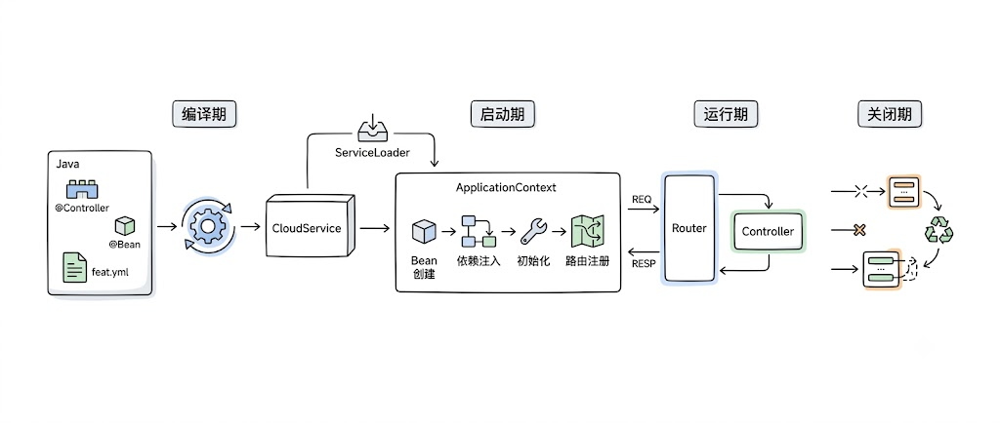

快速开始里，一个 `@Controller` 方法变成了可访问的 HTTP 路由。
这背后最重要的不是某个 API，而是 Feat Cloud 的工作模型：开发时用注解表达意图，编译期生成普通 Java 代码，运行时加载这些生成结果。

理解这一点之后，后面的 Controller、Bean、Profile、MyBatis、MCP 和部署问题都会更容易判断。

## 从注解到 `CloudService`

当项目执行 `mvn compile` 时，`feat-cloud-starter` 中的注解处理器会读取 `@Controller`、`@Bean`、`@Autowired`、`@RequestMapping` 等注解，并生成 `CloudService` 实现类。

这些生成类承担几类工作：

- 创建 Controller 和 Bean 实例
- 为字段注入依赖
- 调用初始化方法
- 把 URL 路由注册到 `Router`
- 在应用关闭时释放资源

所以运行时并不需要重新理解一遍你的注解。  
它只要通过 `ServiceLoader` 找到这些生成类，然后按固定生命周期调用即可。

## 启动生命周期

Feat Cloud 启动时，`ApplicationContext` 会按顺序调用所有 `CloudService`：

1. `loadBean(...)`：创建 Bean，并注册到应用上下文
2. `loadMethodBean(...)`：处理通过方法声明的 Bean
3. `autowired(...)`：完成依赖注入
4. `postConstruct(...)`：执行初始化逻辑
5. `router(...)`：注册 HTTP 路由
6. `destroy()`：应用关闭时释放资源



这个顺序解释了很多行为：为什么 Bean 要先创建再注入，为什么路由要等初始化完成后才注册，为什么启动日志里能直接打印出最终路由。

## 这对开发方式意味着什么

编译期生成带来的好处很直接：

- 启动时少做扫描和反射
- 路由和装配逻辑更接近普通方法调用
- 更容易进入 Native Image 路线
- 配置错误更容易在构建阶段暴露

它也带来一个边界：当你修改 Controller、Bean 或 `feat.yml` 这类编译期输入后，需要重新编译。  
如果只重启已经打好的 jar，生成代码不会自动变化。

## 修改后为什么要重新构建

Controller、Bean、`feat.yml` 和 MCP 声明都是编译期输入。你改了这些内容之后，旧 jar 里的生成代码不会自动变化。

所以本地开发时，IDE 要真正触发 Maven 编译；部署前，也要重新执行构建命令：

```bash title="重新生成并打包"
mvn clean package
```

如果你遇到“代码明明改了，路由或配置却没变化”，第一反应应该是检查生成代码有没有更新，而不是只重启应用。
