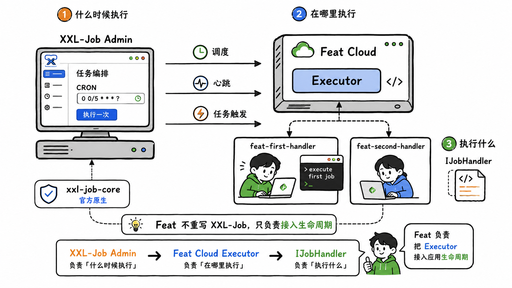
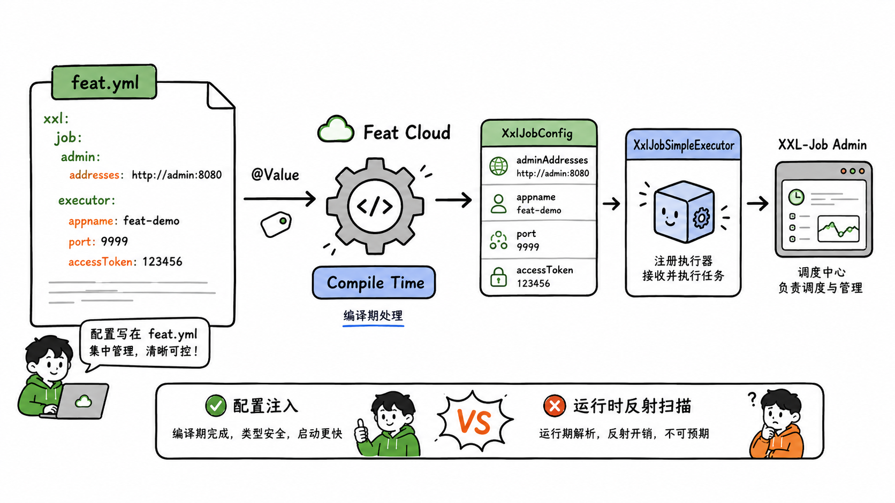
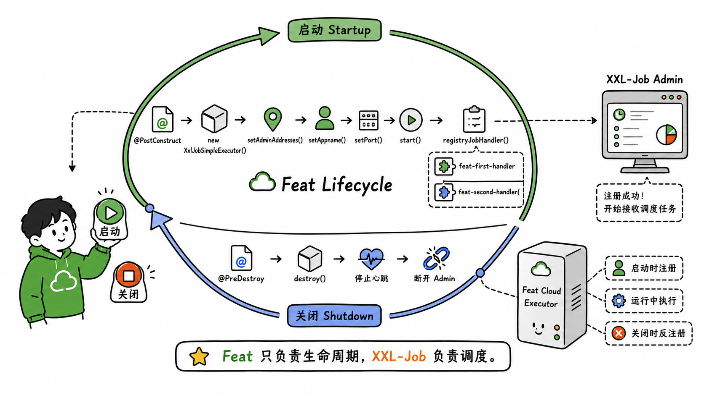
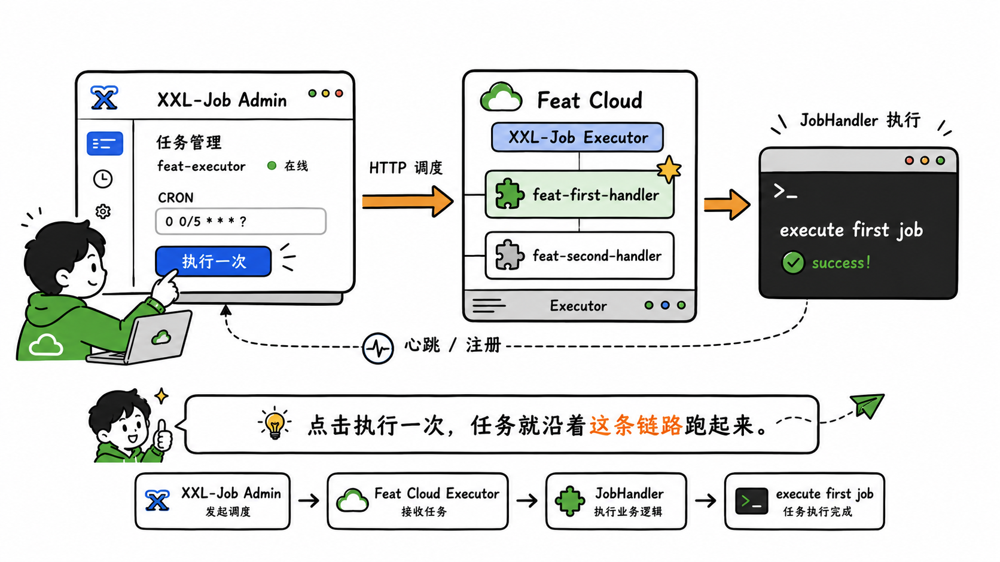

import { Aside } from '@astrojs/starlight/components';

单体应用里，一个 `@Scheduled` 就能跑定时任务。到了分布式环境，同一任务可能在多个实例上同时触发，失败重试、分片执行、动态启停都得靠调度中心统一编排。XXL-Job 把这件事拆成了两个角色：Admin 负责任务编排和触发，Executor 负责真正执行业务逻辑。

Feat Cloud 没有内置 XXL-Job starter，本文直接用官方 `xxl-job-core`，在编译期把配置注入 Bean、在启动期把执行器跑起来、在停机期把它干净地关掉。多写几十行胶水代码，换来的是每一行都看得见——执行器在哪启动、任务怎么注册、停机时怎么反注册。



## 添加依赖

在 `pom.xml` 中加入 `xxl-job-core`：

```xml title="pom.xml"
<dependency>
    <groupId>com.xuxueli</groupId>
    <artifactId>xxl-job-core</artifactId>
    <version>2.4.0</version>
</dependency>
```

`xxl-job-core` 管运行期，`feat-cloud-starter` 管编译期生成代码，两者互不替代。

## 配置执行器参数

在 `feat.yml` 里声明调度中心地址和执行器参数：

```yaml title="feat.yml"
xxl:
  job:
    admin:
      addresses: http://127.0.0.1:8080
      timeout: 3
    executor:
      enabled: true
      appname: feat-executor
      accessToken: default_token
      ip:
      port: 9999
      address: http://host.docker.internal:9999
      logpath: ./xxl-job/jobhandler
      logretentiondays: 30
```

这些值会在编译期通过 `@Value` 注入到字段里。`@Value` 依赖字段对应的 setter 方法，字段叫 `adminAddresses`，就得有 `setAdminAddresses(...)`。嵌套配置用 `xxl.job.admin.addresses` 这种点号路径，自动映射到 `xxl` 下的 `job` 节点。具体规则可以回看 [Bean 与依赖注入](/feat/cloud/bean/)。

<Aside type="caution">
    生产环境的 `accessToken` 不要硬编码进配置文件提交到仓库。可以用 `${xxl.job.accessToken}` 占位符，运行时通过 JVM 参数 `-Dxxl.job.accessToken=xxx` 或环境变量 `XXL_JOB_ACCESSTOKEN=xxx` 注入。
</Aside>

## 写代码

整个集成只需要三个类：一个配置对象收拢 YAML 参数，两个任务处理器执行业务逻辑，一个启动类把它们串起来。

### 配置对象

`XxlJobConfig` 把 `feat.yml` 里的值收拢到一个 Bean 里，启动类只需要注入这一个对象，不用面对十几个散落的 `@Value` 字段。

```java title="XxlJobConfig.java"
package tech.smartboot.feat.xxljob;

import tech.smartboot.feat.cloud.annotation.Bean;
import tech.smartboot.feat.cloud.annotation.Value;

@Bean
public class XxlJobConfig {

    @Value("${xxl.job.admin.addresses}")
    private String adminAddresses;

    @Value("${xxl.job.admin.timeout}")
    private int timeout;

    @Value("${xxl.job.executor.enabled}")
    private boolean enabled;

    @Value("${xxl.job.executor.appname}")
    private String appname;

    @Value("${xxl.job.executor.accessToken}")
    private String accessToken;

    @Value("${xxl.job.executor.ip}")
    private String ip;

    @Value("${xxl.job.executor.port}")
    private int port;

    @Value("${xxl.job.executor.address}")
    private String address;

    @Value("${xxl.job.executor.logpath}")
    private String logPath;

    @Value("${xxl.job.executor.logretentiondays}")
    private int logRetentionDays;

    // getter & setter
}
```

### 任务处理器

任务处理器继承 `IJobHandler`，重写 `execute()`。Feat Cloud 用 `@Bean` 把它们注册进容器，启动时再手动挂到执行器上。

```java title="FirstJobHandler.java"
package tech.smartboot.feat.xxljob;

import com.xxl.job.core.handler.IJobHandler;
import tech.smartboot.feat.cloud.annotation.Bean;

@Bean
public class FirstJobHandler extends IJobHandler {

    @Override
    public void execute() throws Exception {
        System.out.println("execute first job");
    }
}
```

```java title="SecondJobHandler.java"
package tech.smartboot.feat.xxljob;

import com.xxl.job.core.handler.IJobHandler;
import tech.smartboot.feat.cloud.annotation.Bean;

@Bean
public class SecondJobHandler extends IJobHandler {

    @Override
    public void execute() throws Exception {
        System.out.println("execute second job");
    }
}
```

<Aside type="tip">
    如果任务需要接收参数，在 `execute()` 里通过 `XxlJobHelper.getJobParam()` 获取 Admin 下发的任务参数。分片任务则通过 `XxlJobHelper.getShardIndex()` 和 `XxlJobHelper.getShardTotal()` 获取分片信息。这些 API 来自 `xxl-job-core`，和 Feat Cloud 无关。
</Aside>

### 启动类

`Bootstrap` 负责执行器的完整生命周期：启动时创建 `XxlJobSimpleExecutor`、设置参数、启动服务、注册任务处理器；停机时销毁执行器，断开与 Admin 的心跳。

```java title="Bootstrap.java"
package tech.smartboot.feat.xxljob;

import com.xxl.job.core.executor.XxlJobExecutor;
import com.xxl.job.core.executor.impl.XxlJobSimpleExecutor;
import com.xxl.job.core.handler.IJobHandler;
import org.slf4j.Logger;
import org.slf4j.LoggerFactory;
import tech.smartboot.feat.cloud.FeatCloud;
import tech.smartboot.feat.cloud.annotation.Autowired;
import tech.smartboot.feat.cloud.annotation.Bean;
import tech.smartboot.feat.cloud.annotation.PostConstruct;
import tech.smartboot.feat.cloud.annotation.PreDestroy;

@Bean
public class Bootstrap {
    private static final Logger logger = LoggerFactory.getLogger(XxlJobConfig.class);

    @Autowired
    private XxlJobConfig xxlJobConfig;

    @Autowired
    private IJobHandler firstJobHandler;

    @Autowired
    private IJobHandler secondJobHandler;

    private XxlJobSimpleExecutor xxlJobSpringExecutor;

    @PostConstruct
    public void init() {
        logger.info(">>>>>>>>>>> xxl-job config init.");
        xxlJobSpringExecutor = new XxlJobSimpleExecutor();
        xxlJobSpringExecutor.setAdminAddresses(xxlJobConfig.getAdminAddresses());
        xxlJobSpringExecutor.setTimeout(xxlJobConfig.getTimeout());
        xxlJobSpringExecutor.setEnabled(xxlJobConfig.isEnabled());
        xxlJobSpringExecutor.setAppname(xxlJobConfig.getAppname());
        xxlJobSpringExecutor.setAccessToken(xxlJobConfig.getAccessToken());
        xxlJobSpringExecutor.setIp(xxlJobConfig.getIp());
        xxlJobSpringExecutor.setPort(xxlJobConfig.getPort());
        xxlJobSpringExecutor.setAddress(xxlJobConfig.getAddress());
        xxlJobSpringExecutor.setLogPath(xxlJobConfig.getLogPath());
        xxlJobSpringExecutor.setLogRetentionDays(xxlJobConfig.getLogRetentionDays());
        xxlJobSpringExecutor.start();

        XxlJobExecutor.registryJobHandler("feat-first-handler", firstJobHandler);
        XxlJobExecutor.registryJobHandler("feat-second-handler", secondJobHandler);
    }

    @PreDestroy
    public void destroy() {
        if (xxlJobSpringExecutor != null) {
            xxlJobSpringExecutor.destroy();
        }
    }

    // setter

    public static void main(String[] args) {
        FeatCloud.cloudServer().listen(8888);
    }
}
```

这里用了 `XxlJobSimpleExecutor` 而不是 `XxlJobSpringExecutor`，因为后者依赖 Spring 的 `ApplicationContext` 做自动扫描，Feat Cloud 没有 Spring 容器，只能手动设置参数并启动。

`registryJobHandler` 里硬编码的字符串 `"feat-first-handler"` 和 `"feat-second-handler"` 是 Admin 配置任务时填写的 `JobHandler` 名称，两边必须一致，否则 Admin 触发任务时执行器找不到对应的处理器。

## 跑起来验证

执行器跑起来之前，需要先有一个 Admin。demo 目录下提供了完整的 Docker Compose 配置，可以直接启动：

```bash title="启动调度中心"
cd demo/xxljob
docker compose up -d
```

Admin 启动后访问 `http://localhost:8080`，默认账号密码是 `admin / 123456`。然后启动 Feat Cloud 执行器：

```bash title="启动执行器"
mvn clean compile exec:java -Dexec.mainClass="tech.smartboot.feat.xxljob.Bootstrap"
```

进入 Admin 的「任务管理」，新增一条任务：
- 执行器选 `feat-executor`
- JobHandler 填 `feat-first-handler`
- 调度类型选 CRON，表达式填 `0/5 * * * * ?`（每 5 秒一次，仅用于验证）

保存后点击「执行一次」，观察执行器控制台，如果出现 `execute first job`，说明 Admin -> 执行器 -> JobHandler 的整条链路已经打通。

如果执行器没有自动注册到 Admin，检查这几点：
- `xxl.job.admin.addresses` 是否能从执行器网络访问到 Admin
- `appname` 是否与 Admin 里配置的执行器名称一致
- `accessToken` 是否匹配
- 执行器端口（默认 9999）是否被占用或拦截

## 几个要注意的点

- **任务幂等**：分布式调度下，网络超时或 Admin 重试可能导致同一任务被执行多次。`execute()` 里的业务逻辑必须是幂等的，或者通过数据库唯一索引、分布式锁等手段去重。
- **端口规划**：执行器的 `port` 是 Admin 回调触发任务的入口，容器化部署时要暴露这个端口，并确保与宿主机端口映射正确。
- **日志清理**：`logretentiondays` 建议设置为 7~30 天，避免任务日志无限增长撑爆磁盘。
- **优雅关闭**：`@PreDestroy` 里调用 `destroy()`，确保停机时先从 Admin 反注册，避免 Admin 继续向已下线的实例发调度请求。
- **鉴权**：生产环境的 Admin 必须修改默认密码，并设置独立的 `accessToken`，通过环境变量注入执行器，不要写死在配置文件里。

Feat 不包一层 starter，也不重写任务调度。XXL-Job 的 `XxlJobSimpleExecutor`、`IJobHandler`、`registryJobHandler`、心跳注册全是官方原生的东西；Feat 只负责把它接进生命周期：编译期注入配置、启动时初始化执行器、停机时释放资源。接其他调度框架时，套路也一样。