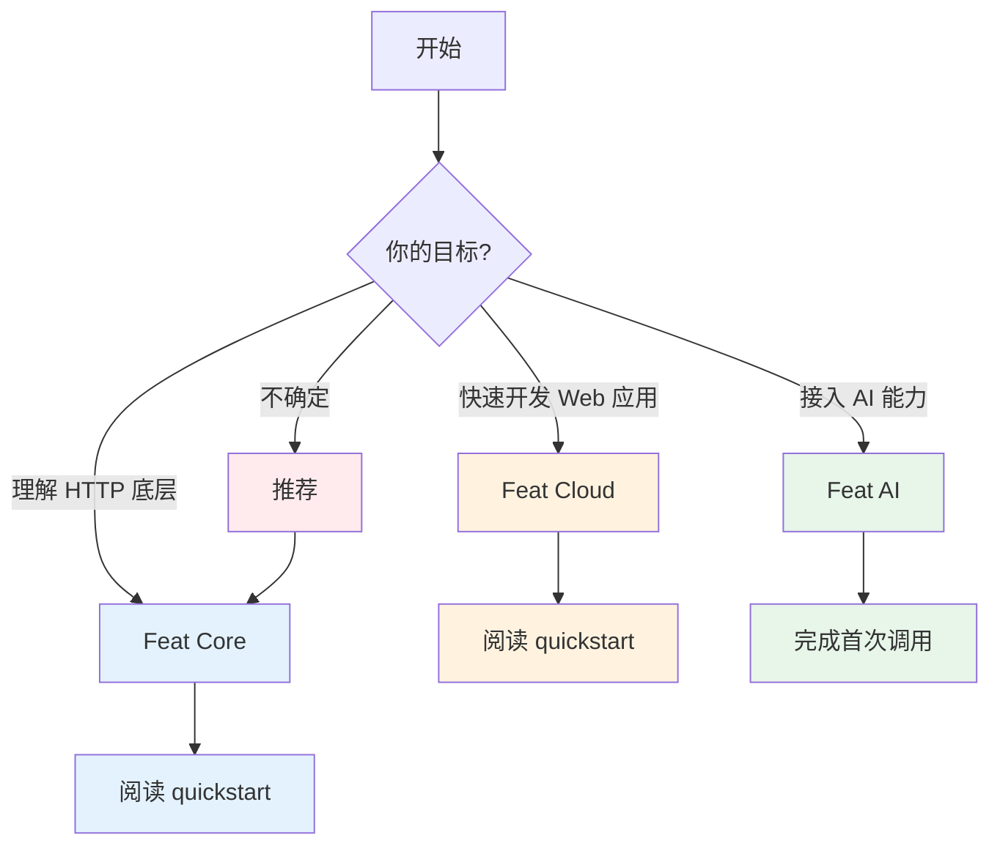

import { Aside, CardGrid, LinkCard } from '@astrojs/starlight/components';

Feat 的文档不适合从配置参考或附录开始看。更高效的方式是先选一条路径，跑通一个最小示例，再沿着那条路径继续往下读。

<Aside type="caution">
Feat 主线仓库采用 Apache 2.0。Feat Core 与 Feat AI 可直接使用；Feat Cloud 通过赞助支持模式开放，如需使用请先[成为赞助者](/feat/sponsors/)获取授权。
</Aside>

以下是 Feat 文档的推荐学习路径：

**图 1**：Feat 文档学习路径选择指南

## 选择一条路径

<CardGrid>
  <LinkCard
    title="Feat Core"
    href="/feat/server/getstart/"
    description="如果你想先理解 Feat 最底层的 HTTP 服务模型，从这里开始。"
  />
  <LinkCard
    title="Feat Cloud"
    href="/feat/cloud/quickstart/"
    description="如果你更习惯注解式开发，并且已经获得 Feat Cloud 授权，从这里开始。"
  />
  <LinkCard
    title="Feat AI"
    href="/feat/ai/getstart/"
    description="如果你的目标是把模型能力接入 Java 应用，从这里开始。"
  />
</CardGrid>

## 如果你还不确定

大多数第一次接触 Feat 的读者，都可以先从 [Feat Core 快速入门](/feat/server/getstart/) 开始。  
它最短，也最容易帮助你建立对 Feat 编程模型的第一印象。

<Aside type="tip">
如果你还没有决定是否使用赞助能力，优先从 [Feat Core 快速入门](/feat/server/getstart/) 或 [Feat AI 第一次调用](/feat/ai/getstart/) 开始，会更容易建立对 Feat 的第一印象。
</Aside>

## 一个简单的阅读顺序

先完成一篇 quickstart，再做下面的事：

- 对某个能力感兴趣，就沿着该能力对应的教程继续往下读
- 只有在你需要查参数、排错或了解兼容性时，再进入配置页和附录

换句话说，先跑通，再扩展；先教程，再参考。
