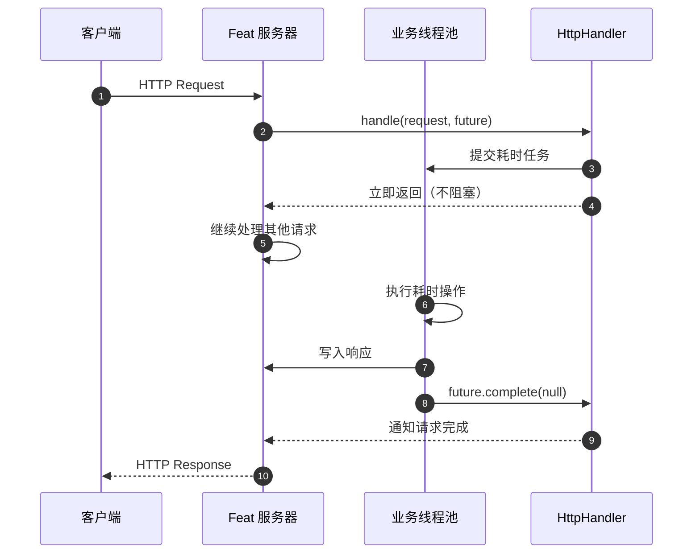

import { Aside, Tabs, TabItem } from '@astrojs/starlight/components';

当请求处理涉及数据库查询、远程 HTTP 调用、文件 IO 等耗时操作时，应该使用异步处理模式。这样可以将工作移出 Feat 的主处理线程，避免阻塞其他请求，显著提升并发处理能力。

## 同步 vs 异步

| 特性 | 同步处理 | 异步处理 |
|------|---------|---------|
| 执行线程 | 主处理线程 | 自定义线程池 |
| 阻塞影响 | 阻塞主线程，降低并发 | 不阻塞主线程 |
| 适用场景 | 简单、快速的操作 | 耗时操作（>10ms） |
| 代码复杂度 | 简单 | 需要管理 CompletableFuture |

<Aside type="tip">
选择建议：纯内存操作、简单数据转换 → 同步；数据库查询、外部 API 调用、文件 IO → 异步
</Aside>

## 异步处理模型

Feat 的异步处理依赖 [`HttpHandler`](feat-core/src/main/java/tech/smartboot/feat/core/server/HttpHandler.java:33) 接口的双参数方法：

```java
void handle(HttpRequest request, CompletableFuture<Void> future)
```

使用异步模式只需做两件事：

1. **将耗时逻辑放到自定义线程池执行**
2. **完成后调用 `future.complete(null)` 通知 Feat**

<Aside type="caution">
如果忘记调用 `future.complete(null)`，请求将一直挂起，客户端收不到响应。
</Aside>

## 基础用法

### 创建异步处理器

```java
import tech.smartboot.feat.Feat;
import tech.smartboot.feat.core.server.HttpHandler;
import tech.smartboot.feat.core.server.HttpRequest;

import java.util.concurrent.CompletableFuture;
import java.util.concurrent.ExecutorService;
import java.util.concurrent.Executors;

public class AsyncDemo {
    public static void main(String[] args) {
        // 创建业务线程池
        ExecutorService executor = Executors.newFixedThreadPool(4);

        Feat.httpServer()
            .httpHandler(new HttpHandler() {
                @Override
                public void handle(HttpRequest request, CompletableFuture<Void> future) {
                    executor.execute(() -> {
                        try {
                            // 模拟耗时操作
                            Thread.sleep(100);
                            request.getResponse().write("Async response");
                        } catch (Exception e) {
                            e.printStackTrace();
                        } finally {
                            // 必须调用，否则请求不会结束
                            future.complete(null);
                        }
                    });
                }

                @Override
                public void handle(HttpRequest request) {
                    // 异步模式下这里不处理主逻辑
                }
            })
            .listen(8080);
    }
}
```

### 使用 Lambda 简化

如果不需要复杂的线程池管理，可以用 Lambda 快速创建异步处理器：

```java
Feat.httpServer()
    .httpHandler(new HttpHandler() {
        @Override
        public void handle(HttpRequest request, CompletableFuture<Void> future) {
            CompletableFuture.supplyAsync(() -> {
                // 耗时操作
                return fetchDataFromDatabase();
            }).thenAccept(result -> {
                request.getResponse().write(result);
                future.complete(null); // 完成后通知 Feat
            });
        }

        @Override
        public void handle(HttpRequest request) {
        }
    })
    .listen(8080);
```

## 回调触发流程

以下泳道图展示了异步请求的处理流程：



**流程说明：**

1. **接收请求** - Feat 主线程接收 HTTP 请求
2. **调用处理器** - 调用 `handle(request, future)` 方法
3. **提交任务** - 将耗时操作提交到业务线程池
4. **立即返回** - 主线程立即返回，继续处理其他请求
5. **异步执行** - 业务线程池执行耗时操作
6. **完成通知** - 调用 `future.complete(null)` 通知 Feat 请求完成
7. **发送响应** - Feat 将响应发送给客户端

## 完整示例

### 数据库查询场景

```java title="AsyncDatabaseDemo.java"
import tech.smartboot.feat.Feat;
import tech.smartboot.feat.core.server.HttpHandler;
import tech.smartboot.feat.core.server.HttpRequest;

import java.util.concurrent.CompletableFuture;
import java.util.concurrent.ExecutorService;
import java.util.concurrent.Executors;

public class AsyncDatabaseDemo {
    // 业务线程池
    private static final ExecutorService executor = Executors.newFixedThreadPool(8);
    
    public static void main(String[] args) {
        Feat.httpServer(options -> options.debug(true))
            .httpHandler(new HttpHandler() {
                @Override
                public void handle(HttpRequest request, CompletableFuture<Void> future) {
                    String userId = request.getParameter("id");
                    
                    executor.execute(() -> {
                        try {
                            // 模拟数据库查询
                            User user = queryDatabase(userId);
                            
                            if (user != null) {
                                request.getResponse().write(
                                    "{\"id\":\"" + user.id + "\",\"name\":\"" + user.name + "\"}"
                                );
                            } else {
                                request.getResponse().setHttpStatus(404);
                                request.getResponse().write("User not found");
                            }
                        } catch (Exception e) {
                            request.getResponse().setHttpStatus(500);
                            request.getResponse().write("Internal error");
                            e.printStackTrace();
                        } finally {
                            // 无论成功失败，都要完成 future
                            future.complete(null);
                        }
                    });
                }

                @Override
                public void handle(HttpRequest request) {
                }
            })
            .listen(8080);
    }
    
    static User queryDatabase(String userId) throws InterruptedException {
        // 模拟数据库查询耗时
        Thread.sleep(50);
        return new User(userId, "User_" + userId);
    }
    
    static class User {
        String id, name;
        User(String id, String name) {
            this.id = id; this.name = name;
        }
    }
}
```

### 外部 API 调用场景

```java title="AsyncHttpCallDemo.java"
import tech.smartboot.feat.Feat;
import tech.smartboot.feat.core.server.HttpHandler;
import tech.smartboot.feat.core.server.HttpRequest;

import java.util.concurrent.CompletableFuture;
import java.util.concurrent.ExecutorService;
import java.util.concurrent.Executors;

public class AsyncHttpCallDemo {
    private static final ExecutorService executor = Executors.newFixedThreadPool(4);
    
    public static void main(String[] args) {
        Feat.httpServer()
            .httpHandler(new HttpHandler() {
                @Override
                public void handle(HttpRequest request, CompletableFuture<Void> future) {
                    executor.execute(() -> {
                        try {
                            // 调用外部 API
                            String result = callExternalApi();
                            request.getResponse().write(result);
                        } catch (Exception e) {
                            request.getResponse().setHttpStatus(502);
                            request.getResponse().write("External service error");
                        } finally {
                            future.complete(null);
                        }
                    });
                }

                @Override
                public void handle(HttpRequest request) {
                }
            })
            .listen(8080);
    }
    
    static String callExternalApi() throws InterruptedException {
        // 模拟 HTTP 调用耗时
        Thread.sleep(200);
        return "{\"status\":\"ok\",\"data\":[]}";
    }
}
```