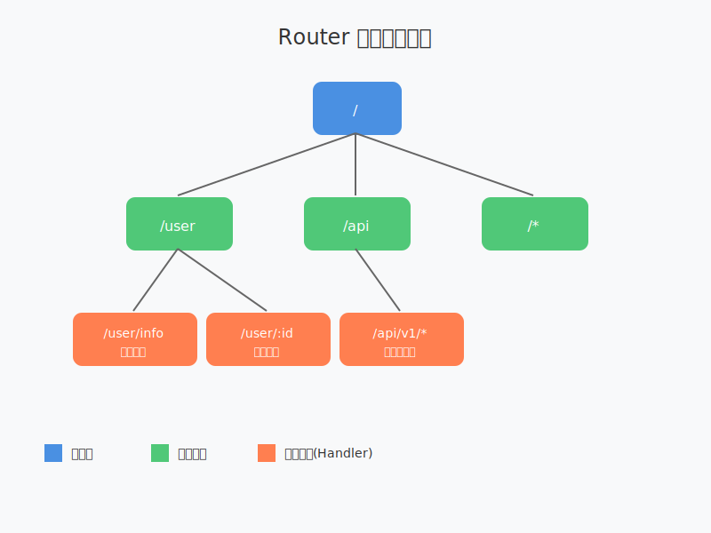

Feat中的`Router`组件是一个功能强大的HTTP请求分发器，用于将HTTP请求分发到对应的处理程序（Handler）。它是基于`NodePath`树状结构实现的，支持多种路由匹配方式，包括精确匹配、通配符匹配、路径参数匹配等。同时提供了Session管理和请求拦截等高级功能。

## 2.2.1 主要功能

### 1. 基础功能

- **路由匹配**：根据请求的URI将请求分发到对应的处理程序
- **路径参数提取**：支持从路径中提取参数
- **多种匹配方式**：支持精确匹配、通配符匹配（`*`）、路径参数匹配（`:param`）等
- **默认路由**：未匹配到任何路由时，使用默认处理程序

### 2. 高级功能

- **Session管理**：提供完整的Session生命周期管理，支持创建、获取、更新和销毁Session
- **请求拦截**：支持配置拦截器，实现请求的前置和后置处理
- **灵活配置**：支持链式调用，简化路由配置

## 2.2.2 路由匹配原理



### 1. 核心数据结构

`Router`内部通过`NodePath`树状结构存储路由规则：

- **根节点**：表示根路径`/`
- **路径节点**：每个`NodePath`节点代表一个路径部分（如`/user`或`:id`）
- **叶子节点**：存储具体的处理程序（RouterHandler）

### 2. 匹配流程

1. **解析请求URI**：将请求URI拆分为路径部分
2. **树状匹配**：
   - 从根节点开始，逐层匹配路径部分
   - 优先进行精确匹配，其次是路径参数匹配，最后是通配符匹配
3. **参数提取**：如果匹配到路径参数（如`:id`），将其提取到`Context`中
4. **处理程序调用**：调用匹配到的处理程序，如未匹配则使用默认处理程序

## 2.2.3 Session管理

### 1. Session配置

```java
Router router = new Router();
router.getSessionOptions()
      .setMaxAge(1800); // 设置Session过期时间为30分钟
```

### 2. Session操作

```java
router.route("/session/demo", ctx -> {
    // 获取或创建Session
    Session session = ctx.getSession();
    
    // 设置Session属性
    session.setAttribute("userId", "12345");
    
    // 获取Session属性
    String userId = session.getAttribute("userId");
    
    // 手动使Session失效
    session.invalidate();
});
```

## 2.2.4 拦截器使用

### 1. 创建拦截器

```java
public class LogInterceptor implements Interceptor {
    @Override
    public void intercept(Context ctx, Chain chain) throws Throwable {
        System.out.println("请求开始: " + ctx.Request.getRequestURI());
        try {
            chain.proceed(ctx);
        } finally {
            System.out.println("请求结束: " + ctx.Request.getRequestURI());
        }
    }
}
```

### 2. 配置拦截器

```java
Router router = new Router();
// 为所有/api路径下的请求添加拦截器
router.addInterceptor("/api/*", new LogInterceptor());

// 为多个路径添加拦截器
List<String> patterns = Arrays.asList("/user/*", "/order/*");
router.addInterceptors(patterns, new LogInterceptor());
```

## 2.2.5 路由配置示例

### 1. 基础路由

```java
Router router = new Router();

// 精确匹配
router.route("/user/info", ctx -> {
    ctx.Response.write("User info");
});

// 路径参数匹配
router.route("/user/:id", ctx -> {
    String id = ctx.pathParam("id");
    ctx.Response.write("User ID: " + id);
});

// 通配符匹配
router.route("/api/*", ctx -> {
    ctx.Response.write("API endpoint");
});
```

### 2. 默认路由

```java
Router router = new Router(request -> {
    request.getResponse()
           .setHttpStatus(HttpStatus.NOT_FOUND)
           .write("404 Not Found");
});
```

### 3. 深层路由示例

```java
public class DeepRouterDemo {
    public static void main(String[] args) {
        Router router = new Router();

        // 1. 精确匹配（最高优先级）
        router.route("/api/v1/user/profile", ctx -> {
            ctx.Response.write("用户档案");
        });

        // 2. 路径参数匹配（次高优先级）
        router.route("/api/v1/user/:id/orders", ctx -> {
            String userId = ctx.pathParam("id");
            ctx.Response.write("用户" + userId + "的订单列表");
        });

        // 3. 多路径参数匹配
        router.route("/api/v1/user/:userId/orders/:orderId", ctx -> {
            String userId = ctx.pathParam("userId");
            String orderId = ctx.pathParam("orderId");
            ctx.Response.write("用户" + userId + "的订单" + orderId + "详情");
        });

        // 4. 通配符匹配（最低优先级）
        router.route("/api/v1/user/*", ctx -> {
            ctx.Response.write("用户相关API");
        });

        // 5. 多层通配符匹配
        router.route("/api/*/user/*/*", ctx -> {
            ctx.Response.write("通用用户API处理");
        });
    }
}
```

上述示例展示了深层路由的匹配优先级规则：
1. 精确路径匹配：完全匹配URL路径，如`/api/v1/user/profile`
2. 路径参数匹配：包含`:param`形式的参数，如`/api/v1/user/:id/orders`
3. 通配符匹配：包含`*`的路径，如`/api/v1/user/*`或`/api/*/user/*/*`

### 4. 完整示例

```java
public class RouterDemo {
    public static void main(String[] args) {
        Router router = new Router();
        
        // 配置Session
        router.getSessionOptions().setMaxAge(1800);
        
        // 添加拦截器
        router.addInterceptor("/*", new LogInterceptor());
        
        // 配置路由
        router.route("/", ctx -> {
            Session session = ctx.getSession();
            session.setAttribute("visitTime", System.currentTimeMillis());
            ctx.Response.write("Welcome!");
        });
        
        router.route("/user/:id", ctx -> {
            String id = ctx.pathParam("id");
            Session session = ctx.getSession(false); // 获取Session但不创建
            if (session != null) {
                Long visitTime = session.getAttribute("visitTime");
                ctx.Response.write("User " + id + ", last visit: " + visitTime);
            } else {
                ctx.Response.write("User " + id);
            }
        });
        
        // 启动服务器
        Feat.httpServer()
            .httpHandler(router)
            .listen();
    }
}
```

## 2.2.6 总结

Feat中的`Router`组件不仅提供了强大的路由匹配功能，还集成了Session管理和请求拦截等高级特性。通过树状的路由匹配结构，实现了高效的请求分发。同时，其链式调用的API设计，使得路由配置更加简洁直观。开发者可以根据实际需求，灵活运用这些功能，构建功能丰富的Web应用。