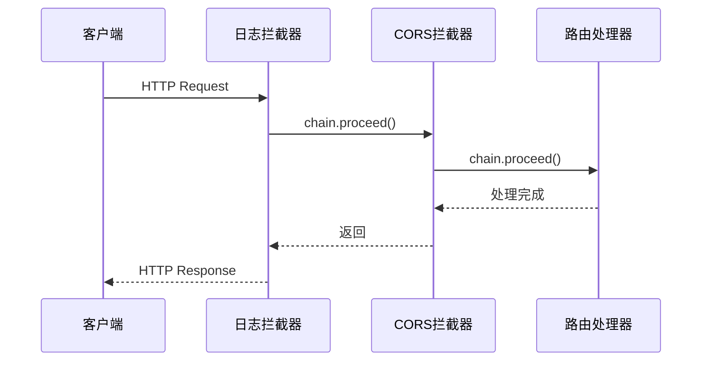

import { Aside, Tabs, TabItem } from '@astrojs/starlight/components';

Router 是 Feat 提供的路由管理器，让你可以在一个服务里处理多个路径，支持路径参数、Session 管理和拦截器等高级功能。

## 创建与配置

### 基础路由

使用 Router 注册多个路由处理器：

```java
Router router = new Router();

router.route("/", ctx -> ctx.Response.write("Welcome"));
router.route("/users", ctx -> ctx.Response.write("User list"));

Feat.httpServer().httpHandler(router).listen(8080);
```

### 路径参数

使用 `:paramName` 语法捕获 URL 中的动态值：

```java
// 捕获 /users/123 中的 123
router.route("/users/:id", ctx -> {
    String userId = ctx.pathParam("id");
    ctx.Response.write("User ID: " + userId);
});

// 多个路径参数
router.route("/users/:userId/orders/:orderId", ctx -> {
    ctx.Response.write("User: " + ctx.pathParam("userId"));
});
```

<Aside type="tip">
路径参数名称区分大小写，`pathParam("id")` 和 `pathParam("ID")` 是不同的参数。
</Aside>

### HTTP 方法路由

同一路径支持不同 HTTP 方法：

```java
router.route("/articles", "GET", ctx -> { /* ... */ });
router.route("/articles", "POST", ctx -> { /* ... */ });
router.route("/articles", "PUT", ctx -> { /* ... */ });
router.route("/articles", "DELETE", ctx -> { /* ... */ });
```

## 路由匹配规则

### 匹配模式

| 模式 | 匹配示例 | 说明 |
|------|----------|------|
| `/users` | `/users` | 精确匹配 |
| `/users/:id` | `/users/42` | `:id` 捕获路径参数 |
| `/static/*` | `/static/js/app.js` | `*` 匹配任意后续路径 |
| `*.html` | `/page.html` | 后缀匹配 |

### 匹配优先级

当多个规则可能匹配同一请求时，Router 按以下优先级选择：

1. **精确匹配**（最高）
2. **路径参数匹配**
3. **通配符匹配**（最低）

```java
router.route("/users/profile", ctx -> { /* 精确匹配优先 */ });
router.route("/users/:id", ctx -> { /* 路径参数次之 */ });
router.route("/users/*", ctx -> { /* 通配符兜底 */ });
```

访问 `/users/profile` 时，**精确匹配**胜出。

<Aside type="tip">
将更具体的路径放在前面注册，有助于代码可读性。
</Aside>

## Session 管理

Router 内置基于 Cookie 的 Session 管理：

```java
// 登录：创建 Session
router.route("/login", ctx -> {
    Session session = ctx.session();
    session.put("user", ctx.Request.getParameter("username"));
    ctx.Response.write("登录成功");
});

// 读取 Session
router.route("/profile", ctx -> {
    String user = ctx.session().get("user");
    if (user == null) {
        ctx.Response.setHttpStatus(401);
        return;
    }
    ctx.Response.write("用户: " + user);
});

// 注销：销毁 Session
router.route("/logout", ctx -> {
    ctx.session().invalidate();
});
```

验证流程：

```shell
# 登录（-c 保存 Cookie）
curl -c cookies.txt "http://localhost:8080/login?username=alice"

# 访问个人资料（-b 携带 Cookie）
curl -b cookies.txt http://localhost:8080/profile
```

<Aside type="caution">
默认的内存 Session 在应用重启后数据丢失，且不支持分布式共享。生产环境建议实现 `SessionManager` 接口，使用 Redis 等外部存储。
</Aside>

## 拦截器

### 基础拦截器

拦截器让你可以在请求到达处理器前执行鉴权、日志等逻辑：

```java
// 拦截 /admin/* 路径
router.addInterceptor("/admin/*", (ctx, future, chain) -> {
    String token = ctx.Request.getHeader("X-Token");
    
    if (!"secret-token".equals(token)) {
        ctx.Response.setHttpStatus(HttpStatus.FORBIDDEN);
        future.complete(null);
        return; // 不调用 chain.proceed()，请求中断
    }
    
    chain.proceed(ctx, future); // 鉴权通过，继续执行
});
```

### 多拦截器链式处理

拦截器按注册顺序执行，可以形成处理链：

```java
// 拦截器 1：请求日志
router.addInterceptor("/*", (ctx, future, chain) -> {
    System.out.println(ctx.Request.getMethod() + " " + ctx.Request.getRequestURI());
    chain.proceed(ctx, future);
});

// 拦截器 2：CORS 处理
router.addInterceptor("/api/*", (ctx, future, chain) -> {
    ctx.Response.setHeader("Access-Control-Allow-Origin", "*");
    chain.proceed(ctx, future);
});
```

以下泳道图展示了多拦截器的执行流程：


```mermaid
sequenceDiagram
    participant Client as 客户端
    participant I1 as 日志拦截器
    participant I2 as CORS拦截器
    participant Handler as 路由处理器

    Client->>I1: HTTP Request
    I1->>I2: chain.proceed()
    I2->>Handler: chain.proceed()
    Handler-->>I2: 处理完成
    I2-->>I1: 返回
    I1-->>Client: HTTP Response
```

<Aside type="tip">
拦截器执行顺序遵循"先进先出"原则。轻量级拦截器（如日志）建议放在前面，尽早中断无效请求。
</Aside>

## 异步处理

Router 支持同步和异步两种处理模式：

<Tabs>
<TabItem label="同步处理">

```java
// 适合简单操作
router.route("/sync", ctx -> {
    ctx.Response.write("同步响应");
});
```

**适合场景**：纯内存操作、简单数据转换、快速状态查询

</TabItem>
<TabItem label="异步处理">

```java
// 适合耗时操作
router.route("/async", (ctx, future) -> {
    CompletableFuture.supplyAsync(() -> fetchData())
        .thenAccept(result -> {
            ctx.Response.write(result);
            future.complete(null); // 必须调用！
        });
});
```

**适合场景**：耗时操作（>10ms）、外部 API 调用、数据库查询、文件 IO

</TabItem>
</Tabs>

<Aside type="tip">
异步模式不会阻塞线程，适合高并发场景。同步模式代码更简洁，适合简单接口。
</Aside>

## 完整示例

### RESTful API 服务

```java title="UserApiDemo.java"
Router router = new Router();

// 获取所有用户
router.route("/api/users", "GET", ctx -> {
    ctx.Response.write(users.toString());
});

// 获取单个用户
router.route("/api/users/:id", "GET", ctx -> {
    String user = users.get(ctx.pathParam("id"));
    ctx.Response.write(user != null ? user : "Not found");
});

// 创建用户
router.route("/api/users", "POST", ctx -> {
    users.put(ctx.Request.getParameter("id"), ctx.Request.getParameter("name"));
    ctx.Response.setHttpStatus(HttpStatus.CREATED);
});

Feat.httpServer().httpHandler(router).listen(8080);
```

### 测试命令

```shell
# 创建用户
curl -X POST "http://localhost:8080/api/users?id=1&name=Alice"

# 获取用户
curl http://localhost:8080/api/users/1

# 获取所有用户
curl http://localhost:8080/api/users
```

## 常见问题

### 路由返回 404

排查清单：

1. 确认 `router` 已传给 `httpHandler()`
2. 检查路径是否完全一致（注意末尾 `/`）
3. 路径参数格式是 `:paramName`，不是 `{param}`
4. 检查 HTTP 方法是否匹配

```java
// 注意：这两个路由是不同的
router.route("/users", handler);     // 匹配 /users
router.route("/users/", handler);    // 匹配 /users/
```

### 拦截器不生效

`/admin/*` 匹配 `/admin/users` 但不匹配 `/admin` 本身：

```java
// 如需包含 /admin，额外注册
router.addInterceptor("/admin", interceptor);      // 匹配 /admin
router.addInterceptor("/admin/*", interceptor);     // 匹配 /admin/xxx
```

### Session 数据丢失

1. curl 需显式指定 `-c` 和 `-b` 参数保存/携带 Cookie
2. 浏览器可能禁用了第三方 Cookie
3. Session 默认 30 分钟过期

### 异步请求不返回

异步处理必须调用 `future.complete(null)`，否则请求不会结束：

```java
router.route("/async", (ctx, future) -> {
    doAsyncWork(result -> {
        ctx.Response.write(result);
        future.complete(null); // 必须调用！
    });
});
```

## 性能建议

1. **路由设计**：避免过度使用通配符，合理规划 API 层级
2. **拦截器**：轻量级拦截器放前面，尽早中断无效请求
3. **Session**：仅存储必要数据，分布式环境使用外部存储
4. **异步选择**：耗时操作使用异步，简单操作使用同步

